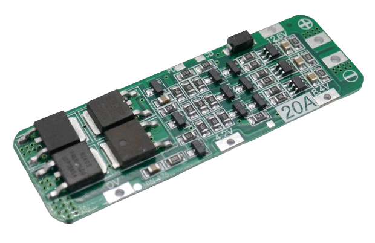
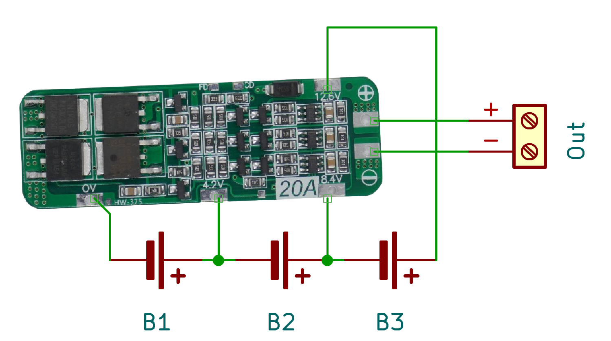

# 3S - Using 3 Batteries in Series

> 3S BMS Protect Three (Groups of) Batteries From Mishap. Combined With Balancing They Are A Perfect Fit For Your Batteries.

A **3S BMS** is needed to protect *three* batteries (or groups of batteries connected *in parallel*) that are connected *in series*. 

Each lithium battery has a voltage between *3.2V*-*4.2V*, depending on state of charge. When you connect three of them *in series*, the **BMS** needs to handle a voltage in the range of *9.6V*-*12.6V*.

## 20A

For currents up to **20A**, here is a rugged and balanced **BMS**:

Connect the batteries like this:

* First battery string to **0V** (-) and **4.2V** (+)
* Second battery string to **4.2V** (-) and **8.4V** (+)
* Third battery string to **8.4V** (-) and **12.6V** (+)

The output voltage is available at the terminals marked  **+** and **-**.

All terminals are also available at the bottom:

> Tags: Battery, BMS, 3S

:eye:&nbsp;[Visit Page on Website](https://powershell.one/doneland_test/components/power/bms/3s?268282020426240854) - last edited 2024-02-27
