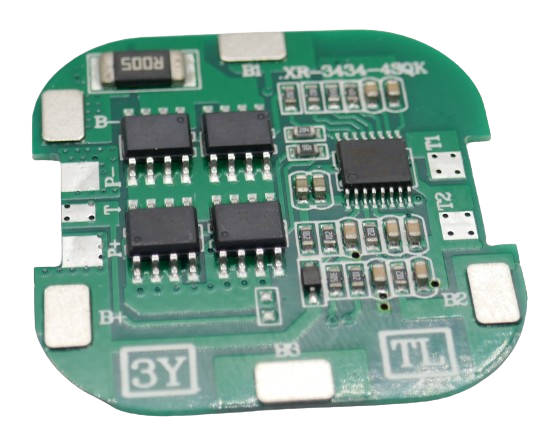
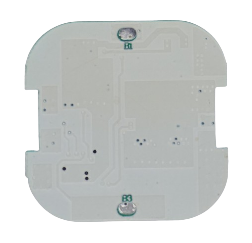
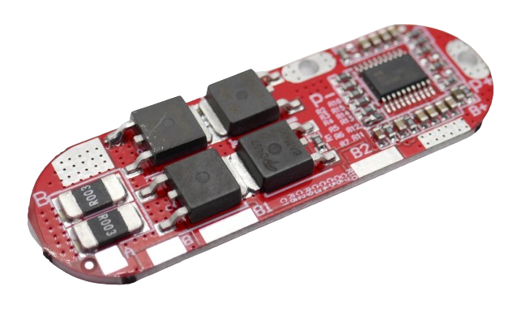
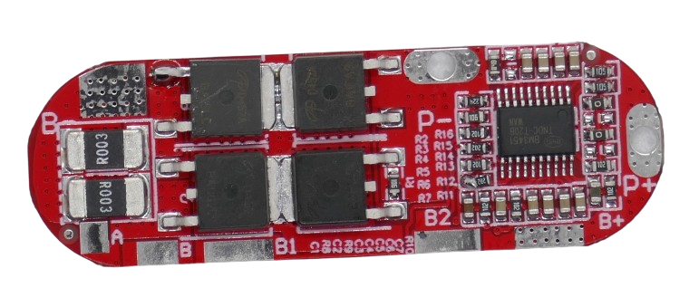

# 4S - Using 4 Batteries in Series

> 4S BMS Protect Four (Groups of) Batteries From Mishap. Combined With Balancing They Are A Perfect Fit For Your Batteries.

A **4S BMS** is needed to protect *four* batteries (or groups of batteries connected *in parallel*) that are connected *in series*. 

Each lithium battery has a voltage between *3.2V*-*4.2V*, depending on state of charge. When you connect two of them *in series*, the **BMS** needs to handle a voltage in the range of *12.8V*-*16.8V*.

## 8A

For currents up to **8A**, you can use a **BMS** with a square form factor. This makes it ideal for battery packs with four *18650 LiIon* cells but can also be used for other lithium batteries including *LiPo*:

There are quite a few connectors on this board that are accessible only from the top. Make sure you connect your batteries correctly.

Connect the batteries like this:

* First battery string to **B-** (-) and **B1** (+)
* Second battery string to **B1** (-) and **B2** (+)
* Third battery string to **B2** (-) and **B3** (+)
* Forth battery string to **B3** (-) and **B+** (+) 

The output voltage is available at the (relatively small) **P+** and **P-** terminals.

The terminals **B1** and **B3** are also available on the back side of the board:

## 15A

For currents up to **15A**, a board with four powerful *MosFET* like this one can be used:

Connect the batteries like this:

* First battery string to **B-** (-) and **VL** (+)
* Second battery string to **VL** (-) and **VM** (+)
* Third battery string to **VM** (-) and **VH** (+)
* Forth battery string to **VH** (-) and **B+** (+) 

The terminals are accessible both from top and bottom.

The output voltage is available at **P+** and **P-**.

## 25A

For currents up to **25A**, this rounded multi-purpose board is available:

Connect the batteries like this:

* First battery string to **B-** (-) and **B** (+)
* Second battery string to **B** (-) and **B1** (+)
* Third battery string to **B1** (-) and **B2** (+)
* Forth battery string to **B2** (-) and **B+** (+)

The output voltage is available at **P+** and **P-**. These two pads are accessible from both sides.

> Tags: Battery, BMS, 4S

:eye:&nbsp;[Visit Page on Website](https://powershell.one/doneland_test/components/power/bms/4s?268282020426240854) - last edited 2024-02-27
