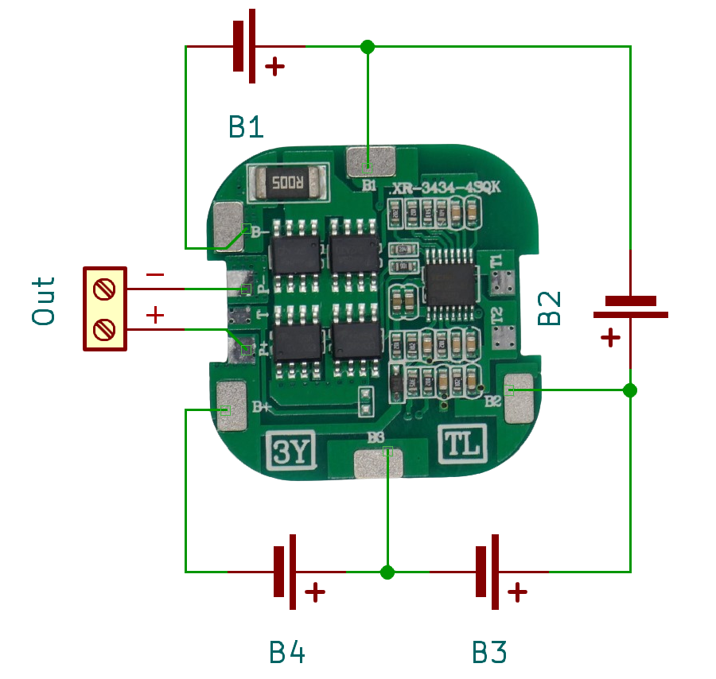
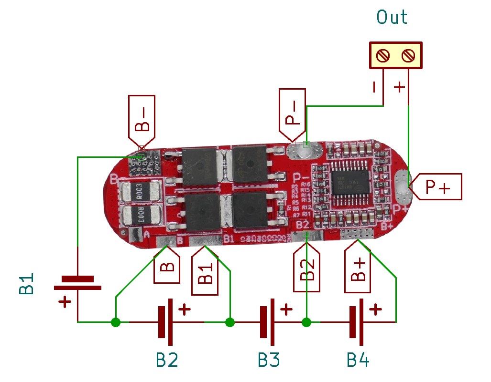
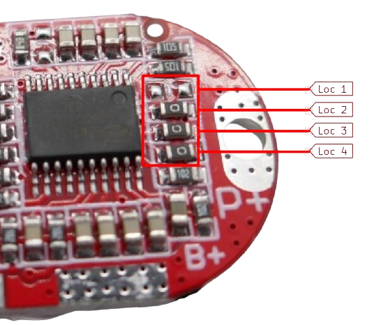

# 4S - Using 4 Batteries in Series

> 4S BMS Protect Four (Groups of) Batteries From Mishap. Combined With Balancing They Are A Perfect Fit For Your Batteries.

A **4S BMS** is needed to protect *four* batteries (or groups of batteries connected *in parallel*) that are connected *in series*. 

Each lithium battery has a voltage between *3.2V*-*4.2V*, depending on state of charge. When you connect two of them *in series*, the **BMS** needs to handle a voltage in the range of *12.8V*-*16.8V*.

> [!IMPORTANT]
> **BMS** often ship in *locked state*: *no output voltage* is available at the output pins. 
> *Locked state* is entered whenever *over-current protection* was triggered. 
> To *unlock* the **BMS**, connect it to a charger. If you did not add a dedicated *charger board*, apply *16.8-17.0V* to its output terminal.

> [!CAUTION]
> When connecting batteries to your **BMS**, make sure you use *wires* with sufficient diameter for the anticipated *high currents*.
> Also make sure you only use batteries of *same type* and *same state of charge*. It is recommended you *fully charge* all batteries before connecting. All batteries must have *the same voltage* (voltage difference less than *0.05V*). Do not mix batteries from different vendors, types, capacity, or age. 

All **BMS** listed below are designed for *LiIon* and *LiPo* batteries. They are not compatible with *LiFePo4* batteries because *LiFePo4* uses different cell voltages.

## 8A

[LiIon/LiPo](#){:.button.button--primary.button--rounded.button--sm}

For currents up to **8A**, you can use a **BMS** with a square form factor. This makes it ideal for battery packs with four *18650 LiIon* cells but can also be used for other lithium batteries including *LiPo*:

There are quite a few connectors on this board that are accessible only from the top. Make sure you connect your batteries correctly.

Connect the batteries like this:

* First battery string to **B-** (-) and **B1** (+)
* Second battery string to **B1** (-) and **B2** (+)
* Third battery string to **B2** (-) and **B3** (+)
* Forth battery string to **B3** (-) and **B+** (+) 

The output voltage is available at the (relatively small) **P+** and **P-** terminals.

The terminals **B1** and **B3** are also available on the back side of the board:

### Specs

| Protection | Threshold | 
| --- | --- | 
| Over-Charge | >4.25V |
| Over-Discharge | 2.3-3.0V |
| Over-Current | 20A | 
| Short Circuit | yes,resettable | 
| Continuous Current | 8A |
| Size | 34x34x3.2mm |

### Charging

When *charging* batteries through this **BMS**, the charging voltage needs to be *16.8-17.0V*. The **BMS** limits the charging current to *6A*.

## 15A

[LiIon/LiPo](#){:.button.button--primary.button--rounded.button--sm}

For currents up to **15A**, a board with four powerful *MosFET* like this one can be used:

Connect the batteries like this:

* First battery string to **B-** (-) and **VL** (+)
* Second battery string to **VL** (-) and **VM** (+)
* Third battery string to **VM** (-) and **VH** (+)
* Forth battery string to **VH** (-) and **B+** (+) 

The terminals are accessible both from top and bottom.

The output voltage is available at **P+** and **P-**.

### Specs

| Protection | Threshold | 
| --- | --- | 
| Over-Charge | >4.25V |
| Over-Discharge | 2.5V |
| Over-Current | 20-30A | 
| Short Circuit | yes,resettable | 
| Continuous Current | 15A (10A w/o heat sink) |
| Size | 50x22x4mm |

## 25A

[LiIon/LiPo](#){:.button.button--primary.button--rounded.button--sm}

For currents up to **25A**, this rounded multi-purpose board is available:

Connect the batteries like this:

* First battery string to **B-** (-) and **B** (+)
* Second battery string to **B** (-) and **B1** (+)
* Third battery string to **B1** (-) and **B2** (+)
* Forth battery string to **B2** (-) and **B+** (+)

The output voltage is available at **P+** and **P-**. These two pads are accessible from both sides.

> [!TIP]
> The terminal **A** is not used. It is reserved for the **5S** version of this board.

### Specs

| Protection | Threshold | 
| --- | --- | 
| Over-Charge | >4.25V |
| Over-Discharge | 2.8V |
| Over-Current | 60A | 
| Short Circuit | yes,resettable | 
| Continuous Current | 25A |
| Size | 50x22x4mm |

### Charging

When *charging* batteries through this **BMS**, the charging voltage needs to be *16.8-17.0V*. The **BMS** limits the charging current to *25A*.

### Changing **BMS** Type

This is a *multipurpose* board and can be used for **3S**, **4S**, and **5S**. The number of supported strings can be configured on the board at four locations:

| Location | **3S** | **4S** | **5S** | 
| --- | --- | --- | --- |
| 1 | unconnected | 0R | unconnected |
| 2 | 0R | unconnected |unconnected |
| 3 | 0R | 0R |unconnected |
| 4 | 0R | unconnected |unconnected |

> [!TIP]
> *0R* refers to a 0-Ohm resistor (a solder bridge). If you'd like to change the configuration of your **BMS**, you can remove **0R** resistors (to switch to *unconnected*), or *bridge* the pads with solder (to switch to *0R*). No need to try and move around and re-solder the tiny *0R* resistors.

For **3S BMS**, connect the batteries like this:

* First battery string to **B-** (-) and **B1** (+)
* Third battery string to **B1** (-) and **B2** (+)
* Forth battery string to **B2** (-) and **B+** (+)

For **5S BMS** connect the batteries like this:

Connect the batteries like this:

* First battery string to **B-** (-) and **A** (+)
* Second battery string to **A** (-) and **B** (+)
* Third battery string to **B** (-) and **B1** (+)
* Forth battery string to **B1** (-) and **B2** (+)
* Fifth battery string to **B2** (-) and **B+** (+)

> Tags: Battery, BMS, 4S

:eye:&nbsp;[Visit Page on Website](https://powershell.one/doneland_test/components/power/bms/4s?268282020426240854) - last edited 2024-02-27
