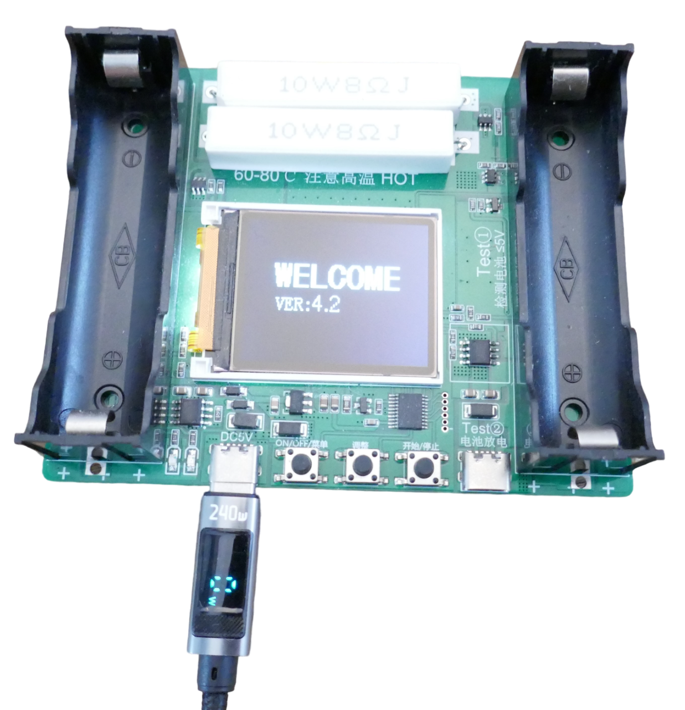
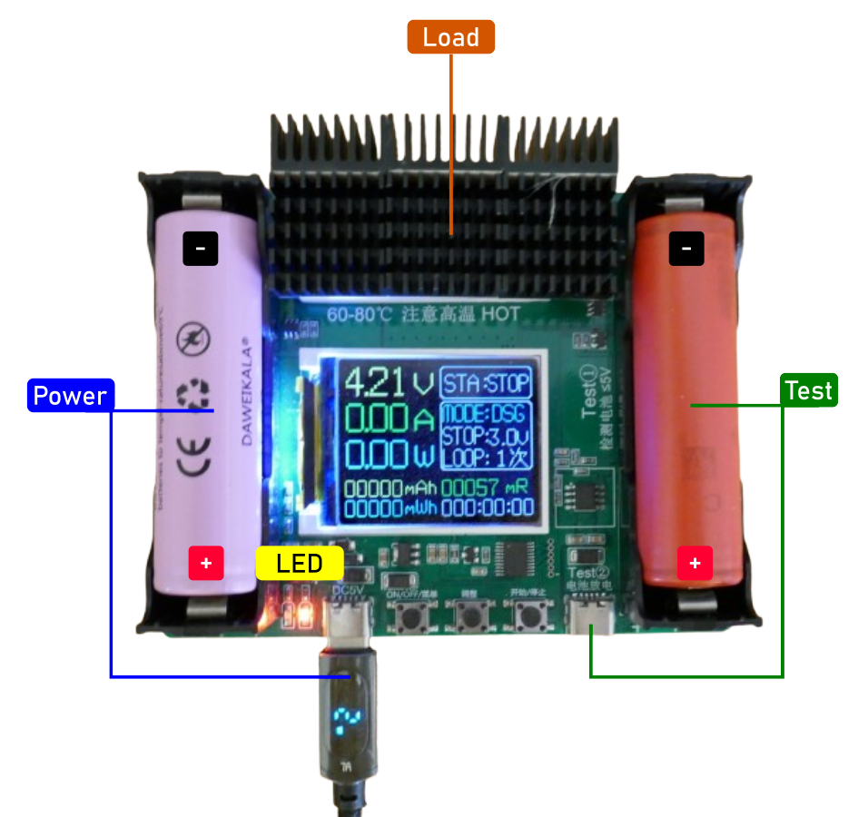

# Generic 1-Battery Tester

> Simple Yet Efficient Single-Battery Tester For 18650 Cells (And Other Types)

Affordable *all-in-one* tester providing essential measurements for reliably distinguishing *counterfeit* batteries from *genuine* ones and assessing overall battery health.

The two load resistors on top (8 Ohms each, connected in parallel) can reach high temperatures during testing (up to 80°C). Adding a heat sink is recommended to avoid accidental burns.

| Feature  | Description  |
|---|---|
| Channels | 1   |
| Battery Under Test  | - **5V max** - *18650* battery bay (right side) - *USB-C* (right side) - Solder pads (next to right battery bay) |
| Power Supply | - *USB-C* **or** - Left battery bay    |
| Discharge Test  | - *4 Ohms 10W* load resistor - Max discharge current *1A* - Units: total *mAh* **or** total *mWh* - Stop-voltage configurable (*2.5–3.5V*) - No heat sink or fan |
| Charging | - *LiIon* and *LiPo* only - Max charging current *1A* |
| Auto-Test | Yes, charge-discharge-charge cycle with total discharge energy reported |
| Off-Button | Yes, long-press left push button |
| Language | *English* and *Chinese*, configurable |
| Software | - Version 4.2 - User cannot upgrade firmware |
| LED  | - *Red:* power-supply battery charging (left battery bay) - *Blue:* power-supply battery fully charged (left battery bay) |
| Display | - Color-TFT - Backlight |

## Overview

This tester can be powered via *USB-C* (using the **left** *USB-C* connector) or by a *18650* cell in the **left** battery bay.

> [!TIP]
> When powering the device through the left *USB-C connector*, the *left battery bay* can remain empty, as it does not participate in testing. If a *18650* cell is inserted into the *left* battery bay, it acts as an internal power supply, making the device portable. In portable mode, the battery under test cannot be charged. When the device is connected to *USB power* while a *18650* cell is present in the *left* battery bay, the cell will be kept charged: a *red* LED indicates charging, and a *blue* LED indicates the battery is fully charged.

The *battery under test* can be a *18650* cell (in the **right** battery holder) or any other battery connected through the **right** *USB-C* connector or solder pads located at the *right* battery bay. The *battery under test* must not exceed **5V**.

### Buttons and Operation

The unit is operated via three push buttons:

* **Power:** Press to turn *on* when off, select a menu item when on, or long-press to turn *off*.
* **Change Settings:** Press to *increment* the currently selected menu item. There’s no *decrement* option, so continue pressing until the settings cycle back to the beginning.
* **Start/Stop Test:** Press to *start* the selected test. Press again to *stop* it.

### Changing Language

The unit supports *English* and *Chinese*. To switch between languages, follow these steps:

1. Turn off the unit.
2. Press and hold the *Menu* button while turning the unit *on*. Release all buttons once the display content appears.
3. Turn the unit off, then on again to confirm the new language setting.

## Test Modes

The unit offers three test modes: *AUTO*, *CHG*, and *DSG*:

* **Automatic Testing** (*LiIon/LiPo only*): In **AUTO** mode, the unit sequentially *charges*, *discharges*, and then *charges* the battery again to provide a full capacity assessment. The battery is left fully charged at the end.

   To select AUTO mode, press the `Power` button until the **Mode** menu is highlighted, then press `Menu` until **AUTO** appears.
   
* **Discharge Test** (*all battery types*): In **DSG** mode, the unit immediately starts *discharging* the battery to assess capacity. Afterward, it leaves the battery discharged, making this mode ideal for non-LiIon/LiPo batteries like *LiFePO4* or *NiMH*.

   To select DSG mode, press the `Power` button until the **Mode** menu is highlighted, then press `Menu` until **DSG** appears.
   
* **LiIon Charger** (*LiIon/LiPo only*): In **CHG** mode, the unit serves as a charger specifically for *LiIon/LiPo* batteries.

   To select CHG mode, press the `Power` button until the **Mode** menu is highlighted, then press `Menu` until **CHG** appears.

Additional test settings can be adjusted for further customization:

* **Loops:** In **AUTO** mode, set up to *10 consecutive loops* for enhanced accuracy.

    To set loops, press the `Power` button until the **Loop** menu is highlighted, then press `Menu` to cycle through the number of loops (*1–10*).
* **Stop Voltage:** In **AUTO** and **DSG** modes, a *stop voltage* can be defined for discharge tests, ideal for different battery chemistries (e.g., *LiFePO4*) or to prevent deep discharge.

    To set stop voltage, press the `Power` button until the **Stop** menu is highlighted, then press `Menu` to adjust the *stop voltage* (*2.5–3.5V* in 0.1V increments).

### Controlled Discharge: Resistive Load

The device uses a fixed resistive load that can reach *60–80°C* during tests. The load produces a maximum discharge current of *1A*.

## Test Results

Test results are shown in the lower portion of the display and are continually updated throughout the test:

* **mAh:** Capacity discharged so far in *mAh*.
* **mWh:** Capacity discharged in *mWh*, accounting for battery *voltage* and *voltage drops* for an accurate energy measure.
* **mR:** Calculated *internal resistance* of the battery in *milliOhms*. Lower values indicate better quality; for *18650* cells, typical values should be below *80mOhm*, and for high-drain cells, they should be well below *20mOhm*.
* **Time:** The elapsed time for the current test, displayed in hours, minutes, and seconds.

## Power Supply

The unit cannot draw power from the battery under test, as this would lead to inaccurate test results.

The primary power source is the **left** *USB-C* connector. When connected through this port, the unit can operate in all three modes.

For *portable use*, insert a *18650 cell* into the **left** battery holder. This will power the unit in **DSG** (*discharge*) mode only; it will not be able to *charge* the battery under test in this mode.

### Automatic Charging

When a *18650* cell is placed in the left battery holder, the unit automatically charges the cell once connected to *USB power*. Two *charger LEDs* indicate the charging status:

| LED  | Status                  |
| ---- | ------------------------ |
| red  | battery is charging      |
| blue | battery is fully charged |

As the battery nears full charge, both *LEDs* may alternate between red and blue briefly, as the unit doesn’t account for *hysteresis*.

> [!IMPORTANT]
> **Remove the left battery** if the unit will be unused for an extended period. The unit draws a small quiescent current and lacks *under-voltage protection* for the left battery, which may lead to deep discharge and potential **battery damage**.

> Tags: Battery Tester, All-in-One, Capacity, Internal Resistance

[Visit Page on Website](https://done.land/components/power/battery/batterytesters/all-in-onetesters/generic1-batterytester?426647102019242309) - created 2024-10-18 - last edited 2024-10-28
