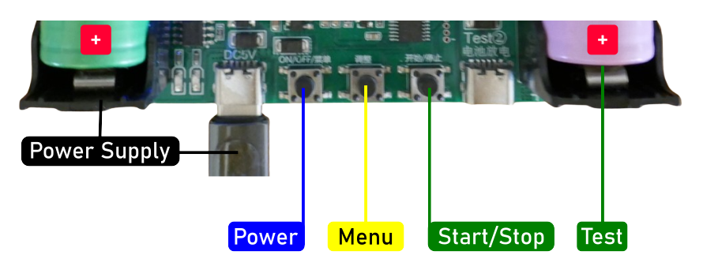
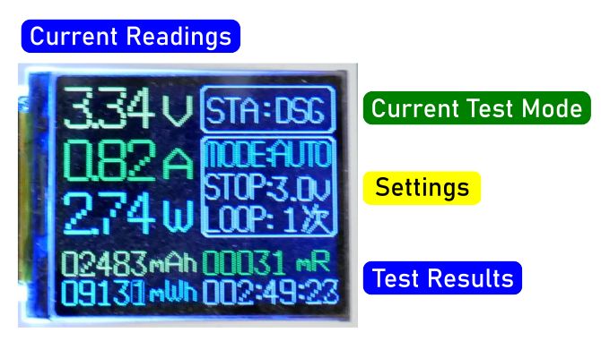

# All-In-One Battery Testers

> Cheap Yet Effective All-In-One Testers For Capacity Tests And Measuring Internal Resistance

Surprisingly affordable  *all-in-one* testers offer all the necessary measurements to reliably distinguish *counterfeit* batteries from *genuine* ones and provide a general estimate of battery health.

> [!TIP]
> The load resistor on top may get very hot during testing (60-80C). No fan or heat sinks are required, but I chose to add some heat sinks nevertheless to minimize the risk of accidentally burning my fingers.   

## Overview
This tester can be powered either via *USB-C* (using the **left** *USB-C* connector) or by a *18650* cell (in the **left** battery holder).

The *battery under test* can be a *18650* cell (in the **right** battery holder) or any other battery connected through the **right** *USB-C* connector. The *PCB* also features solder pads for attaching cables to an alternate battery holder.

| Item | Description |
| --- | --- |
| Power Supply | *USB-C* (left port) or *18650* battery cell (left holder) |
| Battery Under Test | *18650* battery cell (right holder) or external battery (**max. 5V**) |
| Charging | *Lithium Ion*, *1A* max. |
| Discharging | *1A* max (fixed load resistor) |

> [!CAUTION]
> When using this device to *charge* a battery (see details below), only *LiIon* and *LiPo* batteries are supported. The charging voltage is **too high for LiFePo4** batteries.

### Buttons And Operation
The unit has three push buttons:

* **Power:** *When off,* press to turn *on*; *when on,* press to select a menu item or long-press to turn *off*.
* **Change Settings:** Press to *increment* the currently selected menu item. No *decrement* is available, so keep pressing until the settings cycle back to the lowest option.
* **Start/Stop Test:** Press to *start* the selected test. Press again to *stop* it.

### Changing Language
The unit supports *English* and *Chinese* languages. To switch, follow these steps:

1. Turn off the unit.
2. Press and hold the *Menu* button while turning the unit *on*. Once content appears on the display, you can release all buttons.
3. Turn the unit off, then turn it back on.

## Test Modes
The unit supports three test modes: *AUTO*, *CHG*, and *DSG*:

* **Automatic Testing** (*LiIon/LiPo only*): In **AUTO** mode, the unit *charges* the battery under test until fully charged, then *discharges* it to determine its capacity, and finally *charges* it again. At the end of the test, the battery is fully charged.

   To select this mode, press the `Power` button until the **Mode** menu is highlighted, then press `Menu` until **AUTO** is selected.
   
* **Discharge Test** (*all battery types*): In **DSG** mode, the unit immediately begins *discharging* the battery to determine its capacity. Once discharged, the battery remains discharged, with no charging. Use this mode to test *non-LiIon/LiPo* batteries (e.g., *LiFePo4*, *NiMH*, or others).

   To select this mode, press the `Power` button until the **Mode** menu is highlighted, then press `Menu` until **DSG** is selected.
   
* **LiIon Charger** (*LiIon/LiPo only*): In **CHG** mode, the unit functions as a *charger* for the battery under test. Only use this mode with ***LiIon/LiPo*** batteries.

   To select this mode, press the `Power` button until the **Mode** menu is highlighted, then press `Menu` until **CHG** is selected.

The test modes can be further refined by two additional settings:

* **Loops:** In **AUTO** mode, you can perform up to *10 consecutive loops* for better accuracy.     

    To set the number of loops, press the `Power` button until the **Loop** menu is highlighted, then press `Menu` for the desired number of loops (*1-10*).
* **Stop Voltage:** In **AUTO** and **DSG**, you can set a *stop voltage* at which you want the *discharge* to stop. This can be useful if you are testing different *battery chemistries*, i.e. *LiFePo4*, or would like to make sure that the battery under test isn't exposed to deep voltages.     
    
    To set the number of loops, press the `Power` button until the **Stop** menu is highlighted, then press `Menu` to set the desired *stop voltage* (*2.5-3.5V* in steps of *0.1V*).

### Controlled Discharge: Resistive Load
The unit uses a static resistive load that can reach temperatures of *60-80°C* under test conditions. 

## Test Results
Test results are displayed in the lower part of the display and constantly updated while a test is running:

* **mAh:** currently discharged capacity in *mAh*
* **mWh:** currently discharged capacity in *mWh*. This is taking into account the battery *voltage* and *voltage drops* as well, so it is a more accurate unit to describe the battery capacity.
* **mR:** calculated battery *internal resistance* in *milliOhm*. This is an indicator for *battery quality and health*: lower is better. Normal *18650* cells should show an internal resistance of *<80mOhm*. *High drain 18650* cells (capable of delivering high *currents*) should be well below *20mOhm*.
* **Time:** Time in hours, minutes, and seconds that the current test has been running.

## Power Supply
The unit cannot take power from the battery under test, or else the test results would be inaccurate.

The default power supply is through the **left** *USB-C* connector. With this power supply, all three modes can be used.

For *portable use*, insert a *18650 cell* into the **left** battery holder. This cell powers the unit in **DSG** *(discharge) mode only*. You cannot *charge* the battery under test.

### Automatic Charging
When a *18650* cell is placed in the left battery holder, the unit automatically charges it once connected to *USB power*. Two *charger LEDs* indicate the charging status:

| LED  | Status                         |
| ---- | ------------------------------ |
| red  | battery is charging             |
| blue | battery is fully charged        |

When the battery is nearly fully charged, both *LEDs* may alternate between red and blue for a short period, as the unit apparently does not account for *hysteresis*.

> [!IMPORTANT]
> **Remove the left battery** if you do not plan to use the unit for an extended period. The unit draws a small quiescent current and lacks *under-voltage protection* for the left battery. Leaving the battery in the unit unused for too long may deep-discharge and **damage the battery**.

> Tags: Battery Tester, All-in-One, Capacity, Internal Resistance

[Visit Page on Website](https://done.land/components/power/battery/batterytesters/all-in-onetesters?426647102019242309) - created 2024-10-18 - last edited 2024-10-18
