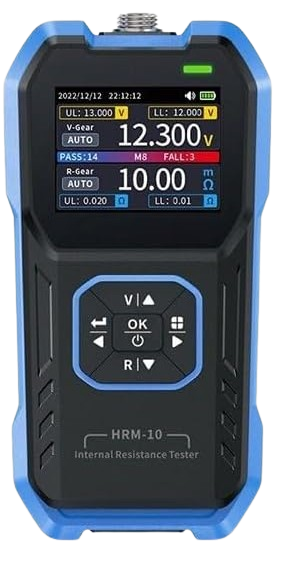
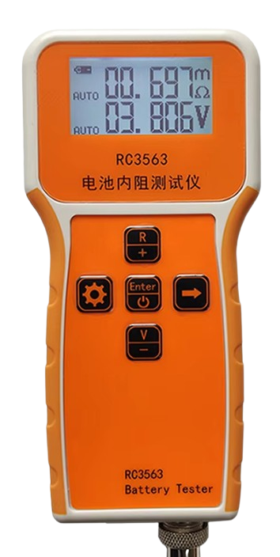

# Advanced Battery Testers

> Testing Batteries For Quality And Health

Advanced battery testers are crucial for evaluating the quality, health, and capacity of batteries, offering valuable insights into their performance. 

Unlike basic battery testers that merely indicate the current state of charge, these sophisticated devices allow you to assess the overall *quality* and total *capacity* of your battery. They can detect failures and help differentiate *genuine* batteries from *counterfeit* ones, ensuring reliable performance and longevity.

## Entry-Level All-In-One Testers
At the entry level, affordable testers costing just a few dollars can perform all the essential tests needed to provide a reliable assessment of your battery.

While often designed for specific battery types, such as *18650* cells, these *all-in-one* testers also feature solder pads that allow you to add connectors or battery holders for other types, as long as their voltage is below **5V**.

Here are the tests you can perform:

* **Total Capacity:** Determine the total battery capacity by conducting a full charge/discharge cycle, with the results displayed in *mAh*.
* **Internal Resistance:** Measure the internal resistance in *mOhm*. Although this method relies on the less accurate and simpler *voltage measurement method* (*DC resistance measurement*), it still provides a useful general assessment of battery health. The margin of error can be between *10%* and *30%*.

## Specialized Internal Resistance Testers
If you are willing to spend at least €40.00, specialized *internal resistance testers* are available, such as the *FNIRSI HRM-10* or the *RC3563*. For a significantly higher price, you can find similar devices from renowned brands, although they might be overkill for *DIY purposes*.

All of these devices utilize the more accurate *AC Resistance Test* to measure the batteries' *internal resistance*, with a margin of error of less than *0.5%*. Often, they include *data export features* to computers.

The downside is that these devices *exclusively* measure *internal resistance*. To assess the battery *capacity*, you will need an additional tester.

## Battery Capacity Meters
The only reliable way to measure a battery's *capacity* is to fully charge it and then completely discharge it to the safest low discharge voltage. During the discharge process, you need to sum up the total discharged current.

This is what the mentioned *all-in-one testers* do, however these typically have a fixed voltage range and discharge current. 

For under *€3.00*, you can also find small breakout boards that perform this same function. However, such dedicated *capacity testers* often offer greater flexibility, typically allowing for wider voltage ranges and adjustable discharge currents.

> Tags: Battery, Test, Capacity, Internal Resistance, FNIRSI HRM-10, RC3562, HW-586

