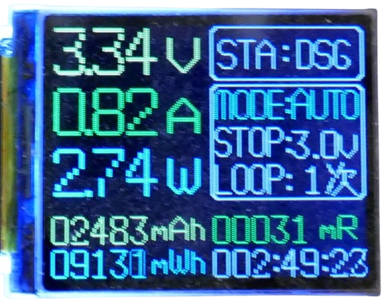

# Fake Batteries

> When Offers Are Too Good: Identifying Fake Rechargeable Batteries

Good rechargeable batteries are expensive. *Ebay*, *AliExpress* and other places are a highly competitive markets with few middlemen. Prices can be very low there - while you *indeed* get great components at unbeatable prices.

At the same time, such markets can be infested with fraudulent sellers: being located far away in untouchable jurisdictions, they feel (and in fact often *are*) *untouchable*.

*You always get what you pay for*, and *greed gets you in trouble*: such wisdom applies to battery sales as well. When prices are *way too good to be true*, then you are most probably getting screwed:

*Batteries* belong to goods that are *almost always* fake on these market places. That doesn't necessarily mean you shouldn't buy there. There are different "levels" of fake, and you may still get a good deal.

> [!IMPORTANT]
> I am **not encouraging** you to buy rechargeable batteries from untrustworthy sources. Quite the contrary, I want to create *awareness* for the fact that *fake and potentially unsafe* batteries are sold under trustworthy brand labels*, and help you identify these. Using batteries from untrusted origin with unknown specs can be **very dangerous** and potentially cause *fire* and *personal and property damage*. That said, I have successfully used *cheap batteries* many times. I use such batteries exclusively *under constant surveillance* and solely in non-critical projects.  

## What Are Fake Batteries?

There are different levels of *fake*, from a *small lie* to *systematic fraud*:

* **Brand Name:** sellers claim to sell original batteries from renown brands, when in reality they sell *no name* batteries that have been relabelled. Such batteries still work, although they seldom have the capacity and surge current capabilities of originals. However, when a battery costs just *10%* of the price at *90%* of the capacity, it may still be a good deal *unless you rely on high performance specs*: when you draw high currents from such batteries, depending on the *unknown underlying battery type*, they may catch fire or explode. For low current projects, they often work fine.
* **Recycled:** sellers source used batteries from industrial battery packs that have been used, are worn-out and at the end of their life time. They typically work for a while but do not at all reach the number of charging cycles that they should.
* **Fraud:** there is an outright *industry* producing *new fake* batteries that look perfect from the outside, but *inside* there is almost no *substrate*. Such batteries were produced *entirely to rip off buyers* and are completely useless. Typically, such batteries are much *lighter* than originals, and often have just *5-15%* of the claimed capacity. 

Often, fake batteries miss the integrated *protective circuits*, so they are not individually protected against short-circuits (any may be a fire hazard when not used with a *BMS* (*battery management system*)).

## How To Protect Yourself
First, apply some common sense to avoid being completely ripped off in the first place:

* **Greed:** Don't be unrealistic: hilariously *cheap* offers are typically just a *honeypot* for naive users.
* **Knowledge:** Know the nature of your batteries. When buying *18650 LiIon batteries*, you *should know* that even the best batteries have capacities no more than *3000mA*. Someone trying to sell *9900mA 18650* is obviously a fraudulent seller.
    
    

* **Customer Feedback:** When the product page does not show *customer feedback*, move on. When there *is* customer feedback, review it carefully. 

Next, when you *do purchase*, take precautions so you are protected if you receive *unusable batteries*:

* **Free Returns:** Only buy at platforms that have a customer service (like *AliExpress*), and only buy when there are *guaranteed **free** returns*. Take screenshots. Some sellers will let you return products, but you are expected to pay the return fee (which can easily be a multitude of the product price once you have deciphered the *Chinese home address*).
* **PayPal:** pay with *PayPal* or other services that offer an extended-time *buyers protection*. Many fraudulent sellers try to circumvent this by using extremely slow transports (although this is also done to minimize shipping cost). Shipping typically takes at least *2 months*, so for a *buyers protection* to be of any use, it should cover at least *3 months after purchase* or some time *after delivery*.

Once you receive your batteries, thoroughly *test them* (see next section) to get a good feeling of what kind of product you actually received, and whether it is safe to use.

Aside from the testing described in the next section, you *may* consider this:

* **Safe Charging Environment:** if you dare to use batteries from unknown sources *at all*, always make sure you *charge* them in a safe environment (i.e. in a fire-proof box or specialized *fire repellent pouches*). Add a smoke detector to that room (and make sure it works), and stay around to respond quickly in case something bad happens.
* **Monitoring:** on first use, and over the course of the first few charge cycles, *very closely monitor* the battery for signs of *heating* or *bulging*. Do not use such batteries *unattended* unless you have developed a good understanding of how the battery behaves.
* **Tear Down:** Given the low prices, you may want to *sacrifice* one battery and carefully examine it, i.e. simulate worst-case scenarios like high current surge or short circuiting, and see whether protective BMS kick in. Obviously, this is dangerous and should only performed by *experienced professionals* in *safe environments*, but you should also consider that *without such tests*, you may inadvertedly perform the same "tests" in your real life when you use unknown batteries in your devices.   

   Alternatively, you may want to carefully tear down the battery contacts and visually search for the BMS (this, too, is dangerous and requires appropriate measures).

## How To Detect Fake Batteries?

So you got new batteries, and now you are wondering if they are any good? Testing whether a rechargeable battery is genuine can be crucial for ensuring safety, performance, and longevity. 

### Visual Inspection
If your batteries come in some *plastic wrap* inside a plain postal envelope (or plastic bag), you can safely assume a non-trustworthy source. 

Branding and labels on the battery won't help at all, they are well-made on most fake batteries. Do make sure the batteries are not *mechanically damaged* by package and handling during the shipping.

### Weight
The easiest way of identifying *complete fraud* is by weighing the batteries:

Compare the weight with the weight of *known good* batteries. *18650 LiIon* for example weigh around *50g*. Completely fake batteries weigh  half of this (and also sound *hollow*). A *25g 18650* is unusable garbage: while it *seems* to have the right voltage, and while it charges and discharges ok on first sight, it typically has a capacity of just *400mAh* (due to the tiny amount of substrate inside of it).

If the battery weight seems ok, you most probably haven't received a *complete fraud*. The battery could *still* be fake (some sellers fill the space in such batteries with sand). Then again, even if the battery *is fake*, it may still be usable. 

So how good is it? Here are a few more tests that will tell:

### Voltage Drop
A simple test is to measure the battery voltage, and see whether the voltage drops *considerably* when you start drawing the current that you need. 

If the voltage drops rapidly when used, it can be a sign of a counterfeit or degraded battery.

## How To Judge A Battery?
Whether you have a *genuine* battery or one that just *looks like it*, the three most important *quality indicators* are

* **Capacity:** how much energy can the battery store?
* **Internal Resistance:** what is the battery health, and how good can it handle currents?
* **C-Rate:** what is the maximum discharge current that you can *safely* draw from the battery?

### Testing Battery Capacity
One of the most crucial parameters for usability is the *capacity test*: how much energy can the battery deliver, and how long will the battery last before it is empty?

The easiest way is to use a dedicated *battery capacity tester*. If you don't have one, you can also put the battery to use and compare it to the run times of *known good* batteries.

As you will probably discover, *most cheap batteries* do not reach the capacities of *quality batteries*, but their capacity may still be ok for your use cases. Typical *18650 fakes* (no complete fraud) come with capacities in the range of *1.500-2-500mAh*.

> [Note]
> A *capacity test* helps you understand whether or not you can use the battery at all. This test does not tell you though whether the battery is *new* or *old*, and how many charge cycles are remaining. It also does not reveal what the maximum discharge current is. For devices that require an exceptionally high discharge rate (i.e. battery packs for drills, electronic cigarettes), better not use batteries from unknown sources even if the seller claims they are good for *30A*. If there's a standard battery inside, it might explode in your face when you essentially *short circuit* it by drawing high currents.

### Testing Internal Resistance
So how about the overall *battery quality and shape*? Is it a *new* battery, or did you get *recycled old batteries* that will probably last only a few more charge cycles?

This is something the *internal resistance* can tell. Measuring the *internal resistance* cannot be done with a simple *Ohm Meter*, but there are procedures that you can follow with a regular *multimeter*. Dedicated battery testers often include this parameter in their measurements:

The battery under test in the picture above shows an internal resistance of *31mOhm* (which is excellent), and the capacity of *2.483mAh* at a voltage of *3.34V* is great as well. Discharging typically continues until *3.0V* is reached, so the expected battery capacity in this ongoing test is probably going to be around *2.600mA*.

Here is what the *internal resistance* can tell you about a battery:

| **Battery Condition**         | **Internal Resistance (mΩ)**        | **Description**                                                        |
|-------------------------------|-------------------------------------|------------------------------------------------------------------------|
| New high-quality cells  | 10 mΩ to 50 mΩ                     | High-quality cells from reputable manufacturers like Panasonic, LG, etc. |
| Standard quality cells         | 50 mΩ to 100 mΩ                    | Moderate quality, but still functional for most applications.           |
| Used or aging cells            | 100 mΩ to 150 mΩ                   | Internal resistance increases with age and usage, showing signs of wear.|
| Degraded or counterfeit cells  | 150 mΩ+                            | Cells with high internal resistance, indicating poor performance and potential safety concerns. |

Lower internal resistance typically means better performance under high load. A high internal resistance may suggest the battery is degraded and cannot handle high current discharge.

> [!NOTE]
> For rough estimates, cheap battery testers (and the manual multimeter method) can give you a general idea of the battery's health but the margin of error is high (*10-30%*). Dedicated battery analyzers or internal resistance testers are much more accurate due to a different measurement scheme (but also much more expensive). 

### Testing C-Rate
The only parameter that cannot be tested *non-invasively* is the battery *C-Rate*: the maximum current that you can safely draw from it.

Normal *Lithium*-based batteries have a *1C* rate (so a *2.500mAh* battery can safely deliver up to *2.5A*). If your battery claims to be a *high current* battery with *C rates* of up to *10C*, you should *verify this claim* with a *discharge test*.

> [!TIP]
> Before worrying too much, measure the *internal resistance* first: batteries with internal resistances of more than *50mOhm* most likely **will not handle high currents well**, in which case you can skip the remainder of this test.  

#### Prerequisites

For this test, you will need a **thermal camera** (you must be able to pick up *battery heating* **immediately**), and an **electronic load** (that can simulate various loads).

#### Setup

1. Connect a *voltmeter* to your battery so you can monitor the current voltage. Most *electronic loads* come with voltage measurement, too, in which case you can skip the multimeter.
2. Connect the electronic load to your battery, and set the load to **3C** (if the battery has a capacity of *2.500mAh*, set it to *2.5Ahx3C=**7.5A***). Don't turn the load on, yet.
3. Set up the *thermal camera*, and note the current battery temperature. Make sure you can constantly monitor the battery temperature. Touch the battery with your hand, and make sure you can immediately see the *warming* in your thermal camera. You must be able to pick up even small temperature changes quickly.

> [!TIP]
> If you suspect your battery to support *lower-than-normal C-Rates*, i.e. with some *LiPo pouch batteries*, do not start the test with **3C**. Start with **0.1C**, and increment in steps of **0.1C**.

#### Performing Test

1. Turn on the load, and monitor *battery voltage* and *battery temperature*. Remove the load **immediately** when either one occurs:
    * the **voltage drops significantly** below the nominal voltage or sags quickly when applying the load
    * the battery **heats up significantly**, remove the test current immediately. 
2. After 1-3 minutes, increase the load by **1C** (if the battery has a capacity of *2.500mAh*, *1C* equals to **2.5A**).

Repeat the steps until you either exceed the current you require, or until the battery starts to show signs of decompensation.
    

> Tags: Battery, Fake, 18650, Internal Resistance, Capacity, Weight, BMS, C-Rate, Discharge Test

