# XT60 Connectors

> Rugged High-Current Connectors for Power Supplies and Batteries

Because *XT60* connectors are an open standard, and since they are relatively small plugs that can handle very high currents up to *60A* (continuous), they are very popular.

While there are also *XT30* (for up to *30A*) and *XT90* (for up to *90A*), *XT60* is the best trade-off between size, performance, and affordability.

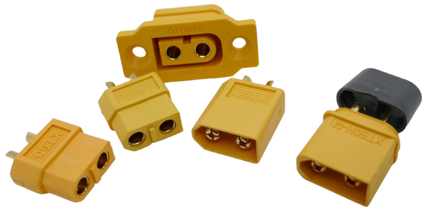

## Overview

Initially, *XT60* became popular among *model makers* and with devices that require large currents: *RC vehicles*, *drones*, etc. Today, *XT60* is used in many scenarios involving high *DC* currents, including *battery charging*, *solar power systems*, and *portable power stations*.

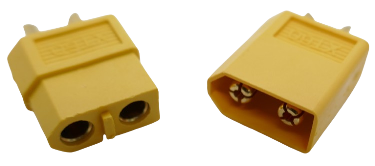

*XT60* is similar to *banana plugs* and has two poles. The connector comes in *female* and *male* configurations, and the shape of the connector prevents accidental reverse polarity.

### Conventions

By convention, *female* plugs are used for the *power supply side*, and *male* plugs are used for the *consumer side*. This is done primarily for safety reasons: the *female* contacts carrying the live supply power are better protected, whereas the *male* plugs could make accidental contact more easily.

Also by convention, the contact at the straight side is *positive*, and the contact at the angled side is *negative*. 

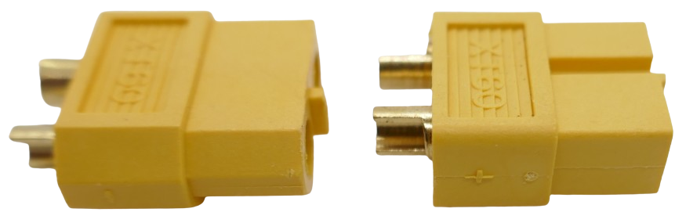

Note the small *+* and *-* icons on the side of the plugs.

> [!IMPORTANT]
> Conventions are great, but they are not mandatory. You may come across cases where **different rules** were applied. When you purchase *3rd party XT60 cables* or use devices with *XT60* connectors, always verify they adhere to the conventions, especially the *polarity*. You can seriously damage or destroy devices when reverse polarity is applied.

### Variations

Typically, *XT60* connectors are *yellow*, but you can also find *orange* and *black* versions. Optionally, protective covers are available to keep dust and dirt outside, underlining that this connector type is intended for rugged outdoor devices.

Generic connectors come with gold-plated contacts only, and cables of appropriate gauge are soldered to them. Then, a simple shrink tube holds them in place.

There are also more sophisticated designs that come with a *clip-on cover* to protect the soldering contacts.

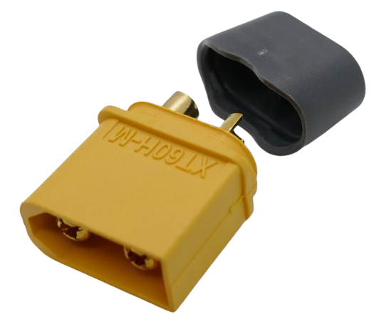

### Common Issues and Tips

- **Soldering Challenges**: The plastic housing can melt during soldering if the iron is too hot or the process takes too long. Use a high-quality soldering iron with a temperature-controlled tip and pre-tin both the wires and the connector.
- **Tight Fit**: New *XT60* connectors may be difficult to plug and unplug. This tight fit improves over time with use.

## Integrating XT60 into Device Housings

The primary use case for *XT60* is to connect *cables*. If you'd like to add *XT60* jacks to a device, there are special designs available:

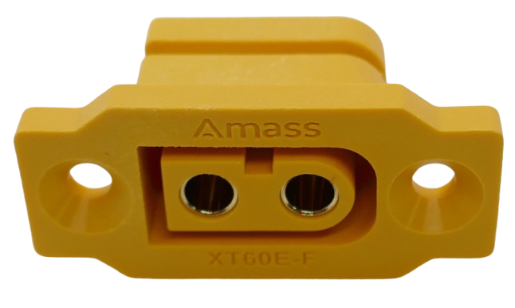

However, these are harder to get, and often they are available as *female* versions only.

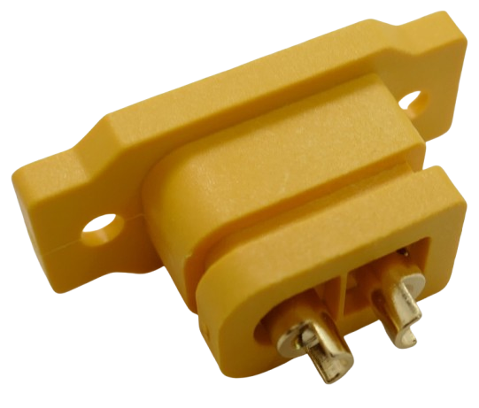

Another disadvantage is that these designs are relatively large. If you need to add more than one jack to your device, a lot of space is wasted.

### Using Plugs As Jacks

If you have access to a [3D Printer](https://done.land/tools/devices/3dprinter/), you can mount regular plugs to your device housings. This requires a bit of fiddling, but it works very well.

#### Locking

Plugs (both *male* and *female*) do not have a classic feature in their shape that could be used to safely lock them in place. However, both plugs expose a rectangular area on each side that sinks in roughly *0.7 mm*.

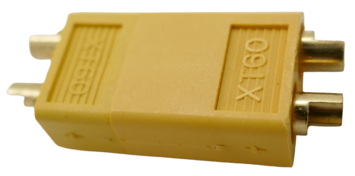

You can take advantage of this by designing your *3D printed housings* with a *counter-locking* rectangle that fits exactly into these recesses. *0.7 mm* is high enough for typical 3D filaments (*PLA*, *PETG*) to keep the plug safely in place.

This way, you can cost-effectively use regular plugs (*male* or *female*) and integrate them into your device housings without wasting space.

Just make sure they are held tightly in place, for example by designing a top plate that can be firmly screwed onto the bottom plate, effectively locking the plugs into place.

Note the rectangular *counter-locking surface* in the printed parts below:

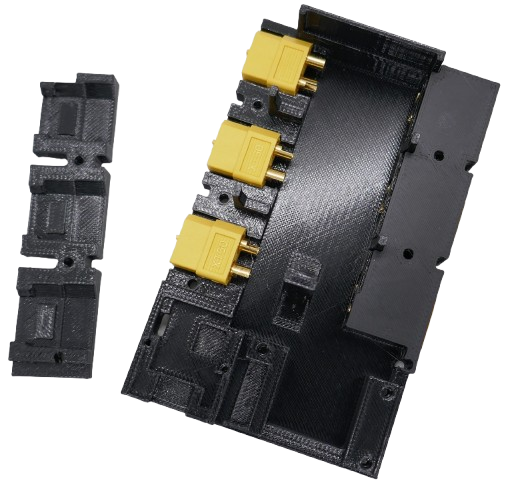

### 3D Models

To easily add mounting beds for *XT60* plugs into your *3D-print housings*, I designed *3D models* for *male* and *female* XT60 plugs in *Fusion360*.

> [!IMPORTANT]
> The models I created may or may not work for you. The affordable *XT60* plugs from *Chinese* sources vary slightly in their outer dimensions. The models are for the *yellow* versions. I found that *orange* versions are slightly larger and need adjustments. I am providing you both with *STL* versions and with the original *f3d* files that you can load into *Fusion360* for adjustments.

#### Male Plug
Here is the shape for a *male XT60 plug*, including a rectangular part that is later reserving the space for the soldering area. Keep in mind that the shape acts like a *stencil* in your *3D model*:

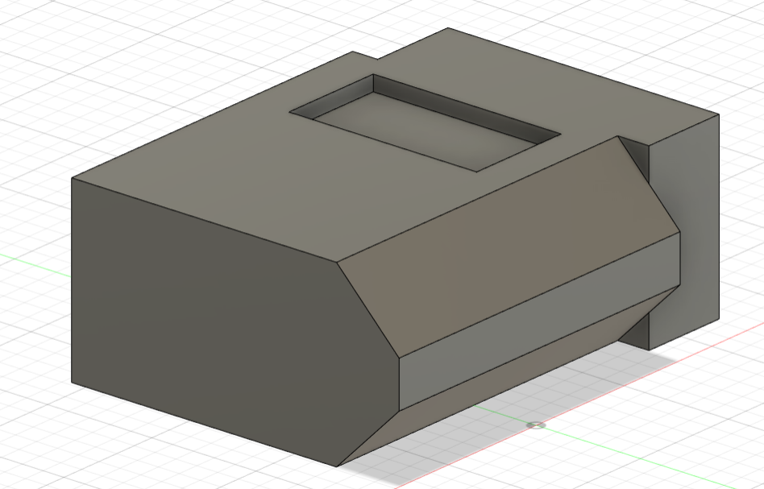

* [XT60 Male STL file](materials/Comp_XT60M.stl)    
* [XT60 Male F3D file](materials/Comp_XT60M.f3d)    

#### Female Plug

The *female* version uses an extended shape to provide the room required to later insert a *male* plug:

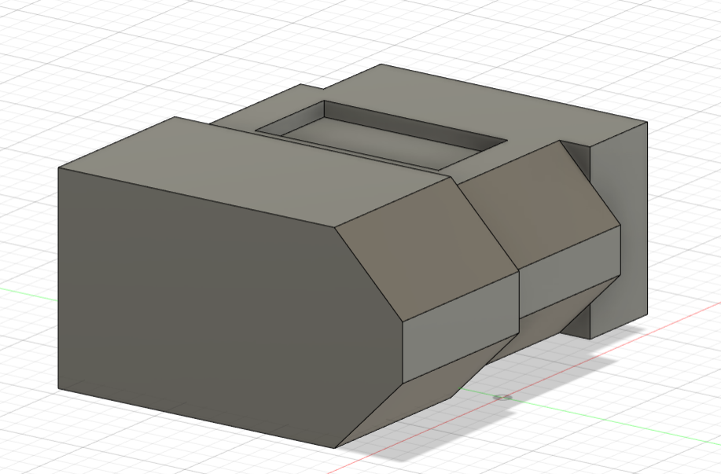

* [XT60 Female STL file](materials/Comp_XT60F.stl)    
* [XT60 Female F3D file](materials/Comp_XT60F.f3d)    

### Using 3D Models
In your *3D-modelled device housing*, place the *XT60 3D models* where you'd like to integrate a plug.

Next, *cut* your model using the inserted XT60 model(s) as *tool*. The result is a *negative imprint*.

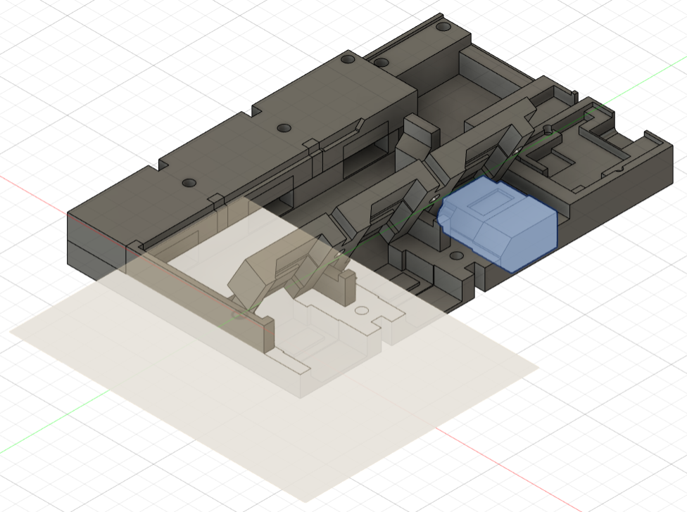

Next, use a construction pane to *split* your housing in a way that you can later insert the real *XT60* plugs into the lower part of your housing, then adding back the splitted upper part of your housing to safely lock the XT60 plugs into place.

#### Testing
Once you have manually inserted the real XT60 plug(s) into your printed model, they should securely "snap" into place. **While applying pressure from the top**, they should remain fixed firmly by the rectangular recess that they are sitting on.

Test this thoroughly because a firm mount is crucial: insert a XT60 cable and try and forcefully remove it (while continuing to apply pressure on the plug from the top).

If the inserted plug moves, then you need to revise your design. Most likely, your XT60 connector dimensions vary slightly from mine and might be a bit too wide.

In cases like this, you may want to open the supplied *f3d* files in *Fusion360*, and adjust the dimensions to match *exactly* your plugs.       

#### Finalizing
It is crucial that the *XT60* plugs are held firmly from top and bottom.

Add *M3 screw holes* so you can securely tighten both parts. This is essential to reliably hold the plugs in place, even when applying a strong *pulling force*, i.e. when unplugging a cable.

> [!TIP]
> Use plain *2.8 mm* cylinder shapes for screw holes. No need to create threads, or use *heat insert nuts*. When you later screw in regular *M3 screws*, they will cut their threads themselves and hold both parts with maximum strength.

## Soldering Tips

Soldering wires to *XT60 connectors* is easy, but because of the large surface areas, a lot of heat is required.

* **Shrink Tube:** do not forget to add shrink tube to the wire before you start soldering, and place it far enough away from the end you are soldering. Since a lot of heat will be involved, the shrink tube could otherwise start to shrink prematurely.
* **Pre-Tin:** Apply tin to the end of your wire before you start soldering it to the connector. Make sure it still fits into the rounded connector.
* **Heat Sink:** To protect the contacts from the heat required for soldering, plug in another plug before you start soldering. This holds the contacts in position. Else, when the XT60 housing gets too hot, it may become soft, and the contacts may start to move or bend.
* **Big Solder Tip:** use a large solder tip (*Type C*). It fits perfectly inside the rounded connector and can heat it up quickly. Small solder tips lose heat too quickly and cannot transfer enough heat for the solder tin to evenly flow into the contact.
* **Low-Temp Soldering Tin:** Use soldering tin with flux, or apply flux yourself. Try using tin with a low melting temperature. With regular lead-free tin, you may need temperatures above *400C*, especially when using too small soldering tips. This can heat up the nylon case of the plug too much, damaging it, or the placement of the contacts inside of it.
* **Heat Connector First:** Melt solder in the connector after applying flux. Once the connector is 1/2 filled with molten led, insert the tinned wire. Hold it in place, and blow for faster cooling until it is firmly kept in place.

> [!IMPORTANT]
> Successfully soldering wires to XT60 connectors depends largely on an appropriate soldering iron and soldering tip. A lot of heat needs to be transferred in a short period of time. Only then will you be able to complete the soldering within a few seconds. With tips that are too small, you risk damaging the nylon casing: it simply takes too long now for the connectors to thoroughly heat up. This causes the case to pick up too much heat and melt.

## Technical Details

- **Current Rating**: 60A continuous (actual capacity depends on cable gauge and soldering quality).
- **Contact Material**: Gold-plated for excellent conductivity and corrosion resistance.
- **Wire Gauge**: Supports cables from *12AWG* to *10AWG* (depending on the variant).
- **Mating Cycles**: Typically rated for 1000 mating cycles, ensuring long-term reliability.
    * Over time and with excessive mating cycles, XT60 connections may loosen, and the resistance may rise. This may limit the maximum current and lead to voltage drops, however it may not have an immediate effect on DIY projects that typically use much lower currents than *60A*.
    * For use cases where connectors need to be mated and unmated *very* frequently, you may want to consider connectors with higher cycle ratings, such as *Anderson Powerpole*, or alternatives that are specifically rated for higher cycle life.

### Wire Gauge and Current Table

| Wire Gauge (AWG) | Max Current (A) | Notes                          |
|-------------------|-----------------|--------------------------------|
| 10                | 55-60          | Heavy-duty, minimal resistance |
| 12                | 35-40          | Common for most applications   |
| 14                | 25-30          | May introduce slight resistance|

## Comparing XT60 to Other Connectors

While *XT60* is a popular choice, there are alternatives worth considering:

- **Anderson PowerPoles**: Modular, stackable, and available in a wide range of current ratings. Often used in amateur radio setups.
- **Deans Connectors**: Smaller than *XT60*, common in RC vehicles but less durable over repeated connections.
- **EC5 Connectors**: Similar to *XT60* but with a more robust design for extreme applications.

## Environmental Resistance

While *XT60* connectors are rugged, they are not inherently weatherproof. For outdoor applications:
- Use heat-shrink tubing or connector covers to seal exposed solder joints.
- Consider fully enclosed housings to protect against moisture and dirt.

> Tags: Connector, Power, High Current, XT30, XT90, Soldering

[Visit Page on Website](https://done.land/components/power/cables/connectors/xt60?528016011022253646) - created 2025-01-21 - last edited 2025-01-21
