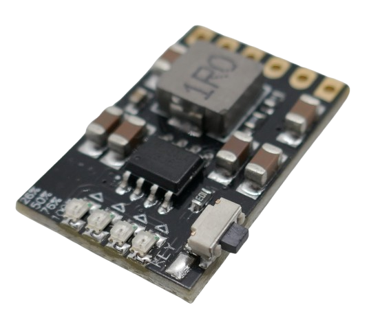
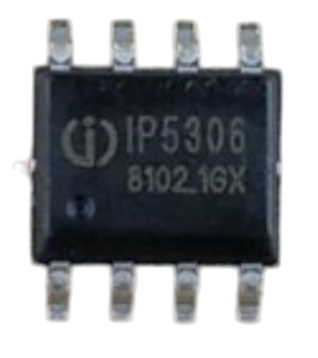
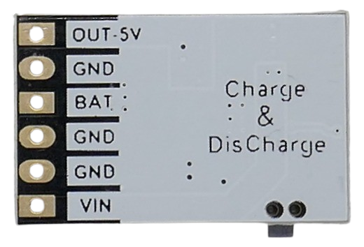
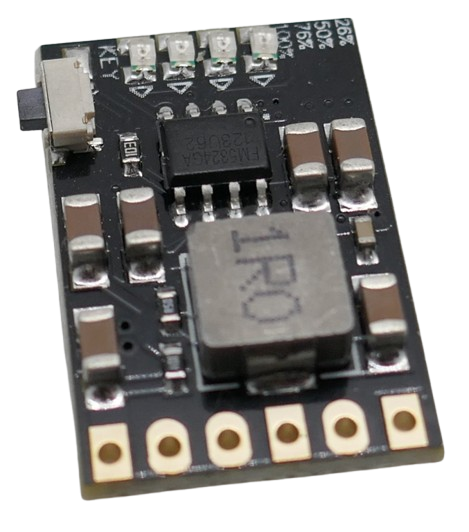

# MH-CD42

> Robust and Powerful 2A 5V Power Supply Powered by a Single Li-Ion Cell

The *MH-CD42* is a compact module designed for use with a single (1S) Li-Ion or Li-Po cell, or multiple cells connected in parallel.

At its core, the module uses the [IP5306](https://done.land/components/power/chargers/charge-discharge/ip5306/) power management chip, a robust solution for efficient power regulation both for charging and for discharging.

Many breakout boards from various vendors exist that are all built around this chip (or its Chinese clones, such as the *FM5324GA*). These boards share many similarities, as the *IP5306* largely defines their behavior.

**That's why it is essential** that you consult [this comprehensive guide](https://done.land/components/power/chargers/charge-discharge/ip5306/) on the IP5306 first before you move on to *this* article which focuses exclusively on the ***specific** details and nuances* of the *MH-CD42* breakout board. 

## Overview

This *16x25mm* module integrates all necessary components for building power banks, portable chargers, or adding battery support to USB/5V devices.

### Separate Input and Output Connectors

Because of the *IP5306* specific power path management, the module uses *separate* USB connectors for input (charging) and output (power supply):

- **VIN:** Input connector for a *5V* charging power supply. Can be connected to a USB connector if you want to use a USB power supply for charging. 
- **OUT 5V:** Output connector. Provides *5V* at a maximum of *2A*. Connect one or more USB connectors of your choice if you want to supply power to USB devices, or connect a *5V* DIY device (i.e. microcontroller breakout board) that you want to supply with portable power.

- **BAT:** connect the positive pole of *Li-Ion* or *Li-Po* battery. Make sure the battery supports *2.4A* charging current and a maximum of *3.5A* discharge current.

#### Understanding Power Output Paths
This module can *either* charge the battery *or* supply power. It cannot do both at the same time. Regardless, you can draw power *while* charging. How does that work?

The chip's power path management uses the battery and boost converter to provide battery power when no external power is connected (no charging).

Once you connect external power to *VIN*, the boost converter is turned off, and charging begins. The power output will still *continue to deliver power* to the *OUT 5V* pin, however now this power is taken from the *VIN* pin.

This has a number of consequences you should know and consider:

* **High Input Power Requirements:** the chip charges the battery with up to *2.4A* (10.5W) while simultaneously providing up to *5V 2.1A* (10.5W) to *OUT 5V*. During charging, *both* is powered by the external power supply connected to *VIN*. The combined output power is *21W*. Your external power supply must be capable of delivering up to *22W*/*4.5A* at *5V*.
* **Short Interruption:** the chip needs to switch power paths once a power supply is connected to, or disconnected from *VIN*. Supplying external power or removing it may therefore both cause a brief power interruption, potentially rebooting connected microcontroller boards. Adding a sufficiently large capacitor to the power input can mitigate this issue.

### Push Button

A push button is mounted to the PCB. There is also a solder pad at one end of the push button, labeled *KEY*, where you can connect an external push button. Use a *10kΩ* resistor to connect the push button to *GND*.

The button allows manual control of the power supply:

- **Short press (>30ms but <2s):** Turns on indicator LEDs and enables power output.
- **Double short press:** Turns off indicator LEDs and disables power output.

### Torch LED

A *torch LED* can be connected in parallel to the push button using a *100Ω* series resistor. The push button can then turn the LED on and off with a *long press*. The torch LED is designed to draw approximately *25mA*.

> [!TIP]
> When the push button is using a *2KΩ* series resistor instead of a *10KΩ* series resistor, the torch feature is disabled, and a *long press* is without function.    

## Charging Mode

The charger activates automatically when a power supply is connected to *VIN**, charging the battery at up to *2.4A*. It requires a *5V 2A* input. For detailed charging specifications, refer to the [*IP5306* documentation](https://done.land/components/power/chargers/charge-discharge/ip5306/).

The charging cut-off voltage is set to *4.2V*, which is suitable for most *Li-Ion* and *Li-Po* batteries. The *IP5306* supports higher cut-off voltages, and some modules like the [X-150](https://done.land/components/power/chargers/charge-discharge/ip5306/x-150/#charging-mode) provide solder bridges to customize this, however this module does not expose this option. 

## Supplying Power

The module provides *5V* at up to *2A* at pin *OUT 5V*. Advanced quick-charge protocols are not supported.

Four red SMD LEDs display charging status and battery *state of charge* in 25% increments. When the battery's *state of charge* drops below *3%*, one LED starts to blink. If the battery voltage drops below *2.8-2.9V*, the *over-discharge protection* cuts off power.

If the load is very light (*<45mA*) for more than *32s*, the *automatic load removal detection* will cut off power.

> [!NOTE]
> During charging, the load is powered directly from the input supply, not the battery. This behavior only applies to battery operation. While charging, the load remains powered regardless of the battery status.

### Manual Mode

Manual mode allows direct control of the (battery-powered) output via the optional push button:

- **Short press:** Manually enters *Standby* mode and turns power output *on*.
- **Double short press:** Exits *Standby* mode and stops power output.

When the module is charging, the buttons have no effect, and *OUT 5V* is always powered.

> Tags: Charger, Li-Ion, LiIon, Li-Po, LiPo, Boost Converter, 2A, USB, 1S, IP5306, FM5324GA

[Visit Page on Website](https://done.land/components/power/chargers/charge-discharge/ip5306/mh-cd42?192546011815254411) - created 2025-01-14 - last edited 2025-01-14
