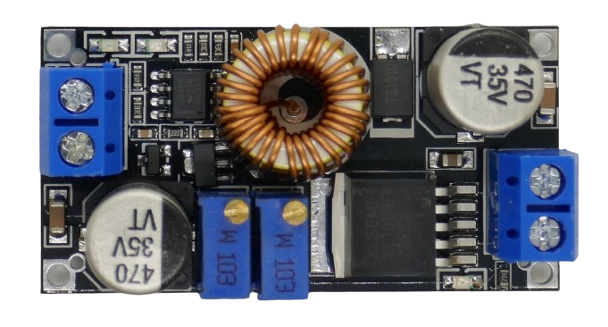
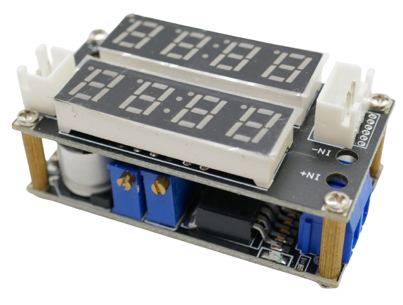

# XL4015 Voltage Regulator

> Buck-Regulator from XLSEMI: 5A, 36V, 180kHz

The **XL4015** from *XLSEMI* is a popular step-down (**Buck**) voltage regulator chip that is used in many cheap breakout boards.

Here are the key specs for this chip:

| Spec | Value |
| --- | --- |
| *Input* Voltage | 8V-36V |
| *Output* Voltage | 1.25V-32V |
| Max *Output* Current | 5A |
| Minimum Voltage Difference | 0.3V |

> [!IMPORTANT]
> The *XL4015 chip* can handle *a maximum* of **5A** only for output voltages *below 10V*. For higher voltages, the limit is **50W** (**75W** with additional heat sink). Exceeding these values permanently destroys the board.

| Spec | Value |
| --- | --- |
| Switching Frequency | fixed 180kHz |
| Short Circuit Protection | yes |
| Constant Current Function  | yes |
| Thermal Protection | yes |
| Max Junction Temperature | 125C |
| Design | PWM-Buck |
| Efficiency | up to 96% |

What does "Efficiency" mean?
 

Any *voltage regulator* converts a *input* voltage to a different *output* voltage, and this process has losses (causes heat). The *efficiency* states how much of the *input* energy is actually ending up at the *output* terminal, and how much is lost as heat:

An efficiency of *96%* states that 4% of the energy is lost in heat. The amount of heat generated depends on the total amount of energy you feed into the regulator.

### Examples

If you supply **12V** and would like to get **5V** and **3A**, then these calculations apply:

* The total *output* energy is **5V** x **3A** = **15W**.
* At *96%* efficiency, *4%* of *input* energy is lost. You need **15W** x **100%** / **96%** = **15.625W** at the *input* (and **0.625W** dissipate as heat)
* When you drive the *input* with **12V**, you need **15.625W** / **12V** = **1.3A**

The *XL4015* has a **maximum** efficiency of *96%*. Efficiency is very different for different *input* and *output voltage* scenarios.

* When you reduce **24V** to **12V** and draw **4A** at the *output* side (i.e. to run a car cooling box off a truck battery), efficiency is *93%* (according to data sheet).
* When you reduce **12V** to **5V** and draw **5A** at the *output* side (i.e. to operate USB devices from a car lighter jack or power a microcontroller), efficiency is just *87%*.

### Dissipate Heat 

This illustrates another important consideration: *heat sinks*.

In the latter example, **5V** @ **5A** result in **25W** power. The lost energy at *87% efficiency* is ( **25W** / **0.96**) - **25W**: **1.04W**. So in this scenario, the voltage regulator also works like a *1W heater element*. Make sure your housing and device design allows *1W* worth of heat to be dissipated. If it is less, your device will continuously heat up until it breaks.

### Affecting Efficiency

*XL4015* efficiency is generally controlled by these scenarios:

* **<200mA Output Current:** when drawing currents *less than 200mA*, efficiency is worst and can drop to as low as 62%. This regulator is therefore *not ideal* to power small microcontroller circuits.
* **>3A Output Current:** Output currents above *3A* hurt efficiency over-proportionally across all voltages.
* **Voltage Difference:** the *higher* the voltage difference between *input* and *output*, the *lower* the efficiency. Converting **36V** to **5V** drops efficiency to around *80%* whereas converting **12V** to **5V** keeps efficiency above *90%* most of the time.
* **Very Low Output Voltage:** the *lower* the *output* voltage, the less efficient. It is more efficient to reduce **24V** to **12V** (*12V* drop) than to reduce **12V** to **5V** (just a *7V* drop, should be *more* efficient but the *output* voltage is *very low*

The *XL4015* is best if operated in the mid-range. It suffers when you move towards its *edge cases*, either by drawing *too little* or *too much* **current**, or by using *a very high input* or a *very low output* voltage.

That said, even with a relatively lower efficiency, the *XL4015* still performs well even in edge cases. Just don't over-do it. The lesser the efficiency and the higher the current you draw, the better should be your *heat sink*.

## Common Pitfalls

Here is a list of common *misperceptions* that can cause breakout boards to go off in flames:

* **Maximum Current:** The *maximum* current is **5A or the maximum handling power of the board** - *whichever is **lower***. The boards discussed here handle a maximum power of **50W** (up to **75** when proper heat sinks are added).
  * **50W** allow a current of **10A** at **5V** output. The absolute maximum *current* for the *XL4015* is **5A** though. So at **5V** output, the maximum current is **25W**.
  * At **24V** output, **5A** would be **120W** which massively exceeds the **50W**. To stay within **50W**, at **24V** output the maximum current is **2A**.
* **Short Circuit Protection:** While the *XL4015* comes with *short-circuit protection*, you cannot skip a *fuse* nor can you keep the *output terminals* shortened for an extended period of time. The *XL4015* *reduces* switching frequency from 180kHz to 48kHz when short-circuited but *will not* disconnect the output. It will ultimately run into its *thermal protection* which *wears down and can eventually damage* the chip. *Short-circuit protection* is meant to protect from *very short* and momentary events.
* **Input Voltage > Output Voltage:** this is a **Buck** regulator. It *reduces* the input voltage. Once you set an *output voltage*, this limits the range of allowable *input* voltages:
  * The regulator supports *input* voltages in the range of *8-36V*. If you set the regulator to an *output* voltage of *12V*, the *input* voltage now is in the range of *12.3-36V* (add *0.3V* to the *output voltage*: this is the *minimum voltage difference* found in the specs above).
   

What does "Switching Frequency" mean?
 

The *XL4015* uses a *fixed* switching frequency of 180kHz which is considered to be relatively *low*. 

> Occasionally vendors claim a switching frequency of *300kHz*. This frequency refers to the *XL4005* regulator. The *XL4015* switching frequency cannot be modified and is always 180kHz during normal operation.

### Benefits of Low Switching Frequency

Low switching frequencies must store *more* energy per switch so they must increase component size (for *coils* and *inductors* so that they can actually store more energy) which increases board size, weight, and cost. 

At the same time, this can improve *efficiency* though, especially when larger currents are required: each time energy needs to be transferred back and forth, losses occur. With lower frequency, losses happen less frequent.

Another positive effect of *low* switching frequencies is less *EMI* (electromagnetic interference). Using regulators with *low* switching frequencies like the *XL4015* are well-suited for *DIY projects* where *makers* seldom pay attention to proper *EMI protection*, and where miniaturization is not critical.

### Benefits of High Switching Frequency

There are advantages for *high* switching frequencies, too: Regulators with *high* switching frequencies (up in the range of several MHz) are much smaller. 

They need to switch only very small amounts of energy because due to the high frequency, they switch much more often. 

This can result in less *output voltage ripple*. For the same reasons, regulators with *high* switching frequency can *respond faster* to changes in load and output impedance. In general, *high* switching frequencies produce more stable output voltages (*steady-state*). They are ideal for highly integrated devices such as *smartphones*.

## Pins

Most probably the *XL4015* will be mounted on a supporting breakout board but you can operate the chip by itself, too, and design your own **Buck** converter around it:

| Pin | Name | Description |
| --- | --- | --- |
| 1 | GND | Make sure you connect it outside a supporting Schottky diode to prevent switching current spikes to backfire as noise into the chip |
| 2 | FB | Feedback. Typically a resistor voltage divider senses the actual output voltage and reports it through this pin (feedback threshold voltage is 1.25V) so that the chip knows whether adjustments are needed |
| 3 | SW | Output positive voltage |
| 4 | VC | Connects a 1uF bypass capacitor to VIN |
| 5 | VIN | Input positive voltage. Use large capacitor to GND to control noise |
 
[Data Sheet](materials/XL4015_datasheet.pdf)

## 50/75W CV Buck Converter

[50W](#){:.button.button--success.button--rounded.button--sm}[CV](#){:.button.button--success.button--rounded.button--sm}

Even though the *XL4015* comes with *constant current* functionality built-in, some breakout boards do not utilize this functionality and provide *constant voltage* (**CV**) only. You can easily recognize these boards by the *one* trim potentiometer (instead of *two*):

> [!TIP]
> This **Buck** converter is perfectly suitable to supply power to your DIY devices as this typically requires a *constant voltage*.
> 
> Use as a LED power supply is *limited* as you can drive LEDs by voltage only. Since this board has *no constant current*, you cannot drive LEDs by current (which is the preferred way). Use as a *battery charger* is not possible as *constant current* is lacking.

### Hardware Design

These *very simple* **Buck** converters feature through-hole connectors for *input* and *output* power on both ends, and a printed arrow on the back side indicates the direction of power flow.

Often, you can get these converters for cheap in packs of 3 or 5 from places like *Amazon*.

A small LED beneath the trim potentiometer lights up when powered.

### Setting Output Voltage

To set the desired fixed output voltage, connect a multimeter to the output, set its range to the **200V** range (or any range that safely covers your input voltage), then connect the *input power*.

The multimeter shows the actual *output* voltage. This voltage *cannot be higher than your input voltage*.

Now turn the trim potentiometer in either direction and watch the voltage change at your multimeter.

### Specs

| Feature | Value |
| --- | --- |
| Input | 4-38V |
| Output | 1.25-36V |
| Maximum Current | 5A |
| Maximum Power | 50W |
| With Heat Sink | 75W |
| Reverse Voltage Protection | yes |
| Reverse Polarity Protection | no |

*(always double-check the data sheet or manual of *your* board. There are many different variants available that all look and behave similar but not necessarily identical)*

> [!TIP]
> The *quality* of these boards varies greatly: they can work great, and they can be dead out of the box. You get what you paid for.
> Any of the boards showcased here can be destroyed by overloading them: keep in mind that the maximum power is **50W**, so when your *input* voltage is **24V**, the maximum current is **2A** (not **5A**), and with a good extra *heat sink* you might push this to a maximum of **3A**.
> These boards work best when *not* pushed to their limits, though.

## 50/75W CV CC Buck Converter

[50W](#){:.button.button--success.button--rounded.button--sm}[CV](#){:.button.button--success.button--rounded.button--sm}

This is a very popular breakout board that is available in a number of slight variations. Boards work fundamentally the same. Here are the differences:

| Item | Difference |
| --- | --- |
| Board Color | red, black |
| LED Colors | red,green,blue / red,red,blue / all red |
| Schottky Diode | TS1010, SS54, SS56 |
| LED description printed on backside | yes / no |
| Coil placement | upright / flat |

Hardware Design Review
 

All board variants use the same fundamental components.

### XL4015 Buck Regulator

The five-leg *XL4015* main regulator chip is located close to the two *input screw terminals*. 

Next to it and close to the *input terminal*, is one of two electrolyte capacitors with a printed voltage. This capacitor is connected directly to the *input* power, so its maximum voltage tolerance must be higher than the maximum *input voltage*.

### Schottky-Diode

In-between the capacitor and the coil is a *Schottky diode* located that provides *reverse voltage protection* for the *input terminal* (protection against accidentally swapping **+** and **-**. 

> [!NOTE]
> There is no *reverse voltage protection* diode for the *output terminals*. If you plan to use the board as a charger you should add a *Schottky* diode to the output. Else, the board can drain connected batteries when not powered.

The type of diode varies among board variants (*TS1010*, *SS54*, *SS56*). All of these diodes support the *maximum current* of **5A**.

### LM358 OpAmp

At the side of the *two output terminals*, a *LM358* operational amplifier is found. It is used to implement the *constant current* functionality.

### 78L05 Voltage Regulator and TL431 Voltage Reference

Next to the OpAmp, you find a *78L05* voltage regulator that provides a stable *5V* power source capable of 100mA. 

Next to the voltage regulator, a *TL431* provides a programmable *voltage reference*. 

### Shunt-Resistor

On the backside, a **R050** shunt resistor is mounted that is connecting the negative *input* and *output* terminal. The voltage drop across the shunt is connected to the *XL4015* feedback pin to control the *output* voltage. 

> Should the back of your module be dirty with residue like in the picture, clean it with *isopropanol alcohol* before first use.

### Using the Module

#### Status LED

The board comes with *three* LEDs, two located at the *output terminals*, and third one next to the *XL4015*. 

* **Full:** the (green or red) LED closest to the *output terminals* lights up when the *input terminals* are connected to power but *no load* is drawing energy from the *output terminals*. This is the equivalent of a battery being fully charged and no longer drawing energy.
* **Charging:** the (blue or red) LED next to the latter lights when there is a load connected to the *output terminal* that draws current. This is the equivalent of a battery being charged.
* **Constant Current:** the red LED next to the *XL4015* lights up when the *constant current* mode is active. This is the case whenever the *output current* is going to exceed the maximum current you set with the trim poti closer to the *output terminals*.
  

> [!NOTE]
> The original board design comes with three differently colored LEDs and is clearly preferrable. You can identify it by the printed LED description on the board back side. The next best choice is the *black* board from *Tenstar* that uses one *blue* and two *red* LEDs. All other tested boards use all *red* LEDs which are much harder to interpret.

### Setting CV and CC

To set the desired *constant voltage* and *constant current*, there are two blue multi-turn *10K* (*W103*) *trim potentiometers*:

#### Setting Constant Voltage

The trim pot next to the *XL4015* controls the *constant voltage*: turn it *clockwise* to *increase* the voltage. The maximum voltage cannot be higher than the *input voltage* you are supplying.

> [!TIP]
> Always set the *constant voltage* first. This sets the *maximum possible output voltage*.

To set the *constant voltage*, connect the *input* to a power source, and connect the *output* to a *multimeter* in *Voltage* mode. Make sure the multimeter voltage range is high enough to measure voltages up to your *input voltage*.

The multimeter should display the actual *voltage* at the *output terminal* now. 

If this voltage is equal to the *input* voltage, turn the trim pot *counter-clockwise* until the multimeter starts to display lower voltages. It can take multiple *counter-clockwise* turns of the trim pot until you see the *output voltage* change.

#### Setting Constant Current

The trim pot next to the *output terminals* controls the *constant voltage*: turn it *clockwise* to *increase* the current.

> [!WARNING]
> **Do not** short-circuit the *output terminals* to set the *constant current*. The *XL4015* is not *short-circuit proof* for long periods of time and can easily be destroyed this way.

To set the *constant current*, turn the trim pot *all the way counter-clockwise* until each new turn just produces a *click* sound. This sets the *constant current* to the lowest setting. Then connect the *input* to a power source, and connect your load to the *output terminals*. 

The *red constant current LED* next to the *XL4015* lights up. Turn the trim pot now *clockwise* until your load (i.e. LED) receives sufficient power. If your load is *over-current sensitive* (like LEDs) you may want to add a multimeter in *Ampere* mode *in series* to your load to read the actual current. 

If your load is *not sensitive* towards over-current, after you connected it to the *output terminals*, simply turn the trim pot *clockwise* until the *red constant current LED* turns *completely off* (no flicker or dim light). Now the current is limited to just a bit over the current that your load currently draws. 

> [!TIP]
> If you own an *electronic load*, setting *constant current* can be extra safe and precise: you can set the *constant current* before you actually connect any *real load*, and the electronic load provides you with precise information about the *current*.
>
> Connect your electronic load to the *output terminals*. Next, set the load to the desired current (**never ever** exceed the board specs: **50W** or **5A**, whichever is **lower**). Turn on the load now.
>
> It draws precisely the set amount of current now. If the *constant current LED* next to the *XL4015* is *on*, turn the trim pot *clockwise* until the LED switches off completely (no flicker or dim light). If the LED is *off*, turn the trim pot *counter-clockwise* until the LED is *on*, then turn it *clockwise* again until the LED is completely off.

How do Constant Voltage and Constant Current Really Work?
 

A **Buck** regulator like the *XL4015* is a *voltage* regulator that can do *just one thing*: *lower* the voltage *below* the *input voltage*.

* *Constant voltage* keeps the output voltage strictly fixed at the voltage you set.
* *Constant current* is *also* controlling the *voltage*, but not to a static value: while *constant voltage* sets the voltage to *one fixed value no matter what*, *constant current* is automatically *decreasing* the voltage until the current drops below the threshold.

From this it becomes evident that there can only be *one* mode active at a time: *either constant voltage*, **or** *constant current*. 

Typically, *constant voltage* is active by default, and with it you set the *upper voltage limit*: the voltage will *never* be higher than this limit.
*Constant current* can *lower* the voltage, though: whenever the *current* exceeds the threshold you set, lowering the voltage lowers the current.

### Version With Display Shield

There is also a special version of this breakout board available that comes with a mounted *display shield* to display the *voltage* and *current*.

The *display shield* uses a modified **Buck** board design where the trim potentiometers can be adjusted from the side (instead of from top).

#### Using the Display Shield

Connect *input power* and *load* as you would with any other board. The display shield is active automatically and shows *voltage* and *current*. The shield is electrically connected to the **Buck** regulator board via the four screws that mount the shield on top of the regulator board. There are *no wires* to connect.

> [!NOTE]
> The display shield comes with a two- and a three-pin connector next to the LED displays. These connectors are without function. You can remove them if they are in the way.

### Using For Charging 

### Specs

| Feature | Value |
| --- | --- |
| Input | 5-32V |
| Output | 0.8-30V |
| Maximum Current | 5A |
| Maximum Power | 50W |
| With Heat Sink | 75W |
| Reverse Voltage Protection | yes |
| Low Battery Protection | yes |
| Reverse Polarity Protection | no |
| Size | 26.5x51.5x14.0mm |

*(always double-check the data sheet or manual of *your* board. There are many different variants available that all look and behave similar but not necessarily identical)*

> Tags: Buck, CC, CV

:eye:&nbsp;[Visit Page on Website](https://powershell.one/doneland_test/components/power/dc-dc-converters/xl4015?344080020426240854) - last edited 2024-02-27
