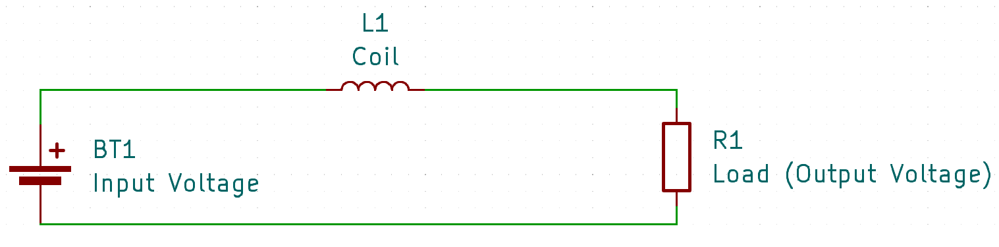
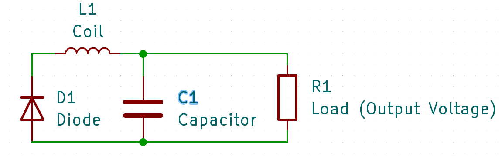

# Buck Converters
:stopwatch: Reading time: 8 minutes.

## Quick Overview

**Buck** converters are electronic circuits that can *lower* **DC** voltage, and the output voltage of a **Buck** converter is always lower than its input voltage.

## Principle

There are many simple ways of lowering a voltage, for example a *voltage divider* (using *resistors*). In fact, *any* load will reduce the voltage by consuming part of the energy.

If you want to lower the voltage *without* consuming energy though (i.e. dissipating heat), you need a **Buck** converter.

### Turning Input Voltage On And Off

A **Buck** converter consists of a high-frequency switch that turns the input voltage on and off in rapid succession. This is the *switching frequency* (and explains why **Buck** converters are called *switching power supply*). Typically, **Buck** converters use a switching frequency of 50kHz up to a few MHz, so they switch the input voltage on and off between 50 thousand to a few million times per second.

If we'd stop here, we would have **PWM**: the output device would receive the full input voltage alternating with no input voltage at all. In the *average*, the output voltage would now be lower than the input voltage, and in fact loads such as *LED* and *motors* can be controlled this way because they don't really care much about voltage spikes.

Hoewever, if you plan to supply more sensitive devices such as microcontrollers, you cannot use **PWM** output directly. You need to supply a *constant voltage* and cannot have a mixture of voltage spikes and no voltage.

This is why **Buck** converters add a *coil*, a *diode*, and a *capacitor*. Here is a circuit diagram showing the fundamental components of a **Buck** converter:

### Phase 1: "Borrowing Energy"

Let's first look at the **Buck** converter when its high-frequency switch is turned *on*. Here the schematics are very simple:

The only new thing is a *coil* that needs to be passed on the way to the load.

A *coil* is just like another load. and it consumes energy, too, just like any other load or resistor (to create a magnetic field). So as long as the magnetic field is still building up, the *coil* acts like a *resistor* in a *voltage divider* and reduces the voltage. Mission accomplished.

Unlike a *resistor* though, the *coil* does not dissipate the energy. Instead, it "invests" the extracted energy into a magnetic field. Magnetic fields store energy, similar to a battery, and can give it back. Dissipated heat from a resistor is lost.

Which brings us to the second half of operation: the *off* phase. 

### Phase 2: Running From Borrowed Energy Only

In this phase, the input voltage source vanished because the **Buck** converter turned it off. It does not supply energy to the output at this point:

Instead, the magnetic field starts to collapse, and the *coil* starts to return the energy it previously extracted. The energy that was needed to create the magnetic field is now used, and the *coil* acts like a battery.

Of course, current can only flow when there is a closed circuit. Since at this point the input source is separated, a *diode* now guarantees that the circuit remains closed.

### Borrow, Return, And Repeat...

When the **Buck** converter switches back to *on* mode in time *before* the magnetic field has fully collapsed, the process repeats. In the *on* phase, the output voltage comes again from the input power supply and is again reduced by the energy that the *coil* needs to rebuild its magnetic field. The *diode* is now in blocking mode.

An additional capacitor can help even out the voltage which otherwise would be "rippled" because building and collapsing a magnetic field isn't linear.

In short, a **Buck** converter is reducing the voltage much similar to a *resistor*. But instead of wasting the unwated voltage uncontrolled by dissipating heat, it temporarily stores this energy in a magnetic field, and returns it while at the same time, the input power supply is temporarily cut off.   

> A **Buck** converter works almost as if you'd charge a battery in series with your load, extracting and transferring energy to that battery. Then, once the battery is full, you run your circuit for a while from the battery until it is empty, and repeat. So in a **Buck** converter, the *coil* and its magnetic field act like a wear-free fast-loading and fast-unloading *battery*.

The *switching frequency* of a **Buck** converter determines the size of the *coil* and *capacitor*. The higher the switching frequency, the shorter the two *on* and *off* phases are, so less energy needs to be temporarily stored, and components can be smaller.

At the same time, with higher frequency the energy must be stored and retured more often. Any loss associated with this process increases. Higher switching frequencies can therefore decrease efficiency.

*(article:642031021812243012)*
