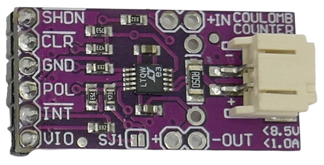

# LTC4150

> Pulse-Based Coloumb Counter for 2.7-8.5V and 1A

The *LTC4150* is a simple yet accurate coloumb counter targeting 1-2S lithium and 3-6S NiCd batteries. It is typically found on ready-to-use breakout boards that use a current sense resistor for 1A currents max.

The chip emits a negative pulse for each fixed quantity of charge. The actual quantity depends on the current sense resistor used by the board. With the typical `R050` resistors, one pulse represents *0.1707mAh*.

> [!NOTE]
> This chip does not record the pulses. You need an external microcontroller that "counts" the pulses, and you must make sure that no emitted pulse is missed.

> Tags: LTC4150, LTC2941, MAX17043, Fuel Gauge, CD4040, CD40193

[Visit Page on Website](https://done.land/components/power/measuringcurrent/coloumbcounters/ltc4150?012966101230255305) - created 2025-10-29 - last edited 2025-10-29
