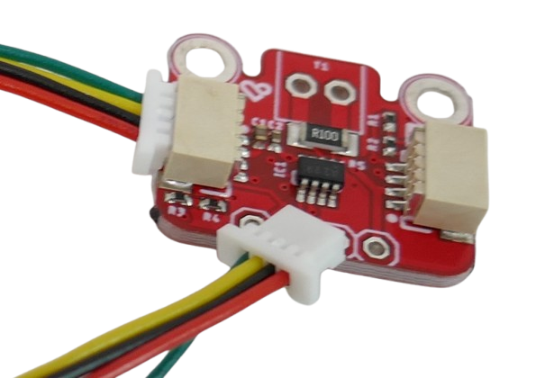
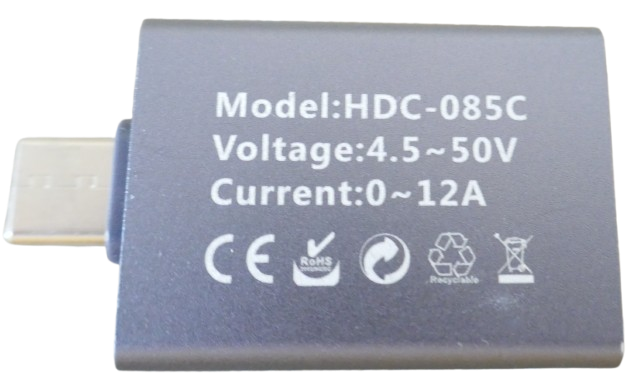
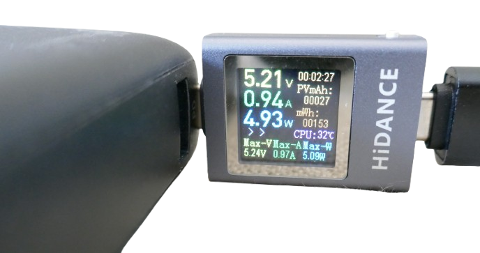
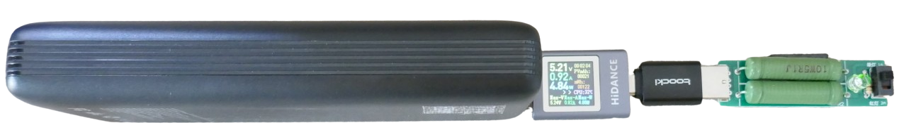
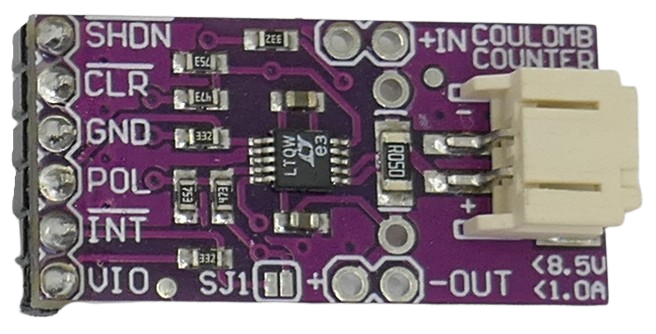
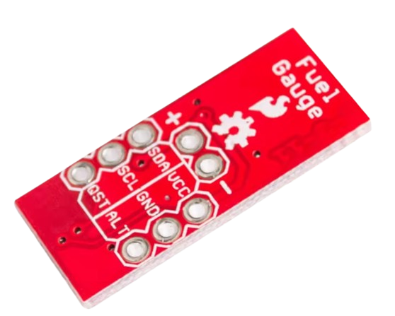

# Coloumb Counters

> Measuring Total Power and Investigating Power Yield, Battery Quality, or Power Consumption

*Coloumb counters* measure voltage and current and calculate the total power. More sophisticated models can also automatically accumulate the power over time so you can see how much power a source (like a solar panel or a battery under test) yields, or how much power a load consumes.

## Overview
It the core, a coloumb meter is a device that measures voltage and current, and calculates the effective power. Simpler devices require **you** to sum up the recorded power over time. More sophisticated devices come with internal memory and do the book keeping for you.

There are a variety of different devices and strategies you can use for coloumb counting, and they primarily differ in cost versus accuracy.

## DIY Solutions

There are many very affordable breakout boards that can measure voltage and current, i.e. [INA219](https://done.land/components/power/measuringcurrent/viashunt/ina219/), [INA226](https://done.land/components/power/measuringcurrent/viashunt/ina226/), and [INA3221](https://done.land/components/power/measuringcurrent/viashunt/ina3221/). 

Likewise, you can use hall sensors, too, to determine current.

However, such boards **neither calculate the power nor record it** over time, so you need an external microcontroller that queries the raw values from these boards in regular intervals, calculates the power and sums up and stores the values.

While this is entirely possible, it adds complexity and has two conceptional drawbacks:

* **Power Consumption:**    
  Your microcontroller must be active most of the time, and this can consume considerable power (unless you are using a very low energy MCU). While you *can* send the microcontroller to deep sleep to conserve power, and query the voltage and current in intervals only, this further reduces accuracy.
* **Lower Accuracy:**    
  Since the microcontroller takes only *snapshots* when it queries voltage and current, it may not be very accurate, especially when current and/or voltage fluctuate. If you stretch the query intervals to i.e. 10 seconds to use deep sleep and minimize MCU energy consumption, your device is essentially "blind" in the time periods inbetween.    
  
  If the measured power consumption is relatively consistent, this is perfectly ok, and your firmware can average the power consumption. If however there was a sudden current spike within the 10 second interval, it would go unnoticed and wouldn't be counted.   

That's why there are more sophisticated (and more expensive) chips like the **INA228**: it has built-in memory, calculates the power in very short intervals, and records it. No need to run a power-hungry external MCU. 

An external MCU can query the **total accumulated power** at any time using an I2C interface, so overall power consumption is minimal.

## USB Testers

USB tester devices are extemely affordable and often come with sophisticated firmware and even color TFT displays. 

While they are targeted towards testing USB devices, many of them are actually generic coloumb counters like this *Hidance HDC-085C* that comes with a metal casing and costs around €3.00: 

It supports DC voltages in the range of *4.5-50V* and currents of up to *12A*. Its large color TFT display shows momentary voltage and current as well as accumulated power (in mAh).

By simply adding a few USB adapters and some sort of load, you can create very functional battery testers:

Here are potential drawbacks:

* **Accuracy:**    
  Perfectly adequate for battery testing but expect an error margin of a few percent.   
* **Power Consumption:**    
  Require a few mA so again perfectly ok for battery testing but problematic in low power scenarios or when testing solar panels.   
* **Data Export:**    
  While there are testers available that come with Bluetooth and allow recording values on a PC, most simple testers have no way of exporting the measured data.

## Dedicated Coloumb Counters

Specialized coloumb counting chips (and breakout boards) are available that provide high accuracy:

* **LTC4150:**     
  Very affordable coloumb counter that outputs a negative pulse each time a certain quantity of charge (coloumbs) has been recorded. The actual quantity depends on the shunt resistor used.

  

  While this chip records the power with high accuracy, it does not *accumulate* the power and is restricted to voltages in the range of *2.7-8.5V*, targeting *1S* and *2S* lithium batteries. With this chip you would still need an external MCU that picks up and counts the pulses emitted.   

  For low power consumption scenarios, you can store the pulses in cascading CMOS counters like *CD4040* (unidirectional) or *CD40123* (bi-directional), and an external MCU can query these counters later via GPIOs or a I2C port extender at its discretion.

* **LTC2941:**    
  More expensive coloumb counter (around €10.00) with increased accuracy and built-in memory that is accessible via *I2C*, so this IC already integrates counters and an I2C interface, lowering complexity and energy consumption. 

  With a quiescent current of less than 100µA, this chip is ideal for autonomously measuring power yield or consumption for small devices. Due to its restricted voltage range of just *2.7-5.5V*, it is mostly targeting 1S lithium cells and 3.3/5V operated devices.

  This chip is marked *end-of-lifetime* though by its manufacturer, and while you still can get breakout boards from some vendors, supply will eventually cease. There is no similar successor chip available.

## "Fuel Gauges"

You may come across small breakout boards based on chips like the *MAX17043*, marketed as "fuel gauges" for lithium batteries. 

Such boards can be attached to lithium batteries to determine their current state of charge.   

### No Coloumb Counters

Internally, the chips may or may not use coloumb counting. The MAX17043 does not and instead relies entirely on proprietary algorithms to determine the state of charge from voltage and current and related effects (such as voltage drop with loads attached). This is called *model-estimation-only*.

Even though higher priced "fuel gauge" chips (like *MAX11040* or *BQ27421*) do use coloumb counting, this is typically done entirely internal and the values are not exposed. 

So no, with "fuel gauges" you cannot measure power consumption or test batteries, solar panels, or other sources or loads.

### Why Do "Fuel Gauges" Exist?
The reason why "fuel gauges" exist is that modern lithium batteries have a very flat voltage discharge curve, so simply measuring battery voltage to estimate state of charge is highly unreliable. That's why "fuel gauge" ICs add mathematical wizardry to improve the accuracy.

This said, most modern powerbank modules and chargers/dischargers already come with sufficiently accurate state-of-charge indicators, and typically a rough estimate in four or five steps is sufficient. If you must know the exact state-of-charge of a lithium battery, though, such "fuel gauge" modules may be handy. However, they are quite expensive and not in the scope of what we discuss here.

> Tags: Hidance, HDC-085C, Battery Tester, LTC4150, LTC2941, MAX17043, Fuel Gauge, CD4040, CD40193

[Visit Page on Website](https://done.land/components/power/measuringcurrent/coloumbcounters?825765101030255221) - created 2025-10-29 - last edited 2025-10-29
