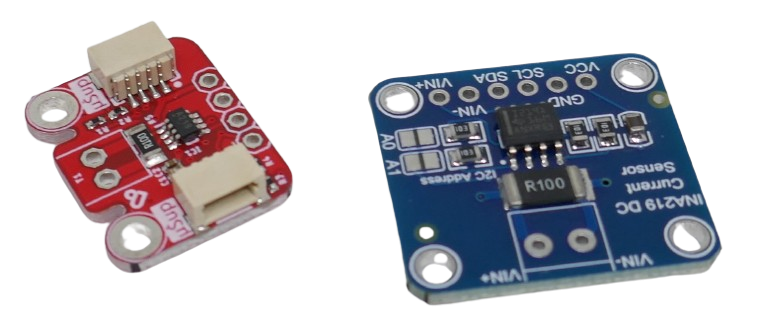
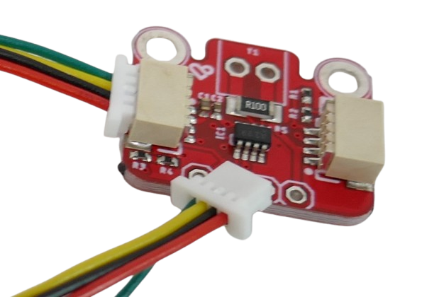
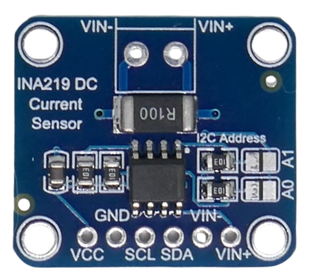
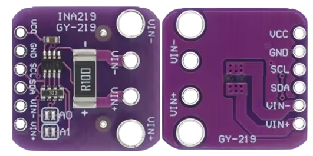
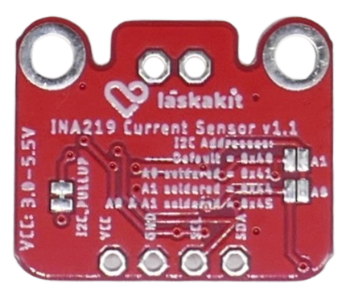
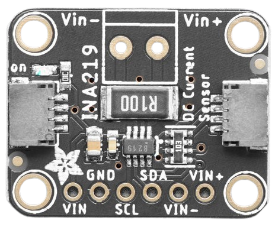

# INA219 Current And Voltage Monitoring

> The INA Family of Microchips From Texas Instruments are Perfect for Measuring Current and Voltage 

[**INA219**](https://www.ti.com/lit/ds/symlink/ina219.pdf) is a microchip from *Texas Instruments* that can bidirectionally measure *current* and *voltage* and calculate *power* (Watts) from it. 

## Overview

Various breakout boards exist with solder pins or pluggable [Grove](https://wiki.seeedstudio.com/Grove_System) connectors ([JST SH 1.0](https://done.land/components/power/cables/connectors/#jst-connectors), *QWIIC*). 

They typically use a *R100* (0.1 Ohm) shunt resistor, providing a current range of up to *+-3.2 A* (bi-directional), and should cost well below €2.00 per piece.

> [!TIP]
> The reason for this relatively large current range is the built-in *PGA* (*programmable gain amplifier*) that can multiply the shunt resistor voltage drop by *2, 4, and 8x* at the expense of accuracy. Newer chips like *INA226* and *INA3221* no longer have a *PGA* and typically support much smaller maximum currents at the same *R100* shunt resistor.

| Spec | Description |
| --- | --- |
| Supply Voltage | 3.3-5V |
| Load Voltage | 0-26V |
| Interface | I2C, 16 assignable addresses, default address `0x40`/`64`  |
| Max Current | 3.2A @ R100 (0.1 Ohms) shunt resistor |

### Shunt Value and Maximum Current

**INA219** does not measure *current* directly: it measures the *voltage drop* at a **Shunt** resistor. The resistance of the **Shunt** determines the maximum *current* that you can measure.

However, the *INA219* contains a *PGA* (*programmable gain amplifier*) which can increase the current range by factors 2, 4, or 8, enabling the chip to adapt to different currents with maximum precision.

> [!TIP]
> Newer chips like the *INA226* or *INA3221* have **no** *PGA* anymore, so their current range is fixed and depends entirely on the load resistor value. That's why a *INA226* with a typical *R100* (0.1 Ohm) load resistor can measure currents of up to 820mA only. The *INA3221* deals with currents of up to *1.64A*. Thanks to its *PGA*, a *INA219* with the same *R100* load resistor can measure currents of up to *3.2A* (provided the PCB traces allow such high currents). 

#### Integrated Shunts

When using breakout boards, the most common presoldered **Shunt** is *R100* (0.1 Ohm). This enables the breakout board to measure a maximum *current* of *3.2A* (with *PGA* factor set to *8x*). Practically, it depends on the PCB and its traces whether such high currents can be used.  

Always test and measure breakout boards with integrated **Shunts** yourself and individually board-by-board to find out their true maximum *current*.

## Breakout Boards

Typical generic **INA219** breakout boards come with 6 pins and cost around € 0.50 to € 1.00:

| Pin Label | Description |
| --- | --- |
| Vin+ | Positive Voltage for Load Circuit |
| Vin- | Negative Voltage for Load Circuit |
| Sda | I2C SDA |
| Scl | I2C SCL |
| Gnd | Common GND |
| VCC | 3.3V/5V supply for INA226 |

* **VCC** and **GND** supply the breakout board with the power it needs to operate. Both *3.3V* and *5V* are supported.
* **VIN+** and **VIN-** carry the load current. That's why these pins may exist multiple times and may use larger traces to support high currents.
* **SDA** and **SCL** are the typical *I2C* pins used to communicate measured values to a microcontroller.

### GY-219
If you are planning to measure high currents in the range of *2.0-3.4A*, you may want to search for `GY-219`. 

There is a *purple* no-name board, often marked *GY-219*, which uses relatively large PCB traces for the load, and the shunt resistor is also larger compared to other no-name boards.

Typically, these boards are harder to find and more expensive (€ 2.00 - € 5.00).

### Grove Connectors

Some boards come with presoldered *Grove/QWIIC/JST SH1.0* connectors which is great for plugging together multiple *I2C sensors*. 

The pins *VCC*, *GND*, *SDA*, and *SCL* are exposed *three times* on such boards: as solder pads, and also through the two *Grove* connectors, enabling easy daisy-chaining of *I2C* devices:

> [!TIP]
> You can for example wire up the board to your microcontroller using the solder pads, which turns the board into a *I2C Hub* with two connectors for additional *I2C* device chains. 

The load is connected *high-side* via two solder pads to the shunt resistor. 

While the traces are decently thick, the solder pins are not labeled, so it is not immediately apparent which solder pad is *Vin+* and which is *Vin-*:

You can always do a trial-and-error: when readings are negative, switch the pads.

### Quality Boards

As it turns out, affordable no-name boards are often *Clones* based on designs from renown vendors (like [Adafruit](https://www.adafruit.com/product/904) in this case). On their boards, load pins are clearly labeled:

The *Adafruit* board has additional differences: it uses a larger shunt resistor, for example. In case you really want to measure currents of up to *3.2A*, that seems like a good idea to dissipate the heat.

That said, quality has its price: the *Adafruit* boards cost around € 10.00 whereas the generic ones I got for € 0.50 at *AliExpress*.

## I2C Address

*INA219* communicates digitally through a [I2C](https://done.land/fundamentals/interface/i2c/) interface, so a microcontroller is mandatory.

*I2C* is address based: each device requires a unique address. *INA219* supports up to 16 different *I2C* addresses, however most breakout board documentations state that only four can be used.

Typically, the default *I2C* address is `0x40`. If you need to use more than one *INA219* in your setup, you can change the address via two solder bridges, typically marked *A0* and *A1*:

| A0 | A1 | Address (hex) | Address (decimal) |
| --- | --- | --- | --- |
| - | - | `0x40` (default) | `64` |
| closed | - | `0x41`| `65` | 
| - | closed | `0x44`| `68`|
| closed | closed | `0x45`| `69` |

### Using 16 I2C Addresses

If you need to operate more than four *INA219* boards, you can set up to 16 different I2C addresses. 

That's because in reality, `A0` and `A1` are dedicated pins on the *INA219* chip and can be connected either to `GND`, `VCC`, `SDA`, or `SCL`, resulting in 16 different address configurations. 

The "solder bridge" is just a convenient way to connect one of these pins to `VCC` for easy configuration of 4 (out of the total of 16) I2C addresses.

Here is how this works:

* When you leave the solder bridge open, the pin is connected to `GND` (pulled low).
* When you close the solder bridge, the pin is connected to `VCC`.

#### Identifying True `A0` and `A1`
To configure one of the remaining 12 addresses, you need to connect `A0` and/or `A1` to *different* pins. For this, you first need to identify which side of the solder bridge actually represents the "true" `A0` and `A1` pin.

With most board designs, the *inner* pad of a solder bridge represents the true chip pin, whereas the *outer* pad is always connected to *VCC*. You can easily test with a multimeter:

  * Measure resistance between the outer pads of both solder bridges. They should be close to *0 Ohm* (connected).
  * Measure resistance between the outer pad and the *VCC* pin. They should also be close to *0 Ohm* (connected).

If they are not, check the opposite pads. The pads that are *not connected* to *VCC* are the true *I2C configuration pins* `A0` and `A1`.

#### Using 16 Different I2C Addresses
If you require more than four I2C addresses, wire the *true* pin side of the solder bridge `A0` and/or `A1` pin to one of these:

| `A0` | `A1`  | I2C Address | Accessible via Solder Bridge |
| --- | --- | --- | --- |
| - | - | `0x40` (default) | yes |
| - | `VCC` (closed solder bridge)| `0x41`  | yes |
| - | `SDA` | `0x42`| no |
| - | `SCL` | `0x43` | no |
| `VCC` (closed solder bridge) | - | `0x44`| yes |
| `VCC` (closed solder bridge) | `VCC` (closed solder bridge)| `0x45`  | yes |
| `VCC` (closed solder bridge) | `SDA` | `0x46`  | no |
| `VCC` (closed solder bridge) | `SCL` | `0x47`  |no |
| `SDA` | - | `0x48`|no |
| `SDA` | `VCC` (closed solder bridge)| `0x49`  |no |
| `SDA` | `SDA` | `0x4A`  |no |
| `SDA` | `SCL` | `0x4B`  |no |
| `SCL` | - | `0x4C`|no |
| `SCL` | `VCC` (closed solder bridge)| `0x4D`  |no |
| `SCL` | `SDA` | `0x4E`  |no |
| `SCL` | `SCL` | `0x4F`  |no |

**IMPORTANT:** Never wire the **wrong** side of the solder bridge. Always make sure you first **correctly identify** the *true pin side* of the solder bridge. The opposite side of the solder bridge is always connected to `VCC`. 

If you connect the wrong pad (the one that is `VCC`) to...

* ...`GND`, you are short circuiting the power supply. 
* ...`SCL` or `SDA`, you are destroying INA219 and/or your microcontroller because when they pull the I2C line low during communications, they now unexpectedly short circuit (normally, a **current-limiting** pull-up resistor keeps I2C lines *high*, but now the lines are directly connected to `VCC`).

## How to Connect a Load
Keep in mind that chips like the *INA219* require **two** power supplies: one for itself, and another one for the load under test:

| Pin | Purpose | Connected to |
| --- | --- | --- |
| VCC | powering *INA219* | +3.3-5V |
| GND | common ground for both *INA219* and the load | ground |
| Vin+ | powering load | +0-26V |

**IMPORTANT:** it is **crucial** to *connect both* power supplies to the same ground. Else, readings will fluctuate and be off considerably.  

### High-Side Load
The load under test must always be connected on the *high side* (the *INA219* is connected in series with the *positive pole* of the load):

| Pin | Connected to |
| --- | --- |
| Vin- | positive pole of load |
| Gnd | negative pole of load |

**Important:** connect *Vin***-** to the *positive* pole of the load. *Vin***+** connects to the positive pole of the load power supply. If you swap *Vin+* and *Vin-*, measured values for current and voltage are negative.

## Programming

Since *INA219* communicates digitally through its *I2C* interface, you need a microcontroller. Most microcontrollers support *I2C*.

### ArduinoIDE/platform.io

There are many [excellent tutorials](https://wolles-elektronikkiste.de/en/ina219-current-and-power-sensor), [videos](https://www.youtube.com/watch?v=JWUKFLCX5Os&ab_channel=GemsungElectronics) and ready-to-use [libraries](https://learn.adafruit.com/adafruit-ina219-current-sensor-breakout/arduino-code).

### ESPHome

[ESPHome] natively supports *INA219* through its `ina219` [sensor platform](https://esphome.io/components/sensor/ina219.html), and there are many [sample configurations](https://gist.github.com/fabaff/762008f61e745b220b9f4693954427e2) available.

## Materials

[INA219 Datasheet](materials/ina219_datasheet.pdf)

> Tags: GY-219, Current, Voltage, Measure, PGA, Texas Instruments, Adafruit, Grove, Qwiic

[Visit Page on Website](https://done.land/components/power/measuringcurrent/viashunt/ina219?220733051221251119) - created 2025-05-20 - last edited 2025-05-20
