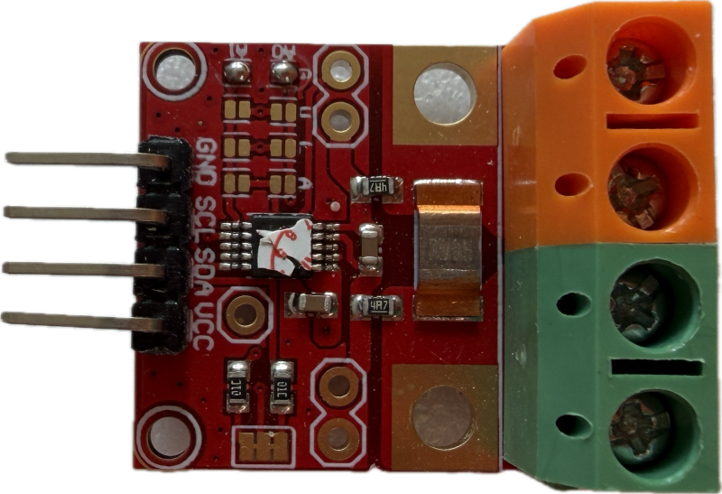
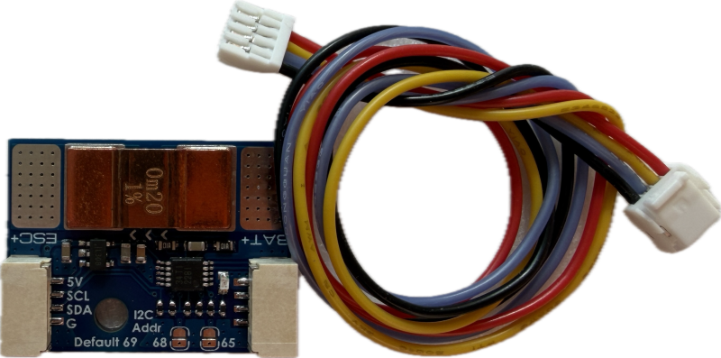
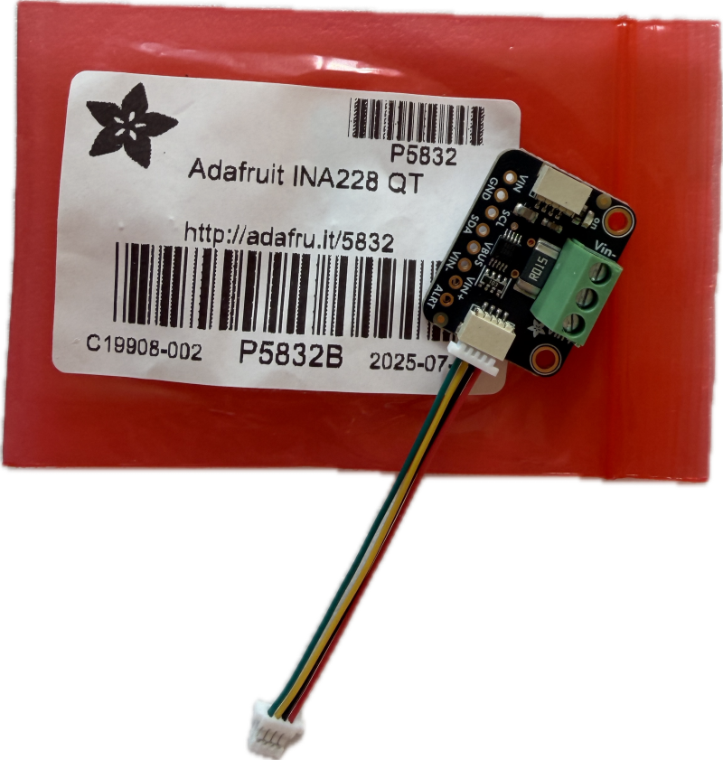
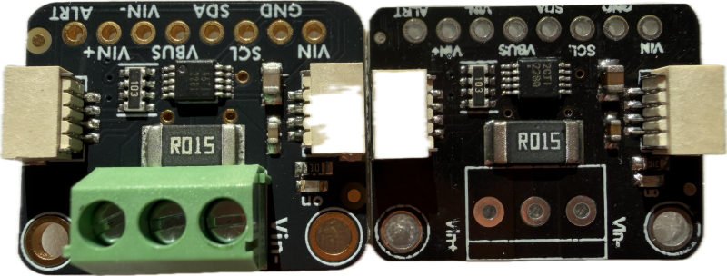
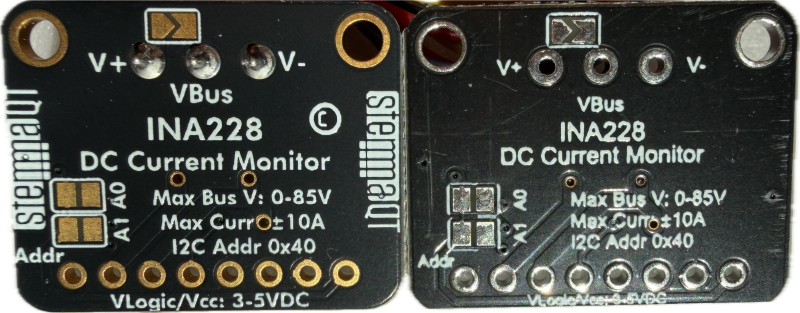
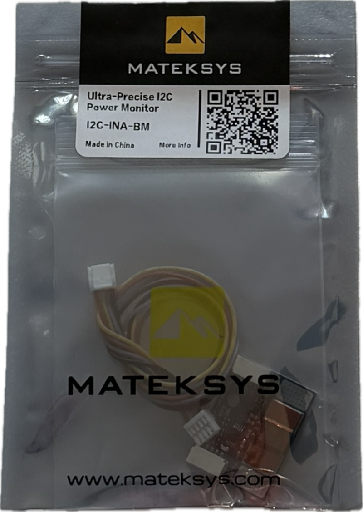

# INA228 Current And Voltage Monitoring

> Measuring Current and Voltage as well as Total Charge

The [INA228](materials/ina228.pdf) from Texas Instruments is a high-precision digital power monitor that measures bus voltage, current, power, energy, and charge and can be interfaced using I2C. 

## Overview
The INA228 measures the tiny voltage drop across a shunt resistor, while independently monitoring the supply/load voltage. It communicates via I²C/SMBus, supports bus voltages up to 85 V, and uses a high-precision 20-bit ADC. 

It can also accumulate energy and charge internally, which is especially useful for measuring Wh and Ah over time.

### Comparison

INA228 is among the most advanced and also most expensive chips in the INA family from Texas Instruments. If all you want is just measuring voltage and current with decent precision, then a cheaper model is often the better choice.

However, the increased 20 bit ADC precision does not only give you a much better precision per se. It also allows for a much larger dynamic range, so your device could test currents in a much larger range than other chips. But don't forget that the maximum current also depends on the traces on your board and ultimately the value of the shunt resistor.

| Feature | INA219 | INA226 | INA3221 | INA228 | INA229 |
|---|---:|---:|---:|---:|---:|
| Interface | I²C/SMBus | I²C/SMBus | I²C/SMBus | I²C | SPI |
| Channels | 1 | 1 | 3 | 1 | 1 |
| ADC resolution | 12-bit | 16-bit | 13-bit | 20-bit | 20-bit |
| Max bus voltage | 26 V | 36 V | 26 V | 85 V | 85 V |
| Bidirectional current | ✅ | ✅ | ✅ | ✅ | ✅ |
| Measures shunt voltage | ✅ | ✅ | ✅ | ✅ | ✅ |
| Measures bus voltage | ✅ | ✅ | ✅ | ✅ | ✅ |
| Calculates current | ✅ | ✅ | ❌* | ✅ | ✅ |
| Calculates power internally | ✅ | ✅ | ❌* | ✅ | ✅ |
| Energy accumulation (Wh/J) | ❌ | ❌ | ❌ | ✅ | ✅ |
| Charge accumulation (Ah/C) | ❌ | ❌ | ❌ | ✅ | ✅ |
| Internal temperature sensor | ❌ | ❌ | ❌ | ✅ | ✅ |
| Programmable averaging | ✅ | ✅ | ✅ | ✅ | ✅ |
| Programmable conversion time | ✅ | ✅ | ✅ | ✅ | ✅ |
| Alert output | ❌ | ✅ | ✅ | ✅ | ✅ |
| Low-Side | ✅ | ✅ | ✅ | ✅ | ✅ |
| High-Side | ✅ | ✅ | ✅ | ✅ | ✅ |
| Max input offset | ~50–100 µV | 10 µV | 80 µV | 1 µV | 1 µV |
| Chip cost, single quantity | ~€1–2 | ~€2–3 | ~€2–4 | ~€5–8 | ~€5–8 |
| Typical breakout board cost | ~€2–5 | ~€2–5 | ~€2–5 | ~€5–12 | ~€6–15 |
| Typical role | Cheap/basic monitor | Accurate general-purpose monitor | 3-channel monitoring | High-end precision/energy monitor | INA228 with SPI |

\* INA3221 primarily reports bus and shunt voltage for three channels; current and power are normally calculated by the MCU.

> [!NOTE]
> One practical caveat: low-side sensing lifts the load ground by the shunt voltage, which can cause ground-reference errors elsewhere in the circuit. That is why high-side sensing is often preferred even though all these chips support both.

### Highlights

To better judge whether the INA228 is right for you, here are the most important practical highlights it offers on top of cheaper models:

* **Voltage Range:**    
  INA228 supports voltages of up to 85 V which is sufficient for literally every DIY project. While you probably do not need this much range, in comparison,  cheaper alternatives such as INA219 and INA3221 are limited much lower at just 26 V. This can be too low for some use cases, i.e. high-string battery monitoring.    
* **Current Range:**    
  While INA228 does not support a programmable gain (like INA219), it does not need to: its high-precision 20-bit ADC delivers enough resolution to implement large current ranges natively.  

  So essentially, measurable current depends on your PCB and the value and robustness of your shunt resistor. Small breakout boards allow for currents in the range of 3-20A, so check before you buy.
  
  

  If you need to measure much higher currents, either use an external heavy-duty shunt, or look for appropriate boards such as the **Matek I2C-INA-BM**:

  
   
  Clearly, you can identify its high-current shunt resistor with an extremely low *200 uΩ* resistance, and thanks to INA228's 20-bit ADC, its precision remains high even with low currents.

* **Charge and Energy Accumulation:**    
  While cheaper chips calculate power internally, they do not *accumulate* it. Your microcontroller needs to poll the values in short intervals and accumulate the readings externally. This ties up the microcontroller, is inherently inaccurate, and congests I2C. 
  
  INA228 autonomously accumulates both charge and enery. It delivers total mAh or mWh when you need it - ideal for i.e. battery testing. 

## Breakout Boards

There are many ready-to-use breakout boards available. Here are the most commonly found:

* **Adafruit (10 A):**   
  The [Adafruit INA228](https://www.adafruit.com/product/5832) is a highly practical board with a R015/15 mΩ shunt resistor. It can measure currents of up to 10 A. 

  

  

  The boards are expensive, yet you can be certain that the board comes with a genuine INA228. Also, the boards are of very good built quality.

  

  Almost identical boards are available on market places like *AliExpress* for a fraction of the cost. However, the PCB built quality is considerably lower. On the left, you can see the original Adafruit board, and on the right a typical clone:

  

   Be aware that some of these offers ship with INA226 chips instead of the INA228, so when ordering from untrusted sources, always make sure you test the boards immediately upon arrival.

* **INA228 High Precision Board (20 A):**   
  These generic boards can vary in many aspects, so look carefully before you order. 

  
  
  The well-designed PCB traces allow currents of up to 20 A. The actual currents that you can measure depend on the installed shunt resistor. These boards are available with R002 (2 mΩ, 20.48 A), R010 (10 mΩ, 4.096 A) and R100 (100 mΩ, 0.4096 A) shunt resistors.

  The boards can use INA226, INA228, or INA229, so again make sure you order the correct version. And even if you do, verify that the correct chip is used. It is quite common that these boards come with a cheap INA226, often hidden beneath a "quality control" sticker, even though an expensive INA228 was ordered.

* **Heavy-Duty MATEK I2C-INA-BM (204,8 A):**   
  [This board](https://www.mateksys.com/?portfolio=i2c-ina-bm) is ideal for measuring seriously high currents. It is well made and comes with a 200 uΩ copper precision shunt. The board is designed for 150 A continuous and 204,8 A in short bursts, and is often used with drones.

  

  The well-made package comes with JST 1.25 connector cables. Since this board is targeted towards drone operation, it does not use the Qwiic JST 1.0 connector.

  

  In addition, this is a **5V board** specified to operate in a range of 4-9 V, so it does not fit well with modern 3.3 V microcontrollers, even though my boards did work flawlessly with 3.3 V as well. 
 

### Prices

The cost of these boards vary greatly, and you can save much money by carefully comparing offers.

| Board | Competitive Price | Sometimes as much as |
| --- | --- | --- |
| Original Adafruit | 9-15€ | 28€ |
| Adafruit Clone | 5-6€ | 14€ |
| INA228 High Precision board | 5-6€ | 18€ |
| Matek Heavy Duty | 10-12€ | 17€ |

Shop wisely, compare extensively, and wait for a sale. It pays off. 

* Places with particularly high prices seem to be *Amazon* and  *eBay*.
* Reasonable pricing can be found in many DIY online stores and on *AliExpress*

## Materials

[INA228 Datasheet including I2C register map](materials/ina228.pdf)

> Tags: Measure, Current, INA, Shunt, Adafruit, INA228, Matek

[Visit Page on Website](https://done.land/components/power/measuringcurrent/viashunt/ina228?980106101205262717) - created 2026-10-04 - last edited 2026-10-04
