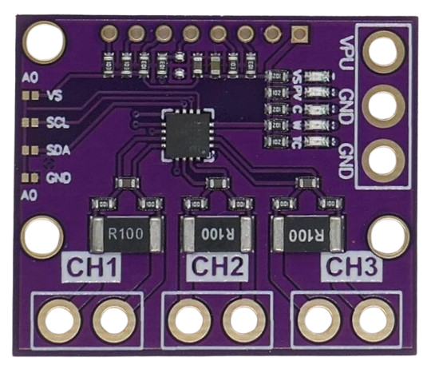
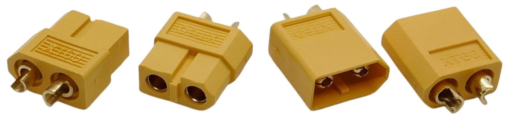
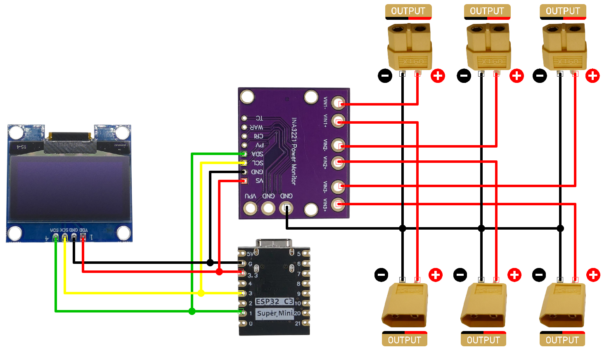

# 3-Channel Current Meter

> Implementing a 3-Channel Current Meter With INA3221

This section illustrates various approaches to using the [INA3221](https://www.ti.com/lit/ds/symlink/ina3221.pdf?ts=1720423291346) to create a 3-channel current (and voltage) meter.

## Overview

A *current and voltage meter* is a valuable tool for any lab. It clearly shows the current consumption of devices, and by summing up consumed currents, you can determine the total energy consumption in *Ah* or *Wh*. This is particularly useful for testing battery capacities or examining charge and discharge curves.

### Multi-Channel Measurements

The *INA3221* provides three independent channels, allowing measurement of three separate loads. **All loads must share a common ground**, but the channels can use different voltages (up to *26V*). 

Since the channels operate independently, you can leave unused channels disconnected if you only need one or two.

Exploring Solar Panel and Converter Efficiency With 3-Channel Current Meter
 

Three channels are ideal for exploring solar panel and converter efficiencies:

* **Channel #1: Solar Panel**  
  Measures the raw power input from the solar cell.

* **Channel #2: Solar Controller Output**  
  Measures the power output from the solar controller. By comparing this data with *Channel #1*, you can calculate the **solar controller efficiency**.

* **Channel #3: Charger**  
  Measures the power output used to charge the buffer battery.

### Steps For Implementation

Here are the basic steps for building the 3-Channel Current Meter:

1. **Hardware:** Identify and gather the required components, then wire them up according to the INA3221's specifications.  
2. **Firmware:** Develop the firmware for your microcontroller. You can either:
   - Write custom firmware using *C++* libraries.
   - Use *ESPHome*, which natively supports the *INA3221* sensor ([documentation here](https://esphome.io/components/sensor/ina3221.html)).
## 1. Hardware

Let's first assemble the hardware, regardless of how you plan to handle the firmware later.

### Parts List

You will need the following components:

1. **INA3221:**  
   Ensure you are using a compatible version. Older boards [may have a design flaw](https://done.land/components/power/measuringcurrent/viashunt/ina3221/#design-flaw-in-old-pcb-versions) and are **incompatible** with the schematics and project guides here. Any board manufactured after 2023 is most likely fine. If uncertain, [verify](https://done.land/components/power/measuringcurrent/viashunt/ina3221/#design-flaw-in-old-pcb-versions) your board.

   

2. **Microcontroller:**  
   Any microcontroller with an *I2C* interface is suitable. This example uses the [ESP32-C3 SuperMini](https://done.land/components/microcontroller/families/esp/esp32/developmentboards/esp32-c3/c3supermini/) due to its compact size, making it ideal for integration into smaller devices.

   

3. **Power Connectors:**  
   You need power connectors for the three channels, such as *banana jacks*. This example uses *male* and *female* **XT60** connectors.

   

4. **Display** *(optional):*  
   To view measured values directly, an *OLED* display is a great option. These displays, which use *I2C* (unlike TFTs that use *SPI*), are simple to connect and don’t require extra GPIOs or complex wiring.

   

5. **Wires:**  
   You'll need approximately 1 meter of two-pole red-and-black cable with sufficient thickness (AWG 24 or lower) and 2x two wires to connect the peripherals to *I2C*.

### Schematics

> [!NOTE]  
> Many modern microcontrollers allow **arbitrary GPIOs** to be assigned for *I2C*. For the *ESP32-C3* used here, *GPIO1* (SDA) and *GPIO3* (SCL) are utilized. Other microcontrollers might have dedicated or commonly used I2C pins. For instance, *ESP32S* (classic versions) typically use *GPIO21* (SDA) and *GPIO22* (SCL). If you're using a different microcontroller, adjust the schematic to match your I2C pin requirements, and ensure the correct pins are assigned to *I2C* in your firmware.

## 2. Firmware

After wiring up your hardware, it’s time to create and upload the *firmware* to your microcontroller.

### Writing C++ Code

For maximum flexibility and control, you can write custom firmware using one of the many *INA3221 libraries* available for C++. While this gives you fine-grained control over functionality, it also requires more effort:

- You'll need to manage all programming tasks yourself.  
- Additional libraries may be required for features like display interfaces or web servers.

This approach is ideal for advanced users seeking complete customization.

### ESPHome

A simpler, more accessible option is using [ESPHome](https://done.land/tools/software/esphome/introduction/), which natively supports the *INA3221*. This method requires no programming expertise and includes features like:

- **WiFi support**  
- **OTA (over-the-air updates)**  

Additionally, ESPHome seamlessly integrates with [Home Assistant](https://done.land/tools/software/homeassistant/), enabling automatic logging of measured values and triggering automations based on those readings.

> Tags: Measure, Current, Voltage, INA3221, INA169, Shunt, Channel, 3 Channel, Efficiency, Solar Controller

[Visit Page on Website](https://done.land/components/power/measuringcurrent/viashunt/ina3221/3-channelcurrentmeter?863976010908253506) - created 2025-01-07 - last edited 2025-01-07
