# INA3221 

> 3-Channel Current And Voltage Monitoring Via Shunt 

[INA3221](https://www.ti.com/lit/ds/symlink/ina3221.pdf?ts=1720423291346) from *Texas Instruments* measures *current* and *voltage* for three different channels concurrently. It supports both *3.3V* and *5V* environments.

* Load voltage must not exceed *26V*.
* All loads and the chip must share a common *GND*.

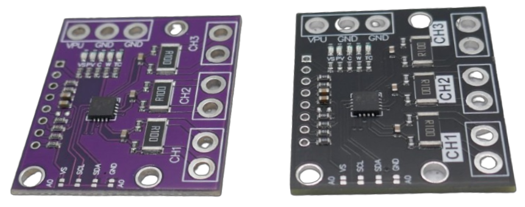

With the typical *R100 shunt resistor* found on most *breakout boards*, the current **must not exceed *1.638A***.

The *INA3221* is typically used in breakout boards that come with a *R100 (0.1 Ohm) shunt resistor*. Those boards are available from €1.00. The *INA3221* chip can be used in own PCB designs as well, of course.

> [!TIP]
> The commonly available *purple* and *black* PCBs are technically *identical*. On purple boards, the traces are easier to identify, helping to verify that the board you have is not affected by the [design flaw](https://done.land/components/power/measuringcurrent/viashunt/ina3221/#design-flaw-in-old-pcb-versions) of early versions.

## Quick Overview

The *INA3221* is a three-channel, *high-side* current and voltage monitor with an I2C- and SMBUS-compatible interface. Its default I2C address is *0x40*, but three additional *I2C* addresses [can be set](https://done.land/components/power/measuringcurrent/viashunt/ina3221/#i2c-address).

| Parameter               | Description                                        |
|-------------------------|----------------------------------------------------|
| Supply Voltage          | 2.7V - 5.5V                                       |
| Current consumption     | 350uA (typical)                                   |
| Detected Voltage        | 0-26V, 8mV increments                             |
| Maximum Detected Current| Depends on shunt resistor value, 4095 steps resolution |
| I2C Default Address     | 0x40 ([four addresses configurable](https://done.land/components/power/measuringcurrent/viashunt/ina3221/#i2c-address))                |

The device power supply (*VC*) and the three input channels are *separated* and can use different voltages (but must share a common *GND*). Bus voltages can be present with the supply voltage off and vice versa.

The chip has programmable conversion times and averaging modes and offers both critical and warning alerts to detect multiple programmable out-of-range conditions for each channel.

### Wiring and Measuring

The *current* is measured as a *voltage drop* across the *shunt resistor* for a particular channel. Each channel uses its own *shunt resistor*.

> [!NOTE]
> *Shunt resistors* can have different values for each channel. However, *identical values* are required to use some of the built-in *averaging functions*.

The *voltage* is measured as a *high-side* measurement against *GND*, excluding any *voltage drop* at the *shunt resistors*. The channel *bus voltage* is measured between *VNx-* and *GND*.

#### Connecting Channels

Each channel has two connectors: *VNx+* and *VNx-*.

- *VNx+* must always be connected to the positive voltage (*high side*).
- *VNx-* connects to the positive side of the load you want to measure.
- All three channels **must share the same *GND***.

This may sound confusing at first, but it is quite simple. Take a look at a practical example and its schematic (taken from [here](https://done.land/components/power/measuringcurrent/viashunt/ina3221/3-channelcurrentmeter/#schematics)):

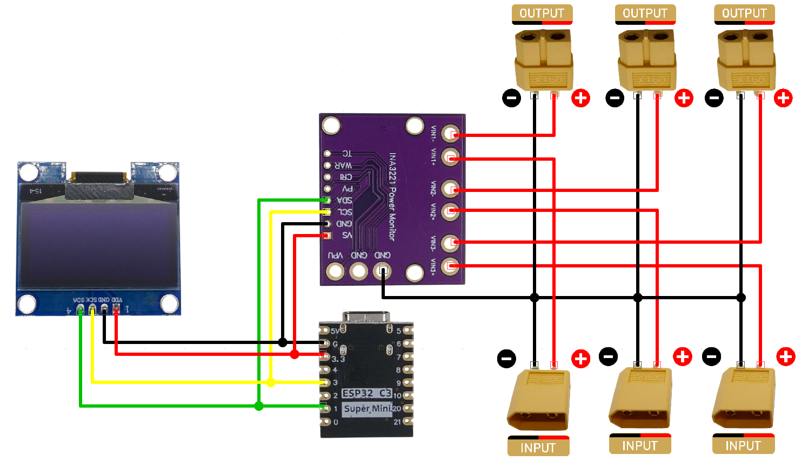

## Breakout Boards

*INA3221 breakout boards* are available in two colors (both are functionally identical):

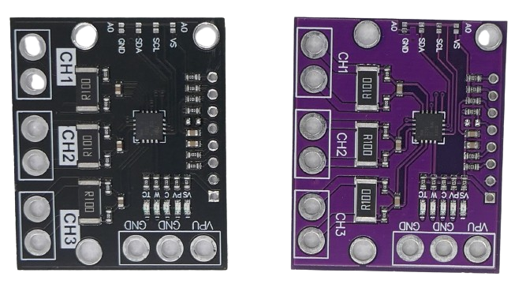

The *purple* version offers better visibility of PCB traces, which is helpful for understanding the *breakout board design* and identifying older PCB versions that have a design flaw:

### Design Flaw in Old PCB Versions

The initial version of the breakout board had a [serious design flaw](https://forum.arduino.cc/t/ina3221-breakout-board/482236): all three *IN+* pins were connected.  

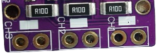

This forced all three *INA3221* channels to share the same positive voltage source, making it impossible to measure setups like *solar panel appliances* with *different voltages* at various circuitry locations. The flawed design required all three channels to use the same *high side* (positive input voltage).

How creative users fixed the flawed INA3221 breakout board
 

Users manually corrected the *PCB design flaw* by cutting and reworking tracks.  

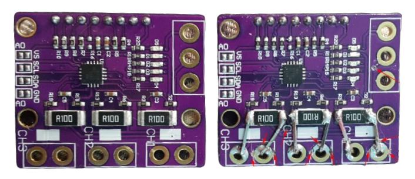

These fixes often worked, but the results were not always visually reliable or professional-looking.  

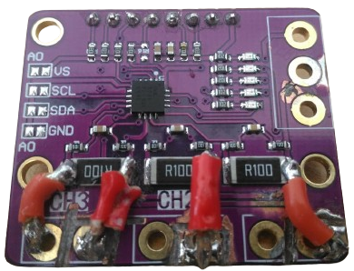

### New PCB Design Without Flaw

The issue has since been resolved, and the PCB layout has been completely redesigned. The updated design eliminates the flaw by separating the *IN+* pins for all three channels. 

Compare the new track routing to the earlier flawed design: each solder pad has its distinct trace leading directly to the shunt resistor, and each shunt resistor is connecting the two solder pads of any channel. 

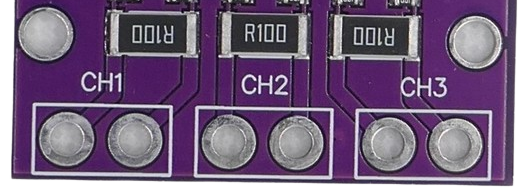

New PCBs can also be identified by the labels on the three large solder pads on the top side: *VPU*, *GND*, and *GND*. The old version lacked these labels and used the pins differently.

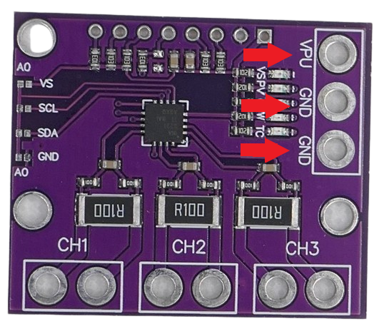

> [!IMPORTANT]
> Since the initial breakout board worked **completely different**, when you are looking for examples in the Internet, you must pay attention which version of the board was used. You cannot use the newer breakout board in schematics that use the old one, and vice versa.

## Shunt Value and Maximum Current

Most breakout boards come with an *R100* shunt resistor (*0.1 Ω*), allowing them to measure a maximum current of **1.638 A per channel**.

This current limit may not be sufficient for your project. Since the shunt resistor value and the maximum measurable current are inversely related, lowering the shunt resistor value increases the maximum current capacity.

> [!TIP]
> To *double* the maximum current, you can solder another *R100* resistor on top of the existing one, effectively halving the resistance.

### Setting Maximum Current

The *INA3221* measures current by detecting the *voltage drop* across a shunt resistor. It senses this voltage drop in *40 µV* increments, up to a maximum of *163.8 mV*. This provides a 12-bit resolution (4,095 steps, with one step reserved for internal use).

By varying the shunt resistor, you can either *increase precision* (for small currents) or *increase maximum current* (at the expense of precision):

The maximum measurable current is determined by the shunt resistor value:

| Shunt Resistor        | Resistance (Ω) | Maximum Current (A) | Remark |
|-----------------------|----------------|----------------------|---|
| R1                    | *1 Ω*         | *0.1638A*             | precision measuring for small currents, i.e. microelectronics power consumption |
| R100                  | *0.1 Ω*       | *1.638*             | default |
| 2x R100 in parallel   | *0.05 Ω*      | *3.276*             | simple hack; soldering another R100 on top of the existing |
| R020                  | *0.01 Ω*      | *8.19*              | high currents, breakout board traces may not handle this current |   

> [!NOTE]
> Ensure that the *shunt resistor value* produces a voltage drop of no more than *±163.8mV* for the highest expected current.

Changing the shunt resistor may allow for higher loads, however always make sure the rest of your circuitry can handle these currents.

*1 mm* traces (as used in typical INA3221 breakout boards) can handle **2–3 A**. Beyond that, they can heat up and eventually get destroyed. 

For high currents, consider wiring the resistors directly (bypassig the traces), or using an external shunt resistor. 

> [!TIP]
> For currents beyond a few Amperes, you may also want to look into *Hall Sensors*.   

Calculating Shunt Resistor Values
 

*Texas Instruments* provides a free [Power Monitor Tool](https://www.ti.com/tool/download/SBOR021), a *Microsoft Excel* sheet with embedded formulas. This tool helps calculate the appropriate *shunt resistor values* for your specific use case.

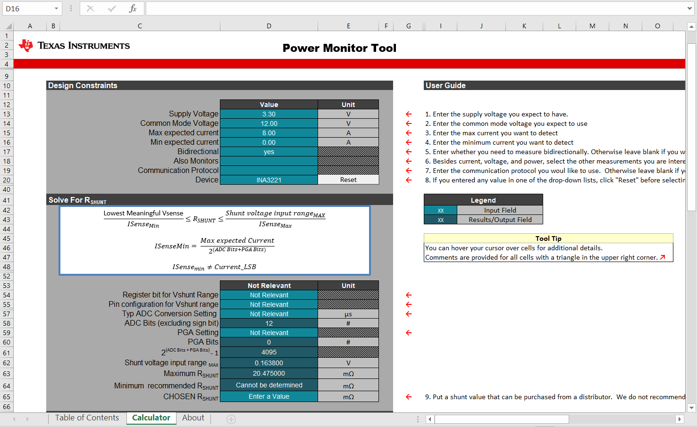

## Pin Layout

| Pin Label | Description |
| --- | --- |
| IN1+ | Positive pin of power supply for load 1 |
| IN1- | Positive side of load 1 |
| IN2+ | Positive pin of power supply for load 2 |
| IN2- | Positive side of load 2 |
| IN3+ | Positive pin of power supply for load 3 |
| IN3- | Positive side of load 3 |
| VS | INA3221 power supply, 2.7-5.5V |
| GND | Common ground (must be shared with all connected loads) |
| SCL | I2C clock line (SCL) |
| SDA | I2C data line (SDA) |
| PV | *Power valid* alert, open-drain output |
| CRI | *Critical* alert, open-drain output, *conversion*-triggered |
| WAR | *Warning* alert, open-drain output, *average*-triggered |
| TC | *Timing control* alert, open-drain output |
| VPU | Pull-up supply voltage used to bias *power valid* output circuitry (*on top side of board*) |
| A0 | Defines the *I2C address*. Default address is *0x40* (*on top side of board*) |

## I2C Address

By default, the I2C address is *0x40*. This can be modified via pin *A0* as follows:

| I2C Address | Pin *A0* connected to |
| --- | --- |
| 0x40 | Not connected (*n/c*) |
| 0x40 | GND |
| 0x41 | VS |
| 0x42 | SDA |
| 0x43 | SCL |

On most breakout boards, pin *A0* is exposed on the front side, along with solder pads for each of the four possible connections. Add a solder bridge to one of these pads to manually change the I2C address.

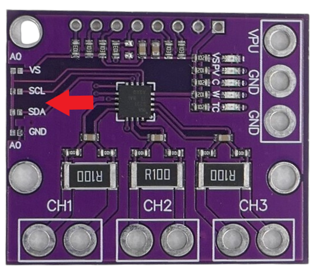

## Schematics

The *INA3221* operates as a *high-side* device with the following rules:

- **Common Ground:** All loads, channels, and the *INA3221 power supply* **must share the same GND**.
- **High Side:** The *positive* pin of each channel connects to the positive power supply. The *negative* pin connects to the positive side of the load, with the negative side of the load connecting to the common **GND**.

Depending on *how* you wire the board up, the user experience can be anywhere from *simple* to *horrible complex*. Here are a few examples and suggestions:

### Simple Design, Horrible Experience

Here is an example how you can connect a microcontroller with the *least effort* and *least number of wires* to a *INA3221 breakout board*. The result works, but a user would have a hard time figuring out how to measure currents and voltages with it:

That's because this example is *shifting complexity to the user*, and the user would need to know the rules for connecting:

- The positive power source connects to *VNx+*.
- The positive side of the load connects to *VNx-*.
- Both the negative power source and load connect to *GND*.

Huh? Right.

If you consider the two solder pads per channel as the two sides of a shunt resistor (which they are), the connection logic becomes a bit clearer:

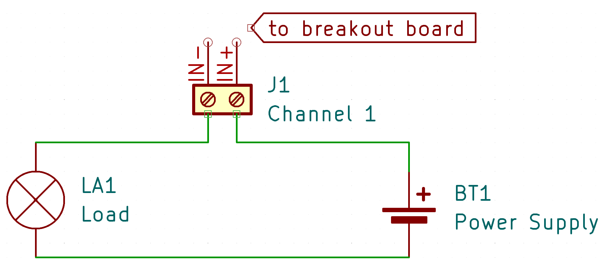

- **Negative Pole:** The load is directly connected to the negative pole of the power supply.
- **Positive Pole:** The load receives its positive voltage from **IN-**, while the power supply provides positive voltage to **IN+**. The breakout board’s *shunt resistor* bridges *IN-* and *IN+*, and the *INA3221* measures the voltage drop across it.

Yet even now, things are *still* not working: that's because the *INA3221* must also share ground with the circuit it measures:

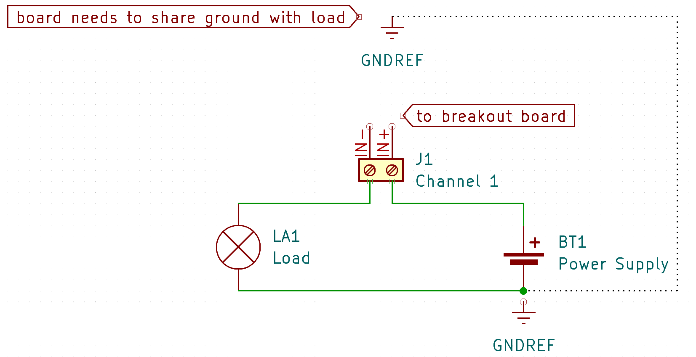

If you are put off by this bad example, you might be inclined to invest a bit more thought on the schematics side to improve the user experience drastically (see next).

### Thoughtful Design, Intuitive Use

You can easily incorporate the connection rules in your schematics. This way, the complexity is moved back inside the measuring device, and the user simply plugs in the power supply and the load that needs to be measured:

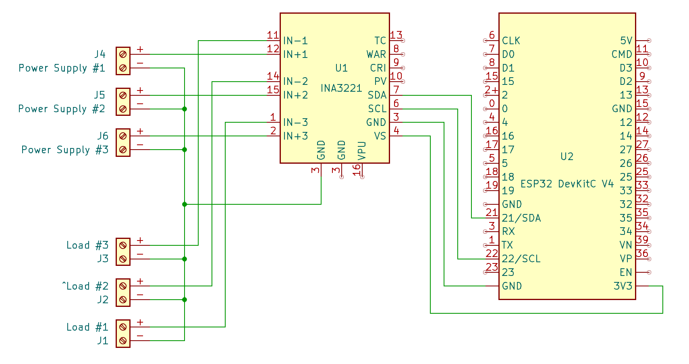

Essentially, the design takes care that all the ground lines connect properly. Now the user can inutitively work with the device:

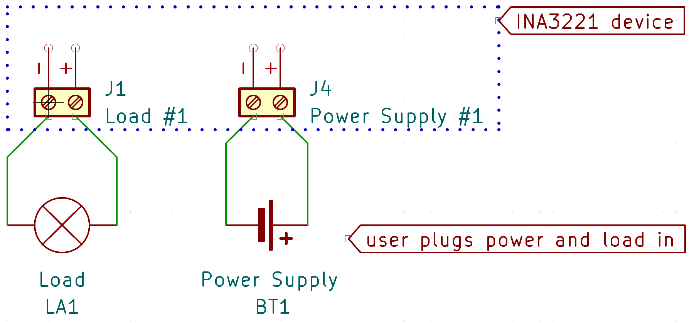

Anything inside the dotted line is shielded from the end user.

## How INA3221 Works Inside

At its core, the *INA3221* is an *analog-to-digital converter (ADC)* that measures analog voltages. It performs two key measurements on up to three power supplies:

1. **Current:** Measured indirectly as the *voltage drop* across the *shunt resistor* (between *INx+* and *INx-*).
2. **Voltage:** The *bus voltage* is measured between *INx-* and *GND*.

> [!TIP]
> The *bus voltage* approximates the power supply voltage, as the *voltage drop* across the *shunt resistor* is negligible. For precise values, account for the voltage drop derived from the *current* measurement.

### Operating Modes

#### Normal Mode
In this mode, the chip continuously measures:

1. *Shunt voltage* for one channel.
2. *Bus voltage* for the same channel.
3. Proceeds sequentially to the next channel.

Channels can be independently enabled or disabled. Disabled channels are bypassed.

#### Single Shot Mode
In this mode:

- The chip measures all enabled channels sequentially *once*.
- Afterward, it enters *power-down mode*. Measurements can still be read and represent the last cycle.

#### Power-Down Mode
In *power-down mode*:

- Quiescent current is minimized.
- Registers remain functional, but current flowing into the *INA3221 inputs* is cut off.

Wake-up time from this mode is *40µs*.
### Alerts

*INA3221* supports four different *alerts* with programmable thresholds per channel. Alert states are available at designated pins. Breakout boards also connect these pins to built-in *LED* to indicate the alert state of the device:

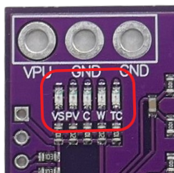

* **VS:** power supply to the board is present
* **PV:** all enabled channels have a *valid voltage* (*power valid*)
* **C:** at least one channel has exceeded the *critical current*
* **W:** at least one channel has exceeded the *warning current*
* **TC:** the *power rails* on *channel 1* and *channel 2* did not start up quickly enough (*timing control*)   
* **Critical:** very fast-acting alert that triggers whenever any enabled channel current exceeds a programmed threshold. Pin goes *low* in alert state. Can optionally use the *sum* of all enabled channels instead (provided all channels use the same *shunt resistor value*).
* **Warning:** less quickly-acting but more fault-tolerant alert that triggers when the *average* current exceeds a programmed threshold. Pin goes *low* in alert state.
* **Power Valid:** changes from *low* to *high* once all enabled channels reach a predefined voltage (by default *10V*). Goes back to *low* once any channel voltage drops below a second threshold (by default *9V*). As long as this pin is *high*, the device power supply is in expected shape. All thresholds can be reprogrammed to a minimum voltage of *2.7V*.
* **Timing-Control:** This is a very specific alert that can be used to ensure proper power-supply sequencing but requires appropriate assignment of channels to the power supplies in question. This alert is not used for most typical application. Here is how it works: At *power-up* only (or after a *reset*), the chip measures the *bus voltage* at *channel 1*, and once it exceeds *1.2V*, it continues to monitor the *bus voltage* at *channel 2*. If this voltage does not also exceed *1.2V* after *28.6ms* (four complete measurement cycles at default values), this pin pulls *low*, indicating that no valid power rail was present on channel 2.

### Conversion Time And Averaging

*Measurement errors* can occur: *current* is measured via *very low voltages*. Such voltages can be subject to *trace inductance* and other *parasitic impedances* between the *shunt resistor* and the chips *input pins*.

When using *breakout boards*, such interferences are minimized by the close proximity of the *shunt resistors*. When you are required to use *external shunt resistors* to measure large currents, *measurement errors* may become a problem.

### Noise And Errors
*INA3221* can limit the impact of *noise* on single *measurements* by two separate types of *averaging*:

* **Conversion Time:** this is the time the internal *ADC* can use to perform a *single* measurement. The more *conversion time* it is granted, the more accurate the results are: internally, the *ADC* uses its *conversion time* to take more samples, effectively averaging its single measurement.
* **Averaging:** *INA3221* can also average. It can take multiple *ADC measurements* and average them once more. 

Both techniques significantly decrease the effect of noise and increase the accuracy of measurements. The price you pay for both optimizations is a lower *response times*.

This graph illustrates the effect of *averaging*:

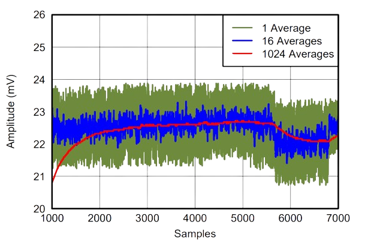

In a nutshell, you can *optimize the accuracy* in a number of ways:

* **Hardware Design:** move the *shunt resistor* as close to the *INA3221 input pins* to minimize noise effects in the first place.   
* **Conversion Time:** give more time to the *ADC* for better sampling.   
* **Average:** average the raw *ADC* samples, effectively filtering out single bad measurements.   

> [!TIP]
> Good hardware design is most important: it minimizes noise, so expensive conversion time and post-averaging is less needed, effectively improving response time.

## Datasheet

[INA3221](materials/ina3221_datasheet.pdf) (*Texas Instruments*)

> Tags: Measure, Current, INA3221, Shunt, Voltage Drop

[Visit Page on Website](https://done.land/components/power/measuringcurrent/viashunt/ina3221?786342071208244530) - created 2024-07-07 - last edited 2025-01-07
