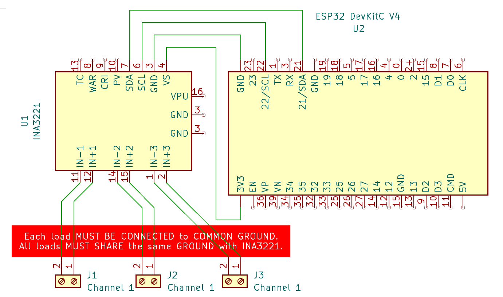

# INA3221 

> 3-Channel Current And Voltage Monitoring Via Shunt 

[INA3221](https://www.ti.com/lit/ds/symlink/ina3221.pdf?ts=1720423291346) is a microchip from *Texas Instruments* that can measure *current* and *voltage* for three different channels concurrently. 

It is suited for analyzing complex power monitoring scenarios like *charging analysis for solar panels*: you can monitor *power generated by the solar panel*, *power going into a battery*, and *power consumption taken from the battery* all in one device.

**INA226** is typically used in breakout boards that come with a *shunt resistor* and cost less than €2.00. but can also be used directly in own PCB designs.

> [!TIP]
> *INA3221* breakout boards come with *purple* and *black* PCBs which are otherwise technically *identical*. Avoid *old breakout board versions* (see below) as they had serious flaws.

## Quick Overview
The INA3221 is a three-channel, *high-side* current and voltage monitor with I2C- and SMBUS-compatible interface. Its I2C address is *0x40*.

Translated, this means all three channels must share the same *GND* but can have different voltages.

### Measuring Voltages
The *current* is measured as a *voltage drop* across the *shunt resistor*. 

The *voltage* is measured as a *high side* measurement against *GND*:

Each channel has two connectors: *VN1+* and *VN1-*. *VN1+* must always be connected to the positive voltage (*high side*). *VN1-* then goes to the positive side of the load you want to measure.

In addition, all three channels must share the same *GND*. The channel *voltage* thus is measured between *VNx+* and *GND*.

It monitors shunt voltage drops and bus supply voltages. It has programmable conversion times
and averaging modes and offers both critical and warning alerts to detect multiple programmable out-of-range conditions for each channel.

It runs both in *3.3V* and in *5V* environments.

| Parameter | Description |
| --- | --- |
| Supply Voltage | 2.7V - 5.5V |
| Current consumption | 350uA (typical) |
| Detected Voltage | 0-26V, 8mV increments |
| Maximum Detected Current | depends on shunt resistor value |

## Breakout Boards

*INA3221 breakout boards* are available in two colors that are functionally identical:

With the *purple* version, the PCB tracks are clearly recognizable. 

This helps to better understand the *breakout board design*, and identify old PCB versions that have a design flaw (see below).

### Avoid Old PCB Versions
The first version of this breakout board had a [serious design flaw](https://forum.arduino.cc/t/ina3221-breakout-board/482236) in which all three *IN+* pins were connected to each other. 

Because of this, the three *INA3221* channels could never be used independently from each other, and it was impossible to measure current in different circuitries. They always had to share the same positive voltage source.

How users fixed the old INA3221 breakout board design flaw
 

Users initially fixed this *PCB design flaw* manually which worked but took a lot of cutting and reworking tracks. 

Depending on how it was done, the result wasn't always looking necessarily trustworthy either.

   

The *PCB design* has meanwhile been fixed, and the tracks on the PCB have been redesigned completely. Compare the new track routing to the three channel solder pads with the earlier design above:

New PCBs without the flaw can be recognized on the top side by looking at the three big connectors: they are now labeled *VPU*, *GND*, and *GND*. The old version did not have labels (and used these pins differently). 

**INA226** internally uses a 16-bit *ADC* (Analog-To-Digital converter) to measure *voltage*. It uses the **Shunt** principle to measure *current* via measuring the *voltage drop* at a **Shunt** resistor.

The maximum measured *voltage* is *36V*. The maximum measured *current* depends on the value of the **Shunt**.

Because of its high-resolution 16-bit *ADC* and automatic internal *averaging* of multiple samples, it produces very accurate and reliable readings. All of its measured and calculated values can be read by a microcontroller via *I2C*.

### Caveat When Using Example Schematics
Since the *INA3221 breakout board* has undergone drastic redesign (as discussed above), this affects *examples* as well that you may find in the Internet.

Always make sure the *schematics* apply to the *same INA3221 breakout board version* you are using.

## Shunt Value and Maximum Current

*INA3221* measures current via *voltage drop* at a *shunt resistor*. 

The *INA3221* can sense this voltage drop in *40uV* increments up to a maximum of *163.8mV*, providing a 12-bit resolution with a total of 4.096 steps.

The shunt resistor value is chosen so that with the maximum current to be measured the voltage drop across the shunt does not exceed *+/-163.8mV*.

The maximum current that can be measured depends on two factors:

* **Shunt Resistor Value:** With the default *0.1 Ohm* shunt resistor found on most breakout boards, a maximum current of *1.638A* can be measured. Likewise, a *1 Ohm* shunt resistor could measure currents of up to *0.1638A*.
* **Tracks:** The *entire current* needs to go through the shunt resistor, so terminals and PCB tracks must be capable of handling this power.    
While you could replace the default *R100* SMD shunt resistor with i.e. a *R020* (*0.02 Ohms*) and now measure currents of up to *8A*, it is doubtful whether the PCB tracks would allow such currents. If you must measure higher currents, then use *external shunt resistors*. The PCB really just needs to be connected to the *voltage drop* this way.

> [!TIP]
> There is a [Power Monitor Tool](https://www.ti.com/tool/download/SBOR021) available for free download from *Texas Instruments* which really is a *Microsoft Excel* sheet that lets you calculate the required *shunt resistor values* for your scenario.

## Pin Layout

Typical **INA226** breakout boards come with 8 pins:

| Pin Label | Description |
| --- | --- |
| IN+ | Positive Voltage for Load Circuit |
| IN- | Negative Voltage for Load Circuit |
| VBS | Bus Voltage |
| ALE | Alert |
| SDA | I2C SDA |
| SCL | I2C SCL |
| GND | Common GND |
| VCC | 3.3V/5V supply for INA226 |

* **VCC** and **GND** supply the breakout board with the power it needs to operate. Both *3.3V* and *5V* are supported.
* **SDA** and **SCL** are the typical *I2C* pins used to communicate measured values to a microcontroller.

## Schematics
The *INA3221* is a *high side* monitor. Here are the rules:

* **Common Ground:** all loads that you want to measure, and the *INA3221*, **must share the same GND**.
* **High Side:** the positive pin of each channel must be connected to the positive power supply. The negative pin of the channel connects to the positive side of the load. The negative side of the load connects to the common **GND**.

### Example

This is an example of hooking up a *ESP32* microcontroller to the *I2C interface* of *INA3221*, and exposing three screw terminals for three different loads to be measured:

> [!IMPORTANT]
> Make sure you connect the positive power source that drives your load to *VNx+*, the negative power source to *GND*, the device's positive pole to the *VNx-*, and the device's negative pole to *GND*. All devices and power supplies must share the same *GND* with *INA3221*.

> Tags: Measure, Current, INA3221, Shunt, Voltage Drop

[Visit Page on Website](https://done.land/components/power/measuringcurrent/viashunt/ina3221?786342071208244530) - created 2024-07-07 - last edited 2024-07-07
