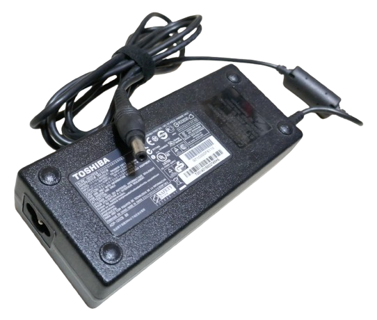
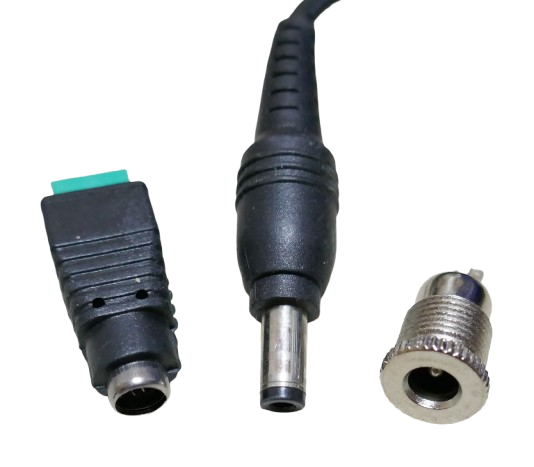

# Power Bricks

> Power Bricks, also known as Laptop Power Supplies: Sealed High-Current Switching Power Supplies

Until recently, most notebooks were equipped with high-performance power supplies. These power supplies typically provided *60-100W* at around *20V*. Due to their large size and weight, the term **power brick** was coined for them.

## Overview

On the output side, *power bricks* commonly use *barrel connectors* with a shielding outside *ground* connection and a central pin for the positive voltage.

Today, these barrel connectors have largely been replaced with *USB-C* connectors. USB-C enables notebooks to be charged with any universal *USB power supply* that can provide *20V* and the necessary current. Modern power supplies, like the *USB-C*-type, have also significantly reduced in size, showcasing the rapid advances in *switching power supply technology* and a dramatic increase in efficiency.

> [!TIP]
> Old notebook power supplies from well-known brands are highly valuable. They are made from durable, high-quality materials (such as good transformers and safe electronics). So, when it's time to part ways with your old notebook, make sure **you keep** the power supply. You can easily repurpose it for many applications, adjust plugs, change its output voltage, and create powerful *USB-C chargers* or chargers for other battery types. Due to their relatively high DC voltage and current capabilities, they also make excellent power supplies for basic *lab bench power supplies*.

## Reusing Power Bricks

There are many ways to repurpose and refurbish old laptop power bricks. Here are some ideas:

* **Lab Bench Power Supply:** Connect a power brick to a *Buck-Boost Lab Bench Power Supply*, such as the *XY-SK120X* or similar models. These ready-to-use modules can convert the input voltage to either a lower or higher voltage, covering a wide range of voltages typically needed in a lab. The *XY-SK120X* can handle up to *120W* or *6A* and pairs perfectly with most notebook power supplies.

    

* **Battery Charger:** Turn the power brick into a universal battery charger, such as for *LiFePO₄* batteries. You can add a specific charger board, or even better, use another *XY-SK120X* (or similar) module. These advanced power supplies are fully programmable, allowing you to set critical battery parameters like *cut-off voltage*, *charging current*, *end-of-charge current*, and more. Since these modules support up to 10 different profiles, you can create tailored charging profiles for various battery chemistries. You can even add custom profiles for slower charging (to preserve battery health when you're not in a rush) or charge batteries only to a specific percentage, ideal for long-term storage.

* **Universal USB Charger:** Affordable breakout boards are available that can convert a wide range of input voltages into up to *65W* of USB output. These breakout boards support most modern *quick-charge* and *power-delivery* protocols. This makes it possible to convert a power supply for an old notebook with a *barrel jack* into a modern *USB-C power supply* for your newest notebooks. However, most modern laptops require *USB-C* to deliver *20V at 65W*, and typical breakout boards only feature *buck converter* functionality, meaning they *cannot increase* the input voltage. Therefore, unless your old power brick outputs more than *20.5V*, simpler breakout boards won't be able to turn it into a USB charger that supports *20V*.

> Tags: Laptop, Notebook, Power Supply, Repurpose, USB Charger, Lab Bench Power Supply

[Visit Page on Website](https://done.land/components/power/powersupplies/acmains/powerbricks?130864011417253637) - created 2025-01-16 - last edited 2025-01-16
