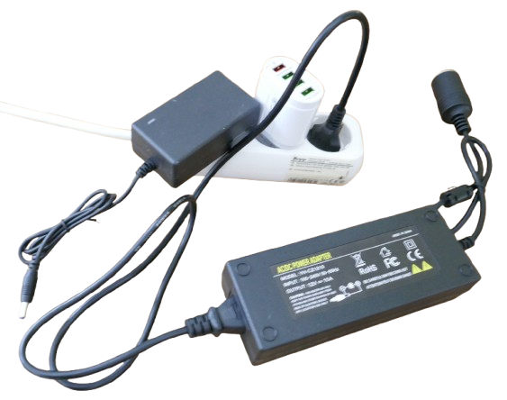
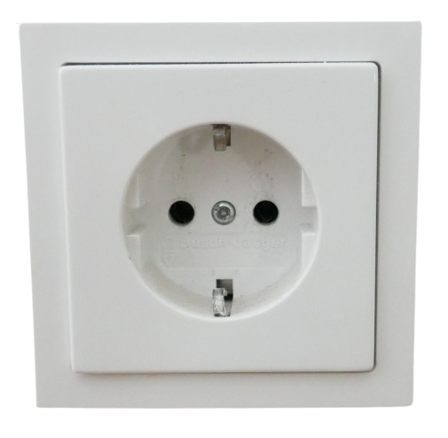
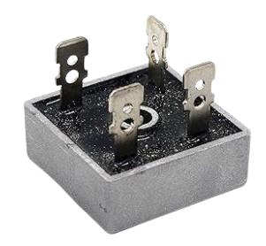
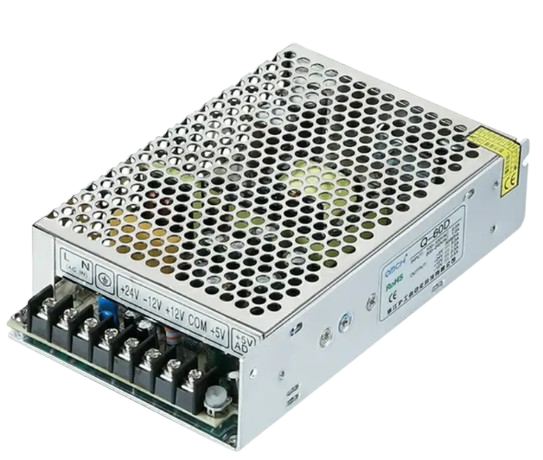

# AC Mains Power Supplies 

> Using AC Mains to Power DC Devices

*AC mains* is an almost unlimited energy source in industrial civilizations and is comparably very affordable. This is why most stationary devices are powered by *AC mains*.

## Overview

*AC mains* has two distinct properties that prevent it from being used directly to power devices in most cases:

1. **Alternating Current (AC):** This type of current results from how energy is generated. Revolving *turbines* produce *AC* rather than *DC*. Additionally, *power plants* are typically located far from consumers. Transporting *AC power* over long distances results in much lower losses compared to *DC*.

2. **High Voltage:** Electric power (watts) is the product of *voltage (V)* and *current (A)*. A higher voltage allows for a lower current to deliver the same power. Typical household voltages (*230V* in Europe, *110V* in the US*) enable smaller household wiring and reduce fire risks since lower current is required. Current, not voltage, causes cables to overheat and melt.

In summary, *AC* and *high voltage* are ideal for transporting electrical energy efficiently. However, high voltage also makes this power potentially *life-threatening*, as it far exceeds the [30V](https://done.land/fundamentals/voltage/) threshold that human skin can safely insulate. Most modern electronic devices require *low voltage* and *DC*, anyway.

*AC mains power supplies* make *AC mains power* usable. These include *power adapters*, *laptop bricks*, *USB power supplies*, or *heavy-duty high-current power supplies*. They are also built into most household appliances which plug into *AC mains* directly.

## How They Work

Almost all *AC mains power supplies* operate using some or all of the following components:

1. A **transformer** to lower the *AC voltage*. Since switching power supplies operate at high frequencies (typically above 100 kHz), they allow for *much smaller* transformers compared to traditional bulky and heavy linear power supplies. Switching power supplies are much more efficient and produce less heat when compared to classic linear power supplies.

    

    > A significant portion of the *energy savings* we enjoy today comes from using modern *switching power supplies* instead of *linear* ones.

2. A **rectifier** to convert *AC* to a raw (unstabilized) *DC* voltage.

    

3. A [switching power supply circuitry](https://done.land/components/power/powersupplies/#voltage-regulators) to produce a stable *DC* output voltage.

    

Fitted into one metal-shielded housing, switching power supplies are compact and used inside many devices.

> [!NOTE]
> Some heavy-duty appliances may still use basic *linear power supplies*, focusing on *high current* and *simplicity*, where *output voltage precision*, *size*, and *weight* are secondary concerns. These power supplies may use a *large transformer* (which operates much less efficiently at the lower frequency of *50/60Hz*), simple diodes for rectification, and a few discrete components.

### Dangerous Power Supplies

Some *AC mains* power supplies are designed extremely poorly to cut production costs. These supplies often:
- Are *unregulated* or insufficiently regulated.
- Use underrated components that overheat under heavy load, posing a fire hazard.
- Violate safety standards by having inadequate internal isolation, risking exposure of dangerous live mains voltage on the low-voltage DC side.

Since *AC mains* power supplies are safety-critical devices (with risks of shock or fire hazards), this is *not* an area to cut corners. 

Externally, most *AC mains power supplies* look the same, but their internal build quality varies greatly. [DiodeGoneWild](https://www.youtube.com/c/DiodeGoneWild) regularly tears down cheap *AC mains* power supplies, exposing the significant quality variations and shocking realities (in the most literal sense).

### Identifying Dangerous Power Supplies

When purchasing cheap power supplies from untrusted sources, you should perform the following simple house-keeping checks **immediately** to identify potential hazards and return the device in time and claim a refund if necessary:

1. **Check Weight:**  
   While modern *switching power supplies* are smaller and lighter, quality components still contribute to noticeable weight. Bad power supplies are often *substantially lighter* than high-quality builds. Compare the weight of the suspect device with a trusted power supply, like a *laptop charger* or a *USB adapter* from a reputable manufacturer. If the device feels significantly lighter, **return it immediately and avoid using it.**

2. **Test-Drive with Maximum Load:**  
   Many cheap power supplies are heavily overrated and cannot reliably provide their claimed output.  
   - Connect a load close to the power supply’s maximum rated output. Ideally, use an [electronic load](https://done.land/tools/devices/electronicload/) for precise testing.  
   - Monitor the *output voltage* and *device temperature*. The output voltage should remain stable within the rated range. For example:
     - A *USB power supply* should not drop below *4.8V*.
     - A *12V power supply* should not drop below *11.5V*.  
   - If the device gets excessively hot (above *70–80°C*), return it.

### Other Considerations

Beyond safety and performance issues, there are additional reasons to avoid low-quality power supplies:

1. **Electromagnetic Interference (EMI):**  
   Cheap power supplies often lack proper filtering to reduce EMI, leading to interference with other devices.  

2. **Power Factor Correction (PFC):**  
   Quality power supplies include *PFC* to improve efficiency and minimize harmonics. Poorly designed supplies may consume power inefficiently and introduce noise into the grid.

## High Voltage Kills

Always remember: [Voltages above 30V can kill.](https://done.land/fundamentals/voltage/). Even if *you* are experienced and cautious, consider these scenarios:
- A year later, when you rediscover your DIY device in a pile of junk, will you remember the spots "where you shouldn't touch or pull"?  
- Will others (especially children or their friends) know not to poke their fingers into live components they found in the basement?

### Key Rule:  
**Never include AC mains power directly in your projects.** Always use a certified external *AC mains power supply* and limit your device to safe low DC voltages below *30V*.

**Do it for your own safety. Do it for your liability.**

### For Professionals:  

If you are a certified electrical engineer and must use *AC voltages* in your designs:
- Ensure *proper grounding* for all metal housings, connected to the AC mains ground.
- This ensures that if live components are exposed, fault currents flow through the grounded parts, tripping protective devices (like circuit breakers, *residual current circuit breaker* (*RCCB*) or *earth leakage circuit breaker* (*ELCB*)) and avoiding harm to people.

> Tags: AC. Mains, Power Supply, RCCB, ELCB, 30V, Danger, Power Adapter, EMI, PFC, Power Factor Correction

[Visit Page on Website](https://done.land/components/power/powersupplies/acmains?702334011017255517) - created 2025-01-16 - last edited 2025-01-16
