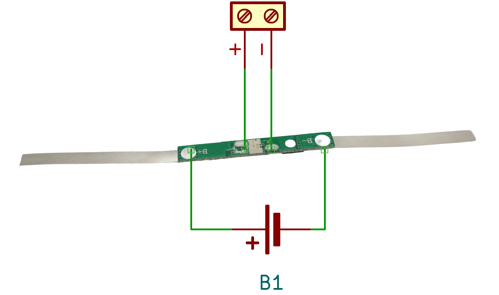

# 1S 5A Battery Management Systems (BMS) 

> BMS For A Single Battery String And 5A Max Current

> [!NOTE]
> **BMS** often ship in *locked state*: *no output voltage* is available at the output pins. *Locked state* is also entered whenever *over-current protection* was triggered. To *unlock* the **BMS**, connect it to a charger. If you did not add a dedicated *charger board*, apply the appropriate charging voltage to its output terminal.

## 5A

[LiIon](https://done.land/fundamentals/battery){:.button.button--success.button--rounded.button--sm}
 [LiPo](https://done.land/fundamentals/battery){:.button.button--success.button--rounded.button--sm}

For currents up to **5A**, there are a few commonly available choices available.

> [!CAUTION]
> While the vendors claim that these boards can sustain a continuous current of **5A**, given the small size of the boards, you should either stay below **3A** or add additional *heat sinks*.

### Sleeve-Connectors

This board comes with long metal sleeves that can be soldered or spot-welded right onto *18650* batteries (but can be used with other *LiIon* or *LiPo* batteries as well):

#### Connection

Its long metal sleeves are designed to be fitted to *18650 LiIon Cells* using spot welding but you can shorten the connector terminals and solder them to *LiPo* as well.

On the backside, there are two terminals marked **B+** and **B-** that are identical to the metal sleeves and go to the battery.

The output voltage is available at the terminals **P+** and **P-** in the middle of the backside.

#### Specs

| Protection | Threshold | Release | Delay |
| --- | --- | --- | --- | 
| Over-Charge | >4.3V | <4.1V | 70ms |
| Over-Discharge | <2.4V | >3.0V | 35ms |
| Over-Current | 6A | | |

### Regular Connectors

This board is based on the *DW01* chip and three *8205A* MosFET:

All solder pads are located on the backside:

#### Connection

Connect the battery to **B+** and **B-**. Output voltage is available at **P+** and **P-**.

#### Specs

| Protection | Threshold | 
| --- | --- | 
| Continuous Current | 5A | 
| Maximum Current | 6A |
| Overcurrent Detection | 7.5A |
| Over-Charge | >4.25V (release at <4.23V) |
| Over-Discharge | <2.45V |
| Size | 35x7.4x2.2mm |

#### Charging

When you *charge* your battery through this *BMS*, the *charging voltage* is *4.2V*.

> [!TIP]
> It is always recommended for charging to use an additional *dedicated charger board* that limits the charging current to the levels appropriate for your particular battery.   
> These simple *BMS* are not designed to be chargers. They do limit the charging current, but there is no way for you to adjust the current. It is typically a fairly high current that may be significantly *too high* for many battery types.

> Tags: Battery, BMS, 1S, 5A, DW01, 8205A

[Visit Page on Website](https://done.land/components/power/bms/1s/5a?253347031416242628) - created 2024-03-24 - last edited 2024-03-24
