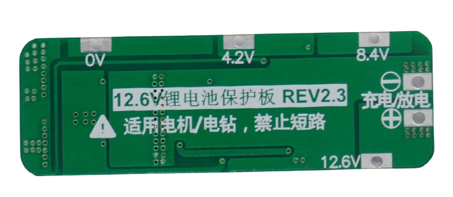

# 3S 20A Battery Management Systems (BMS)

> BMS For Three Battery Strings And 20A Max Current

> [!NOTE]
> **BMS** often ship in *locked state*: *no output voltage* is available at the output pins. *Locked state* is also entered whenever *over-current protection* was triggered. To *unlock* the **BMS**, connect it to a charger. If you did not add a dedicated *charger board*, apply the appropriate charging voltage to its output terminal.

> [!CAUTION]
> When connecting batteries to your **BMS**, make sure to use *wires* with sufficient diameter for the anticipated *high currents*.

> [!CAUTION]
> When designing *battery packs*, use batteries of *same type* and *same state of charge* only. It is recommended you *fully charge* all batteries before connecting. All batteries must have *the same voltage* (voltage difference less than *0.05V*). Do not mix batteries from different vendors, types, capacity, or age. 

## 20A

[LiIon](https://done.land/fundamentals/battery){:.button.button--success.button--rounded.button--sm}
 [LiPo](https://done.land/fundamentals/battery){:.button.button--success.button--rounded.button--sm}

For currents up to **20A**, here is a rugged and balanced **BMS**:

Connect the batteries like this:

* First battery string to **0V** (-) and **4.2V** (+)
* Second battery string to **4.2V** (-) and **8.4V** (+)
* Third battery string to **8.4V** (-) and **12.6V** (+)

The output voltage is available at the terminals marked  **+** and **-**.

All terminals are also available at the bottom:

### Specs

| Protection | Threshold | 
| --- | --- | 
| Over-Charge | >4.25V |
| Over-Discharge | <2.5V |
| Over-Current | 60A (100ms delay) | 
| Short Circuit | yes,resettable | 
| Continuous Current | 20A |
| Size | 59x20x3.4mm |

### Charging

When *charging* batteries through this **BMS**, the charging voltage needs to be *12.6-13.0V*. The **BMS** limits the charging current to *10A*.

> Tags: Battery, BMS, 3S, 20A

[Visit Page on Website](https://done.land/components/power/powersupplies/battery/bms/3s/20a?025426031516245500) - created 2024-03-16 - last edited 2024-03-16
