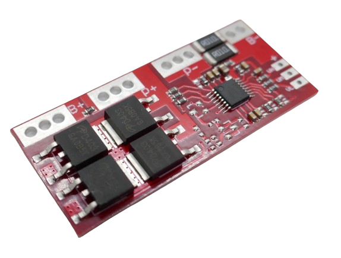
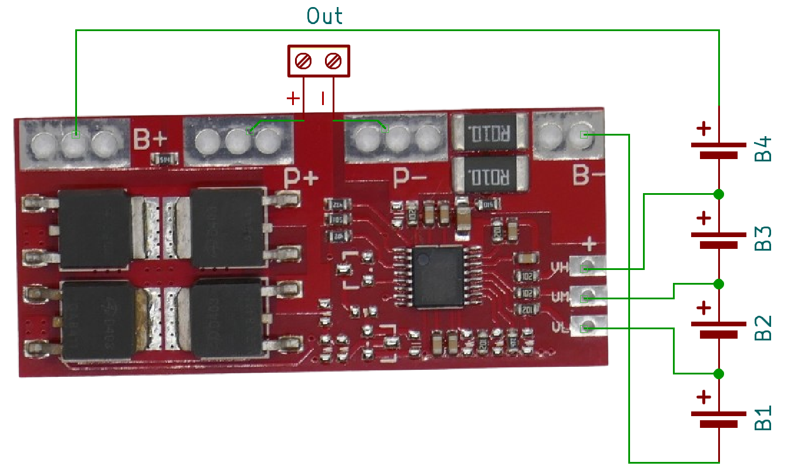

# 4S 15A Battery Management Systems (BMS)

> BMS For Four Battery Strings And 15A Max Current

> [!NOTE]
> **BMS** often ship in *locked state*: *no output voltage* is available at the output pins. *Locked state* is also entered whenever *over-current protection* was triggered. To *unlock* the **BMS**, connect it to a charger. If you did not add a dedicated *charger board*, apply the appropriate charging voltage to its output terminal.

> [!CAUTION]
> When connecting batteries to your **BMS**, make sure to use *wires* with sufficient diameter for the anticipated *high currents*.

> [!CAUTION]
> When designing *battery packs*, use batteries of *same type* and *same state of charge* only. It is recommended you *fully charge* all batteries before connecting. All batteries must have *the same voltage* (voltage difference less than *0.05V*). Do not mix batteries from different vendors, types, capacity, or age. 

## 15A

[LiIon](https://done.land/fundamentals/battery){:.button.button--success.button--rounded.button--sm}
 [LiPo](https://done.land/fundamentals/battery){:.button.button--success.button--rounded.button--sm}
For currents up to **15A**, a board with four powerful *MosFET* like this one can be used:

Connect the batteries like this:

* First battery string to **B-** (-) and **VL** (+)
* Second battery string to **VL** (-) and **VM** (+)
* Third battery string to **VM** (-) and **VH** (+)
* Forth battery string to **VH** (-) and **B+** (+) 

The terminals are accessible both from top and bottom.

The output voltage is available at **P+** and **P-**.

### Specs

| Protection | Threshold | 
| --- | --- | 
| Over-Charge | >4.25V |
| Over-Discharge | 2.5V |
| Over-Current | 20-30A | 
| Short Circuit | yes,resettable | 
| Continuous Current | 15A (10A w/o heat sink) |
| Size | 50x22x4mm |

> Tags: Battery, BMS, 4S, 15A

[Visit Page on Website](https://done.land/components/power/powersupplies/battery/bms/4s/15a?678590031516242508) - created 2024-03-16 - last edited 2024-03-16
