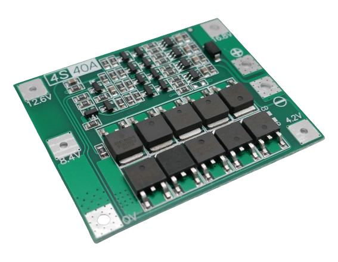
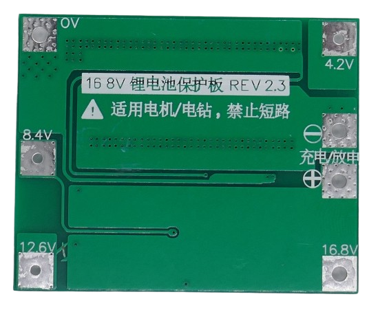

# 4S 40A Battery Management Systems (BMS)

> BMS For Four Battery Strings And 40A Max Current

> [!NOTE]
> **BMS** often ship in *locked state*: *no output voltage* is available at the output pins. *Locked state* is also entered whenever *over-current protection* was triggered. To *unlock* the **BMS**, connect it to a charger. If you did not add a dedicated *charger board*, apply the appropriate charging voltage to its output terminal.

> [!CAUTION]
> This *BMS* is designed for *high currents*. Use copper 3mm2 copper wires to connect the batteries.  

> [!CAUTION]
> When designing *battery packs*, use batteries of *same type* and *same state of charge* only. It is recommended you *fully charge* all batteries before connecting. All batteries must have *the same voltage* (voltage difference less than *0.05V*). Do not mix batteries from different vendors, types, capacity, or age. 

## 60A

[LiIon](https://done.land/fundamentals/battery){:.button.button--success.button--rounded.button--sm}
 [LiPo](https://done.land/fundamentals/battery){:.button.button--success.button--rounded.button--sm}

For currents up to **40A** (i.e. for power tools like *drills* with a high initial *current*), here is a rugged and balanced **BMS**:

> [!NOTE]
> There are two very similar breakout board versions available. One shows the marking *4S 40A* between the terminals *12.6V* and *16.8V*. The other one shows the marking on the left side between the connections *12.6V* and *8.4V*. They are called *Enhance* and *Balance* interchangeably, and it is not clear what the true differences are.

### Connections

Connect the batteries like this:

* First battery string to **0V** (-) and **4.2V** (+)
* Second battery string to **4.2V** (-) and **8.4V** (+)
* Third battery string to **8.4V** (-) and **12.6V** (+)
* Forth battery string to **12.6V** (+) and **16.8V** (+)

The output voltage is available at the terminals marked  **+** and **-** at the port labelled *Discharge*.

All terminals are also available at the bottom:

### Specs

| Protection | Threshold | 
| --- | --- | 
| Continuous current | 40A |
| Over-Charge | >4.25V, recovery at <4.1V |
| Over-Discharge | <2.5V (0.1C),<3V (@1C),<3.5V(@>2C) |
| Over-Current | 80A (150ms delay) | 
| Short Circuit | yes,resettable | 
| Continuous Current | 20A |
| Size | 45x55x3.4mm |

### Charging

Charging voltage is *16.8-18.1V*. The **BMS** limits the charging current to *20A*.

> Tags: Battery, BMS, 4S, 40A

[Visit Page on Website](https://done.land/components/power/powersupplies/battery/bms/4s/40a?469225032326245105) - created 2024-03-28 - last edited 2024-03-28
