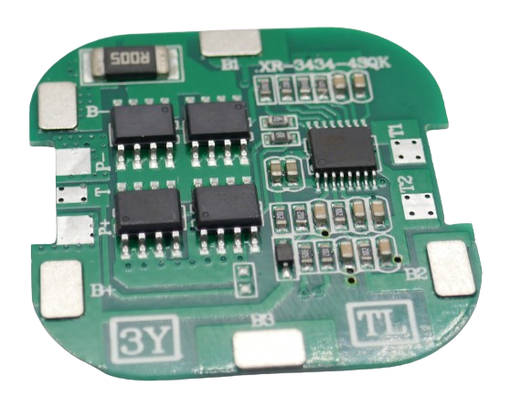
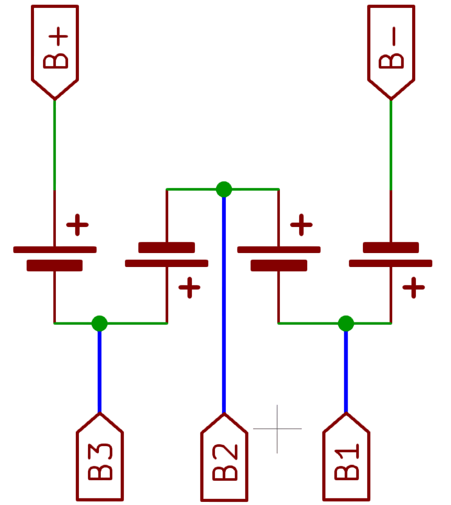
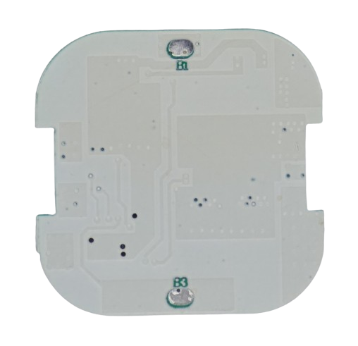

# 4S 8A Battery Management Systems (BMS)

> BMS For Four LiIon Battery Strings And 8A Max Current

> [!NOTE]
> **BMS** often ship in *locked state*: *no output voltage* is available at the output pins. *Locked state* is also entered whenever *over-current protection* was triggered. To *unlock* the **BMS**, connect it to a charger. If you did not add a dedicated *charger board*, apply the appropriate charging voltage to its output terminal.

> [!CAUTION]
> When connecting batteries to your **BMS**, make sure to use *wires* with sufficient diameter for the anticipated *high currents*.

> [!CAUTION]
> When designing *battery packs*, use batteries of *same type* and *same state of charge* only. It is recommended you *fully charge* all batteries before connecting. All batteries must have *the same voltage* (voltage difference less than *0.05V*). Do not mix batteries from different vendors, types, capacity, or age. 

## 8A

[LiIon](https://done.land/fundamentals/battery){:.button.button--success.button--rounded.button--sm}
 [LiPo](https://done.land/fundamentals/battery){:.button.button--success.button--rounded.button--sm}
This is a cost-effective and simple BMS that claims to sustain continuous currents of **8A**, however in this case make sure you add heat sinks. I use this BMS for smaller loads up to **3A** without heat sink.

Note that this BMS **is not balancing the cells**. It only provides the typical protections (i.e. over-discharge, short-circuit):

* assemble your battery pack with fully charged cells of equal size, type, manufacturer, and age (to ensure they charge and discharge equally) *-or-*
* add a passive (or better yet, active) balancer board

The BMS monitors each cell individually which is why you connect your battery pack like this:

* First battery string to **B-** (-) and **B1** (+)
* Second battery string to **B1** (-) and **B2** (+)
* Third battery string to **B2** (-) and **B3** (+)
* Forth battery string to **B3** (-) and **B+** (+) 

The output voltage is available at the (relatively small) **P+** and **P-** terminals. The terminals **B1** and **B3** are also available on the back side of the board:

### Specs

| Protection | Threshold | 
| --- | --- | 
| Over-Charge | >4.25V |
| Over-Discharge | 2.3-3.0V |
| Over-Current | 20A | 
| Short Circuit | yes,resettable | 
| Continuous Current | 8A |
| Size | 34x34x3.2mm |

### Charging

You *can* charge your battery pack directly through this BMS by applying *16.8-17.0V* to **p-** and **P+**, however this would result in relatively high charging currents of **6A**, and you may not typically have *16.8-17.0V* at hand.

A much better alternative is to add a dedicated **4S USB Charger Board**, for example the [LIFC2-N](https://done.land/components/power/powersupplies/battery/chargers/charge/buck-boost/lifc2-n/) module. This way, you can charge your 4S battery from any USB power supply.

### Example

* [Powering Hänsch Comet Emergency Light from Internal 4S Battery](https://done.land/components/power/powersupplies/battery/chargers/charge/buck-boost/lifc2-n/portableemergencylight/)

> Tags: Battery, BMS, 4S, 8A

[Visit Page on Website](https://done.land/components/power/powersupplies/battery/bms/4s/8a?268282020426240854) - created 2024-02-27 - last edited 2025-10-27
