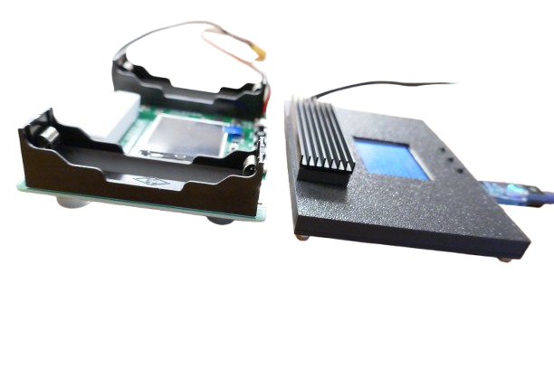
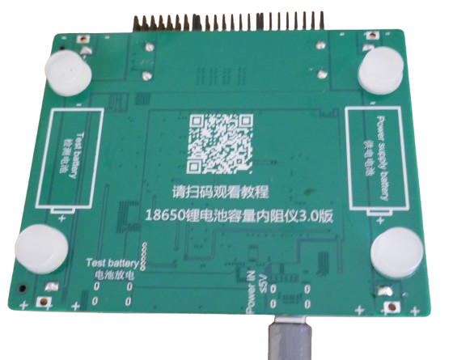
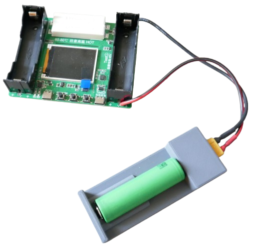
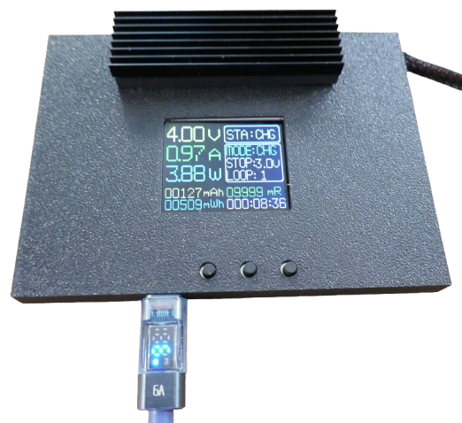
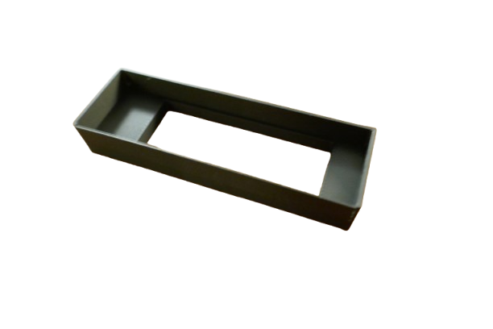
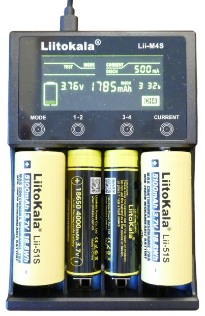
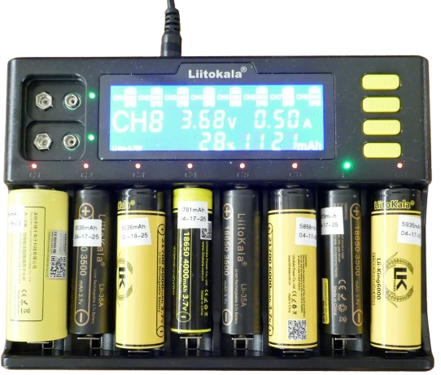

# Single-Battery Tester

> Simple Yet Efficient Single-Battery Tester For 18650 Cells, 5V Power Banks, And Other Battery Cell Below 5V

This is an affordable *all-in-one* tester that can identify *counterfeit* batteries and determine overall battery health and quality. It can test *only one battery at a time*.

The two load resistors on top (8 Ohms each, connected in parallel) can reach high temperatures during testing (up to 80°C). Adding a heat sink is recommended to avoid accidental burns.

You can easily *enhance* this device, i.e. by removing the soldered battery holders and adding external test cables, and/or by adding a 3D-printed housing (STL files below).

| Feature  | Description  |
|---|---|
| Channels | 1   |
| Battery Under Test  | - **5V max** - *18650* battery bay (right side) - *USB-C* (right side) - Solder pads (next to right battery bay) |
| Power Supply | - *USB-C* **or** - Left battery bay    |
| Discharge Test  | - *4 Ohms 10W* load resistor - Max discharge current *1A* - Units: total *mAh* **or** total *mWh* - Stop-voltage configurable (*2.5–3.5V*) - No heat sink or fan |
| Charging | - *LiIon* and *LiPo* only - Max charging current *1A* |
| Auto-Test | Yes, charge-discharge-charge cycle with total discharge energy reported |
| Off-Button | Yes, long-press left push button |
| Language | *English* and *Chinese*, configurable |
| Firmware | - Version 4.2 - User cannot upgrade firmware |
| LED  | - *Red:* power-supply battery charging (left battery bay) - *Blue:* power-supply battery fully charged (left battery bay) |
| Display | - Color-TFT - Backlight |

## Overview

This tester can be powered via *USB-C* (using the **left** *USB-C* connector) or by a *18650* cell in the **left** battery bay.

> [!TIP]
> When powering the device through the left *USB-C connector*, the *left battery bay* can remain empty, as it does not participate in testing. If a *18650* cell is inserted into the *left* battery bay, it acts as an internal power supply, making the device portable. In portable mode, the battery under test cannot be charged. When the device is connected to *USB power* while a *18650* cell is present in the *left* battery bay, the cell will be kept charged: a *red* LED indicates charging, and a *blue* LED indicates the battery is fully charged.

The *battery under test* can be a *18650* cell (in the **right** battery holder) or any other battery connected through the **right** *USB-C* connector or solder pads located at the *right* battery bay. The *battery under test* must not exceed **5V**.

### Buttons and Operation

The unit is operated via three push buttons:

* **Power:** Press to turn *on* when off, select a menu item when on, or long-press to turn *off*.
* **Change Settings:** Press to *increment* the currently selected menu item. There’s no *decrement* option, so continue pressing until the settings cycle back to the beginning.
* **Start/Stop Test:** Press to *start* the selected test. Press again to *stop* it.

### Changing Language

The unit supports *English* and *Chinese*. To switch between languages, follow these steps:

1. Turn off the unit.
2. Press and hold the *Menu* button while turning the unit *on*. Release all buttons once the display content appears.
3. Turn the unit off, then on again to confirm the new language setting.

## Test Modes and Settings

The unit offers three test modes: *AUTO*, *CHG*, and *DSG*:

* **Automatic Testing** (*LiIon/LiPo only*): In **AUTO** mode, the unit sequentially *charges*, *discharges*, and then *charges* the battery again to provide a full capacity assessment. The battery is left fully charged at the end.

   To select AUTO mode, press the `Power` button until the **Mode** menu is highlighted, then press `Menu` until **AUTO** appears.
   
* **Discharge Test** (*all battery types*): In **DSG** mode, the unit starts *discharging* and logs the discharged energy. It then leaves the battery discharged, so this mode is suitable for non-LiIon/LiPo batteries like *LiFePO4* or *NiMH* that cannot be safely charged with this device.

   To select DSG mode, press the `Power` button until the **Mode** menu is highlighted, then press `Menu` until **DSG** appears.
   
* **Charge Test** (*LiIon/LiPo only*): In **CHG** mode, the unit serves as a charger specifically for *LiIon/LiPo* batteries, and logs the charge process.

   To select CHG mode, press the `Power` button until the **Mode** menu is highlighted, then press `Menu` until **CHG** appears.

Additional test settings can be adjusted for further customization:

* **Loops:** In **AUTO** mode, set up to *10 consecutive loops* for enhanced accuracy.

    To set loops, press the `Power` button until the **Loop** menu is highlighted, then press `Menu` to cycle through the number of loops (*1–10*).
* **Stop Voltage:** In **AUTO** and **DSG** modes, a *stop voltage* can be defined for discharge tests, ideal for different battery chemistries (e.g., *LiFePO4*) or to prevent deep discharge.

    To set stop voltage, press the `Power` button until the **Stop** menu is highlighted, then press `Menu` to adjust the *stop voltage* (*2.5–3.5V* in 0.1V increments).

### Controlled Discharge: Resistive Load

The device uses a fixed resistive load that can reach *60–80°C* during tests. The load produces a maximum discharge current of *1A*.

    

## Performing Battery Capacity Test

You can reliably measure the total battery capacity by either *discharging a fully charged* battery or *charging a fully discharged* one:

* **Charge Test:** This approach is efficient if you use the battery until it’s “empty” by your standards, then perform a *CHG* test. The tester logs the *charging energy transferred back* into the battery as it recharges.
* **Discharge Test:** For higher precision, use the *AUTO* test. Here, the tester first *fully charges* the battery to a specified level, then *fully discharges* it to a safe stop voltage. In this test, the device logs the *total energy drawn from the battery*. 

The *discharge test* using *AUTO* mode starts the battery from a defined level, producing consistent results. However, this test takes longer as it includes three phases—charging, discharging, and charging again—and slightly increases battery wear.

The *charging test* in *CHG* mode is faster and reduces battery wear: since the battery would need recharging anyway, the tester simply functions as a smart charger, logging the energy input. The drawback is that there’s no set start level, making the “empty” state subject to user interpretation.

> [!TIP]
> For a more efficient manual testing setup, first run a *DSG* mode test to discharge the battery to a specified stop voltage, then follow up with a *CHG* cycle. This way, the battery charges from a defined "empty" state without unnecessary wear. However, the built-in *AUTO* mode runs the opposite sequence, consuming an extra charge cycle.

### 1. Select Test Parameters

Before testing, follow these steps to select the test mode and its parameters:

1. **Stop Voltage:** Set a safe stop voltage for your battery. **3.0V** is generally safe for *LiIon/LiPo* batteries.
    1. Turn the device on with a short press of the left button.
    2. Short-press the left button until the **STOP** setting is highlighted in blue.
    3. Short-press the middle button until the display shows the desired stop voltage.
   
2. **Test Mode:** Select the test mode: *DSG*, *CHG*, or *AUTO*.
    1. Short-press the left button until the **MODE** setting is highlighted in blue.
    2. Short-press the middle button until the desired test mode is displayed.
    
3. **Loops:** Set the **LOOP** option. Generally, set this to **1** for a single loop test.

All settings are permanently stored and will stay active until manually updated.

> [!NOTE]
> If the display dims due to power-save mode, pressing any button will wake the display to full brightness. Additional button presses will function normally after wake-up.

### 2. Connect Battery Under Test

Once you have set the test paramaters, connect the battery you want to test. Make sure that the battery voltage does not exceed **5V**, especially when testing power banks. 

> [!IMPORTANT]
> When inserting a *18650 cell* into the battery bay, be **extremely careful not to reverse polarity**, or else you **may destroy the device**. The polarity is printed into the battery bay: the positive pole is facing you when looking from the side with the push buttons.

Here are your choices:

* **18650:** Insert an *18650* cell in the **right battery bay**, **or**    
* **Power Bank:** Connect a *USB-C cable* to the **right connector** for testing a power bank (not exceeding **5V**), **or**    
* **Alternate Battery Bay:** Attach wires to the two solder pads next to the **right battery bay** for a different battery type.

### 3. Start the Test

Press the right button to start the test. The display’s **STA** field shows the test status.

The test stops automatically upon completion. Pressing the right button again will pause or abort an ongoing test.

> [!IMPORTANT]
> When switching batteries, *turn off* the device by long-pressing the left button or disconnecting power. Failing to do so may result in cumulative capacity logging, where the new battery adds to the previous battery’s data.

## Test Results

Test results are shown in the lower portion of the display and are continually updated throughout the test:

* **mAh:** Capacity in *mAh*.
* **mWh:** Capacity in *mWh*, accounting for battery *voltage* and *voltage drops* for an accurate energy measure.
* **mR:** Calculated *internal resistance* of the battery in *milliOhms*. Lower values indicate better quality; for *18650* cells, typical values should be below *80mOhm*, and for high-drain cells, they should be well below *20mOhm*.
* **Time:** The elapsed time for the current test, displayed in hours, minutes, and seconds.

Test results are constantly updated while a test is in progress. In the modes *DSG* and *AUTO*, the **discharge capacity** is measured. In the mode *CHG*, the **charge capacity** is measured.

## Power Supply

The unit cannot draw power from the battery under test, as this would lead to inaccurate test results.

The primary power source is the **left** *USB-C* connector. When connected through this port, the unit can operate in all three modes.

### Left Battery Holder / Portable Use

For *portable use*, insert a *18650 cell* into the **left** battery holder. This will power the unit in **DSG** (*discharge*) mode only; it will not be able to *charge* the battery under test in this mode.

> [!TIP]
> The *left* battery holder is of such limited use that you may want to as well desolder it. If you keep it, then never leave a 18650 battery in this bay permanently, or else the quiescent current and missing undervoltage protection may destroy the battery over time. 

#### Automatic Charging

When a *18650* cell is placed in the left battery holder, the unit automatically charges the cell once connected to *USB power*. Two *charger LEDs* indicate the charging status:

| LED  | Status                  |
| ---- | ------------------------ |
| red  | battery is charging      |
| blue | battery is fully charged |

As the battery nears full charge, both *LEDs* may alternate between red and blue briefly, as the unit doesn’t account for *hysteresis*.

> [!IMPORTANT]
> **Remove the left battery** if the unit will be unused for an extended period. The unit draws a small quiescent current and lacks *under-voltage protection* for the left battery, which may lead to deep discharge and potential **battery damage**.

## Customizations

Unless you want to exclusively test *18650* round cells, at the minimum you should solder a pair of test wires to the test bed and add a convenient connector to it.

I have 3D-printed a round-cell holder that lets me easily insert a wide range of lithium-based round cells.

### Housing
The PCB isn't very practical by default: the left battery holder can only be used to power the tester during *discharge* tests. For full tests, you need an external *USB power supply* **anyway**. 

Plus, the left battery bay has no undervoltage protection, and if you indeed use it to power the device, chances are you are damaging or destroying the battery over time.

That's why I recommend removing **both** battery bays:

This way, you can place the PCB in a very small housing. Add a pair of test cables to externally connect a battery bay or other means of battery holder.

The built-in TFT display can now be read easily, and you can attach a heat sink to the load resistors.

Here are the *STL* files for the housing I used:

* [Cover](materials/cover.stl)    
* [Bottom](materials/bottom.stl)     
* [Heat Sink](materials/heatsink.stl)   

> [!NOTE]
> The [heat sink part](materials/heatsink.stl) can be snapped around the two built-in load resistors. On top, there is space for a default 70x21mm heat sink. Since the heat sink can be exposed to temperatures of 60-80C, use a heat-resistant 3D printing material for this part, i.e. *ABS*.

## Conclusion
If you can get this tester for less than €4.00, it **may** be a nice pick for occasional battery testing: it comes with all test functionality required for a *single LiIon cell*, and with a bit of customization - housing, removing internal battery holders, adding external battery holder, and possibly a smaller load resistor for a higher discharge current - you end up with a useful battery tester for small money.

### Single Cell Testing Only

However, if *LiIon battery testing* is your thing and you need to **regularly** test batteries, then this tester **isn't right for you**: since it can test only a *single cell*, and since the discharge current is limited to *1A*, it takes considerable time for a test to be conducted.

Plus, it has some design flaws:

#### Useless Left Battery Bay
The left battery bay is almost completely useless as it is reserved for internal energy supply during *discharge* tests. Regular testing requires an external USB power supply anyway.

* **No Gauge:** no battery gauge for the left battery (so you never know its state of charge).
* **No Undervoltage Protection:** if you leave the battery in the device for prolonged times, and if you do not regularly connect the device to USB power to recharge it, the quiescent current will eventually deep-discharge this battery and destroy it.
* **No Use:** when powered by the the left battery, the battery under test cannot be charged from it. Only simple discharge tests with previously fully charged batteries can be run off the left battery. This makes no sense.

### Lii-M4S: Better Choices

The *Liitokala Lii-M4S* (not to be confused with the *Lii-M4*) would be a **much better choice** for regular LiIon battery testing: you can get it often for less than €14.00, and it comes with four universal bays big enough even for *21700* and *26650* cells.

This single device with its ready-to-use housing, four robust battery slider bays, touch buttons and reliable firmware **costs less** than four of the hobbyist-level test devices described in this article, and performs much better:

* conducts tests on each of its four bays individually
* reports both the total discharge and charge capacity. 
* can also be used as a regular charger, or to bring battery voltage toa safe-for-longtime-storage *3.70V* (by automatically *charging* **or** *discharging* the battery as appropriate)
* comes with internal load resistors, discharge current can be set to *300mA* and *500mA* .

### Dedicated Dischargers

Another route you may want to take is to stick to cheap and affordable multi-bay LiIon chargers and just add a DIY battery **discharger**.

#### Commercial Multi-Bay Chargers With Total Load Current...

For a perfect test environment, invest in chargers that can show the total charging current (like the *Liitokala Lii-S8*):

> [!TIP]
> Check the charger features carefully before you buy: the 8-bay *Lii-S8* for example comes with sophisticated charge current testing per bay, whereas the almost identically-looking 12-bay *Lii-S12* **is lacking all of these features** and works like a simple charger only.

This way, whenever you *charge* batteries, you get a good capacity estimate for free (and without extensive test overhead).

Whenever you want to *really test the total battery capacity*, you just need a device that can *discharge* the battery to a desired level, i.e. *2.8V* (for total capacity) or *3.7V* (for long-term storage).

#### ...and a Universal Battery Discharger

Below is a very affordable breakout board called *HW-586* that can safely discharge any battery (*15V* max) using up to *3A discharge current*.

This module is often available for less than €1.00 and comes with two *5W 8Ohm* load resistors. Typically, both resistors are connected in parallel (4 Ohm) resulting in around *1A discharge current*.

A more flexible approach is to use just one of the two *5W 8Ohm* resistors, and add a *25-50W 2 Ohm* resistor.

* **8 Ohm:** permanently connect a 8 Ohm resistor which enables a moderate discharge current of around *500mA*.
* **2 Ohm:** add a *2 Ohm* resistor **in parallel** with a *3A switch* in series, so you can add this additional resistor only when needed. 

By default, the discharger would now discharge with moderate *500mA*. If you need a higher discharge current, you can add the second resistor in parallel, dropping total resistance to *1.6Ohm*, delivering *2.6A discharge current* at *4.2V*.

#### Fixing "Error 3"
Coincidentally, such a setup would also help with the dreaded **Error 3** issue: 

During the initial seconds of discharging, the module looks for significant voltage drops to make sure the battery under test is actually able to safely deliver the discharge current. 

Unfortunately, this alarm is often triggered by the resistance of your battery holder and its wiring, not the battery, once you start using higher discharge currents.

To get rid of it, either use a higher-quality battery holder with less resistance, or use the dual-resistor approach outlined above, and start discharging with the 8 Ohms resistor at *500mA* only. 

Once the system has stabilized, add the second resistor for the full 3A discharge current.

> Tags: Battery Tester, All-in-One, Capacity, Internal Resistance, Liitokala Lii-M4S, Lii-M4S, M4S, HW-586, Err3, Error 3

[Visit Page on Website](https://done.land/components/power/powersupplies/battery/batterytesters/all-in-onetesters/single-batterytester?426647102019242309) - created 2024-10-18 - last edited 2025-04-20
