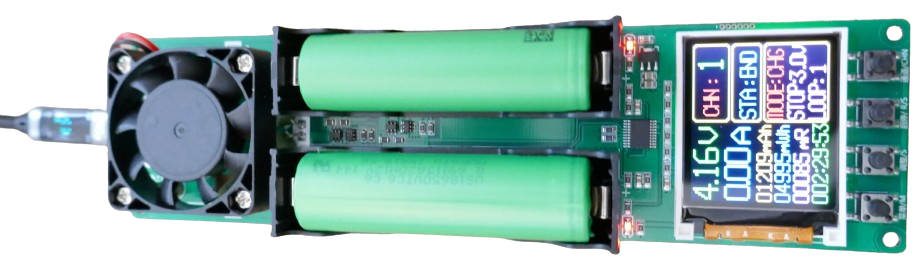
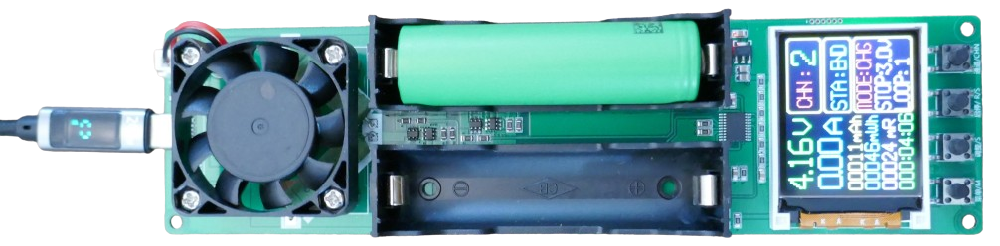
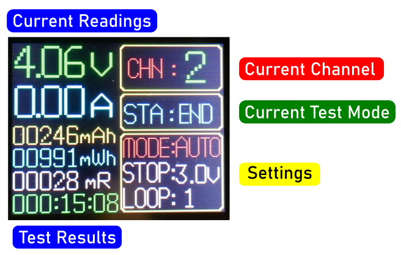

# Two Battery-Tester

> Semi-Professional Battery Tester Simultaneously Testing Up To 2 Batteries

This battery tester is an enhanced version of the [single battery tester](https://done.land/components/power/powersupplies/battery/batterytesters/all-in-onetesters/single-batterytester) reviewed earlier. Unlike the previous model, this tester no longer requires one battery bay for its internal power. Instead, it now runs exclusively on an external *USB* or *5V* power supply.

## Overview

While this tester is optimized for *18650 cells*, it is compatible with many other battery types. On its back, the mounted battery bays expose their solder pins, allowing you to solder cables and connect additional battery holders. Just ensure that the batteries being tested do not exceed the maximum voltage of **5V**.

> [!NOTE]
> If you plan to test different battery types, consider the upgraded [4-battery tester](https://done.land/components/power/powersupplies/battery/batterytesters/all-in-onetesters/four-baybatterytester). This model offers four channels (instead of two) and includes *screw terminals*, making it easy to connect a wide variety of batteries and holders without soldering.

The *USB-C **test** connector* found on the single-battery predecessor has been removed. Previously used to test *USB-C battery banks*, this feature was likely excluded because modern battery banks can easily exceed the *5V limit*, posing a potential risk.

| Feature  | Description  |
|---|---|
| Channels | 2   |
| Battery Under Test  | **5V max:** - *18650* battery bay - solder pins (back side) |
| Power Supply | *USB-C*  |
| Discharge Test  | *4 Ohms 10W* load resistor: - Max discharge current *1A* - Units: total *mAh* **or** total *mWh* - Stop-voltage configurable (*2.5–3.5V*) - Fan (runs continuously, no temperature control) |
| Charging | - *LiIon* and *LiPo* only - Max charging current *1A* |
| Auto-Test | Yes, charge-discharge-charge cycle with total discharge energy reported |
| Off-Button | no, disconnect *USB-C* to power off |
| Language | *English* and *Chinese*, configurable |
| Firmware | - Version 5.6 - User cannot upgrade firmware |
| LED  | one *red* LED per battery bay: - *off:* no test - *blinking:* test running - *on:* test completed |
| Display | - Color-TFT - Backlight |

### Power Supply

Unlike its single-battery predecessor, this device no longer uses an internal battery for power and now always requires *external USB power*.

### Fan

This tester includes a fan mounted on top of the two load resistors (4 Ohms each). The fan not only covers the load resistors, protecting against accidental burns, but also keeps the resistors at a moderate temperature.

The fan automatically activates whenever any test is running, regardless of the test type. Unfortunately, this means the fan frequently runs when it isn’t needed: during a *charging test*, the load resistors do not heat up, so the fan’s cooling action is unnecessary.

> [!TIP]
> The fan is connected via a *JST XH* connector, allowing you to easily add a switch or smart temperature control if the fan noise becomes irritating. That said, the fan produces minimal noise.

## Buttons and Operation

The unit is operated via four push buttons. Each battery bay has its own *red LED* to indicate status:

- **Off:** Battery untested
- **Blinking:** Battery under test
- **On:** Battery test completed

* **Menu Select:** *(labeled **M** on the PCB)* Short-press to select a menu item. Long-press to start the currently selected test on *both channels* simultaneously. Unfortunately, there is no option to **stop** all tests with a single button press.
* **Change Settings:** *(labeled **S** on the PCB)* Short-press to *increment* the selected menu item. There’s no *decrement* option, so continue pressing to cycle back to the beginning.
* **Start/Stop Test:** *(labeled **R/S** on the PCB)* Short-press to *start*, *pause*, or *resume* the selected test. Long-press to *stop and reset* or *reset and start* (clearing the results to zero).
* **Select Channel:** *(labeled **CHN** on the PCB)* Short-press to switch between channels (1-4). The display shows the selected channel in the upper right corner. All four channels operate independently and simultaneously, regardless of which channel details are shown on the display.

### Changing Language

The unit supports *English* and *Chinese*. To switch between languages, begin with the unit powered off. Then, press and hold the specified buttons while connecting to power:

* **English:** Hold down the 1st and 3rd push buttons, then connect the device to power.  
* **Chinese:** Hold down the 1st and 2nd push buttons, then connect the device to power.

## Test Modes and Settings

The unit offers three test modes, each with specific battery compatibility: **AUTO** (for LiIon/LiPo), **DSG** (for all battery types), and **CHG** (for LiIon/LiPo). These modes can be set individually per channel:

* **Automatic Testing** (*LiIon/LiPo only*): In **AUTO** mode, the unit sequentially *charges*, then *discharges* while logging the current drawn, and then *charges* the battery again for a full capacity assessment. The battery is left fully charged at the end.

   To select AUTO mode, press the `M` button until the **Mode** menu is highlighted, then press `S` until **AUTO** appears.
   
* **Discharge Test** (*all battery types*): In **DSG** mode, the unit starts *discharging* and logs the discharged energy. The battery is left discharged, making this mode suitable for non-LiIon/LiPo batteries like *LiFePO4* or *NiMH* that cannot be safely charged with this device.

   To select DSG mode, press the `M` button until the **Mode** menu is highlighted, then press `S` until **DSG** appears.
   
* **Charge Test** (*LiIon/LiPo only*): In **CHG** mode, the unit functions as a charger specifically for *LiIon/LiPo* batteries, logging the charged energy.

   To select CHG mode, press the `M` button until the **Mode** menu is highlighted, then press `S` until **CHG** appears.

Additional test settings can be adjusted for further customization:

* **Loops:** In **AUTO** mode, set up to *10 consecutive loops* for repeated testing cycles, allowing greater measurement accuracy.

   To set loops, press the `M` button until the **Loop** menu is highlighted, then press `S` to select the number of loops (*1–10*).
* **Stop Voltage:** In **AUTO** and **DSG** modes, a customizable *stop voltage* can be set for discharge tests. This setting is ideal for protecting battery health across different chemistries (e.g., *LiFePO4*), as some batteries are more sensitive to deep discharge.

   To set stop voltage, press the `M` button until the **Stop** menu is highlighted, then press `S` to adjust the *stop voltage* (*2.5–3.5V* in 0.1V increments).

## Performing Battery Capacity Test

The unit allows you to reliably measure a battery's total capacity through either a *Charge Test* or a *Discharge Test*:

* **Charge Test:** Ideal if you’ve used the battery until it’s “empty” by your standards. Performing a *CHG* test logs the *charging energy transferred back* as the tester recharges the battery.

* **Discharge Test:** For higher precision, the *AUTO* test starts by *fully charging* the battery to a specified level, then *fully discharges* it to a safe stop voltage. The tester logs the *total energy drawn* from the battery. This method provides consistent results by starting from a known charge level but is slower, as it includes three phases—charging, discharging, and charging again—and may increase battery wear slightly.

The *Charge Test* in *CHG* mode is faster and reduces battery wear: since the battery would need recharging anyway, the tester functions as a smart charger, logging the energy input. However, the starting charge level isn’t precise and depends on the battery’s “empty” state, as defined by the user.

> [!TIP]
> For a more efficient manual setup, first run a *DSG* test to discharge the battery to a specific stop voltage, then perform a *CHG* cycle. This sequence avoids an extra charging cycle. However, the built-in *AUTO* mode follows the reverse order, which consumes an additional charge cycle.

### 1. Select Test Parameters

Before testing, set up the parameters as follows:

1. **Channel:** Short-press the *right* button (`CHN`) to select the channel you wish to use. The battery bays are labeled `CHN1` and `CHN2` on their top side. Ensure the correct channel is shown in the top right of the display. 
   
2. **Stop Voltage:** Set a safe stop voltage for your battery, typically **3.0V** for *LiIon/LiPo*.
   1. Power on the device by connecting it to a USB supply.
   2. Short-press the *left* button (`M`) until **STOP** is highlighted.
   3. Short-press the *second* button (`S`) to adjust the *stop voltage* as desired.

3. **Test Mode:** Choose *DSG*, *CHG*, or *AUTO* mode:
   1. Short-press the *left* button (`M`) until **MODE** is highlighted.
   2. Short-press the *second* button (`S`) to select the test mode.

4. **Loops:** Set the **LOOP** option. Use **1** for a single loop test.

Your settings are stored until manually changed.

### 2. Connect the Battery Under Test

Once parameters are set, connect the battery **to the selected channel**. Each battery bay is marked as `CHN1` through `CHN4`, with matching screw terminals on the back. Ensure that the battery voltage does not exceed **5V**, especially when testing power banks.

> [!IMPORTANT]
> When inserting a *18650 cell* into the battery bay, avoid reversing the polarity, which could damage the device. The positive terminal faces you when viewed from the button side of the device.

Choose one of these connection methods for the battery under test:

* **18650:** Insert an *18650* cell in the **right battery bay**, **or**    
* **Alternate Battery/Power Bank:** Use the screw terminals on the back, connecting an appropriate battery bay or connector.

### 3. Start the Test

To start testing, use one of these options:

* **Start/Continue current channel:** Short-press the third button (`R/S`).
* **Start/Reset current channel:** Long-press the third button (`R/S`).
* **Start/Reset BOTH channels:** Long-press the first button (`M`).

The display’s **STA** field shows the test status. The test stops automatically upon completion. Pressing the `R/S` button again will pause or abort the test.

#### USB-C Power Supply Requirements for Charging
When using *CHG* and *AUTO* modes, connect both *USB-C* ports to external USB power to ensure charging functionality. If only one port is powered, channels connected to the unpowered port will show **0A** charging current during tests.

> [!NOTE]
> Connecting just one *USB-C* port may seem sufficient for configuring and reporting test results, but charging current will remain at **0A** for channels connected to an unpowered USB-C port. For reliable operation, always connect *both USB-C ports* to external power.

## Test Results

Results display in the lower portion of the screen and update continually:

* **mAh:** Capacity in *mAh*.
* **mWh:** Energy capacity in *mWh*, accounting for battery *voltage* and *voltage drops* for an accurate energy measure.
* **mR:** Internal resistance in *milliOhms*. Lower values indicate better quality. For *18650* cells, values should generally be below *80mOhm*, while high-drain cells are typically well below *20mOhm*.
* **Time:** Elapsed time, displayed in hours, minutes, and seconds.

In *DSG* and *AUTO* modes, the **discharge capacity** is measured, while in *CHG* mode, the **charge capacity** is logged.

## Conclusion
This tester, improved from its predecessor, offers reliable testing for up to *two* batteries at once and is especially suitable for *18650* cells. For other battery types, consider the [4-battery version](https://done.land/components/power/powersupplies/battery/batterytesters/all-in-onetesters/four-baybatterytester/) with *screw terminals* for easy connection to alternate battery bays. Note that these testers are limited to **5V**, so they cannot test multi-string batteries like *12V* packs.

The design and firmware improvements address many of the limitations of the original [single battery tester](https://done.land/components/power/powersupplies/battery/batterytesters/all-in-onetesters/single-batterytester/):

* **Hardware:** The newer version no longer requires a battery bay for internal power. The load resistors are actively cooled by a fan, which also shields them from accidental contact.
* **Software:** Firmware version *5.6* introduces better button shortcuts and multi-channel capabilities compared to version *4.2* in the single-bay tester.

### Ideas for Improvement
This device performs well, but a few upgrades could enhance its usability:

* **Smarter Fan Control:** Adding temperature control for the fan, or at least a manual switch, would reduce noise by allowing the fan to turn off when *discharge* testing isn’t active.
* **Dedicated Power Switch:** Since the device cannot be turned off via the `M` button (now assigned to start tests), adding a dedicated power switch would eliminate the need to unplug the dual USB-C connections.
* **Stop All Tests Option:** While a long-press on `M` starts tests on all channels, there’s no corresponding shortcut to stop them all at once. Adding this option would complete the device's otherwise user-friendly design.

> Tags: Battery Tester, All-in-One, Capacity, Internal Resistance, 2-Channel

[Visit Page on Website](https://done.land/components/power/powersupplies/battery/batterytesters/all-in-onetesters/two-baybatterytester?474929111909245010) - created 2024-11-08 - last edited 2025-01-15
