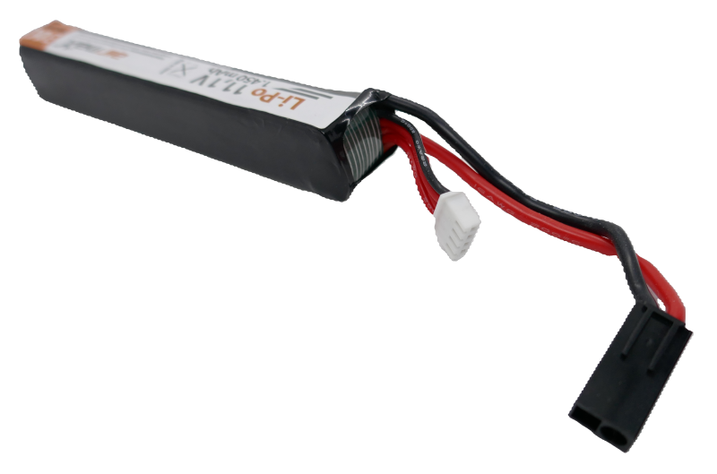
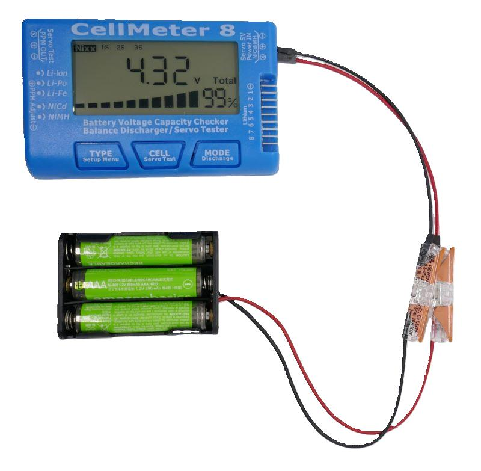
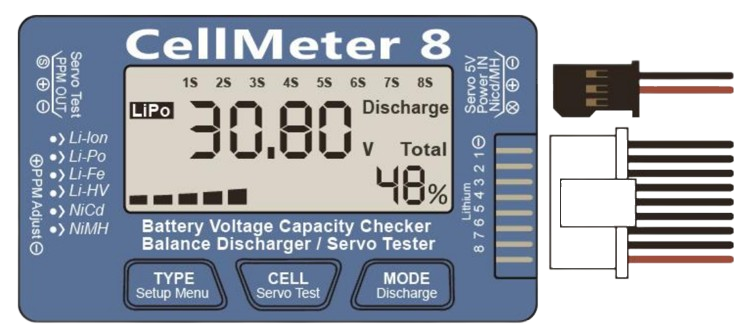
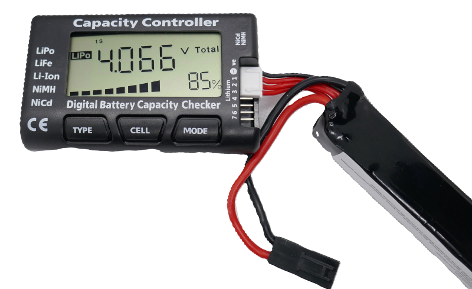
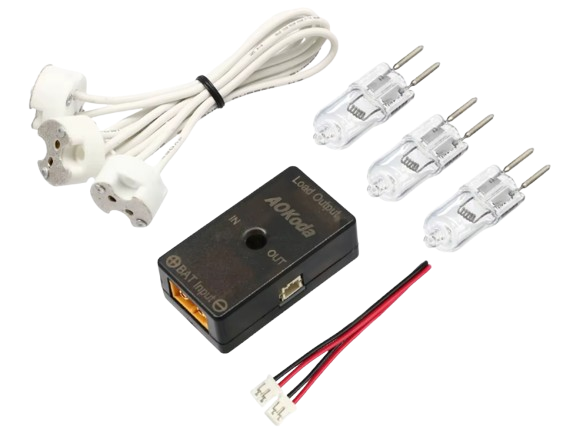

# Cellmeter

> Convenient Battery Voltage Analyzer And Balancer For RC Modeling Battery Packs

*Cellmeter* is a battery tester specifically designed for testing RC modeling battery packs that are used with drones, planes, boats and alike. Such batteries do not contain an integrated BMS (battery management system). Instead, they feature *balancer cables* which allow direct access to each battery cell.

* **Cellmeter 7:** black, sometimes labeled *Capacity Controller*, can test batteries with up to 7 cells
* **Cellmeter 8:** black or blue, can test batteries with up to 8 cells, incluudes a servo tester

## Overview
*Cellmeter* attaches to the balancing plug and measure the voltage of each battery cell individually, as well as report the total battery voltage. 

This provides a quick and reliable estimate of battery state of charge and health, and identifies battery cell imbalances. If imbalances exist, *Cellmeter* can also *balance* the battery cells by gradually discharging all cells until they all have the same state of charge again.

While it also supports *NiCd* and *NiMH* batteries via a second connection port, these require at least four cells and at most eight cells (4S-8S). Additionally, it cannot diagnose individual cells within these packs. Disposable batteries can be tested starting in packs of three cells.

> [!IMPORTANT]
> *Cellmeter* is not suited for testing single lithum cells or 1-3S nickel cells because the battery you test must deliver at least *4.5V* to provide *Cellmeter* with sufficient voltage to operate. If you connect a fully charged single cell, *Cellmeter* seems to work at first, however it reports voltages far off reality.

### Cellmeter 7 and Cellmeter 8
Currently, two versions of *Cellmeter* are available: *Cellmeter 7*, and its successor *Cellmeter 8*, the latter roughly costing twice as much. 

Both models do an equally good job in battery testing: *Cellmeter 7* supports *3S-7S* batteries, and *Cellmeter 8* supports *3S-8S* batteries.

> [!TIP]
> *Cellmeter 8* now has backlight and includes a servo tester. The servo tester port can also be used to control a high current discharge load. All of these additions are really rather esoteric, though, and you typically would use better and more dedicated equipment for servo or battery capacity testing. Accoring to documentation, *Cellmeter 8* is supposed to support an *external power supply* in order to also test *1S* (single cell) batteries, however this claim seems to be false. Neither version of *Cellmeter* can reliably measure batteries with a voltage below *4.5V*. 

### Battery Connectors

The device features two connection ports on the right side:

- **Nickel Batteries:** *NiCd* and *NiMH* batteries are connected to a male three-pin connector, of which only the top two pins are used. The topmost pin is *negative*, and the middle pin is *positive*. *JST* plugs are incompatible because they are too high and do not physically fit the opening, but you can use female *DuPont* wires for the connection.

- **Lithium Batteries:** These are connected to an *eight-pin* male port with *2.54mm* pin spacing. Both *JST EH* and *JST XH* plugs are supported.

## Testing Lithium Batteries

Connect the battery to the 8-pin lithium port. The topmost pin is *ground*. If the battery comes with a balancer cable, use it. For other battery types, connect them using a *JST EH* or *JST XH* plug, or use *DuPont wires*.

> [!IMPORTANT]
> Ensure the *ground* (negative) pole is connected to the topmost pin.

### Select Chemistry

The device displays the measured voltage and the estimated *state of charge* (SoC) as a percentage. Since SoC depends on the battery chemistry, make sure the correct chemistry is selected. This is displayed on the left side of the screen. Use the `TYPE` button to cycle through and select the appropriate chemistry.

### Mode Button

Press the `MODE` button to change the displayed result. You can choose from:
- *Total battery voltage*
- *Maximum and minimum cell voltages* (requires batteries with at least two cells)
- *Highest cell voltage only* (indicating which cell has the highest voltage)
- *Lowest cell voltage only* (indicating which cell has the lowest voltage)

Here is an example of a *3S LiPo battery*, measuring the voltage differences between the cells. In this pack, the minimum and maximum voltages differ by merely *0.008V*, so the battery is perfectly in balance:

### Cell Button

For multi-cell batteries, short-press `CELL` to switch from the total voltage display to the first single cell's voltage. Additional presses cycle through the remaining cells.

Here is an example of a defective *3S LiPo battery*: with a nominal voltage of *11.1V*, the tester finds only one healthy cell (1S) and a total voltage of just *4.07V*, indicating that the two other cells in this battery are dead:

This is the typical picture of a battery that was damaged due to long-term storage: over time, self-discharge discharged two of the three cells to such a low voltage that the internal battery chemistry was irreversibly damaged.

## Testing Nickel Batteries

Nickel batteries (such as *NiCd* and *NiMH*) are connected via the three-pin *nickel test port*. Only the upper two pins are used, with the middle pin connected to the positive pole.

Since *nickel batteries* are connected via *two wires* only, the tester can measure and display only the total voltage. Individual cell voltages cannot be measured. And since the tester does not know the number of Nickel cells your battery uses, you need to manually press `CELL` multiple times until the display shows the correct *xS* configuration that matches your battery. If you do not set the number of cells correctly, the displayed SoC (*State of Charge* in percent) is wrong.

The device draws its power directly from the batteries under test. Testing requires at least **four nickel cells**, as this ensures sufficient voltage even if the cells are nearly depleted.

You *can* test *3S nickel battery packs* when connecting a >5V lithium battery to the lithium test port at the same time. This does not work for *1-2S nickel batteries*, and it does not work vice versa, either: you cannot test *1S lithium cells* by connecting a >5V nickel battery at the same time (even though the manual claims this was possible).

## Balancing

Lithium batteries with multiple cells can be *balanced*, ensuring all cells have the same voltage, which restores the battery’s capacity.

To balance a lithium battery:
1. Connect it to the lithium test port as described earlier.  
2. Ensure the battery provides *balancing cables* where each cell's positive pole is exposed through a distinct wire.  

To start balancing:
- Long-press `MODE` for one second.  
Balancing discharges cells until they all reach the stop voltage (*3.7V* by default). If one or more cells are below this voltage, balancing fails. In such cases, charge the battery first or set a lower stop voltage.

When balancing is active, pressing `MODE` updates the stop voltage to match the lowest voltage of any connected cells.

> [!TIP]
> For effective balancing, it’s best to let the batteries discharge to a noticeably low voltage, typically 3.7V or less. This is because lithium batteries have a relatively flat discharge curve. If the stop voltage is set too high, such as at 4V, the measured voltage may not accurately reflect the true state of charge of the cell. In other words, during the middle portion of the discharge curve, the state of charge can change significantly without causing a noticeable change in the measurable voltage.

## Long Time Storage
*LiIon* and *LiPo* batteries shouldn't be put into long-time stoage at 100% SoC. The recommendation is to charge batteries to around *50%* for long-time storage.

You can use the *balancing* function described above to *discharge* your battery to a desired stop voltage. The discharge current is around *1A*.

## Servo Testing

*Servo testing* is a feature exclusive to *Cellmeter 8* and is not available in *Cellmeter 7*. On the left side of *Cellmeter 8*, there is a servo connector for direct servo connection.

To test a servo:
1. First, connect a *4-cell NiMH* battery to the *nickel test port* and verify its voltage on the display.  
2. Then, connect the servo to the servo test port on the left side.  

To enter servo test mode:
- Long-press `CELL`.  

Using the test wheel on the left side of the device, you can manually test the servo. By pressing `CELL` and `MODE`, you can switch to different testing modes or initiate automated testing, where the servo moves through its full range of motion.

## Optional Discharge Load
Some *Cellmeter 8* are sold as a combo with the *AOKoda external load*. It consists of a small black box, three halogen lamp bulbs totalling *150W*, and a cable. A smaller *5W version* also exists.

The cable fits into the servo test port. The lamps resemble the load and are plugged into the *Load Output* connector. The power for the load is supplied directly from the battery to the black box via the *XT* connector marked *BAT input*. 

The test device can now use its servo port to turn the external load on and off. By controlling the external load, the tester can rapidly discharge a battery to a given stop voltage.

> [!NOTE]
> The concept of this *external load* is more than a decade old. When this device surfaced 10+ years ago, halogen lamps might have been a clever way of implementing an external load. Today, much better solutions exist. Aside from the concept, this external load is incredibly expensive and not recommended.   

## Settings
In *Cellmeter 8*, long-pressing `TYPE` opens the settings where you can configure a few settings:

* **Discharge Stop Voltage:** the voltage at which the discharging stops (i.e. when balancing cells). The default is *3.7V*.
* **Servo Test Frequency:** Default is 50Hz. Range is 50-300Hz in increments of 50.
* **Servo Test Running Distance:** 500-2500us or 1000-2000us
* **Backlight Timeout:** 10-60sec. Default is 30sec after which the backlight turns off (and turns back on by pressing any button).
* **Beep:** beep can be turned on and off

> Tags: Battery Tester, Balancing, State of Charge, Battery Chemistry, Chemistry, Battery Voltage, RC Modelling

[Visit Page on Website](https://done.land/components/power/battery/batterytesters/celltesters/cellmeter?102228121809244816) - created 2024-12-08 - last edited 2024-12-08
