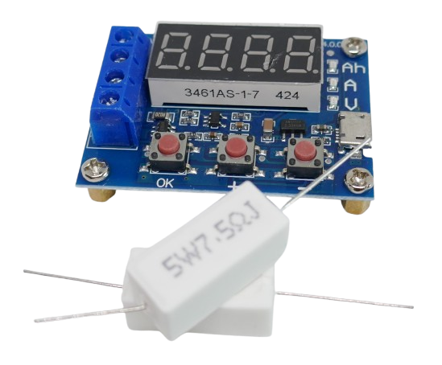
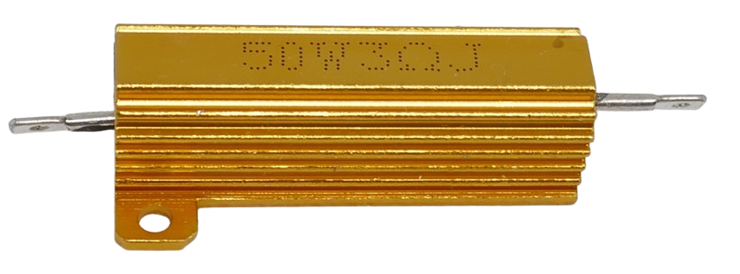
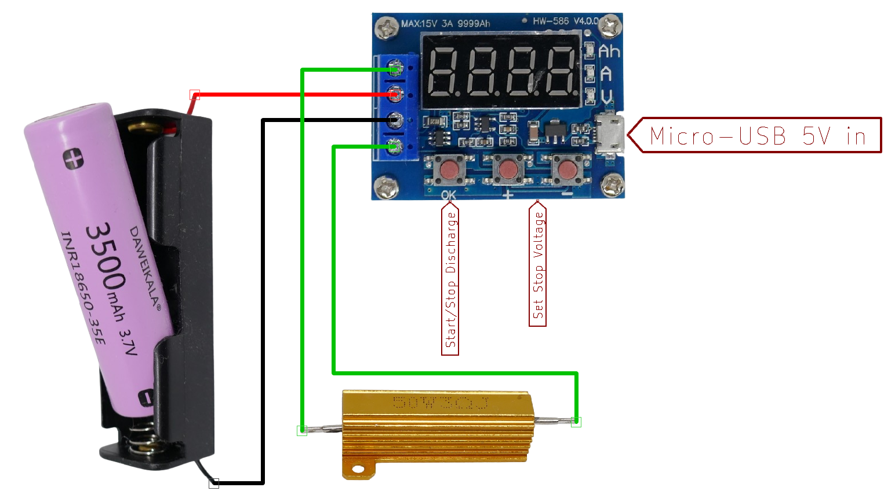

# HW-586 Battery Discharger Module

> Very Affordable and Flexible Battery Discharger Module

The `HW-586` is a breakout board designed to *discharge* batteries down to a user-defined stop voltage. It originally appeared under the name `ZB2L3`.

It supports single cells as well as battery packs with a total voltage of up to *15V*.



The board includes two *5W 7.5Ω* load resistors, which can be used in parallel or in series. You can also replace them with a different load resistor if desired—just ensure the discharge current always remains below *3A*.



## Overview

The *HW-586* is a microcontroller-based battery discharge tester, allowing batteries to be discharged to a defined stop voltage.

It measures and records the discharged energy (in *mAh*) for capacities up to *9.999 Ah* (*9,999,000 mAh*).

| Item | Description |
| --- | --- |
| Power Supply | 4.5–6V, <70mA<br/>Typically supplied via a *Micro USB* connector |
| Test Battery Voltage | 1.0V – 15.0V |
| Test Discharge Current | Max. 3A, 0.001A resolution |
| Test Battery Capacity | Max. 9999Ah (9,999,000mAh) |
| Board Size | 50 × 37 mm |

### Versions and Evolutions

Originally introduced as `ZB2L3`, the board used an *STM8S003F3P6* microcontroller (hidden beneath the seven-segment display) and a *TM1650* LED controller.

Since 2019, the board is sold as `HW-586`. Though the appearance remains the same, it has undergone several silent revisions.

To reduce costs, [both the microcontroller and LED controller were replaced](https://github.com/TG9541/stm8ef/issues/248) with cheaper, pin-compatible no-name clones (e.g., *Nuvoton* microcontrollers and *ET6226M* LED controllers).

The most significant change is the reduced memory in the cheaper *Nuvoton* MCU, which led to a trimmed-down firmware and the removal of the *calibration* features.

In the original version, pressing all three push buttons while powering on the module would activate a special calibration mode to fine-tune voltage and current measurements. This functionality is no longer available.

### Practical Consequences

[In-depth analysis](https://youtu.be/7SWExcGAnOQ?si=ZEkMyMa3liwBq4_D) of this module shows that it may or may not be reliable, depending on the variant.

While many users report accurate capacity measurements, others have seen errors up to *30%*. This variability likely stems from the numerous lookalike clones available on the market. Some versions use counterfeit op-amps, which can lead to large measurement errors.

Since the original calibration feature is no longer present, it’s essential to verify the accuracy of your module. Compare its results with a known-good battery tester to ensure it's suitable for your use case.

### Workaround

Even if your module isn't accurate enough for capacity measurement, it can still be extremely useful.

Use it simply as a *discharger*: set a stop voltage, and let the module discharge the battery. Confirm that it reliably stops at the desired voltage.

Then, use any standard battery charger with a capacity (*mAh*) display to measure the battery's actual capacity. Use the *HW-586* exclusively to discharge batteries to a defined voltage.


## Wiring

The board features four screw terminals, labeled on the back of the PCB:

| Screw Terminal | Description |
|----------------|-------------|
| R, R           | Connects the external load resistor |
| +IN            | **Positive** pole of the battery under test |
| IN-            | **Negative** pole of the battery under test |

Here’s a typical setup using a *18650 battery holder* and an external load resistor:



The board requires a separate power supply via its *Micro USB connector*.

## Choosing a Load Resistor

The discharge current is determined by both the load resistor(s) **and** the voltage of the battery under test.

The board includes two *5W 7.5Ω* load resistors. You can configure them in different ways to adjust the discharge current:

* **Highest current:**  
  Use both resistors **in parallel** (3.75Ω)
* **Medium current:**  
  Use **only one** resistor (7.5Ω)
* **Lowest current:**  
  Use both resistors **in series** (15Ω)

### Calculating Discharge Current

You can calculate the discharge current using *Ohm's Law*:


````
I = V / R
````

The actual current depends on the **voltage** of the battery:

| Resistance                     | 4.2 V         | 3.7 V         | 3.0 V         | 12 V          |
|-------------------------------|---------------|---------------|---------------|---------------|
| 3.75 Ω / 10W<br/>(parallel)   | 1.12 A / 4.70 W | 0.99 A / 3.66 W | 0.80 A / 2.40 W | **3.20 A / 38.40 W** |
| 7.5 Ω / 5W<br/>(single)       | 0.56 A / 2.35 W | 0.49 A / 1.81 W | 0.40 A / 1.20 W | 1.60 A / **19.20 W** |
| 15 Ω / 10W<br/>(series)       | 0.28 A / 1.18 W | 0.25 A / 0.91 W | 0.20 A / 0.60 W | 0.80 A / 9.60 W  |

### Replacing Load Resistors

As seen above, discharging a *12V battery* produces significantly higher currents than testing a single Li-ion cell. At higher voltages, the total wattage increases dramatically—often exceeding the board’s or resistor’s specifications.

For example, testing a *12V* battery with both resistors in parallel results in a *3.2 A* current (exceeding the board's *3A* limit) and *38.4 W* load (almost 4× the resistors’ combined rating).

The included resistors are best suited for single *Li-ion* cells. For higher-voltage batteries:

- Use resistors rated for at least **50 W**
- Ensure the discharge current does **not** exceed *3.0 A*

To achieve the maximum *3A* discharge current with a single Li-ion cell, use a **1.4 Ω** resistor rated for at least **15 W**.

## Errors

Before starting a discharge cycle, the firmware performs a few checks. If a check fails, it shows an error code and stops:

| Error | Description                          |
|-------|--------------------------------------|
| Err1  | Battery voltage > 15 V               |
| Err2  | Battery voltage is below stop-voltage |
| Err3  | Voltage drop too high                |
| Err4  | Discharge current exceeded *3.1 A*   |

If you encounter an error, here’s what to do:

| Error | Suggested Fix |
|-------|----------------|
| Err1  | Battery voltage is too high—this board supports up to *15 V* only |
| Err2  | Fully charge the battery or adjust the stop-voltage to a lower value |
| Err3  | Reduce contact resistance: use a better battery holder or reduce discharge current by increasing resistor value |
| Err4  | Use a higher resistance load, or test a battery with lower voltage to keep current below *3A* |

### The Dreaded *Err3*

*Err3* can be especially annoying. It was intended to protect batteries from excessive load but often triggers falsely. Here's why:

When any load is applied, a battery’s voltage naturally drops due to its internal resistance. If the drop is excessive, it’s usually a sign of too much load. The firmware monitors this during the first few seconds of discharge. If the voltage drop is deemed too high, *Err3* is shown.

However, in many cases, **it’s not the battery that’s at fault**—it's the **battery holder** or its wiring, which may have high contact resistance. For discharge purposes, this added resistance is often harmless—it just acts like an extra series resistor.

### Workarounds for *Err3*

If you’re seeing *Err3*, try the following:

* **Upgrade your battery holder:**  
  Use a holder with lower contact resistance. This reduces voltage sag and avoids false triggers.

* **Reduce discharge current:**  
  Use a higher resistance load. Lower current means lower voltage drop.

* **Delay increased load:**  
  Start with a higher resistance, such as *7.5 Ω*, to keep the initial current low. After ~10 seconds (once the firmware has completed its voltage-drop check), add a second resistor in parallel (e.g., *2 Ω*) to lower total resistance to *1.58 Ω*.  
  For a 4.2 V Li-ion cell, this means starting at ~500 mA and increasing to ~2.66 A after the initial check.


> Tags: Battery Tester, Discharge, HW-586, ZB2L3

