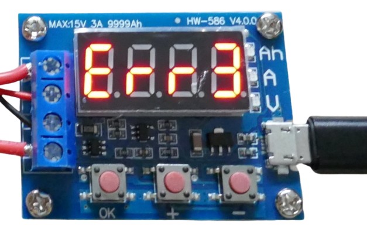
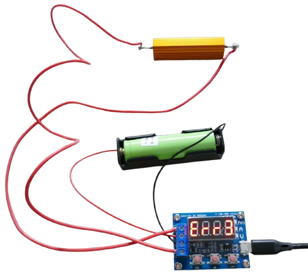
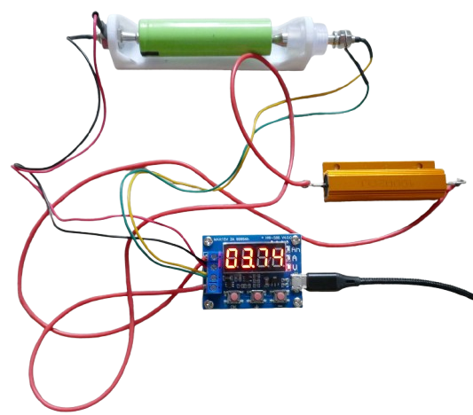
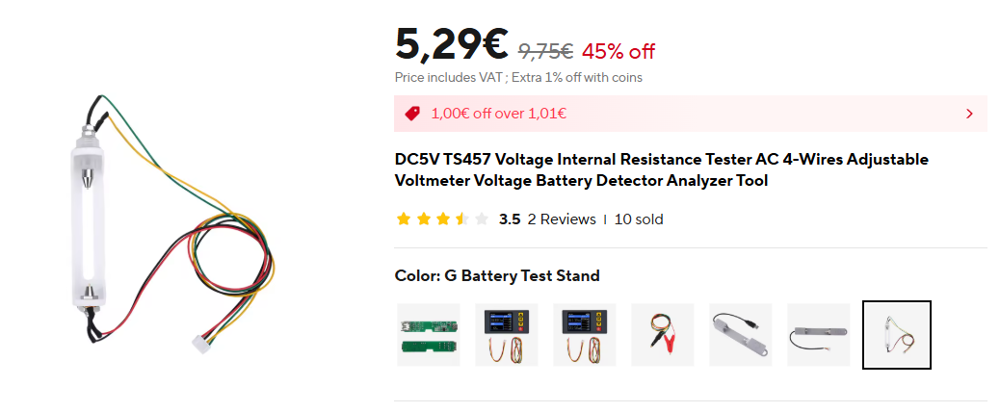
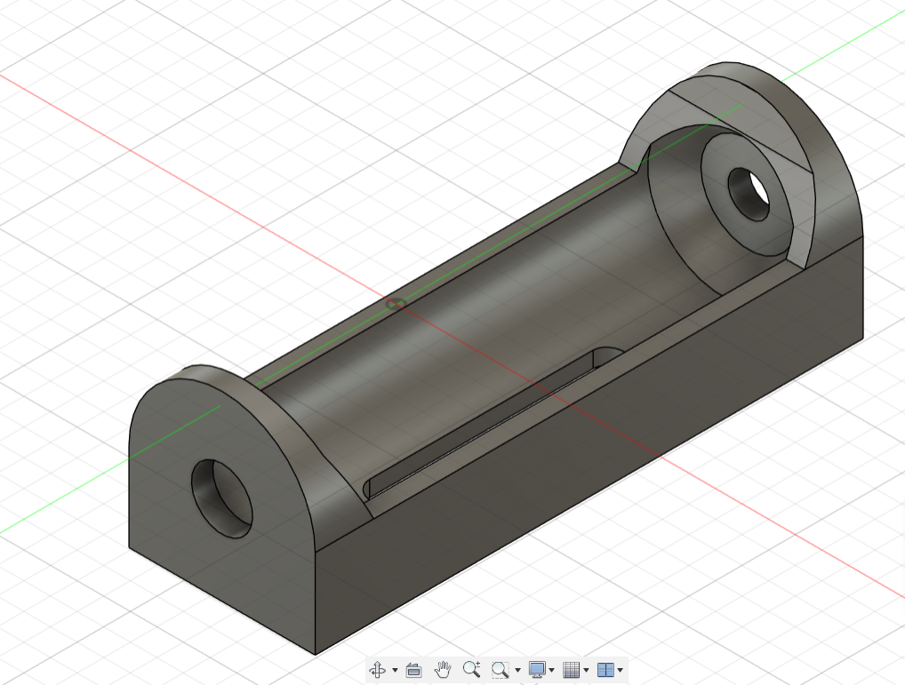

# HW-586 Battery Discharger Module

> Very Affordable and Flexible Battery Discharger Module

The `HW-586` is a breakout board designed to *discharge* batteries down to a user-defined stop voltage. It originally appeared under the name `ZB2L3` and supports single cells as well as battery packs with a total voltage of up to *15V*.


The board includes two *5W 7.5Ω* load resistors, which can be used in parallel or in series, or replaced by different load resistors if desired—just ensure the discharge current always remains below *3A*.


## Overview

The *HW-586* is a microcontroller-based battery discharge tester, allowing batteries to be discharged to a defined stop voltage. It measures and records the discharged energy (in *mAh*) for capacities up to *9.999 Ah* (*9,999,000 mAh*).

| Item | Description |
| --- | --- |
| Power Supply | 4.5–6V, <70mA<br/>Typically supplied via a *Micro USB* connector |
| Test Battery Voltage | 1.0V – 15.0V |
| Test Discharge Current | Max. 3A, 0.001A resolution |
| Test Battery Capacity | Max. 9999Ah (9,999,000mAh) |
| Board Size | 50 × 37 mm |

### Versions and Evolutions

When originally introduced as `ZB2L3`, the board used an *STM8S003F3P6* microcontroller (hidden beneath the seven-segment display) and a *TM1650* LED controller.

Since 2019, the board is sold as `HW-586`, and even though the appearance remains the same, it has undergone several silent revisions since then: to reduce costs, [both the microcontroller and LED controller were replaced](https://github.com/TG9541/stm8ef/issues/248) with cheaper, pin-compatible no-name clones (e.g., *Nuvoton* microcontrollers and *ET6226M* LED controllers).

#### Custom Calibration Removed
The most significant change is the reduced memory in the cheaper *Nuvoton* MCU, which led to a trimmed-down firmware and the removal of the *calibration* features.

In the original version, pressing all three push buttons while powering on the module would activate a special calibration mode to fine-tune voltage and current measurements. This functionality is no longer available.

### Reliability

[In-depth analysis](https://youtu.be/7SWExcGAnOQ?si=ZEkMyMa3liwBq4_D) of this module shows that it may or may not be reliable, depending on the variant.

While many users report accurate capacity measurements, others have seen errors up to *30%*. This variability likely stems from the numerous lookalike clones available on the market. Some versions use counterfeit op-amps, which can lead to large measurement errors.

Since the original calibration feature is no longer present, it’s essential to verify the accuracy of your module. Compare its results with a known-good battery tester to ensure it's suitable for your use case.

#### Recommendations

If your copy of `HW-586` turns out to be accurate: good for you. You then have an extremely affordable battery tester.

Yet even if your module *isn't* accurate enough for capacity measurement, you can *still* use it to accurately test your batteries: use it as a simple *discharger* to complement your existing battery *charger*:

1. Before you charge your batteries, use `HW-586` to **discharge** them to a known stop voltage, i.e. *2.8V* or *3.0V*. If your `HW-586` isn't accurately summing up the discharge capacity, simply ignore it. All that matters is that `HW-586` reliably discharges your batteries to a known stop voltage.
2. Next, charge your batteries as you would usually do. Most half-way sophisticated chargers report the total *mAh* that were charged into the battery. Since - thanks to `HW-586` - all of your batteries now start charging at the same stop voltage, the charge that goes into your batteries is now a good estimate of battery capacity.

As an added benefit, this way of monitoring battery capacity and health is much faster and adds less strain on your batteries since you start with *already empty* cells and just discharge them a little bit more to bring them to the same voltage:

* **Slow Classic Testing:** In classic automated battery testing, your test device would first fully charge the battery, then fully discharge it, then again fully charge it. You would waste a full charge cycle
* **Fast Testing:** When testing the battery during charge, you are not wasting any charge cycle, and YOU save approximately 6-8 hours of time.

That said, the *fast testing* outlined here may over-estimate the battery capacity by a few percent: the total energy going *into* a battery during charging is slightly higher than the energy drawn out of the battery during discharge. However, *fast testing* is perfect for *routinely* monitoring battery health as part of your regular charging routine.


## Wiring

The board features four screw terminals, labeled on the back of the PCB:

| Screw Terminal | Description |
|----------------|-------------|
| R, R           | Connects the external load resistor |
| +IN            | **Positive** pole of the battery under test |
| IN-            | **Negative** pole of the battery under test |

Here’s a typical setup using a *18650 battery holder* and an external load resistor:


The board requires a separate power supply via its *Micro USB connector*.

## Choosing a Load Resistor

The discharge current is determined by both the load resistor(s) **and** the voltage of the battery under test.

The board includes two *5W 7.5Ω* load resistors. You can configure them in different ways to adjust the discharge current:

* **Highest current:**  
  Use both resistors **in parallel** (3.75Ω)
* **Medium current:**  
  Use **only one** resistor (7.5Ω)
* **Lowest current:**  
  Use both resistors **in series** (15Ω)

### Calculating Discharge Current

You can calculate the discharge current using *Ohm's Law*:


````
I = V / R
````

The actual current depends on the **voltage** of the battery:

| Resistance                     | 4.2 V         | 3.7 V         | 3.0 V         | 12 V          |
|-------------------------------|---------------|---------------|---------------|---------------|
| 3.75 Ω / 10W<br/>(parallel)   | 1.12 A / 4.70 W | 0.99 A / 3.66 W | 0.80 A / 2.40 W | **3.20 A / 38.40 W** |
| 7.5 Ω / 5W<br/>(single)       | 0.56 A / 2.35 W | 0.49 A / 1.81 W | 0.40 A / 1.20 W | 1.60 A / **19.20 W** |
| 15 Ω / 10W<br/>(series)       | 0.28 A / 1.18 W | 0.25 A / 0.91 W | 0.20 A / 0.60 W | 0.80 A / 9.60 W  |

### Replacing Load Resistors

As seen above, discharging a *12V battery* produces significantly higher currents than testing a single Li-ion cell. At higher voltages, the total wattage increases dramatically—often exceeding the board’s or resistor’s specifications.

For example, testing a *12V* battery with both resistors in parallel results in a *3.2 A* current (exceeding the board's *3A* limit) and *38.4 W* load (almost 4× the resistors’ combined rating).

The included resistors are best suited for single *Li-ion* cells. For higher-voltage batteries:

- Use resistors rated for at least **50 W**
- Ensure the discharge current does **not** exceed *3.0 A*

To achieve the maximum *3A* discharge current with a single Li-ion cell, use a **1.4 Ω** resistor rated for at least **15 W**.

## Errors

Before starting a discharge cycle, the firmware performs a few checks. If a check fails, it shows an error code and stops:

| Error | Description                          |
|-------|--------------------------------------|
| Err1  | Battery voltage > 15 V               |
| Err2  | Battery voltage is below stop-voltage |
| Err3  | Voltage drop too high                |
| Err4  | Discharge current exceeded *3.1 A*   |

If you encounter an error, here’s what to do:

| Error | Suggested Fix |
|-------|----------------|
| Err1  | Battery voltage is too high—this board supports up to *15 V* only |
| Err2  | Fully charge the battery or adjust the stop-voltage to a lower value |
| Err3  | Reduce contact resistance: use a better battery holder or reduce discharge current by increasing resistor value |
| Err4  | Use a higher resistance load, or test a battery with lower voltage to keep current below *3A* |


### The Dreaded *Err3*

*Err3* can be especially annoying. It was intended to protect batteries from excessive load but often triggers falsely. Here's why:




When any load is applied, a battery’s voltage naturally drops due to its internal resistance. If the drop is excessive, it’s usually a sign of too much load. The firmware monitors this during the first few seconds of discharge. If the voltage drop is deemed too high, *Err3* is shown.

However, in many cases, **it’s not the battery that’s at fault**—it's the **battery holder** or its wiring, which may have high contact resistance. For discharge purposes, this added resistance is often harmless—it just acts like an extra series resistor.

#### Battery Holder at Fault

Here is an example using a standard 18650 battery holder, and a *50W 2 Ω* load resistor. At *4.2V*, this should produce a discharge current of *2.1A*:



However, in reality it just produces an *Err3* error, and discharging is interrupted.

#### Using Better Battery Holder

When replacing just the battery holder with a higher-quality 4-wire test bay, *Err3* goes away, and the same battery discharges just fine.



Note that it is absolutely not necessary to use a 4-wire battery holder. What matters is the low surface resistance between the battery contacts and the holder springs. The battery holder that worked best for me can be found at *AliExpress* when searching for `TS457`. That's a simple internal resistance battery tester which offers high quality 4-wire battery bays as separate extras (around € 4.00-€6.00 per piece).

### Workarounds for *Err3*

If you’re experiencing *Err3*, try the following:

* **Upgrade your battery holder:**  
  Use a holder with lower contact resistance (like in the example above). This reduces voltage sag and avoids false triggers.

* **Reduce discharge current:**  
  Use a higher resistance load. Lower current means lower voltage drop and less false alarms.

* **Delay increased load:**  
  Start with a higher resistance, such as *7.5 Ω*, to keep the initial current low. After ~10 seconds (once the firmware has completed its voltage-drop check), add a second resistor in parallel (e.g., *2 Ω*) to lower total resistance to *1.58 Ω*.  
  For a 4.2 V Li-ion cell, this means starting at ~500 mA and increasing to ~2.66 A after the initial check.

## Performing Test Discharge

Insert a battery to test into your battery bay, and connect power to the test device by plugging in a Micro USB plug.

The display now shows the current battery voltage (`000` if no battery is present).

### Setting Stop Voltage
If you do not set a stop voltage, the tester picks a stop voltage automatically. The automatically picked stop voltage is typically **too low** though (i.e. *2.5V* for a LiIon cell), and may damage your battery.

To set your own stop voltage, press and hold `+` until the desired stop voltage is reached. You can set or change the stop voltage only when no discharge test is running. It is not possible to change the stop voltage once you started a test run.

### Starting Test
To start the discharge test, press `OK`. The display shows the stop voltage for a few seconds. Then the discharge test begins.

The display automatically switches between `Ah` (total discharged capacity), `A` (discharge current), and `V` (current battery voltage) in short intervals.

Press `OK` to freeze the display to one of these units. The tester continues to automatically switch between the units after 15 seconds.

### Ending Test
There is no way to prematurely stop (or pause) the test. If you must interrupt the test, pull the Micro USB power plug.

Once the battery has reached the stop voltage that you have defined, the display shows the total discharged capacity (*Ah*).

## Conclusion

I routinely test all of my batteries using a commercial battery tester, then attach a sticker to each battery with the measured capacity and the date of test. This provides a great way of evaluating battery health at any time, and also identifies fake batteries immediately so they can be returned in time.


### Charging Turned Into Battery Test
Thanks to `HW-586`, I can now turn each regular charging cycle into a full battery test: 

Before I charge an "empty" battery, I use `HW-586` to fully discharge the battery to a known level, i.e. *3.0V*. 

This way, when I then charge the battery using my regular charger, I can directly compare the total charge that the charger reports at the end of charging to the original battery capacity that I initially measured.

The great thing about this setup is that it comes at almost no extra cost or effort: since `HW-586` can discharge with up to *3A*, it takes almost no time to bring "empty" batteries to the common *3.0V stop voltage*. The subsequent charging process is the same charging process I would do anyway.

### Load Resistor

The batteries I am using are all good for at least *3A discharge* which is why I picked a *50W 2 Ohm* load resistor. 

It discharges "empty" batteries (around 3.4V) at *1.7A*: `3.4 V / 2 Ohm = 1.7 A`.

### Precision and Experience
The `HW-586` works very well for me. Even when I place a fully charged battery into the battery holder and discharge the battery all the way, `HW-586` reports roughly the same capacity that my commercial battery tester found initially, too.

`HW-586` reliably cuts off discharging at the defined stop voltage.

Let there be no misunderstanding: the kind of battery testing I perform aims at getting a good battery health estimate. It does not have to be accurate to the milli-Ampere. I can live with a 5% error. What's more important is repeatability.

### Challenges

`HW-586` is dirt cheap. The most recent batch I ordered was around €0.70 per piece (including load resistors).

However, you should invest in a high quality battery holder. I am using the battery test stand for the *TS457* internal resistance tester.




The contacts can be unscrewed from the test stand holder and then screwed in your own test stands. 

> [!TIP]
> The larger contact has an internal spring mechanism that can be pressed approximately 1cm in. This makes it very convenient to insert or remove batteries. In the center of each contact, there is an additional pogo-like pin. Overall, the surface resistance is very low. The contacts work well with discharge currents of up to *3A*. I did not test any higher currents.


[Here](materials/teststand_18650.stl) is a 3D-printable test stand that works with most LiIon round cells:




> Tags: Battery Tester, Discharge, HW-586, ZB2L3

[Visit Page on Website](https://done.land/components/power/powersupplies/battery/batterytesters/dischargetesters/hw-586?386537041324252208) - created 2025-04-23 - last edited 2025-04-23
