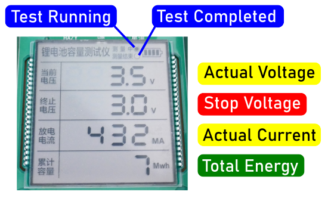

# XH-M239 Single 18650 Discharge Tester
> Simple Discharge Tester For Testing One 18650 Battery Capacity

The *XH-M239* is a **discharge-only** battery capacity tester with two *18650* battery bays, although it can test only one *18650* cell at a time. The left battery bay is reserved for its optional internal power supply.

> [!IMPORTANT]
> Most other battery testers position the **positive pole** of the *18650* cells near the operating buttons. This tester is different: it expects *18650* cells to be inserted with their positive pole at the top. While the battery bays do mark the poles, these markings are faint and may be difficult to see.

## Overview

This *discharge-only* test device supports testing *a single 18650 cell* at a time. A *screw terminal* on the right side allows for alternate battery holders (or test wires) to accommodate different battery types and sizes, as long as the battery voltage does not exceed **5V**.

> [!NOTE]
> Due to limited documentation, the implied voltage limit for batteries under test is *5V*. However, the ability to set a stop voltage within a range of *1.0–30.0V* hints that the device might support batteries with higher voltages than its operating power. This suggests potential for testing a wider variety of batteries, though this has not been verified. If you're willing to experiment, proceed with caution and at your own risk (you may destroy the device).    

Both *18650 battery holders* are quite tight, making battery insertion or removal challenging at first. Over time, the holders wear slightly, making it easier to insert and remove cells.

| Feature              | Description                                                                                                  |
|----------------------|--------------------------------------------------------------------------------------------------------------|
| Channels             | 1                                                                                                            |
| Battery Under Test   | **5V max:** - *18650* battery bay - screw terminal (right side)                                      |
| Power Supply         | *USB-C*                                                                                                      |
| Discharge Test       | *8 Ohms 10W* load resistor: - Max discharge current *500mA* - Units: total *mAh* **or** total *mWh* - Stop-voltage configurable (*1.0–30V*) - no heat sink or fan |
| Charging             | no charging                                                                                                  |
| Auto-Test            | no auto test, manual operation only                                                                          |
| Off-Button           | yes                                                                                                          |
| Language             | *Chinese* only                                                                                               |
| Firmware             | version unknown                                                                                              |
| LED                  | no LEDs                                                                                                      |
| Display              | - monochrome LCD - no backlight                                                                          |

> [!NOTE]
> Although the *stop voltage* can be configured within *1.0-30.0V*, suggesting the potential to test batteries >5V, there is no documentation or PCB labeling to confirm this. Testing batteries >5V may damage the device, so I have not attempted it. If you have additional information, please leave a comment below.

## Language

The device operates in **Chinese** only, with no known option to switch to *English*. Once familiar with the device’s operation, the language limitation becomes manageable:

If you provide external power via the barrel jack connector on the left side, you may leave the *left* battery bay empty. The device supports a wide range of input voltage (*5-12V*).

For portable use, insert a *18650* cell into the *left* bay to make the device independent of external power supplies.

### Display

The device has a large *LCD display* without a *backlight*. In bright daylight, the display is very readable, but in dim environments, visibility is poor.

The display is in *Chinese* only.

### Discharge Load

This device uses a *10W 8 Ohm* load resistor, differing from most testers that use *4 Ohm*. Consequently, it has a moderate maximum discharge current of *500mA*, while most other testers discharge at *1A*. Testing large-capacity battery cells therefore can take many hours.

## Portable Use

The tester includes a dedicated *power switch* on the right side and a power supply battery indicator in the top right corner of its display, which is helpful for portable use. This feature prevents accidental drainage of the power supply battery, unlike the [single-cell all-in-one tester](https://done.land/components/power/powersupplies/battery/batterytesters/all-in-onetesters/single-batterytester), which lacks both a power switch and a battery indicator, potentially draining the power supply battery to *0V*.

### Power Supply

Either insert a *18650* cell into the *left* battery bay or connect an external *5-12V* power supply to the barrel jack connector on the left side.

## Buttons and Operation

To test a battery, insert it into the **right** battery holder or connect it via the *screw terminal*. Power the device using either an external source or a *18650* cell in the **left** bay, then switch it on with the *power switch* on the right side.

The display will show the voltage of the battery under test (placed in the **right** bay) and a battery indicator for the power-supply battery (placed in the **left** bay).

### Setting Stop Voltage

Before testing, set the *stop voltage* by pressing the **+** and **-** buttons. For *18650* cells, a stop voltage of **3.0V** is suitable.

For unknown reasons, the device allows for stop voltages in the range of *1.0-30.0V*.

### Setting Unit

The device can measure capacity in *mAh* or *mWh*. Use the left button to switch units as needed.

> [!TIP]
> To compare the actual capacity to vendor specifications, use *mAh*. For a measure of the true energy stored, use *mWh*, which accounts for voltage drops during discharge. While you cannot directly compare *mAh* and *mWh*, *mWh* is more accurate for total energy capacity.

### Starting/Stopping Test

To start or stop a discharge test, press the second button. The circles in the top of the display will indicate:

- **Test Active/No Test:** top circle is filled when testing is active, and unchecked when stopped.
- **Test Completed:** bottom circle is filled when a test completes automatically.

Test results will appear within a few seconds of starting.

## Conclusion

This tester is designed specifically for testing **fully charged** *Li-ion* cells in a **portable** manner. Its ease of use, dedicated power switch, and built-in battery indicator make it well-suited for portable use. 

The *screw terminals* also offer flexibility to connect different battery bays or test cables.

### No Charging Capabilities

This device is optimized for *portable use*, so it does not include *charging capabilities*, which limits its utility for testing:

* **Accuracy:** A tester with charging capabilities ensures that batteries are fully charged before testing. Without this, test results may be inaccurate.
* **Charging Tests:** **Charging** tests allow a tester to charge an almost empty battery while logging the charge input, ending the test with a fully charged battery. By contrast, this tester **discharges** a fully charged battery to empty, which can be less practical.

### Flaws

While functional, this device has some notable limitations:

* **Tight Battery Bays:** *18650* battery bays are overly tight, requiring force to insert or remove cells.
* **Chinese Only:** The device lacks English language support and documentation, though this becomes manageable once you understand its operation.
* **Ambiguous Settings:** The configurable stop voltage range (*1.0-30.0V*) seems incompatible with its intended use for batteries <5V.
* **No Backlight:** The large monochrome LCD display is excellent, but the lack of backlighting makes it difficult to read in low-light conditions.

> Tags: Battery Tester, All-in-One, Capacity, Internal Resistance, 2-Channel

[Visit Page on Website](https://done.land/components/power/powersupplies/battery/batterytesters/dischargetesters/xh-m239?665265111410241653) - created 2024-11-09 - last edited 2025-01-15
