# 134N3P Charger-Discharger

> Compact Charge/Discharge Solution for Single Li-Ion Cells and 5V USB Output

The **134N3P** is an excellent solution to build small power banks or add battery power to portable devices (like microcontroller projects): it supports *LiIon/LiPo* batteries and can both charge them as well as boost the battery voltage to a stable *5V USB output*.

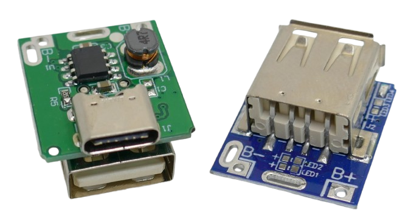

**134N3P** refers to *both* a power management chip *and* the breakout board that is using it. While there is no datasheet available for the *134N3P*, many clones use similar power management chips like the [HT4928S](https://blog.pagefault-limited.co.uk/wp-content/plugins/pdf-poster/pdfjs-new/web/viewer.html?file=https://blog.pagefault-limited.co.uk/wp-content/uploads/2019/04/HT4928S-HOTCHIP_EN.pdf&z=auto&raw=&nobaki=false&stdono=false&open=false&onlypdf=false&hrscroll=false&side=false&isHideRightToolbar=false#page=0). Often, chips with no markings at all are found.

> [!IMPORTANT]
> The power management chip on this board uses *CMOS* technology and is sensitive to *electrostatic discharge*.

## Overview

Technically, **134N3P** boards combine battery charging logic (similar to a *TP4056*), **and** a *boost* converter that steps up the battery voltage (*3.0-4.7V*) to *USB 5V Output*.

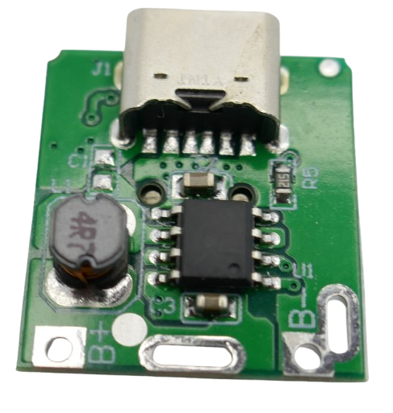

> Dedicated *chargers* (like *TP4056*) typically have no *coil* on the board (which is part of the *boost* converter that pure chargers lack).

These boards are tailored to be used in power banks. Unfortunately, this means they have a built-in *low load detection*: once the load drops below *60mA* for more than 8 seconds, the output is turned off.

### Use in Microcontroller Projects
If your microcontroller constantly draws more than *60mA*, you are fine. However, if you use a low-power microcontroller (such as *Arduino*), or send your microcontroller to *deep sleep*, you'll experience the effects of the *low load detection*, and power is cut off.

Users have worked around this by *brute force* adding additional load, i.e. resistors. This obviously increases power consumption considerably, creates unwanted heat, and shortens battery life. While this works, it is highly inefficient.

A more clever approach is to use a transistor (i.e. *PN2222*) via a GPIO that turns on a *50 Ohm* resistor load for *0.01 seconds* every 3-6 seconds. That's enough to keep the output active and will add less than *1mA* extra load. 

If these workaround are not for you, you may be better off using (a) separate charger and boost boards, or (b) use a *programmable* power management chip such as the [IP5306](https://done.land/components/power/powersupplies/battery/chargers/charge-discharge/ip5306/) or *IP5310*.

> [!NOTE]
> "Regular" *IP5306* charge/discharge boards like the [X-150](https://done.land/components/power/powersupplies/battery/chargers/charge-discharge/ip5306/x-150/) or [MH-CD42](https://done.land/components/power/powersupplies/battery/chargers/charge-discharge/ip5306/mh-cd42/) are **not programmable** because they do not expose the required *I2C* interface.

### Supported Batteries
You can connect any single *LiIon* or *LiPo* battery to the board. Other chemistries, especially *LiFePo4*, are **not supported** and **must not be used**.

* **Check Charging Current:** Since the board charges with a maximum of *1A*, the connected battery needs to support this charge current. *1A* may be too much for very small batteries (<1000mAh). Check the battery specs. 

* **Add More Batteries in Parallel:** To increase battery capacity, you can connect multiple cells **in parallel** (never in series!). This can also help with batteries that require less than *1A* charging current.

* **No BMS Required:** Since the board comes with BMS functionality like *over-charge* protection and *over-discharge* protection, a separate BMS is not required. Once you connect multiple batteries in parallel, though, you should add your own balanced BMS.

### USB 5V Output
The board provides an *output* of *5V* with a peak current of *1A* (only with fully charged batteries; *500mA* continuously is a safe assumption). That is suitable for supplying power to microcontroller projects.

Output power is available on both USB connectors, and there is *overload protection* and *short-circuit protection* built-in.

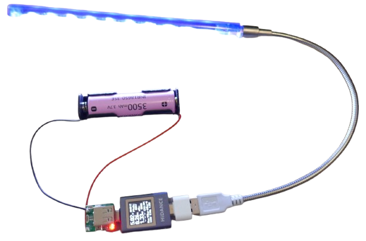

### Charging Current
The board charges a *LiIon/LiPo* cell with a maximum current of *1A*. 

It accepts USB power at its *USB-C/Micro-USB* connector. The *USB-A* connector is **output-only** and cannot be used for charging.

#### Portable Power Supply for DIY Projects
The maximum charging current of *1A* is perfect for many portable DIY solutions: 

* **Low-Capacity Batteries:** Since portable DIY projects aim to be small in size, and typically do not require excessive power, small LiIon or LiPo batteries are used, with limited capacity (*1.500 mAh* or less).

* **Preventing Over-Charging:** Even at *1C* charging rate, a charging current of *1A* is often already close to the upper range of what these batteries can accept. 

  Most comparable boards use much higher charging currents. They are unsuitable and sometimes even dangerous to use with small batteries (for example, boards based on [IP5306](https://done.land/components/power/powersupplies/battery/chargers/charge-discharge/ip5306/) with *>2A* charging current).

#### Power Bank
If you intend to use this board to build a generic power bank to charge your USB devices, this is perfectly fine: you can charge up to two devices (one on *USB-A*, and the other one on *USB-C/Micro-USB*).

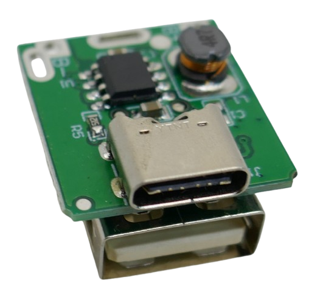

Just be aware that the *1A* output current allows for charging your devices at a maximum of *5W*. There are no sophisticated "quick charge" modes either (most dedicated smartphone chargers charge with 10-20W).

### Specifications

| Specification | Value |
| :-- | :-- |
| Input Voltage | 3.7 V – 5.5 V |
| Output Voltage | 5 V |
| Charging Current (max) | 1 A |
| Output Current (max) | 1 A |
| Charging Voltage (preset) | 4.2 V (±1%) |
| BAT Discharging Stop Voltage | 2.9 V |
| Discharging Efficiency | 85% (input 3.7 V, output 5 V/1 A) |
| BMS | - Output overvoltage protection - Short-circuit protection - Overload protection - Over-charging protection - Over-discharging protection |
| Anti Backflow Protection | yes | 
| Reverse Polarity Protection | no |
| Trickle-Mode | supported |
| Zero-Voltage Charging | supported |
| LED | red: on=load connected, blinking=charging, off=standby |
| Standby Current | 13-30 μA (max) |
| Switching Frequency | 1 MHz |
| Operating Temperature Range | -30°C to +85°C |
| Module Size | 23 mm × 17.5 mm × 12 mm |
| Weight | ~3 g |

The board comes with *anti backflow protection* at the charging input which might be useful when using solar panels as charging input (to be investigated).

> [!IMPORTANT]
> The board has no *reverse polarity* protection: always make sure you connect the battery in correct polarity, especially when using a battery holder.

### Board Differences

When you [google](https://www.google.com/search?q=134N3P) for `134N3P`, you quickly find a vast number of offers. Buying the board in quantities drops the price to €0.30 or even lower.

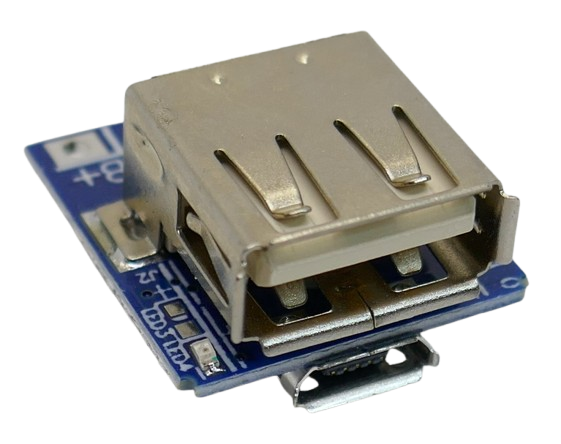

All offered boards are similar and differ only in two aspects:

* **USB-C vs. Micro-USB:** *blue* boards use an old *Micro-USB* connector whereas *green* boards use a modern *USB-C* connector. Both boards come with an additional *USB-A* connector.
  * **USB-A:** output only. 
  * **USB-C/Micro-USB:** input and output, can be used for charging

  
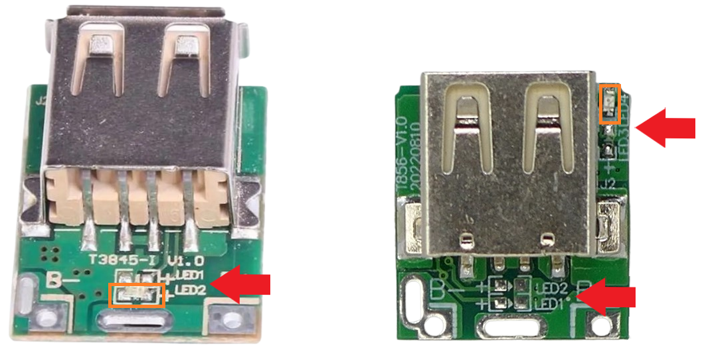

* **LED Solder Pads:** some boards come with *two* LED solder pads on *each side* whereas other boards expose all four LED solder pads on the *top side*.

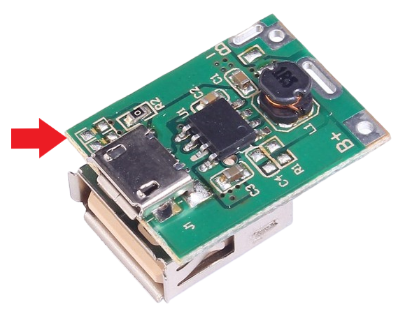

### LEDs

Regardless of board type and location of LED solder pads, typically only *one* red LED is mounted. The remaining LED solder pads are left empty.

The power management chip supports a maximum of *two* indicator LEDs:

* `LED2`, `LED4`: primary LED (LED is mounted to one solder pad, the other one can be used for external wiring)
* `LED1`, `LED3`: secondary LED for alternating blinking, no LEDs mounted

`LED1` and `LED3` are used only for *alternating blinking* in one of the blink modes. When the primary LED is constantly on (i.e. during *discharge*), `LED1` and `LED3` are constantly **off**.

That's useful for power efficiency: if you want to only indicate *charging* but not vwaste power on an indicator LED during *discharge*, remove the mounted LED, and instead add your own LED to `LED1` or `LED3`. 

#### Single-LED Mode

In *single LED mode* (default), the LED behaves like this:

* **Off:**    
  - no battery connected
  - board is in *standby*, waiting for load or charger to be connected
  - *2.95V* under-voltage shutdown (battery empty). Note that the battery voltage may recover a bit again after under-voltage protection has kicked in.
* **On:**    
  discharging (load connected)
* **Blinking:**    
  - charging
  - discharging with battery voltage below *3.2V* (near empty warning) 

#### Power-Saving Configuration
When you remove the built-in LED, and instead solder your own LED to `LED1` or `LED3`, the LED works like this:

* **Off:**    
  - no battery connected
  - board is in *standby*, waiting for load or charger to be connected
  - *2.95V* under-voltage shutdown (battery empty). Note that the battery voltage may recover a bit again after under-voltage protection has kicked in.
  - discharging with battery voltage above *3.2V*
* **Blinking:**    
  - charging
  - discharging with battery voltage below *3.2V* (near empty warning) 

This is a perfect configuration for power efficiency: the LED indicates charging and also warns the user when the battery is close to depletion. Else, it is off.

#### Two-LED Mode
If you connect *two* LEDs, one to `LED2` or `LED4` (primary), and another one to `LED1` or `LED3` (secondary), this changes behavior to this:

* **Off:**    
  - no battery connected
  - board is in *standby*, waiting for load or charger to be connected
  - *2.95V* under-voltage shutdown (battery empty). Note that the battery voltage may recover a bit again after under-voltage protection has kicked in.
* **Primary LED On, Secondary LED Off:**    
  discharging (load connected)
* **Alternating Blinking Between Both LEDs:**    
  - charging
  - discharging with battery voltage below *3.2V* (near empty warning)

## Use Cases
By adding a single *LiIon/LiPo* battery to this board, you essentially create a simple power bank.

#### Power Bank
Turn any single *LiIon/LiPo* cell into a (very) simple power bank that can be used to charge USB devices. 

Since the board outputs a maximum of *5V 1A*, such a power bank can charge USB devices at a maximum of *5W* (which is much less than "real" power banks or USB chargers can do). Charging USB devices will therefore be relatively slow.

If you need more battery capacity, connect multiple batteries **in parallel** (**not** in series). This will improve the energy your power bank can store, but it will not affect the speed in which it can charge USB devices.

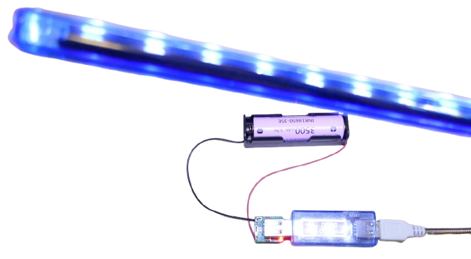

#### Powering Microcontrollers
A much more rewarding use case for the *134N3P* is acting as power supply for portable microcontroller projects. 

* For this, you could de-solder the clumsy *output-only USB-A* connector and just keep the *USB-C/Micro-USB* connector for charging.

* Wire the *5V* output from the de-soldered *USB-A* connector directly to the *5V* input of your microcontroller board. 

## Wiring

Wiring is simple: just solder a battery holder to the `B+` and `B-` solder pads. 

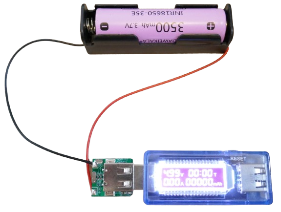

* **Power Switch:** You may want to add a switch to the battery holder wiring so you can turn off the battery. Else, the *134n3p* board draws a constant *8uA* quiescent current.
* **Missing Reverse Polarity Protection:**    
  * If the battery in your device is non-servicable, you just need to be careful *once* when you assemble your device.
  * If your device allows users to change/replace the battery, add a *ideal diode board* to protect the user from reverse polarity which can destroy the board in a split second.
* **BMS:** 134N3P comes with over-discharge, over-charge and short circuit protection. No additional BMS board required.

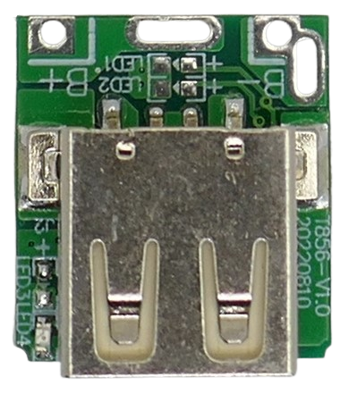

### Operation

Once you connect the board to a battery, it immediately switches to *standby* mode. In this mode, power consumption is minimal (8 μA). The built-in red LED is off.

With a USB tester you can already detect *5V*. However, the output is instable, and your USB tester will reboot in intervals of a few seconds.

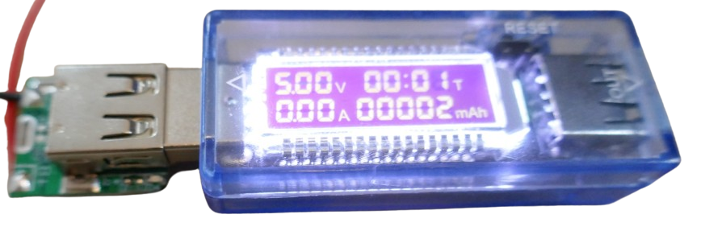

In Standby mode, *134N3P* just **monitors** the outputs. The boost converter is not fully running.

#### Connecting Load

Once you connect a load to either one of the boards USB connectors, the *134N3P* detects it and switches to full operation: a red LED lights up, and it provides a stable power source now.

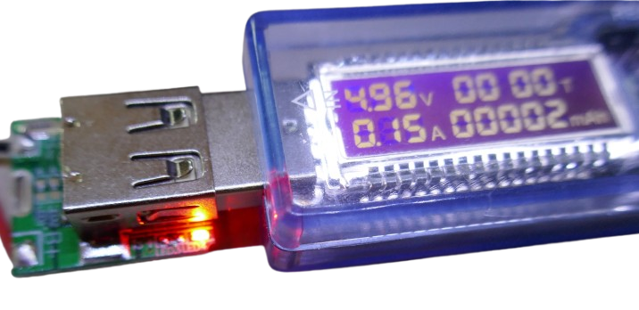

Output power is available on both USB connectors. 

Note the current direction in the USB tester display: energy is flowing from the USB-C connector to the load.

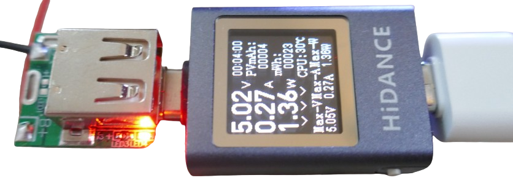

#### Over-Discharge Protection

Once the battery voltage drops below *2.9-3.0V*, the board automatically disconnects the load to protect the battery from over-discharge. The red LED turns off.

When you measure battery voltage with a multimeter, you may find that it shows a battery voltage of *3.1-3.2V*, especially when measuring after some delay. This is normal: once the load is disconnected, battery voltage can rise again.

Once the battery voltage rises to *>3.2V*, the under-voltage protection is cleared.

### Charging

To charge the battery, connect a USB power source to the *USB-C/Micro-USB* connector. 

Note the current direction in the USB tester display: now energy is flowing **from external USB** to the board.

The red LED is **blinking** during charging.

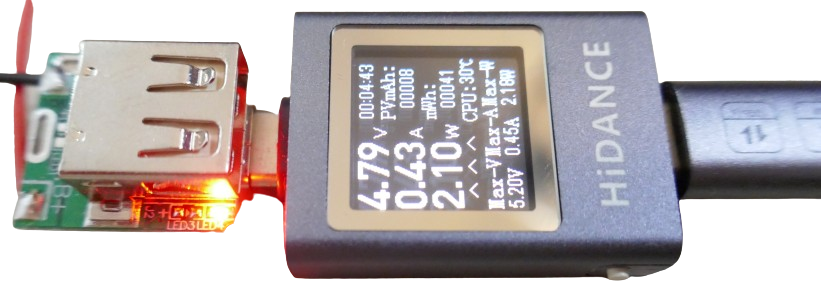

> [!NOTE]
> When you connect a USB power source to the board, it may take a few seconds until the charging process starts. The built-in red LED is a valuable indicator: it starts blinking after a few seconds, indicating that charging has begun.

#### Charging Current
The board supports a **maximum** charge current of *1A*. However, this current is adapted to the battery voltage. 

Under normal conditions, you'll see a charging current of around *0.95A* (with fully depleted batteries) that is slowly dropping as the battery is approaching full charge.

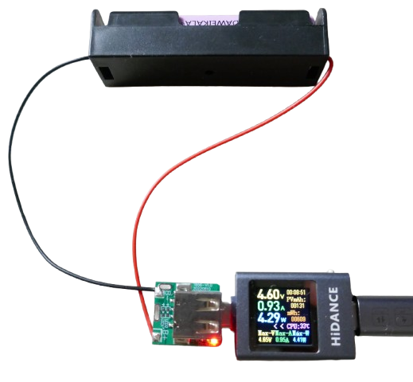

#### Trickle-Charging

This board supports trickle-charging and zero-voltage charging, which means you can use it to try and *recover* dead cells.

* **Deep-Discharged Batteries:** Many chargers start charging only when the battery cell has a minimum voltage of around *2.5V*. If a battery cell has accidentally been deep-discharged (i.e. due to natural self-discharging over some time), its voltage may no longer be above *2.5V*, or even *0V*.

* **Normal Charging Impossible:** Charging such a cell with normal currents is dangerous because at such low voltages, batteries cannot accept high currents. That's why some chargers refuse to charge at all at these voltages.

* **Trickle-Charge at 0V Battery Voltage:** *134N3P* automatically switches to *trickle charging* under such conditions: a very low charging current is applied in intervals until the battery voltage has recovered.

So if you have dead *LiIon/LiPo* cells that your normal charger wouldn't charge, you may try to charge them with *134N3P* boards. Chances are that they may recover.

## Discharging While Charging

You can discharge (power a device) while charging. The board supports *side charging:** when an external charger is connected, it charges both the battery and a connected USB device.

Once external power is removed, the boost circuitry is started. This switch can lead to a short power interruption.

* **Simultaneous Charging and Discharging:** you can keep a charger connected to *USB-C/Micro-USB* while drawing power from the *USB-A* port.
* **No Interruption When Adding Charger:** Connecting a charger to *USB-C/Micro-USB* does not interrupt the output power supply on *USB-A*.

* **Interruption When Removing Charger:** However, when you stop charging (i.e. **remove** the *USB-C* charging cable), there will be a short interruption, and your connected *USB-A* device will lose power for a short moment.

## Materials

There is no dedicated data sheet for a *134N3P* controller chip. Many boards use the [HT4928S](materials/ht4928s_datasheet.pdf) or a similar chip with identical features:

* [HT4928S Power Management Chip](materials/ht4928s_datasheet.pdf)   
  (*source: [pagefault-limited.co.uk](https://blog.pagefault-limited.co.uk/hotchip-ht4928s-ver1-1-english-pdf)*)

> Tags: Charger, Discharger, Li-Ion, Li-Po, Boost Converter, 1A, USB, 1S, Microcontroller, HT4928S, Power Source, Portable

[Visit Page on Website](https://done.land/components/power/powersupplies/battery/chargers/charge-discharge/134n3p?739577062007250254) - created 2025-06-06 - last edited 2025-06-06
