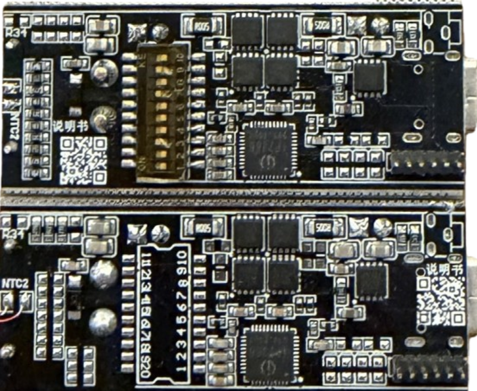
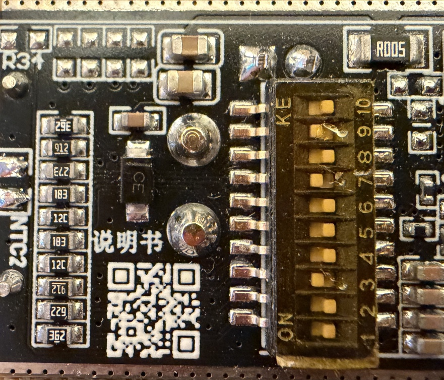
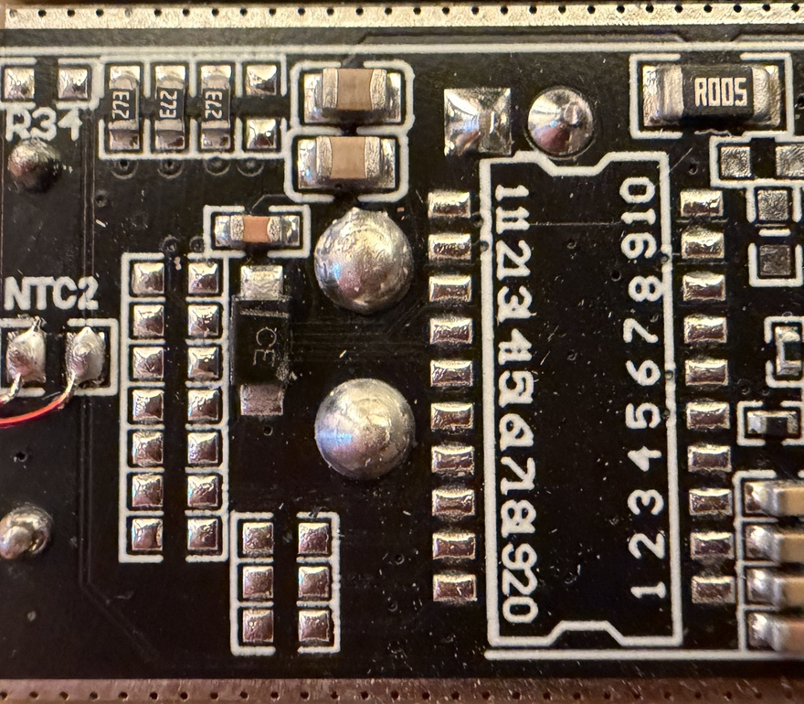
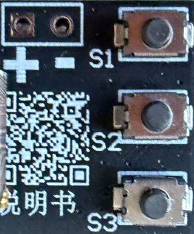
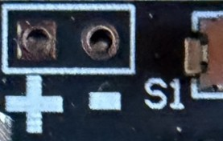

# IP2366 Display Board

> Versatile IP2366 Board With Optional Display and I²C

This compact board comes in two flavors: 

* As a simple base board with an IP2366, XT30 jack, NTC temperature probe, and 10-switch configuration panel. 
* Or with an enhanced base board (I²C-capable), plus a pluggable Arm Cortex microcontroller daughter board with TFT display, three push buttons and NTC-controlled fan connector.

## Overview

This board is currently sold in two variants and two screen sizes:

* Base board only, configurable via DIP switch, with four white status LED   
* Base board with display daughter board, configurable on-screen via I²C
  * 0.96-inch, 80×160 ST7735 TFT
  * 1.47-inch, 170x320 ST7789 TFT

### Without Display

Base board with a **non-I²C IP2366** and DIP switch for configuration plus unpopulated `R17`-`R20` (next to the NTC sensor) for fine-tuning. 

Four white LEDs for status indication and state-of-charge. Enable-push button can be soldered but is not populated.

Battery can be connected via **female XT30** plug (board comes with **male** XT30 connector).

### With Display
Base board with a **I²C-enabled IP2366** and 6-pin header in order to piggy-back the display board.

The daughter board uses an Arm Cortex microcontroller (Puya PY32F030K28) to control the base board via I²C, three push buttons marked `S1` - `S3`, and a second NTC temperature probe as part of a 2-wire 5 V fan control.

The fan can be connected to the two contacts marked `+ -` on the fron side next to the push buttons.

### Hardware Revisions (Differences)

There are multiple base board versions available. The board version is printed on the front side.

Version 1.00 and version 1.1 are almost identical, whereas version 1.3 marks a significant hardware revision. Its most prominent change is the unpopulated DIP switch:

* **JTYJ-2366-C-V1.00:**     
  Stand-alone board with an IP2366 **that has no I²C capabilities**. The 6-pin header used to plug in the display daughter board is unpopulated. Four white LEDs and two LED resistors are populated.

  DIP switch is present, resistors `R17`-`R20` are unpopulated, resistor bank for DIP switch is populated. 

* **JTYJ-2366-C-V1.1:**     
  Like version 1.00, but instead of the LEDs, a 6-pin header is populated that connects to the display daughter board. The **IP2366 on this board supports I²C**.

  
  

* **JTYJ-2366-C-V1.3:**     
  **No DIP switch**, resistors `R17`-`R20` are populated (`273`, 27 kΩ), resistor bank for DIP switch is not populated.

  

### Default Configuration
V1.00 can only run stand-alone as it uses a non-I²C IP2366. The DIP switches and on-board resistors are the only option to configure battery and maximum power.

V1.1 and V1.3 can run stand-alone, too. Without the daughter board, V1.1 can be configured identically to V1.0 via DIP switches. V1.3 has fixed defaults defined via the populated `R17` - `R19`, setting these defaults:

* 6S battery
* 140W maximum power
* LiIon chemistry

Both V1.1 and V1.3 are designed to operate with the display daughter board and its microcontroller, which overrides the default values via I²C as soon as it boots. That's why setting the configuration via resistors isn't really important here, and most probably the reason why the makers decided to remove the DIP switch for the display version starting in V1.3.

## Resistor Configurations

Resistors `R17`-`R20` configure the IP2366. The I²C-enabled display versions can override these settings. The resistor markings are located on the front side, the resistors themselves are mounted on the flipside.

| Resistor | Description |
| --- | --- |
| `R17`|  `BAT_NUM` - string count |
| `R18` | `VSET` - cell voltage |
| `R19` | `PSET` - maximum power |
| `R20` | `CC_BDO` - power direction |

### `BAT_NUM` (`BATSET`)

| Resistor value | Cell count | Remarks |
| --- | --- | --- |
| 3.6kΩ | 2S |
| 6.2kΩ | 3S |
| 9.1kΩ | 4S |
| 13kΩ | 5S |
| 18kΩ | 6S |
| 27kΩ | 6S | *(default for board V1.3)* |

### `VSET`

Sets the cell voltage which depends on the cell chemistry:

| Resistor value | Cell voltage | Remarks |
| --- | --- | --- |
| 3.6kΩ | 3.65V | *(LiFePO₄)* |
| 6.2kΩ | 4.1V |
| 9.1kΩ | 4.2V | *(standard Li-ion)* |
| 13kΩ | 4.35V |
| 18kΩ | 4.4V |
| 27kΩ | 4.2V plus diagnostic output | *(default for board V1.3)* |

> The 27 kΩ setting additionally enables diagnostic serial output on the VSET pin after configuration is detected.

### `PSET`

Sets the maximum power the board can deliver. This setting **applies to both charging and discharging**.

| Resistor value | Max power | Fan/Heat Sink required |
| --- | --- | --- |
| 3.6 kΩ | 30W | no |
| 6.2kΩ | 45W | no |
| 9.1kΩ | 60W | yes|
| 13kΩ | 65W | yes|
| 18kΩ |100W | yes|
| 27kΩ | 140W | yes; *(default for board V1.3)* |

**Warning:** Setting the power incorrectly can be dangerous:

* **Charging Current:**    
  The setting sets both **charging and discharging current**. If you set power to i.e. 140 W, then your battery will be charged with up to 140 W. A two-string LiIon battery would therefore receive a charging current of roughly up to **23.5 A**.    
* **Excessive Heat:**    
  Starting at roughly 45-60 W, the MOSFETs on the board can no longer passively dissipate the heat. At 45 W, they stabilize at around 50 degrees celsius. Make sure you add a fan and/or heat sink and monitor the temperature if you want to use higher power levels.

> [!TIP]
> With higher power levels, use higher-string batteries to keep the currents manageable. 

Here is a table with maximum currents when using 140 W:

#### LiFePO₄ Cells
Assumed low voltage cutoff at 2.5 V:

| String Count | Maximum Current (roughly) |
| -- | -- |
| 2S | 28 A |
| 3S | 18.7 A |
| 4S | 14 A |
| 5S | 11.2 A |
| 6S | 9.4 A |

#### LiIon/LiPo Cells
Assumed low voltage cutoff at 3.0 V:

| String Count | Maximum Current (roughly) |
| -- | -- |
| 2S | 23.4 A |
| 3S | 15.6 A |
| 4S | 11.7 A |
| 5S | 9.4 A |
| 6S | 7.8 A |

### `CC_BDO`

Affects how two USB PD devices negotiate power direction.

USB PD can both *sink* and *source* power:

* **Sink:**    
  Accepts power via USB-C and charges the battery    
* **Source:**   
  Provides power to connected devices on the USB-C port

IP2366 supports both (*dual mode*, `DRP`), so you can both power devices *and* charge the battery via the same USB-C connector. Issues can arise, though, when two `DRP` devices are connected, i.e. when you connect a powerbank or a notebook to this board.

Since now both devices - this board as well as the connected device - can deliver or accept charge, `CC_BDO` (`R20`) can resolve ambiguity. 

By default, the board wakes up in *sink* mode, and when you connect a `DRP` device, the board may request power to charge its battery. So when you connect a powerbank, it charges the battery of this board, and when you connect a notebook, the notebook battery will drain to charge the battery connected to this board.

Via `R20`, you can change its default to *source* mode. Now the board would try to deliver power. 

In reality, `CC_BDO` does not always resolve ambiguity and does not permanently restrict the IP2366 to charging or discharging. It just determines the initial USB-C role in low-power mode, not necessarily the role after the device wakes up and negotiates a connection. 

So if the notebook or powerbank default is also set to *sink*, power direction would still depend on USB PD negotiation, and you might even see power direction change back and forth. 

| Resistor value | Initial Role | Remarks |
| --- | --- | --- |
| `open` | Sink (`UFP`) | board *charges* the battery via USB-C by default |
| 1kΩ | Source (`DFP`) | board *provides power* to devices connected via USB-C by default |

## Base Board Configuration

Before use, adjust the ten DIP switches to your needs:

If you use the display board, you should still use the DIP switches to set your default values: carefully pull off the daughter board with the display to gain access to the base board DIP switches.

* **Battery:**    

  Switches 1 - 5 set the string count to 2 - 6, so the minimum string count is 2S.

* **Power:**  

  Set the maximum power using switches 6 - 8. Keep in mind that even with the lowest setting of 65 W, the board can already warm up significantly. To be able to use 140 W, you **must add a fan and heat sink**.    

* **Battery Chemistry:**    

  Take special care with switches 9 and 10: they set the battery chemistry and determine whether the charger charges to 3.7 V (LiFePo4) or 4.2 V (LiIon). **Apparently, there is an error in the original documentation:** all boards I tested used switch 9 for LiIon/LiPo and switch 10 for LiFePo4. The vendors' documentation claims it is the other way around. If in doubt, measure the battery connector's open-circuit voltage.

> [!IMPORTANT]
> Only **one switch per group** may be in the `ON` position, so make sure there are exactly **three switches in `ON` position**.

### Wiring

Here is the fundamental setup:

#### 1. Connect Charger Only

Initially, connect only a USB charger to the board. Do not yet connect the battery. Then check this:

* **Screen broken?**    
  Does the screen come up at all? Is it broken? The screen is fragile, and the units are often shipped with poor protection, so checking for damages should be done immediately after arrival to not miss return windows.

* **Charging Voltage Correct?**   
  Next, measure the voltage at the battery connector. While it may fluctuate a bit as the chip is trying to identify the battery, make sure the highest voltage **does not exceed the intended charging voltage**. 

  If it does, power off the unit, and revisit the configuration of the DIP switches. Make sure you configured string count and battery chemistry correctly. Make also sure you did not accidentally put more than one switch to `ON` per configuration group.

  Note that the description of switches 9 and 10 (battery chemistry) may be reversed in the original vendor documentation. Always check the output voltage **before you connect a battery**.   

#### 2. Disconnect Charger, and Connect Battery
Next, remove the USB charger, and connect the battery. This is important because in the default settings, charging current may be way too high for your battery.

With only the battery connected, the screen should come to live, and you can now review the settings and make any adjustments necessary (see below). One of the first things you may want to do is change the UI language from Chinese to English.

### Warning: High Battery Current

Depending on how you operate the board, there can be **high currents on the battery side** (which is why the board uses XT30 high-current connectors that can handle up to 30 A).

If, for example, you use a 2S battery and have enabled the full 140 W, then a load on the USB PD side could draw a maximum of 20 V 7 A (140 W). At a nominal 7.4 V on the 2S battery side, this would require roughly 21 A (including converter losses).

So in the settings (see below), make sure you use `In/Out Power` and `Batt Cur` together to control the available power:

* `In/Out Power`:   
  Configurable to 65/100/140 W. At 140 W, a 2S battery would be charged with almost **20 A**. Even at 65 W, charging would still be around **9 A**. This setting can be set via DIP switches on all boards.
*  `Batt Cur`:    
  Sets the maximum current the battery can provide. It is still unclear at this time whether this is a global setting or applies to charging or discharging only. This setting is available only on display boards. 

### Enable Button

The base board does not come with an installed `Enable` push button, so by default, the USB PD power output is **activated automatically** when a sufficiently large load is plugged in.

If you want to be able to **manually** enable the output via a push button - like many power banks do - there are already three through-holes on the PCB, next to the USB-C connector, that let you solder on a push button or wires.

The single through-hole towards the side with the USB-C connector is `GND`. You need the other two through-holes that are lined up: when you short these for a few milliseconds, the output is activated.

## Display Board Configuration

If you opted for a board with a TFT-display daughter board, you should first configure the base board exactly as described above. Carefully pull off the daughter board to gain access to the 10-switch DIP panel, and set your defaults.

After this, you continue with the software configuration. Unfortunately, that's not trivial since the firmware uses Chinese characters by default. Once you have completed the initial setup, though, the UI is in English.

### Navigation

Navigation for this board is done through the three push buttons:

| Button | Description |
| --- | --- |
| `S1` |  move up |
| `S2` | short press: select long press: confirm and exit
| `S3` | move down |

### Configuration

When you connect the display board to a USB charger, the display turns on. Unfortunately, the firmware initially runs with Chinese language settings.

1. **Unlocking IP2366:**    

    If you see a screen with Chinese characters that does not respond to button presses, then you need to connect a USB charger to the board, at least for a few seconds. By default, IP2366 is in locked mode. Connecting a charger unlocks it.

    

    Generally, this Chinese screen appears whenever the microcontroller cannot access the IP2366 I²C interface.

2. **Pre-Setup:**  

    Next, you see a setup page with only the most important settings, such as string count and battery voltages.

    

    This screen, too, is initially in Chinese, and there is no way to change the language at this point. Later, once you have changed the language, this screen will also be translated. I have included the English screens here for better orientation.

    

    `Setup Next` controls whether you want to see this setup screen the next time you power on the chip. If you plan to experiment, keep `Yes`. If you permanently attach the board to a particular battery that will not require changes later, choose `No`.

    Accept the values by long-pressing the middle button (`S2`).

3. **Operations Screen:**    

    This brings you to the regular operations screen, where you see a varying number of monitoring and operation-related properties.

    

    Pressing the upper button switches between screen layouts.

        
        
        
      
      

4. **Settings:**      

    Long-pressing the middle button (`S2`) opens the settings menu.   

    - **Gauging, Battery, Max Power, and State of Charge:**

        

      Battery state-of-charge can be based on voltage or on coloumb counting, controlled by `Batt Percent`. 
      
      Coloumb counting (set to `Gauge`) is much more accurate but requires that you set the accurate battery capacity in `Capacity`. It also requires a full discharge/charge cycle. So initially, in this setting the battery gauge is not working properly. 

      Use the setting `Voltage` instead of `Gauge` to derive the state of charge from the battery voltage. This works immediately, but it can provide only a rough estimate with a high margin of error.

      `In/Out Power` controls the maximum power available. Make sure this fits your battery (both charging and discharging current at battery voltage), and ensure a fan and heat sinks are in place before you select any rating above **65 W**.

    - **Maximum Battery Current:**   

        

      `Batt Cur` limits the battery current if necessary. This also reduces maximum available power. So in essence, both `In/Out Power` and `Batt Cur` together control the available power.

      

    - **Fan Control and Bidirectional Operation:**      

            

      `Fan Temp` sets the temperature at which the attached fan activates. This is controlled by the NTC Sensor attached to the daughter board. You need to connect a 5 V two-wire fan to the daughter board yourself; a fan is not included.

      Connect it to the through-holes marked `+ -` next to the push buttons:
      
       

      The second NTC sensor connected to the base board is controlled via `Batt NTC` and should remain `ON` and placed close to the battery to ensure charging stops on overheating.

      With `C Mode`, you control whether the IP2366 should work bidirectional (charge and discharge), or just one way.    

    - **Auto Sleep and Screen Rotation:**   

        

    
      `Auto Sleep` is important: by default, it is set to `OFF`, meaning the display will stay on forever, eventually draining a battery. You can set it to `Auto` or specify a time in the range of 5-120 seconds. This turns off the display and puts the MCU in sleep until you press any button.

      
      With `Rotation` you can rotate the screen in order to adjust it to the way you mount this board.

    - **UI Language:**   

        

      Finally, at the very end you find the setting `Language`. Press the middle button `S2` to enter the setting, press `S3` to select `English`, and press `S2` again to confirm. Long-press `S2` to save and exit the menu.

## Fan Control

The display version comes with built-in temperature-controlled fan support. You just need to supply a two-wire 5 V fan.

Connect the fan to the two solder pads marked `+ -`, and make sure you use the correct polarity.

In the settings (discussed above), you can set the temperature at which the fan should start spinning. The fan is controlled by the NTC temperature probe soldered to the daughter board. The other NTC probe is soldered to the base board and controls the IP2366.

### Attention: Heat!

IP2366 is so powerful that it potentially generates a lot of heat. Even with its lowest setting (65 W max), the board gets quite warm. If you decide to use the maximum 140 W, you *must install* a fan, and you should also add heat sinks to the base board.

Adding heat sinks is not trivial though because the back side of the board is populated as well. Probably the best place for a heat sink is the inductor on the back side, and with the display-less version, also the IP2366 on the front side.

## I²C Connector

Versions with a display feature a 6-pin connector on the base board:

  

Pin assignment from left to right:

| Pin | Description |
| --- | --- |
| 1 | `GND` |
| 2 | *(unknown)* |
| 3 | `INT`|
| 4 | `SDA` |
| 5 | `SCL`|
| 6 | `BAT+` |

The base board that comes without a display has no connector and instead four LEDs. The through-holes for the connector are nonetheless present.

### Testing I²C

If you want to test whether your display-less board may possibly have an I²C-enabled IP2366, you must remove the two tiny LED resistors (or better yet: lift them up just on one side so you can later solder them back in place).

> [!IMPORTANT]
> Do this only with appropriate soldering skills and at your own risk. If you accidentally confuse the `GND` and `VBAT` pins, or pin order in general, you can easily destroy the board or anything you connect to it. I have tested a number of boards for you, and they all **did not support I²C**.

The picture below shows both methods: on the left, the resistor is removed, and on the right, it is lifted up on one side only:

  

Next, add pull-up resistors to `4` (`SDA`) and `5` (`SCL`), and connect them to an I²C scanner (sketches for I²C scanners are available everywhere and are really simple). Do not forget to connect pin `1` (`GND`) to your scanner's `GND`.

If your IP2366 supports I²C, it responds at address `0x75`.

An even easier test: with the pull-ups in place, check the voltage on both I²C pins. When I²C is enabled, they should sit at around 3.3 V most of the time. With the non-I²C version of IP2366, the voltage is around 1.6 V despite the pull-ups.

## Firmware Updates

The display version is highly interesting since it comes with its own dedicated microcontroller that is fully programmable.

  

The programming interface for this Arm Cortex MCU can be found on the back side of the PCB:

  

The board developers even promise full open source and access to the toolchain and future firmware updates. This would place this board in a premier league because it would come with an I²C-enabled IP2366 that is already hooked up to a microcontroller and screen, potentially opening up an entire universe of useful applications.

When you scan the QR code on the board, it leads you to a Chinese QQ group:

  

The developers maintain all resources for this board in QQ group 170681020. Unfortunately, to access this group, you must sign up for QQ, and to be able to sign up for QQ, you must be Chinese (and have a Chinese phone number at hand).

> [!NOTE]
> If anyone has a QQ account and was able to download the materials, please leave a comment below, and I will get in touch with you ASAP. I would really love to get the official firmware and play with it here.

> Tags: IP2366, Charger, Firmware, QQ, Display

[Visit Page on Website](https://done.land/components/power/powersupplies/battery/chargers/charge-discharge/ip2366/boards/displayboard?444791101706263214) - created 2026-10-05 - last edited 2026-10-05
