# IP2366 Display Board

> Versatile IP2366 Board With Optional Display and I2C

This compact board comes in two flavors: 

* As a simple base board with an IP2366, XT30 jack, NTC temperature probe, and 10-switch configuration panel. 
* Or with an enhanced base board (I2C-capable), plus a pluggable Arm Cortex microcontroller daughter board with TFT display, three push buttons and NTC-controlled fan connector.

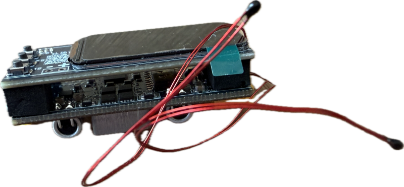

## Overview

This board is currently sold in two variants and two screen sizes:

* **Without Display:**    

  Contains the base board only. The IP2366 on this board **does not support I2C**, so a daughter board cannot be fitted later, nor can you connect your own microcontroller to it. 

  

  A 10-switch DIP panel allows for convenient configuration. Four white LEDs are located on the board and indicate battery state-of-charge, charging, and discharging.

* **With Display:**    

  The base board included here uses the exact same PCB but a IP2366 variant with I2C-enabled firmware. The same ten-switch DIP panel can be used to configure the board defaults. 

  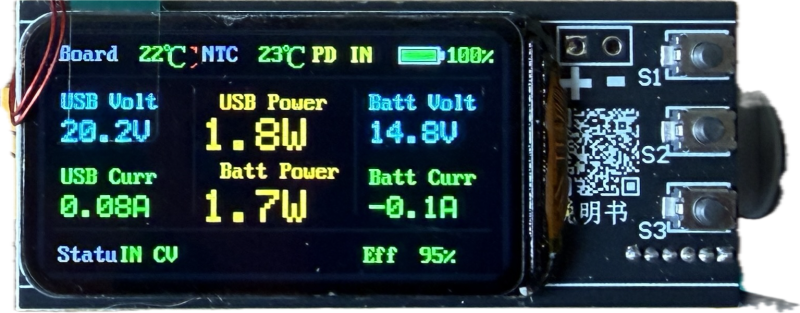

  Most of these values can later be overridden via I2C and the display. Instead of the four white LEDs, this board has a six-pin connector.

  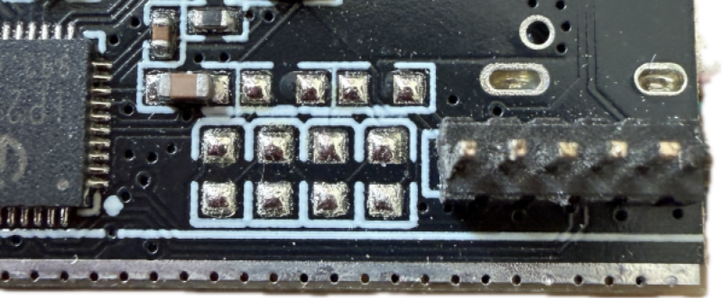

  The **daughter board** plugs onto the six-pin connector and comes with an Arm Cortex microcontroller (Puya PY32F030K28), three push buttons marked `S1` - `S3`, and a second NTC temperature probe as part of a 2-wire 5 V fan control.

  

  The daughter board is available with two different TFT display sizes:

  * 0.96-inch, 80×160 ST7735 TFT
  * 1.47-inch, 170x320 ST7789 TFT

## Base Board Configuration

Before use, adjust the ten DIP switches to your needs:

If you use the display board, you should still use the DIP switches to set your default values: carefully pull off the daughter board with the display to gain access to the base board DIP switches.

* **Battery:**    

  Switches 1 - 5 set the string count to 2 - 6, so the minimum string count is 2S.

* **Power:**  

  Set the maximum power using switches 6 - 8. Keep in mind that even with the lowest setting of 65 W, the board can already warm up significantly. To be able to use 140 W, you **must add a fan and heat sink**.    

* **Battery Chemistry:**    

  Take special care with switches 9 and 10: they set the battery chemistry and determine whether the charger charges to 3.7 V (LiFePo4) or 4.2 V (LiIon). **Apparently, there is an error in the original documentation:** all boards I tested used switch 9 for LiIon/LiPo and switch 10 for LiFePo4. The vendors' documentation claims it is the other way around. If in doubt, measure the battery connector's open-circuit voltage.

> [!IMPORTANT]
> Only **one switch per group** may be in the `ON` position, so make sure there are exactly **three switches in `ON` position**.

### Wiring

Add a **male XT30** connector to your battery, and connect it to the board. To unseal the IP2366, connect a USB charger to the USB-C port for a few seconds until the white LEDs (on the display-less board) or the TFT screen turn on.

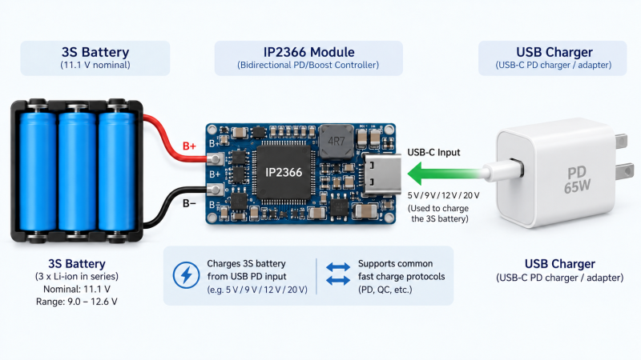

While you *can* run the board without a connected battery, this triggers constant chip resets and other unusual behavior.

Running the board with just a charger can still be useful for a number of reasons:

* **Diagnostics:**      

  Does the board work at all? Is the screen possibly broken?

* **Verifying Charger Settings:**  

  Measure the voltage on the battery side. It should align with the maximum charge voltage for your battery. If it is off, check these:

  - did you configure the string count?
  - did you set the battery chemistry correctly? Remember that the vendor has accidentally switched the settings for LiIon/LiPo and LiFePo4.
  - are you positive you did not accidentally set TWO DIP switches in either settings group? Only **one** switch may be set to `ON`.

### Warning: High Battery Current

Depending on how you operate the board, there can be **high currents on the battery side** (which is why the board uses XT30 high-current connectors that can handle up to 30 A).

If, for example, you use a 2S battery and have enabled the full 140 W, then a load on the USB PD side could draw a maximum of 20 V 7 A (140 W). At a nominal 7.4 V on the 2S battery side, this would require roughly 21 A (including converter losses).

The version with the display can set the maximum allowable battery current to any value you need. The display-less variant can only limit the maximum output power in three steps (65/100/140 W).

### Enable Button

The base board does not come with an installed `Enable` push button, so by default, the USB PD power output is **activated automatically** when a sufficiently large load is plugged in.

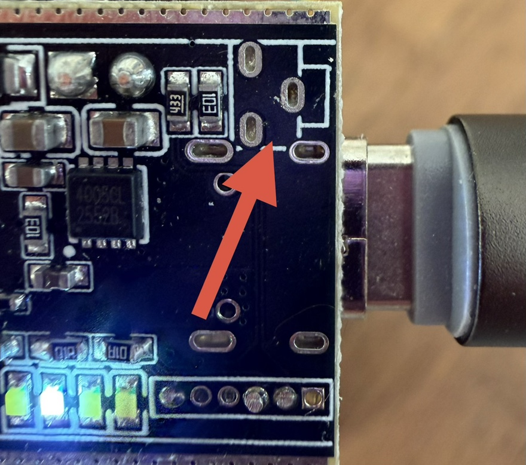

If you want to be able to **manually** enable the output via a push button - like many power banks do - there are already three through-holes on the PCB, next to the USB-C connector, that let you solder on a push button or wires.

The single through-hole towards the side with the USB-C connector is `GND`. You need the other two through-holes that are lined up: when you short these for a few milliseconds, the output is activated.

## Display Board Configuration

If you opted for a board with a TFT-display daughter board, you should first configure the base board exactly as described above. Carefully pull off the daughter board to gain access to the 10-switch DIP panel, and set your defaults.

After this, you continue with the software configuration. Unfortunately, that's not trivial since the firmware uses Chinese characters by default. Once you have completed the initial setup, though, the UI is in English.

### Navigation

Navigation for this board is done through the three push buttons:

| Button | Description |
| --- | --- |
| `S1` |  move up |
| `S2` | short press: select long press: confirm and exit
| `S3` | move down |

### Configuration

When you connect the display board to a USB charger, the display turns on. Unfortunately, the firmware initially runs with Chinese language settings.

1. **Unlocking IP2366:**    

    If you see a screen with Chinese characters that does not respond to button presses, then you need to connect a USB charger to the board, at least for a few seconds. By default, IP2366 is in locked mode. Connecting a charger unlocks it.

    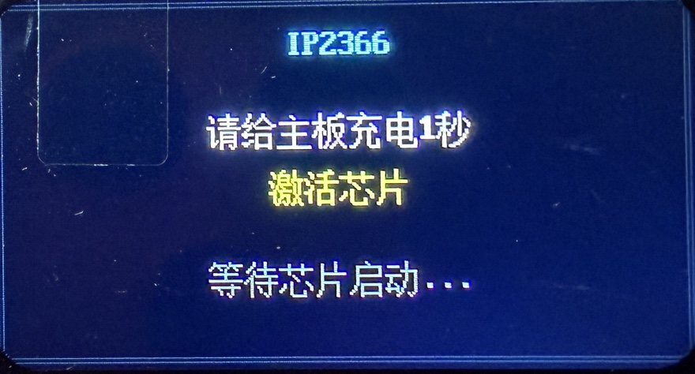

    Generally, this Chinese screen appears whenever the microcontroller cannot access the IP2366 I2C interface.

2. **Pre-Setup:**  

    Next, you see a setup page with only the most important settings, such as string count and battery voltages.

    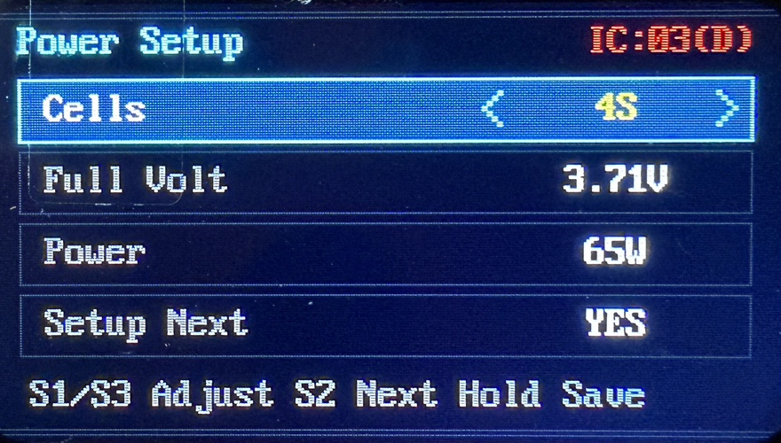

    This screen, too, is initially in Chinese, and there is no way to change the language at this point. Later, once you have changed the language, this screen will also be translated. I have included the English screens here for better orientation.

    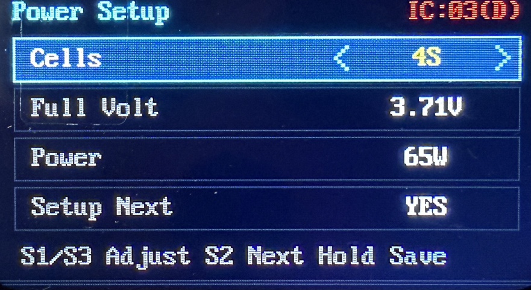

    `Setup Next` controls whether you want to see this setup screen the next time you power on the chip. If you plan to experiment, keep `Yes`. If you permanently attach the board to a particular battery that will not require changes later, choose `No`.

    Accept the values by long-pressing the middle button (`S2`).

3. **Operations Screen:**    

    This brings you to the regular operations screen, where you see a varying number of monitoring and operation-related properties.

    

    Pressing the upper button switches between screen layouts.

        
    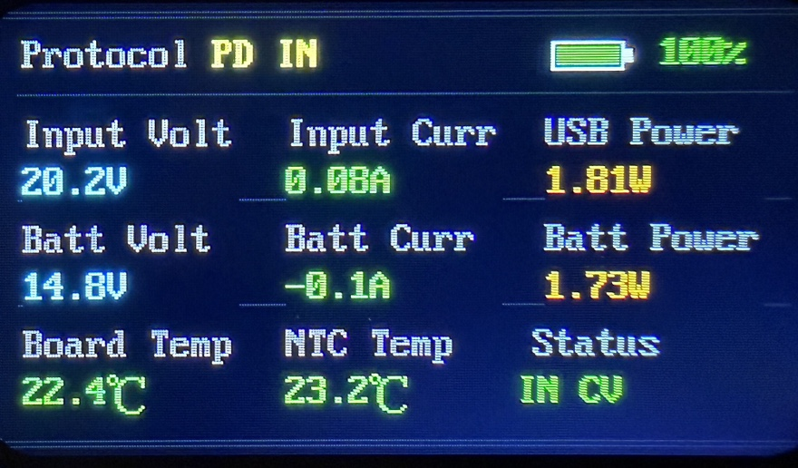    
    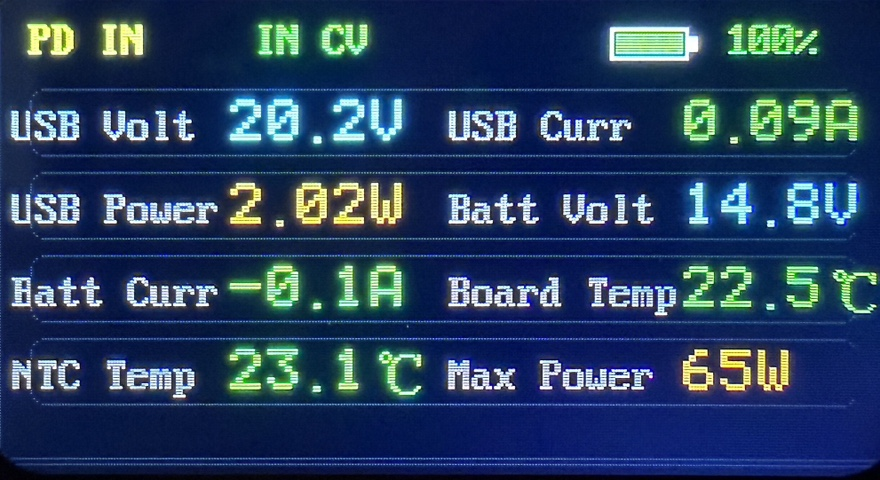    
    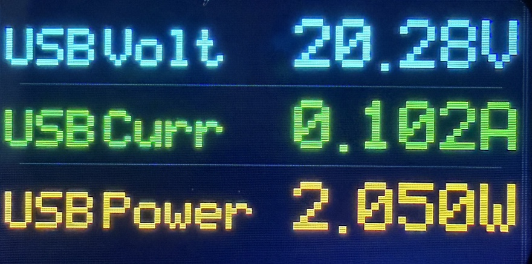  
    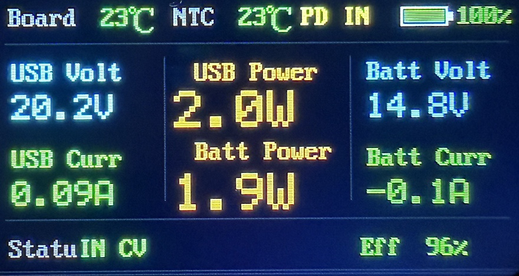  

4. **Settings:**      

    Long-pressing the middle button (`S2`) opens the settings menu.    

    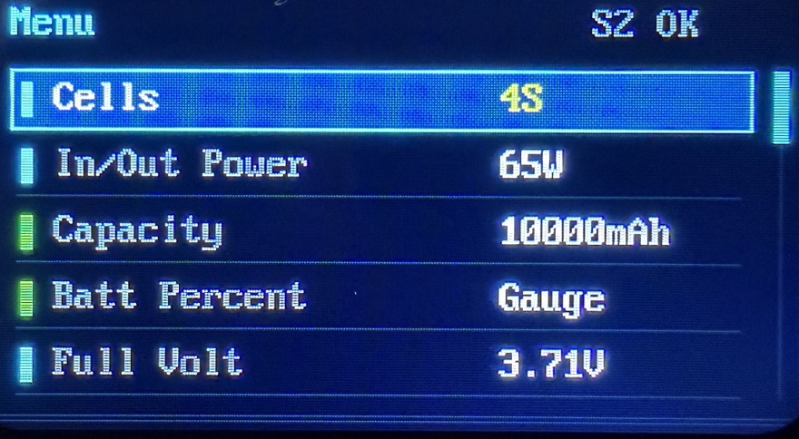  

    If you want to use coulomb counting (gauging), make sure you set the correct battery capacity on the first page, and set `Batt Percent` to `Gauge`. Even then will your on-screen battery meter be off for a couple of complete charge/discharge cycles until the controller has gathered enough data.   
    
    Alternately, use the setting `Voltage` instead of `Gauge`. Now, the software extrapolates the state of charge based on the battery voltage, which works immediately but is only a rough indicator with high margin of error.

    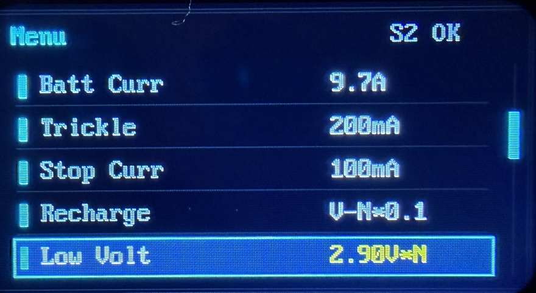  

    On the second page, make sure you limit the battery current if necessary. This, of course, reduces the available power.    

    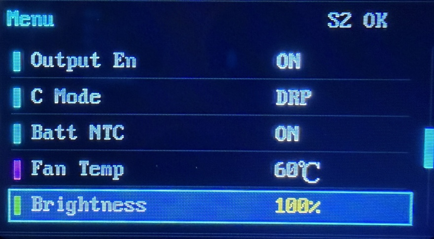  

    On the third page, set the temperature at which the attached fan should activate. You have to connect a 5 V two-wire fan to the daughter board yourself, though; a fan is not included.

    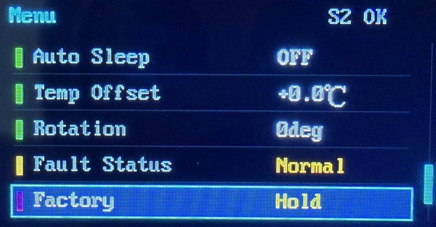  

    On the fourth page, you can rotate the screen design and adjust it to the way you mount this board.

    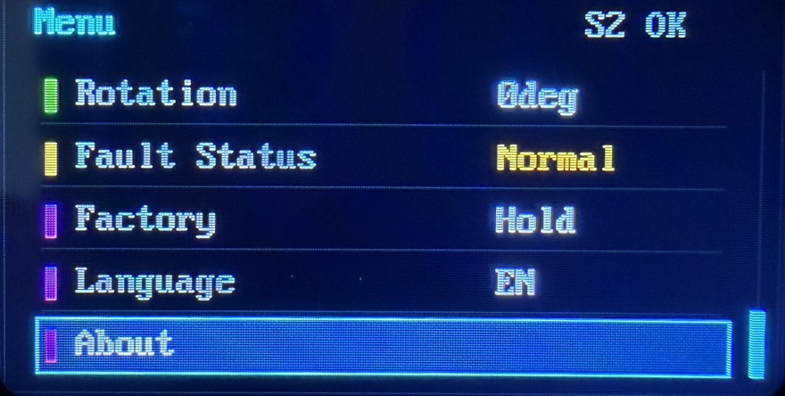  

    On the last page, you finally find the setting `Language`. Press the middle button `S2` to enter the setting, press `S3` to select `English`, and press `S2` again to confirm. Long-press `S2` to save and exit the menu.

## Fan Control

The display version comes with built-in temperature-controlled fan support. You just need to supply a two-wire 5 V fan.

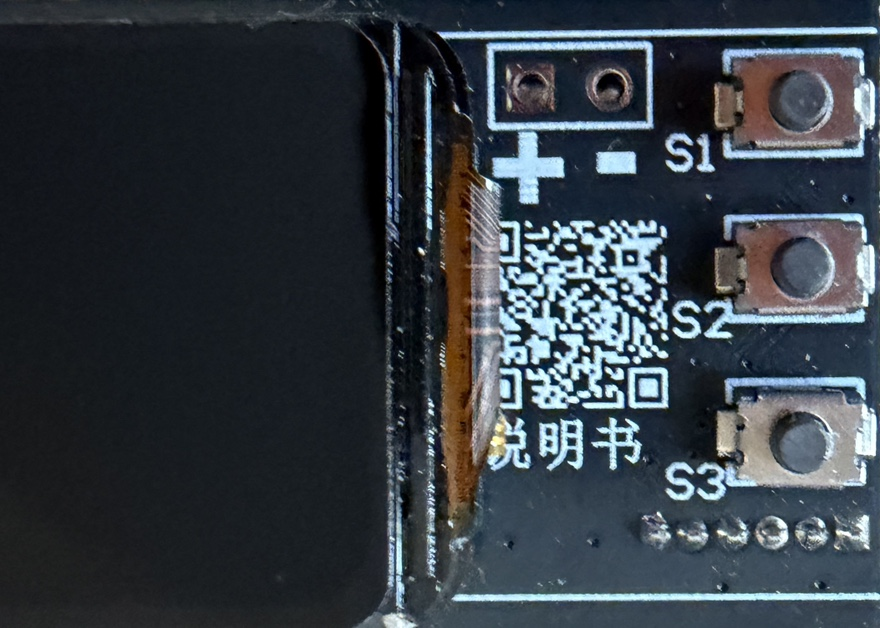  

Connect the fan to the two solder pads marked `+ -`, and make sure you use the correct polarity.

In the settings (discussed above), you can set the temperature at which the fan should start spinning. The fan is controlled by the NTC temperature probe soldered to the daughter board. The other NTC probe is soldered to the base board and controls the IP2366.

### Attention: Heat!

IP2366 is so powerful that it potentially generates a lot of heat. Even with its lowest setting (65 W max), the board gets quite warm. If you decide to use the maximum 140 W, you *must install* a fan, and you should also add heat sinks to the base board.

Adding heat sinks is not trivial though because the back side of the board is populated as well. Probably the best place for a heat sink is the inductor on the back side, and with the display-less version, also the IP2366 on the front side.

## I2C Connector

Versions with a display feature a 6-pin connector on the base board:

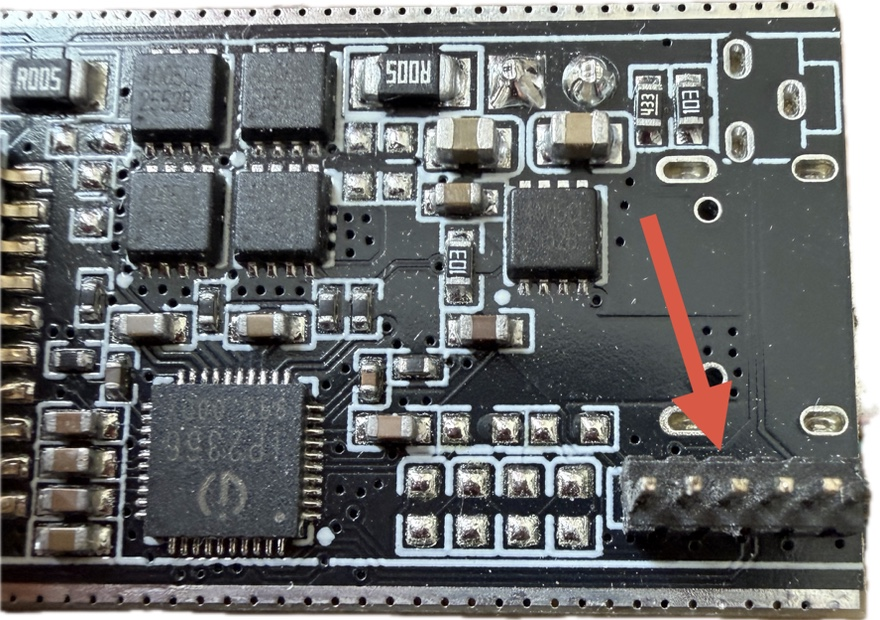  

Pin assignment from left to right:

| Pin | Description |
| --- | --- |
| 1 | `GND` |
| 2 | *(unknown)* |
| 3 | `INT`|
| 4 | `SDA` |
| 5 | `SCL`|
| 6 | `BAT+` |

The base board that comes without a display has no connector and instead four LEDs. The through-holes for the connector are nonetheless present.

### Testing I2C

If you want to test whether your display-less board may possibly have an I2C-enabled IP2366, you must remove the two tiny LED resistors (or better yet: lift them up just on one side so you can later solder them back in place).

> [!IMPORTANT]
> Do this only with appropriate soldering skills and at your own risk. If you accidentally confuse the `GND` and `VBAT` pins, or pin order in general, you can easily destroy the board or anything you connect to it. I have tested a number of boards for you, and they all **did not support I2C**.

The picture below shows both methods: on the left, the resistor is removed, and on the right, it is lifted up on one side only:

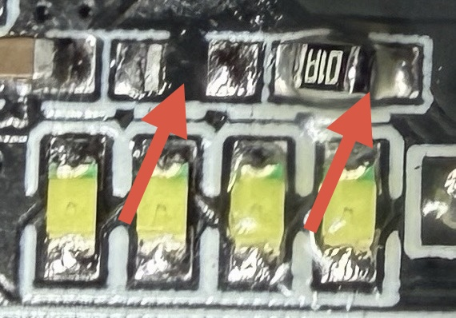  

Next, add pull-up resistors to `4` (`SDA`) and `5` (`SCL`), and connect them to an I2C scanner (sketches for I2C scanners are available everywhere and are really simple). Do not forget to connect pin `1` (`GND`) to your scanner's `GND`.

If your IP2366 supports I2C, it responds at address `0x75`.

An even easier test: with the pull-ups in place, check the voltage on both I2C pins. When I2C is enabled, they should sit at around 3.3 V most of the time. With the non-I2C version of IP2366, the voltage is around 1.6 V despite the pull-ups.

## Firmware Updates

The display version is highly interesting since it comes with its own dedicated microcontroller that is fully programmable.

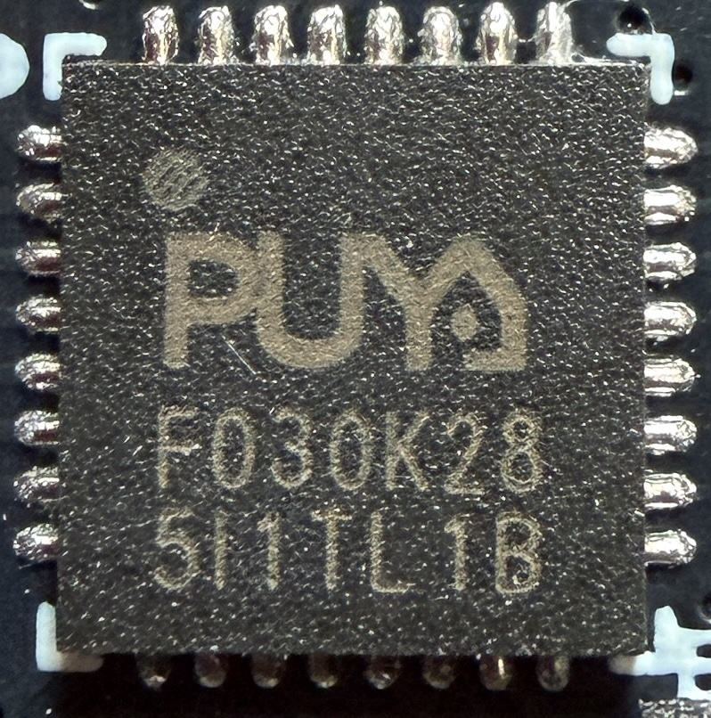  

The programming interface for this Arm Cortex MCU can be found on the back side of the PCB:

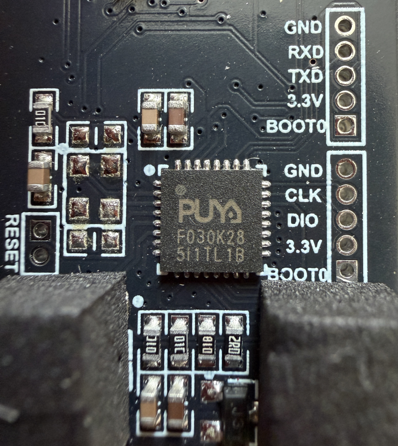  

The board developers even promise full open source and access to the toolchain and future firmware updates. This would place this board in a premier league because it would come with an I2C-enabled IP2366 that is already hooked up to a microcontroller and screen, potentially opening up an entire universe of useful applications.

When you scan the QR code on the board, it leads you to a Chinese QQ group:

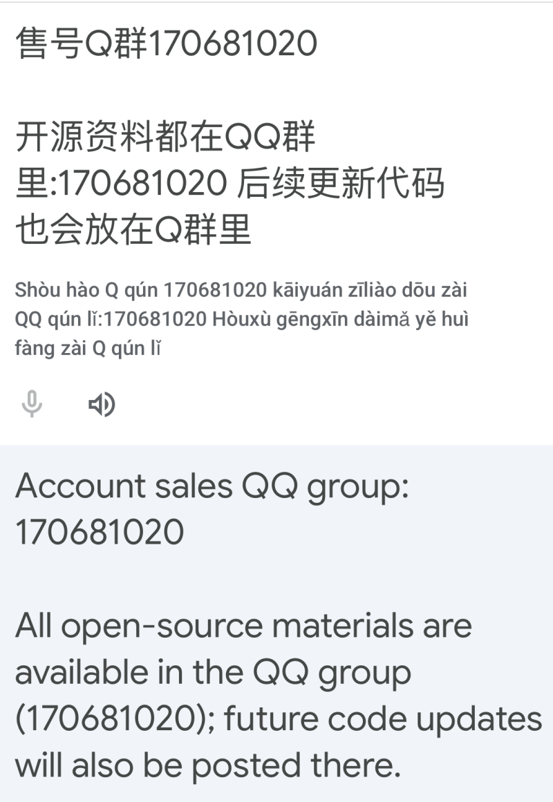  

The developers maintain all resources for this board in QQ group 170681020. Unfortunately, to access this group, you must sign up for QQ, and to be able to sign up for QQ, you must be Chinese (and have a Chinese phone number at hand).

> [!NOTE]
> If anyone has a QQ account and was able to download the materials, please leave a comment below, and I will get in touch with you ASAP. I would really love to get the official firmware and play with it here.

> Tags: IP2366, Charger, Firmware, QQ, Display