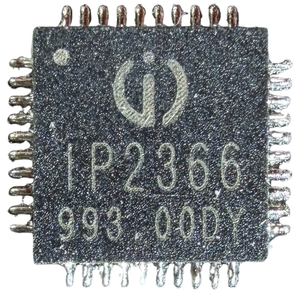
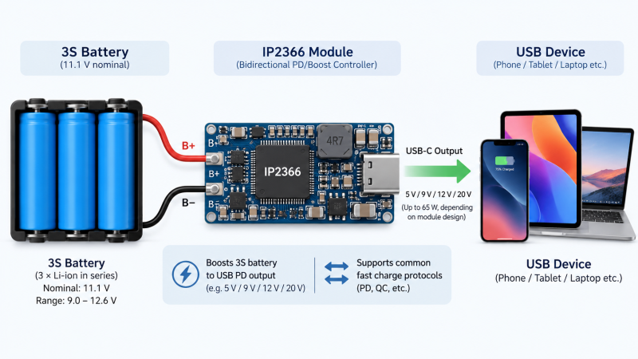
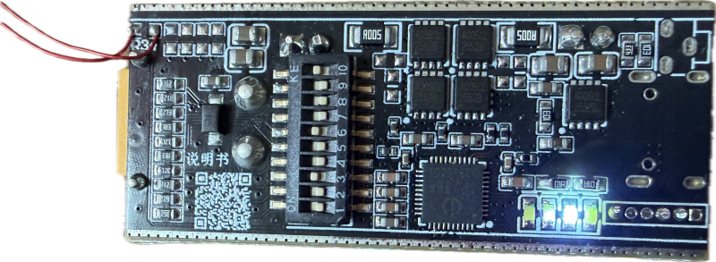
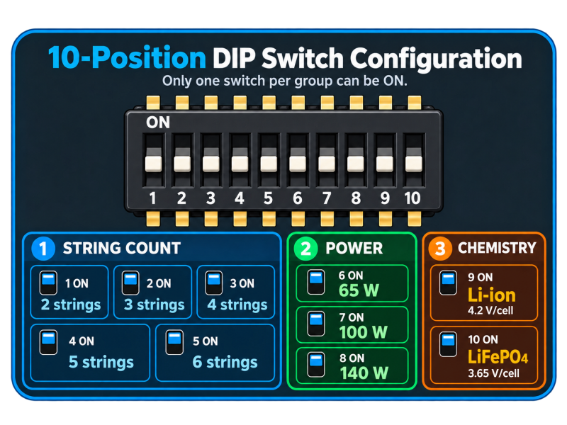

# IP2366 Power Management IC

> Integrated 140W Charger/Discharger for 2-6S LiIon/LiPo/LiFePo4 Battery Packs





The [IP2366](materials/ip2366_datasheet.pdf) is a highly integrated bidirectional buck-boost power-management IC designed for multi-cell lithium battery packs (2-6S). It combines USB-C Power Delivery/QC fast charging, battery charging, and high-power USB output in one chip. 




Battery voltages are configurable, and it works with 2–6 series Li-ion or LiFePO₄ cells.

IP2366 can both **discharge** the battery and provide USB PD output to devices, and **charge** the battery from an USB PD charger.


## Overview

IP2366's strength is power and flexibility: it supports up to 140 W (with proper heat sink), can negotiate USB-PD power for charging and discharging, and work with a wide range of batteries (2-6S) and chemistries (LiIon, LiPo, LiFePo4). 

Some IP2366 come with I²C-compatible firmware and provide even richer configuration plus real-time monitoring.

## Configuration

The chip can be used in two fundamentally different scenarios:

* **Stand-Alone:**    
  Configuration (i.e. battery string count, chemistry, power limits) are configured via resistors and read by the chip on boot. Likewise, visual feedback to the user can be given through up to four LEDs (i.e. state of charge, discharging, charging).  

  
  

* **Microcontroller:**    
  Via I²C, a microcontroller can granularily control the chip configuration and monitor and query operational values such as current and voltage. Likewise, the microcontroller can drive LEDs or display screens to provide feedback.

  
  


Which of the two approaches is useable depends on the chips' particular firmware version. 

Unlike the [IP2369](https://done.land/components/power/powersupplies/battery/chargers/charge-discharge/ip2369/), the IP2366 multiplexes LED and I²C pins, so depending on the firmware version, these pins either drive the LEDs or expose I²C signals. This is why the IP2366 - unlike the [IP2369](https://done.land/components/power/powersupplies/battery/chargers/charge-discharge/ip2369/) with physically different pins for LEDs and I²C - comes in different firmware variants and **may or may not support** I²C.

> [!NOTE]
> Occasionally, IP2366 chips may apparently support both - LEDs and I²C. By removing the LED resistors, I²C is then accessible. Whether this works or not depends solely on the intransparent internal firmware. There are no particular chip markings that could reveal this. Put differently: the visually same chip with the same markings can support LEDs in some instances, require I²C in others, and may even support both. The only way to find out is to test a particular chip.

### Static Configuration
For the non-I²C IP2366, configuration is done by resistor-coded strap pins and fixed external wiring. 

| Property | Defined by | Range |
|---|---|---|
| **Maximum charge/discharge power** | Resistor from **PSET (GPIO3)** to GND | **30 / 45 / 60 / 65 / 100 / 140 W** |
| **Battery series count** | Resistor from **BAT_NUM (GPIO4)** to GND | **2S / 3S / 4S / 5S / 6S** |
| **Battery full-charge voltage / chemistry** | Resistor from **VSET (GPIO2)** to GND | **3.65 / 4.10 / 4.20 / 4.35 / 4.40 V per cell** |
| **Diagnostic print mode** | Special **VSET** resistor selection | **4.20 V/cell + diagnostic output mode** |
| **Default USB-C power role** | **CC_BDO** hardware strap | Default **Sink** or **Source** role |
| **Battery-temperature protection** | External thermistor on **NTC** | Typically configured for approximately **0…45 °C charging** and **−20…60 °C discharging** |
| **Battery/status indicator type** | External wiring of **LED1/LED2/LED3** | **4-LED, 2-LED or 1-LED** indication schemes |
| **Battery-level indication** | LED topology + internal state-of-charge logic | Depending on LED mode: coarse **25/50/75/100%**, thirds, or basic charge/full/status indication |
| **Charge/discharge/error feedback** | LED outputs | Charging, full, discharging, low battery and fault states |
| **Power/wake control** | **EN** input and pushbutton circuitry | Wake, short-press control, sleep/off command and long-press reset |
| **Fast-charge protocols** | Internal firmware, constrained mainly by **PSET** | Automatic USB-PD and supported legacy fast-charge protocols |
| **PD source capabilities** | **PSET**, cable capability and internal firmware | Advertised PDOs/current limits scale with configured maximum power, up to the chip’s supported high-power PD modes |


A non-I²C IP2366 is not really “programmable.” Its significant operating parameters are selected from predefined tables using resistor values or wiring topology. Consequently, a DIP-switch board simply switches resistor networks onto `BAT_NUM`, `PSET` and `VSET`.


The three major user-adjustable parameters therefore reduce neatly to:

````
BAT_NUM → 2S / 3S / 4S / 5S / 6S
PSET    → 30 / 45 / 60 / 65 / 100 / 140 W
VSET    → 3.65 / 4.10 / 4.20 / 4.35 / 4.40 V per cell
````

Everything else is either external hardware selection—CC_BDO, NTC, LED topology, EN—or automatically managed by the IP2366 firmware. This is why the I²C version is substantially more interesting: it exposes parameters and telemetry that otherwise remain internal and/or fixed by these hardware straps.

#### Manual Configuration
On some boards, fixed resistors are used. Others use solder bridges to select from internal resistor networks, whereas yet other boards may use configurable dip switches, so the board can be configured without soldering.





> [!IMPORTANT]
> Always make sure that **only one** resistor per setting is selected. If you i.e. accidentally bridge **two** solder bridges or enable **more than one** dip switch for a given property group, the effective resistor values combine (typically in parallel), so the values are much lower than expected, with unpredictable consequences.


### I²C

Provided an IP2366 *has* I²C-capable firmware, a microcontroller can control the IP2366 in a much more granular way. I²C also provides rich operational data.

Since IP2366 has no internal memory, though, I²C settings are **not retained**. Instead, the `INT` pin goes `HIGH` when the chip activates, and the MCU then needs to freshly define all relevant settings over again. This is why it is advisable to set the defaults via resistors and use I²C for fine-tuning.

Some safety-relevant settings such as battery string count are protected. They can only be changed via I²C when there is no battery currently connected.

IP2366 uses common 3.3 V logic levels on the I²C pins and is easy to interface with 3.3 V MCUs. Just add appropriate pullup resistors. Level shifting is still needed if you want to use a 5 V MCU (i.e. Arduino).

> [!NOTE]
> Some simpler chips for 1S batteries - like the [IP5306](https://done.land/components/power/powersupplies/battery/chargers/charge-discharge/ip5306/) - use the battery voltage as reference which makes it necessary to use a MCU that can be run from the wide range of battery voltage. This is fortunately not the case with the IP2366.


## Materials

* [IP2366 Datasheet](materials/ip2366_datasheet.pdf)       


> Tags: IP2366, Charger, Li-Ion, Li-Po, Boost Converter, 140W, Charger, Discharger, LiFePo4, I2C, NTC

[Visit Page on Website](https://done.land/components/power/powersupplies/battery/chargers/charge-discharge/ip2366?960082101306262639) - created 2026-10-05 - last edited 2026-10-05
