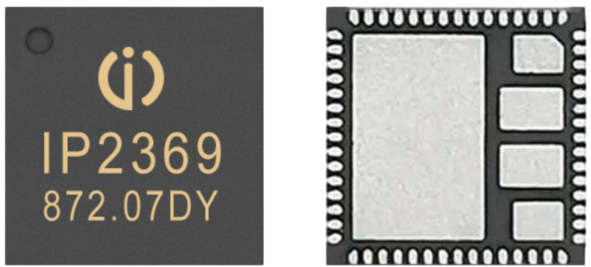
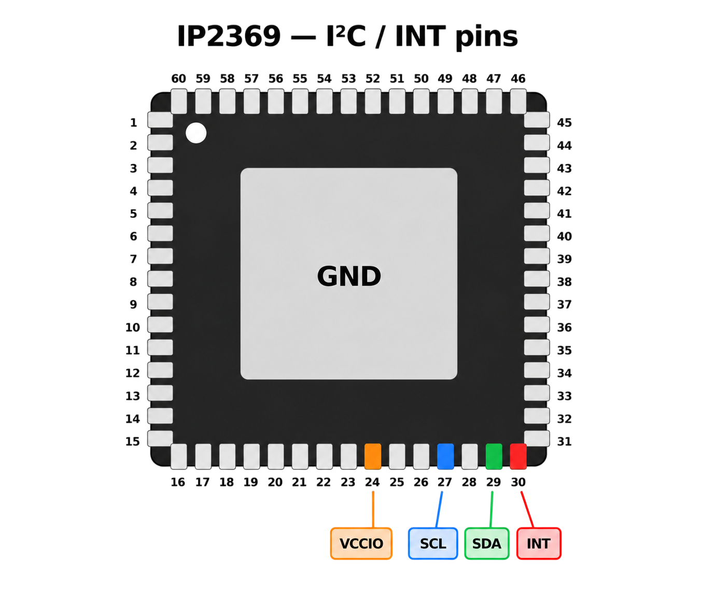
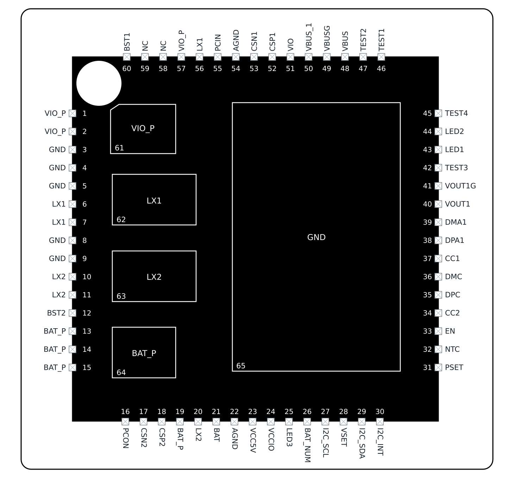

# IP2369 I²C Register Reference

> Comprehensive I²C Register Reference Compiled From Public Sources - Use at Own Risk

[IP2369](https://done.land/components/power/powersupplies/battery/chargers/charge-discharge/ip2369/) is a powerful 45W Charger/Discharger for 2-6S LiIon/LiPo/LiFePo4 that comes with an I²C control interface. It is available in `A` through `D` versions. All versions implement I²C. The `D` version supports additional features, i.e. a special low-quiescent standby mode.




The chip uses dedicated pins for I²C, so on most ready-to-use boards (like the popular [Nouying](https://done.land/components/power/powersupplies/battery/chargers/charge-discharge/ip2369/nouying45w/)), these pins are not exposed on the board. Often, the only way of accessing the I²C interface is to solder your own tiny wires directly to the appropriate chip pins for access. This requires enameled copper wire, a very fine solder tip, good soldering experience, and ideally a digital microscope.

This access method differs from many other chips (like the IP2366) which share pins with indicator LEDs and I²C. While the I²C pins are easier to access on these boards, they require other soldering work: typically the LED resistors need to be desoldered for reliable I²C signals.

> [!NOTE]
> This document is a best-effort. The I²C registers are not publicly documented, and below information is based on testing, and compiling public information. Always verify and test carefully yourself, and use this information entirely at your own risk. If you come across errors or find new information, please leave a comment below.

---

## 1. I²C interface




| Signal  |     Pin | Description |
| ------- | ------: | --- |
| `SCL` |      27 | I²C Clock |
| `SDA` |      29 | I²C Data |
| `INT` |      30 | Chip Awake Status (R/W) |
| `VCCIO`   |      24 | Chip's 3.3 V digital supply |
| `AGND`    | 22 / 55 | Ground |

Interface Parameters:

| Parameter | Value |
|---|---|
| 7-bit I²C address | `0x75` |
| 8-bit write address | `0xEA` |
| 8-bit read address | `0xEB` |
| I²C logic level | 3.3 V |
| Maximum clock | 250 kHz |
| Recommended clock | 100–200 kHz |
| Manufacturer example | 100 kHz |
| Delay after address ACK | approx. 50 µs |
| Recommended read access | single byte |
| Recommended delay between read bytes | approx. 1 ms |
| Last byte of a read | terminate with NACK |


[](materials/ip2369_chip_pinout.svg)

> [!NOTE]
> This chip uses an internal 3.3 V rail and is directly compatible with 3.3 V MCUs. It is not using the battery voltage like some simpler chips do. You still need a level shifter if you want to use a 5 V MCU.

### Important Rules

- Wait until `INT` has remained HIGH for at least **100 ms** before I²C access after wake-up.
- If `INT` goes LOW, stop accessing the IC within **16 ms**.
- Modify registers using **Read → Modify → Write**.
- Do not alter reserved bits or undocumented registers.
- Default values can vary with peripheral configuration and IC configuration.
- For multi-byte live values, read the **low byte first**, then the high byte. Reading the low byte latches/updates the associated high byte.

---

## 2. Register Map

| Address | Register | Access | Function |
|---|---|---|---|
| `0x00` | `SYS_CTL0` | R/W | charge / input fast-charge enables |
| `0x01` | `SYS_CTL1` | R/W | VBUS/VOUT1 path MOS control |
| `0x02` | `SYS_CTL2` | R/W | cell full-charge voltage |
| `0x03` | `SYS_CTL3` | R/W | battery terminal current limit |
| `0x04` | `SYS_CTL4` | R/W | number of series cells |
| `0x06` | `SYS_CTL6` | R/W | trickle-charge current |
| `0x08` | `SYS_CTL8` | R/W | charge termination and recharge threshold |
| `0x09` | `SYS_CTL9` | R/W | standby / low-voltage behavior |
| `0x0A` | `SYS_CTL10` | R/W | battery undervoltage threshold |
| `0x0B` | `SYS_CTL11` | R/W | output and fast-charge enables |
| `0x0C` | `SYS_CTL12` | R/W | VBUS power selection |
| `0x0D` | `SELECT_PDO` | R | charging PDO selection |
| `0x10` | `TEMP_LOOP_CTL` | R/W | thermal power-reduction loop |
| `0x15` | `CC3CC4_CTL` | R/W | CC3/CC4 output control |
| `0x16` | `STANDBY_TIME` | R/W | no-load standby delay |
| `0x17` | `NTC_CTL` | R/W | NTC protection enable |
| `0x22` | `TypeC_CTL8` | R/W | Type-C port role |
| `0x23` | `TypeC_CTL9` | R/W | PDO current-setting enables |
| `0x24` | `TypeC_CTL10` | R/W | 5 V PDO current |
| `0x25` | `TypeC_CTL11` | R/W | 9 V PDO current |
| `0x26` | `TypeC_CTL12` | R/W | 12 V PDO current |
| `0x27` | `TypeC_CTL13` | R/W | 15 V PDO current |
| `0x28` | `TypeC_CTL14` | R/W | 20 V PDO current |
| `0x29` | `TypeC_CTL23` | R/W | PPS1 PDO current |
| `0x2A` | `TypeC_CTL24` | R/W | PPS2 PDO current |
| `0x2B` | `TypeC_CTL17` | R/W | advertised source PDO enables |
| `0x2C` | `TYPEC_CTL18` | R/W | +10 mA PDO-current adjustment |
| `0x31` | `STATE_CTL0` | R | charging state |
| `0x32` | `STATE_CTL1` | R | discharge / MOS state |
| `0x33` | `STATE_CTL2` | R | input / charging-voltage state |
| `0x34` | `TypeC_STATE` | R | Type-C connection / fast-charge state |
| `0x35` | `RECEIVED_PDO` | R | PDOs offered/received from adapter |
| `0x38` | `STATE_CTL3` | R* | overcurrent / short-circuit flags |
| `0x39` | `IC_VERSION` | R | IC revision |
| `0x3A` | `IC_TEMP` | R | IC temperature / thermal-loop flag |
| `0x50` | `BATVADC_DAT0` | R | VBAT low byte |
| `0x51` | `BATVADC_DAT1` | R | VBAT high byte |
| `0x52` | `VsysVADC_DAT0` | R | VSYS low byte |
| `0x53` | `VsysVADC_DAT1` | R | VSYS high byte |
| `0x54` | `IMOS_C_DAT0` | R | USB-C MOS current low byte |
| `0x55` | `IMOS_C_DAT1` | R | USB-C MOS current high byte |
| `0x56` | `IMOS_A_DAT0` | R | USB-A/VOUT1 MOS current low byte |
| `0x57` | `IMOS_A_DAT1` | R | USB-A/VOUT1 MOS current high byte |
| `0x69` | `TIMENODE1` | R | timestamp ASCII byte 1 |
| `0x6A` | `TIMENODE2` | R | timestamp ASCII byte 2 |
| `0x6B` | `TIMENODE3` | R | timestamp ASCII byte 3 |
| `0x6C` | `TIMENODE4` | R | timestamp ASCII byte 4 |
| `0x6D` | `TIMENODE5` | R | timestamp ASCII byte 5 |
| `0x6E` | `IBATIADC_DAT0` | R | battery current low byte |
| `0x6F` | `IBATIADC_DAT1` | R | battery current high byte |
| `0x70` | `ISYS_IADC_DAT0` | R | system current low byte |
| `0x71` | `Isys_IADC_DAT1` | R | system current high byte |
| `0x74` | `Vsys_POW_DAT0` | R | system power low byte |
| `0x75` | `Vsys_POW_DAT1` | R | system power high byte |
| `0x77` | `INTC_IADC_DAT0` | R | NTC excitation current |
| `0x78` | `VGPIO0_NTC_DAT0` | R | NTC/GPIO ADC voltage low byte |
| `0x79` | `VGPIO0_NTC_DAT1` | R | NTC/GPIO ADC voltage high byte |


Addresses not listed above are not documented and should be treated as reserved/undocumented.

> [!IMPORTANT]
> Documentation ambiguity: `0x38` is labeled as read-only but simultaneously certain latched flags are cleared by setting them to 1. Verify on hardware before relying on write-to-clear behavior.

---

## 3. Read/Write Registers

### 0x00 — SYS_CTL0

| Bits | Name | Access | Reset | Meaning |
|---|---|---|---|---|
| 7 | `En_LOADOTP` | R/W | 1 | 1 = reset/register defaults loaded at power-on wake; recommended to leaving enabled |
| 6 | `En_RESETMCU` | R/W | 0 | write 1 to reset registers to defaults; bit returns to 0; wait about 2 s before subsequent register access |
| 5 | Reserved | — | — | preserve |
| 4 | `En_Vbus_SinkDPdM` | R/W | 1 | USB-C input DP/DM fast-charge enable |
| 3 | `En_Vbus_SinkPd` | R/W | 1 | USB-C input PD fast-charge enable |
| 2 | `En_Vbus_SinkSCP` | R/W | 1 | USB-C input SCP enable; AC solution requires corresponding customization/support |
| 1 | `En_ppath` | R/W | 1 | 5 V simultaneous charge/discharge power-path function; 0 gives charging priority |
| 0 | `En_Charger` | R/W | 1 | charging enable |

### 0x01 — SYS_CTL1

| Bits | Name | Access | Reset | Meaning |
|---|---|---|---|---|
| 7 | `En_Vbus_Src_Mos` | R/W | 1 | VBUS output-path MOS enable |
| 6:5 | Reserved | — | — | preserve |
| 4 | `En_Vin_Src_Mos` | R/W | 1 | VOUT1 output-path MOS enable |
| 3 | Reserved | — | — | preserve |
| 2 | `En_Vbus_Sink_Mos` | R/W | 1 | VBUS input-path MOS enable |
| 1:0 | Reserved | — | — | preserve |

### 0x02 — SYS_CTL2

| Bits | Name | Access | Reset | Formula |
|---|---|---|---|---|
| 7:0 | `Vset` | R/W | `10101010b` (`0xAA`) | `Vcell = N × 10 mV + 2500 mV`; maximum 4.4 V |

Default code `0xAA = 170` corresponds to **4.20 V/cell**.

### 0x03 — SYS_CTL3

| Bits | Name | Access | Reset | Formula |
|---|---|---|---|---|
| 7:0 | `Iset` | R/W | `01100001b` (`0x61`) | `Ilimit = N × 100 mA`; maximum 9.7 A |

Default code `0x61 = 97` corresponds to **9.7 A**.

> [!IMPORTANT]
> Do not set this below the actual intended charge/discharge current.

### 0x04 — SYS_CTL4

| Bits | Name | Access | Reset | Meaning |
|---|---|---|---|---|
| 7:3 | Reserved | — | — | preserve |
| 2:0 | `Bat_Num` | R/W | not clearly shown | series-cell count; `Bat_Num = N`, documented range 2–6 |

### 0x06 — SYS_CTL6

| Bits | Name | Access | Reset | Formula |
|---|---|---|---|---|
| 7:0 | `Itk` | R/W | `00000100b` (`0x04`) | `Itrickle = N × 50 mA` |

Default = **200 mA**.

### 0x08 — SYS_CTL8

| Bits | Name | Access | Reset | Meaning |
|---|---|---|---|---|
| 7:4 | `Istop` | R/W | `0010b` | charge termination current: `Istop = N × 50 mA` |
| 3:2 | `Vrch` | R/W | `10b` | recharge threshold encoding |
| 1 | `Chg_OvTime` | R/W | 0 | charge-enable / timeout behavior after full charge |
| 0 | Reserved | — | — | preserve |

`Vrch`:

| Code | Recharge behavior |
|---|---|
| `00` | no recharge after full charge |
| `01` | `VTRGT − Ncells × 0.05 V` |
| `10` | `VTRGT − Ncells × 0.10 V` |
| `11` | `VTRGT − Ncells × 0.20 V` |

`Chg_OvTime`:

- `0`: automatically disable charging after full charge; charging timeout remains active.
- `1`: do not disable charging enable after full charge; charging timeout is removed.

### 0x09 — SYS_CTL9

| Bits | Name | Access | Reset | Meaning |
|---|---|---|---|---|
| 7 | `En_Standby` | R/W | 1 | standby enable |
| 6 | `Standby` | R/W | 0 | write 1 for one-shot immediate standby in non-charging condition; bit 7 must be enabled |
| 5 | `En_BAT_Low` | R/W | 0 | 5 V low-voltage shutdown mode |
| 4 | Reserved | — | — | preserve |
| 3 | `Standby_Mode` | R/W | configuration-dependent | D-version-only standby current selection |
| 2:0 | Reserved | — | — | preserve |

`Standby_Mode` for D-version IC:

- `0`: about **10 µA**
- `1`: about **100 µA**
- default is 100 µA.

### 0x0A — SYS_CTL10

| Bits | Name | Access | Reset | Meaning |
|---|---|---|---|---|
| 7:5 | `Set_BATlow` | R/W | `101b` | base battery low-voltage code |
| 4 | `Adjust_En` | R/W | 0 | selects subtract/add correction |
| 3 | Reserved | — | — | preserve |
| 2:0 | `Adjust_Data` | R/W | 0 | correction magnitude |

Base threshold:

`ShutVol = (Set_BATlow + 25) × 100 mV × Ncells`

Correction:

`Vadjust = Adjust_Data × 100 mV`

- `Adjust_En = 0`: `ShutVol = base − Vadjust × Ncells`
- `Adjust_En = 1`: `ShutVol = base + Vadjust × Ncells`


> [!IMPORTANT]
> Settings below 2.7 V/cell provide software low-battery protection only.

### 0x0B — SYS_CTL11

| Bits | Name | Access | Reset | Meaning |
|---|---|---|---|---|
| 7 | `En_Dc-Dc_Output` | R/W | 1 | discharge/DC-DC output enable |
| 6 | `En_Vbus_Src_DPdM` | R/W | 1 | USB-C output DP/DM fast-charge enable |
| 5 | `En_Vbus_SrcPd` | R/W | 1 | USB-C output PD enable |
| 4 | `En_Vbus_SrcSCP` | R/W | 1 | USB-C output SCP enable |
| 3 | `En_Vin_Src_DPDM` | R/W | 1 | VOUT1/USB-A DP/DM fast-charge enable |
| 2 | `En_Vin_Src_SCP` | R/W | 1 | VOUT1/USB-A SCP enable |
| 1 | `EN_DRV_EMI` | R/W | 0 | chip-driven anti-EMI function |
| 0 | Reserved | — | — | preserve |


> [!IMPORTANT]
> USB-A/VOUT1 discharge during USB-C charging is not necessarily blocked by bit 7.

### 0x0C — SYS_CTL12

| Bits | Name | Access | Reset | Meaning |
|---|---|---|---|---|
| 7:5 | `Vbus_Src_Power` | R/W | `100b` | VBUS output/input power selection |
| 4 | Reserved | — | — | preserve |
| 3 | `Chg_Power_En` | R/W | 0 | independent maximum VBUS input-power selection enable |
| 2:0 | `Vbus_Snk_Power` | R/W | `101b` | independent VBUS input power selection |

Power codes explicitly listed:

| Code | Power |
|---|---:|
| `000` | 20 W |
| `001` | 27 W |
| `010` | 30 W |
| `011` | 36 W |
| `100` | 45 W |

> [!IMPORTANT]
> Inconsistency: the reset shown for `Vbus_Snk_Power` is `101b`, while the visible table explicitly defines power codes only through `100b`. Do not assume a meaning for `101b` without hardware verification.

### 0x0D — SELECT_PDO

| Bits | Name | Access shown | Meaning |
|---|---|---|---|
| 7:3 | Reserved | — | preserve |
| 2:0 | `Pdo_select` | `R`  | selected charging PDO |

Codes:

| Code | PDO |
|---|---|
| `000` | automatic / adapter maximum |
| `001` | 5 V |
| `010` | 9 V |
| `011` | 12 V |
| `100` | 15 V |
| `101` | 20 V |

Before selection, inspect `0x35`. Selection becomes invalid when the adapter is unplugged and must then be determined/configured again.

> [!IMPORTANT]
> Documentation ambiguity: the text describes making a selection but the access column is rendered as `R`. Verify whether the actual device accepts writes to this field.

### 0x10 — TEMP_LOOP_CTL

| Bits | Name | Access | Reset | Meaning |
|---|---|---|---|---|
| 7 | `Temp_Loop_En` | R/W | unknown | thermal power-reduction loop enable |
| 6:3 | Reserved | — | — | preserve |
| 2:0 | `Temp_Loop` | R/W | `100b` | thermal threshold code |

Threshold:

`Tthreshold = 80 °C + N × 5 °C`

### 0x15 — CC3CC4_CTL

| Bits | Name | Access | Reset | Meaning |
|---|---|---|---|---|
| 7 | `CC4_OUT` | R/W | 0 | CC4 output control |
| 6 | `CC3_OUT` | R/W | 0 | CC3 output control |
| 5:0 | Reserved | — | — | preserve |

For CC3/CC4:

- `0`: LOW, internal **5.1 kΩ pull-down**
- `1`: HIGH via approximately **330 µA pull-up**


> [!IMPORTANT]
> Use these outputs only to drive MOS circuitry.

### 0x16 — STANDBY_TIME

| Bits | Name | Access | Reset | Formula |
|---|---|---|---|---|
| 7:0 | `Standby_Time` | R/W | `00001010b` (`0x0A`) | `tstandby = N × 1 s`; minimum 2 s |

Default = **10 s**.

### 0x17 — NTC_CTL

| Bits | Name | Access | Reset | Meaning |
|---|---|---|---|---|
| 7 | `NTC_EN` | R/W | 1 | NTC high-/low-temperature protection enable |
| 6:0 | Reserved | — | — | preserve |

### 0x22 — TypeC_CTL8

| Bits | Name | Access | Reset | Meaning |
|---|---|---|---|---|
| 7:6 | `Vbus_Mode_Set` | R/W | `11b` | Type-C role |
| 5:0 | Reserved | — | — | preserve |

Role codes:

| Code | Role |
|---|---|
| `00` | UFP |
| `01` | DFP |
| `11` | DRP |

`10` is not defined.

### 0x23 — TypeC_CTL9

| Bit | Name | Reset | Meaning |
|---:|---|---:|---|
| 7 | `En_5VPdo_3A/2.4A` | 1 | 1 = 3 A; 0 = 2.4 A |
| 6 | `En_Pps2Pdo_Iset` | 0 | enable programmable PPS2 current |
| 5 | `En_Pps1Pdo_Iset` | 0 | enable programmable PPS1 current |
| 4 | `En_20VPdo_Iset` | 0 | enable programmable 20 V PDO current |
| 3 | `En_15VPdo_Iset` | 0 | enable programmable 15 V PDO current |
| 2 | `En_12VPdo_Iset` | 0 | enable programmable 12 V PDO current |
| 1 | `En_9VPdo_Iset` | 0 | enable programmable 9 V PDO current |
| 0 | `En_5VPdo_Iset` | 0 | enable programmable 5 V PDO current |

All fields are R/W.

For the programmable-current enable bits, once enabled:

- advertised/output power is based on the configured PDO current;
- overcurrent is approximately **1.1 × configured PDO current**.

### 0x24–0x28 — fixed-voltage PDO current settings

| Reg | Field | Reset | Formula |
|---|---|---|---|
| `0x24` | `5VPdo_Iset` | `0x96` | `I5V = N × 20 mA` |
| `0x25` | `9VPdo_Iset` | `0x96` | `I9V = N × 20 mA` |
| `0x26` | `12VPdo_Iset` | `0x96` | `I12V = N × 20 mA` |
| `0x27` | `15VPdo_Iset` | `0x96` | `I15V = N × 20 mA` |
| `0x28` | `20VPdo_Iset` | `0xFA` | `I20V = N × 20 mA` |

All fields occupy bits `7:0` and are R/W.

Default currents implied by the reset values:

- `0x96 = 150` → **3.00 A**
- `0xFA = 250` → **5.00 A**

### 0x29–0x2A — PPS PDO current settings

| Reg | Field | Reset | Formula |
|---|---|---|---|
| `0x29` | `Pps1Pdo_Iset` | `0x3C` | `IPPS1 = N × 50 mA` |
| `0x2A` | `Pps2Pdo_Iset` | `0x3C` | `IPPS2 = N × 50 mA` |

> Default `0x3C = 60` → **3.00 A**.

### 0x2B — TypeC_CTL17

| Bit | Name | Reset | Meaning |
|---:|---|---:|---|
| 7 | Reserved |  `R` | preserve |
| 6 | `En_Src_Pps2Pdo` | 1 | advertise/enable PPS2 PDO |
| 5 | `En_Src_Pps1Pdo` | 1 | advertise/enable PPS1 PDO |
| 4 | `En_Src_20VPdo` | 1 | advertise/enable 20 V PDO |
| 3 | `En_Src_15VPdo` | 1 | advertise/enable 15 V PDO |
| 2 | `En_Src_12VPdo` | 1 | advertise/enable 12 V PDO |
| 1 | `En_Src_9VPdo` | 1 | advertise/enable 9 V PDO |
| 0 | Reserved |  `R` | preserve |

### 0x2C — TYPEC_CTL18

Adds **10 mA** to selected fixed-voltage PDO current settings; intended to be used together with the corresponding current-setting register.

| Bit | Name | Reset | Meaning |
|---:|---|---:|---|
| 7:5 | Reserved | 0 | preserve |
| 4 | `EN_20VPDO_ADD` | 0 | add 10 mA to 20 V PDO current |
| 3 | `EN_15VPDO_ADD` | 0 | add 10 mA to 15 V PDO current |
| 2 | `EN_12VPDO_ADD` | 0 | add 10 mA to 12 V PDO current |
| 1 | `EN_9VPDO_ADD` | 0 | add 10 mA to 9 V PDO current |
| 0 | `EN_5VPDO_ADD` | 0 | add 10 mA to 5 V PDO current |

---

## 4. Read-Only Status Registers

### 0x31 — STATE_CTL0

| Bits | Name | Meaning |
|---|---|---|
| 7:6 | `Chg_State` | input charging mode: `00` = 5 V input; `01` = high-voltage fast-charge input |
| 5 | `CHG_En` | 1 = charging state / VBUS valid; 0 = not charging |
| 4 | `CHG_End` | 1 = charge complete |
| 3 | `Output_En` | 1 = discharge output open and no abnormality; 0 = output not open or discharge anomaly |
| 2:0 | `Chg_state` | detailed charge state |

Detailed `2:0` states:

| Code | State |
|---|---|
| `000` | standby |
| `001` | trickle charge |
| `010` | constant-current charge |
| `011` | constant-voltage charge |
| `100` | charging in progress / pre-initiation state |
| `101` | fully charged |
| `110` | charging timeout |
| `111` | not defined |

### 0x32 — STATE_CTL1

| Bit(s) | Name | Meaning |
|---|---|---|
| 7 | `Vbus_Output_State` | 1 = VBUS fast-charge discharge; 0 = 5 V discharge |
| 6 | `Vin_Output_State` | 1 = VOUT1 fast-charge discharge; 0 = 5 V discharge |
| 5 | `Mos_Vbus` | VBUS output MOS status |
| 4 | `Mos_Vin` | VOUT1 output MOS status |
| 3 | `At_Same` | simultaneous/common-placement flag |
| 2:0 | Reserved | — |

### 0x33 — STATE_CTL2

| Bits | Name | Meaning |
|---|---|---|
| 7 | `Vbus_Ok` | VBUS input present |
| 6 | `Vbus_Ov` | VBUS input overvoltage |
| 5:3 | Reserved | — |
| 2:0 | `Chg_Vbus` | negotiated/input charging voltage |

`Chg_Vbus`:

| Code | Voltage |
|---|---:|
| `001` | 5 V |
| `010` | 7 V |
| `011` | 9 V |
| `100` | 12 V |
| `101` | 15 V |
| `110` | 20 V |


> [!IMPORTANT]
> `000` and `111` are not defined/unknown.

### 0x34 — TypeC_STATE

| Bit | Name | Meaning |
|---:|---|---|
| 7 | `Sink_Ok` | Type-C sink/input connection valid |
| 6 | `Src_Ok` | Type-C source/output connection valid |
| 5 | `Src_Pd_Ok` | source-side PD connection valid |
| 4 | `Sink_Pd_Ok` | sink-side PD connection valid |
| 3 | `Vbus_Sink_Qc_Ok` | input fast-charge validity flag |
| 2 | `Vbus_Src_Qc_Ok` | output fast-charge validity flag |
| 1:0 | Reserved | — |


> [!IMPORTANT]
> Bits 3 and 2: QC5V/PD5V indication does not guarantee that fast charging succeeded.

### 0x35 — RECEIVED_PDO

| Bit | Name | Meaning |
|---:|---|---|
| 7:5 | Reserved | — |
| 4 | `PDO_20V` | 20 V PDO available/received |
| 3 | `PDO_15V` | 15 V PDO available/received |
| 2 | `PDO_12V` | 12 V PDO available/received |
| 1 | `PDO_9V` | 9 V PDO available/received |
| 0 | `PDO_5V` | 5 V PDO available/received |

> Each PDO bit: `1 = yes`, `0 = no`.

### 0x38 — STATE_CTL3

| Bits | Name | Meaning |
|---|---|---|
| 7:6 | Reserved | — |
| 5 | `Vsys_Oc` | latched VSYS overcurrent indication |
| 4 | `Vsys_Scdt` | latched VSYS short-circuit indication |
| 3:0 | Reserved | — |

For both fault bits:

- `1` indicates the event has occurred.
- Condition is considered valid after being detected more than twice within about **600 ms**.
- From the event to system sleep is approximately **1.5 s**.
- Bit needs to be set to `1` to clear it, despite classifying the section as read-only. Treat write-to-clear as **needs hardware verification**.

### 0x39 — IC_VERSION

| Value | Version |
|---:|---|
| 1 | B version |
| 2 | C version |
| 3 | D version |
| … | later revisions |

### 0x3A — IC_TEMP

| Bits | Name | Meaning |
|---|---|---|
| 7 | `Temp_Loop` | thermal-loop trigger flag |
| 6:0 | `IC_temp` | chip temperature in °C |

---

## 5. ADC / Telemetry Registers

### Multi-byte read rule

For every two-byte measurement:

1. read the **low-byte register first**;
2. then read the associated high-byte register;
3. combine as:

```text
raw = low | (high << 8)
```

Reading the low byte updates/latches both bytes so that the pair belongs to the same sample.

### Voltage

| Registers | Value | Formula |
|---|---|---|
| `0x50` low, `0x51` high | `BATVADC` | `VBAT = raw mV` |
| `0x52` low, `0x53` high | `VsysVADC` | `VSYS = raw mV` |

### Port currents

| Registers | Value | Formula / note |
|---|---|---|
| `0x54` low, `0x55` high | `IMos_C` | C-port current = raw mA |
| `0x56` low, `0x57` high | `IMos_A` | A-port/VOUT1 current = raw mA |

The port-current conversion assumes approximately **10 mΩ MOS internal resistance**.

### Timestamp

| Register | Field |
|---|---|
| `0x69` | `TimeNode1` — ASCII byte 1 |
| `0x6A` | `TimeNode2` — ASCII byte 2 |
| `0x6B` | `TimeNode3` — ASCII byte 3 |
| `0x6C` | `TimeNode4` — ASCII byte 4 |
| `0x6D` | `TimeNode5` — ASCII byte 5 |

### Battery current

| Register | Field |
|---|---|
| `0x6E` | `IBATIADC[7:0]` |
| `0x6F` | `IBATIADC[15:8]` |

`IBAT = raw mA`

### System current

| Register | Field |
|---|---|
| `0x70` | `ISYSIADC[7:0]` |
| `0x71` | `ISYSIADC[15:8]` |

`ISYS = raw mA`

> [!IMPORTANT]
> Minor naming inconsistencies (`ISYSIADC`, `IVsysIADC`, `VsysIADC`) relating to the same VSYS/system-current measurement pair.

### System Power

| Register | Field |
|---|---|
| `0x74` | `Vsys_POW_ADC[7:0]` |
| `0x75` | `Vsys_POW_ADC[15:8]` |

`Psys = raw × 10 mW`

### NTC excitation current

`0x77`, bit 7 `NTC_IADC_DAT`:

| Bit 7 | NTC excitation current |
|---:|---:|
| 0 | 20 µA |
| 1 | 80 µA |

Bits `6:0` are reserved.

### NTC / GPIO0 ADC voltage

| Register | Field |
|---|---|
| `0x78` | `VGPIO0_ADC[7:0]` |
| `0x79` | `VGPIO0_ADC[15:8]` |

`VGPIO0 = raw mV`

Documented range: **0–3.3 V**.

---

## 6. Default Values

| Register/field | Reset | Derived default |
|---|---:|---:|
| `0x02 Vset` | `0xAA` | 4.20 V/cell |
| `0x03 Iset` | `0x61` | 9.7 A |
| `0x06 Itk` | `0x04` | 200 mA |
| `0x08 Istop` | `0x2` | 100 mA |
| `0x08 Vrch` | `10b` | recharge at `VTRGT − 0.10 V × Ncells` |
| `0x0C Vbus_Src_Power` | `100b` | 45 W |
| `0x16 Standby_Time` | `0x0A` | 10 s |
| `0x22 Vbus_Mode_Set` | `11b` | DRP |
| `0x24 5VPdo_Iset` | `0x96` | 3.00 A |
| `0x25 9VPdo_Iset` | `0x96` | 3.00 A |
| `0x26 12VPdo_Iset` | `0x96` | 3.00 A |
| `0x27 15VPdo_Iset` | `0x96` | 3.00 A |
| `0x28 20VPdo_Iset` | `0xFA` | 5.00 A |
| `0x29 PPS1 current` | `0x3C` | 3.00 A |
| `0x2A PPS2 current` | `0x3C` | 3.00 A |


> [!IMPORTANT]
> Actual read-back defaults can differ according to the peripheral/configuration state; regard the value read from the IC as authoritative.

---

## 7. Implementation Notes

### Safe register update

```text
old = read_register(address)
new = (old & ~mask) | (desired_bits & mask)
write_register(address, new)
```


> [!IMPORTANT]
> Do not overwrite reserved bits with hard-coded values.

### Recommended read transaction behavior

```text
wait until INT has been HIGH >= 100 ms
send device address
wait ~50 µs after ACK
read one register byte
NACK final byte
STOP
delay ~1 ms before next byte/register read
```

### Example 16-bit telemetry

```text
low  = read(0x50)
high = read(0x51)
vbat_mV = low | (high << 8)
```

---

## 8. Ambiguities


1. `0x0D Pdo_select` is documented as selectable/configurable but the access column is shown as `R`.
2. `0x0C Vbus_Snk_Power` reset appears as `101b`, while the visible power-code list only defines `000` through `100`.
3. `0x10 Temp_Loop_En` has a malformed/shifted reset presentation.
4. `0x38` belongs to the read-only status section, yet bits 5 and 4 are described as cleared by writing `1`.
5. A few current-register signal names vary between adjacent lines (`ISYSIADC`, `IVsysIADC`, `VsysIADC`).

These fields should be verified experimentally before firmware depends on the ambiguous behavior.

[Visit Page on Website](https://done.land/components/power/powersupplies/battery/chargers/charge-discharge/ip2369/ip2369i2c?045362091524264024) - created 2026-09-23 - last edited 2026-09-23
