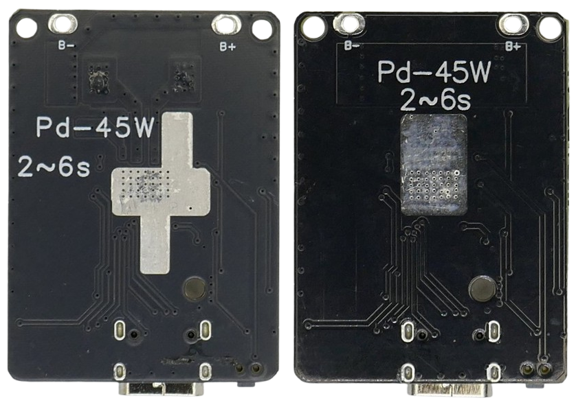

# Nouying 45W

> 45W 2-6S Charger/Discharger Board With Protections and Support for LiIon and LiFePo4

This 2-6S 45W charger/discharger is based on the [IP2369 power management chip](https://done.land/components/power/powersupplies/battery/chargers/charge-discharge/ip2369/) and surfaces in various slightly different versions:

This board is a complete and highly integrated powerbank-solution: connect it to any lithium 2-6S battery pack, and you are done.

 
| Item | Remark |
| --- | --- |
| Supported batteries | LiIon, LiPo, LiFePo4 |
| Built-in battery protections | yes |
| Built-in output protections | yes |
| Maximum output current | 3A |
| Maximum output power | 45W (6S battery) - 18W (2S battery) |
| Output voltages | USB PD: 5/9/12/15/20V and PPS |
| DC-Converter | Buck-Boost |

The board can be configured conveniently via solder bridges (i.e. setting the battery chemistry and number of strings). No complex soldering required.

> [!NOTE]
> For technical details and use cases, please refer to the article about [IP2369](https://done.land/components/power/powersupplies/battery/chargers/charge-discharge/ip2369/). This article focuses on the specifics of the Nouying breakout board.

## Overview

This board is an extremely flexible powerbank solution and can be connected to almost any lithium-based battery pack (including LiFePo4). It is important to note though that you **must configure the board properly** through solder bridges **before connecting any battery**.

> [!NOTE]
> All board features are implemented by the [IP2369](https://done.land/components/power/powersupplies/battery/chargers/charge-discharge/ip2369/) power management chip, so it is strongly recommended that you [read the IP2369 overview](https://done.land/components/power/powersupplies/battery/chargers/charge-discharge/ip2369/) before reading *this* article.

### Highlights

There are zillions of power management boards, but this board stands out for a number of reasons:

* **LiFePo4-Support:**    
  Most boards work with LiIon and LiPo batteries only. This board can also be configured to work with LiFePo4 batteries.  
* **Universal Charger:**  
  This board is a charger *and* discharger, so it can act as a universal charger for any 2-6S battery pack of any lithium chemistry. That's why you can use this board **as a charger only**: 
    * **LiFePo4 Charger:**    
    Small chargers for LiFePo4 - especially with more than one string - are hard to find and expensive. With this board, you can easily charge typical 12V LiFePo4 batteries. Just configure it for *LiFePo4* and *4S*.    
    * **Tool Batteries - Makita & Co:**    
    Chargers for tool batteries (like Makita, Parkside, DeWalt, Bosch, Milwauki, you-name-it) are either hard to get, expensive, or low quality. With this board, you can easily charge typical 18-20V tool batteries from any USB power supply. Just configure it for *LiIon* and *5S*. As a bonus, you also get a 45W USB PD output and can power your laptop from a tool battery.  
   
    This board is **not suited for** charging **small batteries** with low capacity: since this board charges with up to 45W, depending on the number of strings your battery uses, the charging current can reach up to **7-8A**. It is also not suited for charging single cells since its minimum configuration is **2S** (two cells in series).

  Note also that your battery pack should have its own **BMS** that takes care of balancing the individual cells. With tool batteries and LiFePo4 batteries, this is the case. With your own DIY battery packs, it's your responsibility to add a BMS.
  
* **Wide Input Voltage:**    
  IP2369 accepts any input voltage in the range of 4.5-25V, so you can - but you are not limited to - use a USB power supply to charge your batteries. You could as well use a classic voltage supply or re-purpose an old "power brick" you have lingering around.  
  

* **Full USB PD Output (including 20V and PPS):**     
  The board outputs full USB PD and includes a highly efficient buck-boost converter. From any of the supported battery string configurations (2-6S), you get all USB PD 3 output voltages up to 20V. 

  Via **PPS**, you can even request arbitrary output voltages in 100mV increments.
  
  There are really not too many **affordable** and small boards that provide 20V/1.5A/30W output at just 6V input (when using a **2S** battery pack). Even at this wide boost voltage gap, the board operates at 92% conversion efficiency and works reliably at comparably low heat.
* **Affordability:**     
  All this may cost you as little as €3.50 (that was my price ordering 10 pieces, a regular order and no "welcome" offer). 
  
  The normal price range for single units is 3-6€, so even if you order without much comparing and not in bulk, this board is still highly affordable.

### Limitations

This board is powered by the [IP2369](https://done.land/components/power/powersupplies/battery/chargers/charge-discharge/ip2369/) chip. It implements most (but not all) configuration options. 

| Feature | Remark |
| --- | --- |
| Light Loads | IP2369 cannot detect loads <70mA and cuts power |
| Charging and Output Power | IP2369 supports [limiting the power](https://done.land/components/power/powersupplies/battery/chargers/charge-discharge/ip2369/#maximum-output-power) (both for charging and discharging) from 45W down to 20W, however the board does not expose the required `RPSET` resistor | 

Light Loads and Workarounds
 

Most power management chips cannot "see" light loads. For IP2369, the blind spot starts at power consumption less than 350mW (70mA at 5V).

In the datasheet, it reads: *"the board **automatically turns off the power output** if a "light load" is detected."* 

The truth though is that IP2369 cannot "detect" a light load, rather it **fails to detect** small currents. So when the load drops below 70mA, it becomes undetectable. At this point, the chip cannot differentiate anymore whether a load is running or not.

To somewhat heal this situation, most power management chips do not shut down the output immediately when no load can be detected anymore. Instead, they start a grace timer. 

With IP2369, the grace period depends on how the load was supplied with power:

* **Normal (Non-USB PD) Load:**     
  If the load uses 5V and has not negotiated any other voltage or current using USB PD, the grace period is 32 seconds.  
* **PD Protocol:**    
  If the load is using USB PD, the grace period is 16 minutes.

#### Keeping Output open
If you need to run a load below the chips' detection range, i.e. a microcontroller in deep sleep, here are the options:

* **Brute Force:**    
  Add additional loads, i.e. LEDs, that raise the power consumption over 70mA so that the chip can "see" the load.
* **Reset Grace Period:**    
  Wake up the microcontroller in regular intervals to temporarily increase the current above the detection threshold. This resets the grace timer and keeps the output open.
* **Change IP2369 Behavior:**     
  Use a microcontroller and I2C to change the IP2369 settings: simply disable the "automatic output shutdown" altogether. This keeps the output open at all times, regardless of load type.

Adjusting Maximum Power
 

IP2369 supports [limiting the power](https://done.land/components/power/powersupplies/battery/chargers/charge-discharge/ip2369/#maximum-output-power) (both for charging and discharging) from 45W down to 20W. This can make sense if you design a powerbank with a smaller battery that cannot handle 45W charging and/or discharging.

Setting the power limit is configured via an `RPSET` resistor, however the board does not clearly expose this resistor. There is just one resistor on the PCB that is specifically marked (`R10`), however the purpose of this resistor is undocumented.

If you need to limit the power, you would have to identify where the board has located the `RPSET` resistor. Next, you'd have to replace the existing (tiny) SMB resistor with the [resistor value for the output power you want to use](https://done.land/components/power/powersupplies/battery/chargers/charge-discharge/ip2369/#maximum-output-power).

A much more convenient approach is to use I2C to change the maximum power digitally. This requires an external microcontroller, though.

### Caveats

This board is a high-performance buck-boost converter that can output considerable power at a much higher voltage than your battery pack. This can induce **high currents** at your battery pack level. 

> For example, in a **2S** battery configuration, the board can output up to 20V and 1.5A (30W). At the 6V battery, more than **5A** are drawn.

* **Battery pack:**     
  Sufficient battery capacity (i.e. >6000 mAh at **2S** configuration) ensures that the battery can safely provide the high currents required. Most lithium batteries safely charge and discharge at **1C**.    
* **Wiring:**    
  Wires must be short and thick to avoid voltage drops and heating up:   

  * **Fire Hazard:**     
  If your wires are **way too thin** (i.e. AWG 24 and higher), they will heat up so much that they can melt and cause a fire.   
  * **Malfunctioning Charger:**    
  If your wires are **only slightly too thin** (i.e. AWG 20-AWG 22), they cause a significant **voltage drop** at the high currents involved.    

    To the charger, the battery voltage now always seems lower than it really is (true battery voltage less the voltage drop). That's why the charger might **overcharge** the battery, and over-discharge protection may kick in long before the battery is truly empty.  

In a nutshell:

* use **AWG 18** or **AWG 16** wires.
* use battery packs with a capacity of at least **6.000mAh**, especially in **2-4S** configurations.
* make sure your battery pack has a **BMS** that takes care of balancing the battery cells.

## Board Versions
This board is available from different vendors and can be labeled **Nouying** or **DYKB**. 

While the board design is identical, there are **significant differences**:

* PCB quality / label quality
* TVS diode
* Inductor value (4.7µH , 6.8µH)

There is no vendor information on version differences. An educated guess would be that the Nuoying board is a **newer** design with slightly superior features, possibly driven by higher EMI protection requirements, but this could be wrong.

Both boards work well. If you are interested in the subtle differences, read the detailed review below.

Differences: Nouying vs. DYKB
 

### Label Quality
The Nouying board is clearly labeld, and you can easily identify the solder bridges for the different battery string configurations:

On the DYKB board, labels are hardly recognizable and become visible only in large magnification:

Both boards are preconfigured for **4S LiIon/LiPo** batteries.

### Heat Sink
On the back side, the **Nouying** board (left) uses a slightly more efficient heat sink than the **DYKB** version with its simple rectangular shape (right):

### TVS Protection

The Nouying board uses a TVS diode close to the `B+` connector (the black item labeld `CK` in the background of the picture).

The DYKB board leaves the diode unpopulated:

The TVS diode protects against voltage spikes that can originate from varoious situations:

* **Hot-Pluggable Battery:**     
  If the battery pack is not soldered directly to the board, battery plug‑in/out can create fast overshoot ringing; a TVS damps/clamps it, omission means the spike propagates into the buck‑boost/input caps and IC pins.
* **ESD:**    
  Charged cables or user ESD can inject kV pulses; the TVS provides a low‑impedance path and lowers clamping voltage seen by silicon. Without it, protection relies only on internal diodes and layout.

Parts may not fail immediately but suffer reduced lifetime or intermittent faults after repeated stress events.

Even though the added safety from this TVS diode can be argued for the typical "powerbank" use-case where a battery is permanently attached, the Nouying comes with this protection, and the DYKB has saved a few cents by leaving the TVS diode unpopulated.

### Inductor 
Nuoying uses a 6.8µH inductor whereas DKYB uses a 4.7µH inductor. 4.7µH is the inductor value of the reference schematics in the IP2369 datasheet.

In reality, both inductor values presumably work equally well, however there may be subtle differences:

| Item | 4.7µH (DYKB) | 6.8µH (Nuoying) |
| --- | --- | --- |
| Ripple | higher | lower |
| Efficiency | better | worse |
| Light Loads | worse | better |
| EMI | worse | better |

Rule of thumb:

* Heavier loads, stricter ripple/EMI: 6.8 µH.
* Highest efficiency in the same footprint, acceptable ripple: 4.7 µH.

### SMB Resistors
Both boards seem to use different SMB resistors at some places on first look. However, this is not the case:

* **Different Labeling Systems:**    
   `01C` is equivalent to `103`, and both are 10 kΩ values.
* **Variantions within allowable range:**    
  For example, Nouying uses `01C` (10 kΩ) for the **4S** setting whereas DYKB uses `912` (9.1 kΩ).   
* **Solder Bridge:**    
  The DYKB board uses a `000` resistor for the default solder bridge (0 Ω jumper). Nouying uses a `015` (0.15 Ω), presumably because of a lack of `000`.

#### Nouying Configuration

#### DYKB Configuration

## Exploring the board

### Front View
On the front side, the board features:

* **Push Button:**     
  Manually enable (single click) or disable (two single clicks) the power output.    
* **USB-C Connector:**    
  In-/Output. Can be used to charge the battery, and provides USB PD output when running from the battery.   
* **Four LEDs:**    
  Indicate battery state-of-charge, and charging progress when connecting to a USB power supply.    
* **MOSFET:**    
  **AGM405AP** or similar N-channel power MOSFET, most likely used as an "ideal diode": when the board sources power (discharge mode) it doesn’t leak back into an attached charger, and when sinking (charging) it blocks system voltage from returning to the port if disabled

  

#### LED Indicator
The board implements a 4-LED indicator located next to the USB-C connector.

**Charging:**

| Battery Capacity | LED1 | LED2 | LED3 | LED4 |
| --- | --- |--- | --- | --- |
| full | 💡 | 💡 | 💡 | 💡 |
| 75% | 💡 | 💡 | ⚡ (0.5Hz) |  |
| 50% | 💡 | ⚡ (0.5Hz) |  |  |
| 25% | ⚡ (0.5Hz) |  |  |  |

💡 = on, ⚡ (0.5Hz) = slow blink, empty cell = off.

**Discharging:**

| Battery Capacity | LED1 | LED2 | LED3 | LED4 |
| --- | --- |--- | --- | --- |
| full | 💡 | 💡 | 💡 | 💡 |
| 75% | 💡 | 💡 | 💡 |  |
| 50% | 💡 | 💡 |  |  |
| 25% | 💡 |  |  |  |
| 0% |  |  |  |  |

💡 = on, ⚡ (0.5Hz) = slow blink, empty cell = off.

> When the over-discharge protection kicks in (battery empty), all four LEDs flash 4 times, then turn off.

#### Push Button
The board automatically enables power output when a load is plugged in, and disables it again when the load is removed.

When the load is very light, it may be undetected, and the power output needs to be manually turned on via a push button that is located next to the USB-C connector.

Any push longer than 100ms and shorter than 2s is considered a "short push":

* **1x Short Push:**    
  Enables the power output and turns on the LED state-of-charge display.
* **2x Short Push:**  
  Disables power output and enters low-power mode.

### Side View
On the side, to the left there are the battery connectors, and next to the `B+` connector, the Nouying board populates the protective TVS diode (labeled **CK**, big black component) whereas the DYKB board leaves the diode unpopulated.

In the background, the large inductor is visible. The inductor is used both for buck and boost.

* **Nuoying:**   
  Uses a `6R8` inductor (6.8µH)
* **DYKB:**   
  Uses a `4R7`inductor (4.7µH).

In the middle part, you see the [IP2369](https://done.land/components/power/powersupplies/battery/chargers/charge-discharge/ip2369/) power management chip.

On the right side, the solder bridges for the battery configuration can be seen. 

## Battery Pack
The battery pack is connected to `B+` and `B-`. 

* **Protections/BMS:**    
  The board comes with all necessary [protections](https://done.land/components/power/powersupplies/battery/chargers/charge-discharge/ip2369/#protections), so the battery pack does not necessarily need its own protections (although recommended).
* **Balancing:**    
  The board has no balancing capabilities. Use a separate BMS for your battery pack that supports balancing.    
* **Wires:**    
  IP2369 limits **input** currents to **3A**/**45W**. Depending on your battery configuration, there can be much higher currents at the battery terminal. For example, in **2S** configuration, the maximum battery current can reach **7.5A**.

### Configuring Battery Type

Both string configuration and battery chemistry can conveniently be configured using solder bridges. By default, the board is configured for **4S** and **LiIon/LiPo** chemistry:

#### LiFePo4

If you want to use LiFePo4 batteries, close the solder bridge marked **Li-fe**.

#### 2-6S Configuration

Bridge the appropriate solder bridge for your battery packs' string configuration. 

> [!IMPORTANT]
> Always make sure **that only ONE solder bridge is bridged**. The solder bridges [enable an internal resistor](https://done.land/components/power/powersupplies/battery/chargers/charge-discharge/ip2369/#batteries). If you accidentally bridge more than one solder bridge, the total resistor value decreases (resistor parallel connection), and the effective string configuration may be lower than required.    

> Tags: DYKB, Charger, Li-Ion, Li-Po, LiFePo4, Boost, Buck, Buck-Boost, 20V, IP2369, 45W, Charger, Discharger, Light Load, Powerbank, I2C

[Visit Page on Website](https://done.land/components/power/powersupplies/battery/chargers/charge-discharge/ip2369/nouying45w?125674091701252408) - created 2025-08-31 - last edited 2025-09-03
