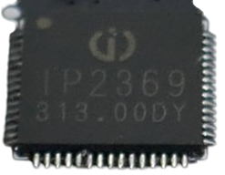
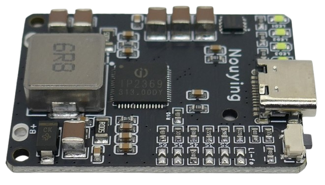

# IP2369 Power Management IC

> Integrated 45W Charger/Discharger for 2-6S LiIon/LiPo/LiFePo4 Battery Packs

The [IP2369](materials/ip2369_datasheet_en.pdf) is a highly integrated *power bank* system-on-chip (SOC) with a charger and a discharger that works with **2-6S** lithium cells (supports LiIon, LiPo, and LiFePo4). It supports two USB ports simultaneously (1x USB-A output, 1x USB-C in-/output).

IP2369 has built-in I2C support and can be monitored or fine-tuned by a microcontroller. At this time, no I2C register information could be found, and the vendor did not yet reply. 

If you have access to I2C register information, please leave a comment below.

## Overview
The stand-out feature of IP2369 is its powerful 250 kHz buck-boost converter that can boost a voltage as low as 4.5 V to as high as 25.2 V.

This works both ways - which is important:

* **Charging:**     
  You can charge your battery with as low as 5 V USB. Depending on your battery pack configuration, IP2369 boosts this voltage to up to 25.2 V:

  | Pack | Min charging voltage | Max charging voltage |
  |---|---:|---:|
  | 2S | 6.0 V | 8.4 V |
  | 3S | 9.0 V | 12.6 V |
  | 4S | 12.0 V | 16.8 V |
  | 5S | 15.0 V | 21.0 V |
  | 6S | 18.0 V | 25.2 V |

* **Discharging:**     
  The minimum battery configuration is **2S** (6.0–8.4 V). Even at 6.0 V input, IP2369 can boost this battery voltage to 20 V output at 1.5 A (30 W) at 92% efficiency.

  That's why IP2369 supports full USB PD including voltages much higher than the battery voltage, i.e. 20 V.

## Use Cases

IP2369 is used by a few breakout boards that are ready-to-use and very affordable, for example:

The chips' enormous flexibility allows for a wide range of use cases:

* **Powerbank:**     
  IP2369 works with almost any battery pack (except **1S**, single cells). Simply by adding a board with IP2369, you get a powerful powerbank solution with fast charging support both for input and output.  

* **Charger:**     
  You can use IP2369 as a charger only, too: for example, when you set IP2369 to **5S** configuration, a simple 5 V USB input could be used to charge 18–20 V tool batteries from Makita and similar vendors.

  Since the charger input supports fast charging protocols, if you connect a USB PD power supply, it would automatically request a higher input voltage and charge with up to 45 W (i.e. 2.2 A at 20 V input).    

* **Boost Converter:**     
  You can use this chip as a boost converter only: when you configure it to **6S**, it would, for example, convert 5 V (or 12 V, or any voltage within its input range of 4.5–25 V) input to around 24 V output.

### Protections

IP2369 comes with all basic battery protection features:

* Short Circuit Protection
* Overcharge Protection
* Over-Discharge Protection
* Over-Current Protection

The system protects itself as well:

* Input Overvoltage Protection
* Input Undervoltage Protection
* IC Over-Temperature Protection

Optionally, an external 10K (B=3380) NTC Thermistor can be connected for added safety. 

* Charging stops at below 0 °C and above 45 °C.
* Discharging stops at below -20 °C and above 60 °C.

> Depending on the breakout board you are using, when connecting a NTC Thermistor to a board that was not previously equipped with a thermistor, it may be necessary to also change a resistor value on the board. Else, the thermistor would generate significantly wrong readings.   

### LED / State of Charge

IP2369 contains a state-of-charge meter that can be implemented with up to 4 LEDs.

## Charging / Input Voltage
IP2369 accepts an input voltage in the range of 4.5–25 V. It can handle a maximum input current of **3A**.

IP2369 automatically manages the maximum input current based on the input voltage to ensure that at no point the current exceeds **3A** and the power exceeds **45W**.

### Maximum Power

Due to its fixed **3A threshold**, IP2369 can provide 45W only at an input voltage of at least 15V. Voltages lower than 15V reduce the maximum power.

> [!NOTE]
> The tables below list the maximum **input** current. The actual charging output is roughly 10% less due to conversion losses.

### Fixed Voltage Supply
If you use a simple 5V charger (with no fast charging support), or if you supply a fixed voltage from a classic power supply, IP2369 sets the maximum input current according to this table:

| Input Voltage | Maximum Input Current | max Watt |
| --- | --- | --- |
| <6.5V  | 3A | 19.5W |
| <9.5V | 2A | 19W |
| <13.5V | 1.5A | 20.3W |
| <16.5V | 3A | 49.5W |
| <=24V | 2.25A | 54W |

> [!NOTE]
> If you configure the chip for **6S** batteries (25V output), and you supply 24V input, the total power reaches 54W. From the datasheet, it is not clear whether exceeding the 45W limit would damage the chip or require additional heat sinks.   

The maximum input power can also be limited by a resistor, in which case this lower value is in effect.

### USB Fast Charge / PD Input
IP2369 supports a range of fast charging protocols at its input: AFC/FCP/PD2.0/PD3.0/PD3.1.

If your power supply supports one of these protocols, IP2369 requests a higher voltage, and the maximum input current is set according to the voltage that was successfully negotiated:

| Requested Fast Charge Voltage | Maximum Input Current | max Watt |
| --- | --- | --- |
| 9V | 2.22/3.0A (configurable) | 20/27W |
| 12V | 1.7/2.25/2.5/3.0A (configurable) | 20/27/30/36W  | 
| 15V | 1.25/1.7/1.9/2.3/2.85A (configurable) | 20/27/30/36/45W |
| 20V | 0.95/1.3/1.4/1.7/2.15A (configurable) | 20/27/30/36/45W |

### Charging Currents

As you have seen above, IP2369 is capable of providing relatively high charging currents. For example, when supplying 20V via USB PD, the maximum input power is 45W (20V at 2.25A). 

* In a **5S** configuration, each battery cell can receive a maximum charging current of 2.85A:
  (20V * 2.25A) / (5S * 3.0V) = 45W / 15V = 3A
  3A * 0.95% = 2.85A
* In a **2S** configuration, each battery cell can receive a maximum charging current of 7.125A:
  (20V * 2.25A) / (2S * 3.0V) = 45W / 6V = 7.5A
  7.5A * 0.95% = 7.125A

Either make sure your batteries can copy with these charging currents, or reduce the maximum power either by setting a maximum input voltage, or by limiting the maximum current via an external resistor:

| Maximum Power | RPSET |
| --- | --- |
| 45W | 18K |
| 36W | 13K |
| 30W | 9.1K |
| 27W | 6.2K |
| 20W |  3.6K |

Note that this setting controls both **input** and **output**, so when you reduce i.e. battery charging power to 20W, then the USB PD output that you can draw from the battery is also limited to 20W.   

Limiting both input and output does make sense to a degree: if the battery pack you are using isn't capable of accepting the maximum possible charging current, then the battery pack is likely to also not be able to **deliver** this same current during discharge.

## Batteries 

IP2369 can configure both the cell chemistry (voltage per cell), and battery pack configuration (**2S-6S**). This is typically done via external resistors.

| Battery Pack | RBAT_NUM |
| --- | --- |
| 6S | 18K |
| 5S | 13K |
| 4S | 9.1K |
| 3S | 6.2K |
| 2S | 3.6K |

The battery type can also be configured via resistor:

| Chemistry | Max. Cell Voltage | RVSET | Remark |
| --- | --- | --- | --- |
| LiIon/LiPo | 4.2V | 9.1K | default |
| LiIon/LiPo | 4.1V | 6.2K | use only with verified batteries |
| LiIon/LiPo | 4.3V | 13K | use only with verified batteries |
| LiIon/LiPo | 4.35V | 18K | use only with verified batteries |
| LiIon/LiPo | 4.4V | 27K | use only with verified batteries |
| LiFePo4 | 3.65V | 3.6K | default |

## Output Voltage
IP2369 converts the battery voltage to USB 5 V plus a range of fast charging protocols: PD2.0/PD3.0/PD3.1, QC2.0/QC3.0/QC3+, FCP, AFC, and Apple.

The output voltage can be supplied to both a USB-A and a USB-C port.

### Enabling/Disabling Output
IP2369 automatically enables output ports when a load is connected, provided the load is significant. Light loads may not trigger automatic turn-on.

A push button can be connected that manually opens the output ports.

#### Light-Load Shutdown

Since IP2369 was designed primarily for use in powerbanks, it automatically supports light load shutdown:

| Condition | Timeout when low load is detected |
| --- | --- |
| USB PD | 16 minutes |
| Multi-port output mode | <80mA (MOS Rds_ON@15mohm) 16 seconds |
| Single output port | <350mW 32 seconds |

### Maximum Output Power
With USB-C and PD2.0/PD3.0/PD3.1, the maximum output power can be limited:

| Maximum Output Power | Available Outputs | RPSET |
| --- | --- | --- |
| 45W | 5V/3A,9V/3A,12V/3A,15V/3A,20V/2.25A | 18K |
| 36W | 5V/3A,9V/3A,12V/3A,15V/2.4A,20V/1.8A  | 13K |
| 30W | 5V/3A,9V/3A,12V/2.5A,15V/2A,20V/1.5A  | 9.1K |
| 27W | 5V/3A,9V/3A,12V/2.25A,15V/1.8A  | 6.2K |
| 20W | 5V/3A,9V/2.22A,12V/1.67A  | 3.6K |

IP2369's USB-A1 and USB-C can also support QC2.0/QC3.0/QC3+, FCP, AFC, and Apple.

### Fast Charging Protocols
Since IP2369 is a single-inductor solution, it can only provide one output voltage at any time. That's why fast charging protocols are enabled with single output ports only. Once both output ports are used, fast charging protocols are disabled.

This is a safety feature. Here is why:

* When you connect a device to **either** the USB-C or the USB-A port, then this port can negotiate fast charging protocols, and IP2369 sets the requested voltage.
* If you connect a second device to the remaining other port, it would immediately receive the same voltage that the first port negotiated. This is dangerous and could destroy devices.
* This is why IP2369 disables any fast charging protocol once you connect a device to the second port, and falls back to standard USB 5 V on both ports. This involves a temporary power break.

## Materials

[IP2369 Datasheet](materials/ip2369_datasheet_en.pdf)             
[IP2369 Datasheet Original (Chinese)](materials/ip2369_datasheet_ch.pdf)   

> Tags: Charger, Li-Ion, Li-Po, Boost Converter, IP2369, 45W, Charger, Discharger, LiFePo4, 250khz, I2C, NTC, Light-Load Shutdown

[Visit Page on Website](https://done.land/components/power/powersupplies/battery/chargers/charge-discharge/ip2369?728608081930253114) - created 2025-08-29 - last edited 2025-08-30
