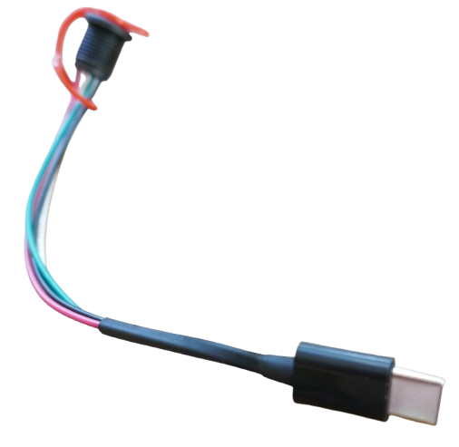

# MH-CD42 Emergency Light

> Using MG-CD42 to Create a Fully Portable Emergency Light

In this project, I am adding a custom powerbank to a **Haensch Comet 12-24V Emergency Light**, making it conveniently usable without any cables for 3-5 hours of operation.

The interesting part about this project is its creative use of affordable and readily available breakout boards to run 12V loads from a 1S LiIon (3.7V) powerbank:

*  [MH-CD42](https://done.land/components/power/powersupplies/battery/chargers/charge-discharge/ip5306/mh-cd42/) is used as a charger and discharger for a 1S LiIon cell
* **LX-LISC** is used as a super-small and super-efficient boost converter that boosts the 5V to 12V at 12W (without even getting hot). LX-LISC is actually just another battery charger, designed to charge 2S and 3S battery packs, but it also works as boost converter for 12V loads.

In this project you learn how to build your own custom powerbank that can drive 12V devices up to around 12-15W.

## Overview

Professional emergency lights are powered by car electric. For fixed installations, this is simple and robust. For portable use, though, a coiled power cord is needed that is cumbersome and can easily get into the way.

Operating such lights away from cars - to demo it, or to use it as a warning beacon on the road side - is almost impossible unless you have a separate 12V power supply.

### The Issue
I needed to run the light on the road side, with no 12v car electric available. 

So I previously used a strong USB powerbank and a USB trigger board to draw the 12V from the power bank which worked flawlessly. However it involved a lot of gear to carry around.

### The Plan
Why not build the powerbank right into the light? There is considerable unused space inside **Heansch Comet** emergency lights, and I always have older 18650 LiIon battery cells available that aren't first grade anymore but still strong enough to be repurposed for the light.

By integrating a custom powerbank into the light, it becomes a unique and truly independent hassle-free portable solution, requiring no power cable and external power supply anymore.

## The Design

Here is the design I came up with:

* **Battery Pack:**   
  4x 18650 LiIon battery cells, connected **in parallel**. This creates a battery pack with 3.7V nominal and roughly 10.000mAh (33Wh) - enough to operate the light for more than 4 hours.

* **Charger/Discharger:**
  [MH-CD42](https://done.land/components/power/powersupplies/battery/chargers/charge-discharge/ip5306/mh-cd42/) takes a 1S LiIon battery and outputs 2.4A at 5V (12W). It can also charge the battery at a maximum rate of 2.1A which is perfect for the size of battery pack (0.25C).

  
  
* **Boost Converter:**     
  Instead of a traditional bulky boost converter I opted for an affordable modern *IP2326* power management chip that is readily available on boards such as **LX LISC**. While this IC is typically used as a 2/3S charger, it can also work as a simple boost converter and yields impressive 1.5-2A (15W input) at 12V.

  

  

> [!NOTE]
> The LX-LISC board is available in a variety of versions. I came across versions **V1**, **V2**, and unmarked boards. Meanwhile, even a **V3** is available. All versions except **V3** look and feel very similar. I tested my setup both with a **V2** version and with an unmarked board.   

### Reasoning

There are a zillion ways to add portable power to a device, so here I share the reasoning behind the presented solution:

* *Why not 3S or 4S battery pack?*     
  A **4S** battery pack would natively produce the required 12V. Since Haensch Comet LED emergency lights accept 12-24V input, the light could have been directly driven off such a battery despite its varying output voltage (12.0-16.8V). 

  However, charger boards for 4S batteries are much harder to get than simple 1S chargers. Also, I was looking for a use case for an *IP5306*-driven charger/discharger, plus this chip comes with additional useful features such as support for a neat push button that can control the load.

* *Why not a classic boost converter?*     
  There are tons of affordable boost converter breakout boards available, and I own plenty of them. However, my experience with these is dissapointing: either they are very large and bulky (and would not fit into the lamp housing), or they do not come even close to the output power that is required without severe voltage drops.

  Worse yet, classic boost converters are fairly inefficient. That's generally not good for a battery-operated device, and it is particularly problematic because of the massive heat that is generated.

  I was pleasantly surprised to see 3S charger boards with modern power management ICs working phantastically as a boost converter. They seem to be highly efficient and can yield 10-15W output without getting very hot at all. They did not even require a heat sink.

* *Why not using a modern boost converter?*   
  I looked into *TPS61088* which is a highly efficient boost converter that yields up to 12V/3A. While this IC supports input voltages from as low as 2.7V, it was not able to provide the required currents at 12V directly from LiIon voltage. That's expected because the higher the voltage difference between input and output, the higher are the currents at input, which are eventually capped. 

  It turned out to be an ideal design to first use the MH-CD42 to produce strong and stable 5V, then take this voltage into a second boost converter to transform it to 12V. 

  The LX-LISC has yet another advantage when compared to simple boost converters like *TPS61088*: it has built-in thermal control via an external NTC thermistor. 

  Although I did not use it in this project, adding a temperature probe can add significant robustness: when you squeeze batteries in housings that already host power electronics, it is a good idea to keep an eye on temperature, and when it exceeds thresholds, shut down the device.

> [!NOTE]
> In this particular case, the emergency lamps' power electronics already comes with built-in thermal management: if it gets too hot inside the housing, the LED driver first reduces power and eventually shuts down the lamp.   

## 3.7V-to-12V Boost Solution

The boost solution in this project can be used for any scenario where you have a 1S LiIon battery and need to draw 12V at no more than 12-15W (1A).

Boosting is a two-step boost process: 

* **3.7V-to-5V:**     
  MH-CD42 connects to 1S LiIon input at 3.7V nominal, and outputs 5V.
* **5V-to-12V:**    
  LX-LISC gets the 5V input and boosts it to 12V output. **Add a  10kΩ thermistor to pin `NTC` for extra safety and embed it in your battery pack.**

### Caveats

* **Ensure 3S Configuration:**           
  Make sure your LX-LISC is [configured for **3S**](https://done.land/components/power/powersupplies/battery/chargers/charge-discharge/ip5306/mh-cd42/portableemergencylight/#lx-lisc). By default, it is often configured for **2S**.

* **Use Short Thick Wires:**          
  Use short wires with sufficient diameter (AWG 18/0.75 mm² at minimum). There are substantial currents involved: 1A at 12V is up to 4A at battery level.

    Long wires and/or insufficient diameter won't immediately cause meltdowns. This issue is rather that they cause a **significant voltage drop** at these currents. The power management ICs **may shut down** and go into error mode when detecting such an unusual voltage drop.

## Project Schematics

The overall schematics for this project just adds a few external components:

* **Push button:**     
  Controls MH-CD42. A single push opens its 5V output, and a dual push closes it. With this push button, you turn the light on and off. When the light is off, MH-CD42 enters standby mode and lowers power consumption to 50-100uA.
* **Rocker Switch:**     
  Cuts off the load physically. This may be necessary during charging. MH-CD42 always opens its 5V output during charging, and you can run the lamp from external chargers, bypassing the battery. If you don't want to run the lamp during charging, you can turn it physically off with the rocker switch.
* **State-of-Charge Meter:**     
  To estimate the charge remaining, a simple off-the-shelf 1S LiIon SOC gauge can be connected directly to the battery.

> [!TIP]
> If you flip the LX-LISC around you can wire it to MH-CD42 without crossing lines. The LX-LISC USB-C connector isn't used anyway.    

### Illuminated Push Button

I used a slick water-proof black metal push button with a built-in green LED:

My version has a 4-pin JST connector. The two black wires are connected to the push button. The red and brown wires connect to the internal green LED.

I connected these to the MH-CD42 5V output. This way the button provides immediate feedback when power is turned on. That's useful because LX-LISC takes 3-4 seconds before it starts boosting.

### Battery Gauge
MH-CD42 actually has a great battery gauge built-in (4 LEDs), however unless you want to mount it outside the housing or drill openings at the right places, you won't be able to see its LEDs later. Adding an extra **external** battery gauge is often the much easier approach. 

There are plenty of affordable off-the-shelf gauges available. They are very simple to use and need to be connected directly to the battery.

The model I opted for has a "TEST" bush button so it only consumes power when you need to check battery state. It also is very easy to mount: simply drill a hole for the wires, then glue the gauge to the outside of your housing.

Whichever gauge you end up choosing, make sure it is configured for *1S LiIon* (matches your battery). There are identical-looking variants for other battery chemistries (i.e. LiFePo4) and configurations (i.e. 2S, 3S, 4S, etc.).

## Preparation

### LX LISC

#### **Verify 3S Configuration**
Make sure you order the LX LISC **3S** version. If you got the **2S** version, remove the marked SMD resistor, and close the solder bridge:

#### Overheat Protection
When you look at the bottom side of LX-LISC you see additional through-hole pins that may be useful to enhance this project:

The **LED** pin isn't useful in this project: the emergency lamp itself clearly indicates when 12V output is available.

However the **NTC** pin can be useful: after all, the battery is installed in a housing where a high performance emergency light and its power electronics may generate considerable heat. Furthermore, the battery is installed close to the heat-generating power electronis.

#### Add Thermistor (optional)
LX-LISC has a built-in thermal management and can protect your device from overheating:

* Replace the 51kΩ SMD resistor on the LX-LISC board next to the mark **NTC** (the resistor itself is marked `513`) with a  82kΩ, 1% SMD resistor. 
* Add a 100kΩ NTC thermistor (B=4100K) to pins `NTC` and `GND`. Embed it into your battery pack where you expect the most heat.

Here is what the thermistor does in a *IP2326* power management chip (that LX-LISC is using):

| Temperature (Celsius) | Action |
| --- | --- |
| 0-40 | normal operation, full current |
| 40-45 | reduced current |
| >45 | stop |
| <0 | stop |

As an added benefit, your battery is now also protected from charging below freezing point (which can damage LiIon batteries).

### Haensch Comet

Disassemble the emergency light:

1. Remove the screw from the transparent cap, then screw it off by turning it about 10 degrees.     
  
    

2. Remove the three screws that hold the light dome. Remove it, and make sure you are not pulling out the rubber seal. Now you see the inside of the housing.

    

3. Make yourself familiar with the available space. Keep in mind that the power electronics below the light dome is extensive and reaches inside the housing. Your head space is limited in certain areas.

    

4. Use a drill, and add the required holes for your connectors. 

    

5. I used a rocker switch, a push button, a USB-C connector, and a hole to mount a LiIon 1S charge meter:

    * Push button: connects to MH-CD42 `K` pin. Short press turns light on. Two short presses turns it off.
    * USB-C: connects to the MH-CD42 USB-C input for charging the battery
    * LiIon charge meter: simple off-the-shelf on-demand tester that shows the state of charge on button press
    * Rocker switch: turns the light *physically* off. I learned the hard way that MH-CD42 outputs 5V *always* when connected to a USB-C power supply, regardless of push button state. Since I don't want to keep the light on during charging, the rocker switch can be turned off for charging. 

    **Note:** the rocker switch was added later so it is missing on some of the images.

    
    

    

### USB Extension Cable

To conveniently charge the emergency light externally, I created a 4-wire USB-C extension cable that connects to a water-proof female USB-C connector externally, and a male USB-C connector internally.

There are also **two**-wire connectors, but then you can no longer charge via modern USB PD (power delivery) chargers which require the two extra data lines.

The water-proof USB-C connector (4 wires) is soldered to a **male** USB-C connector. Connect **V**, **D+**, **D-**, and **G** (there are tiny marks on the male connector PCB). 

> [!TIP]
> Male USB connectors sometimes come with a housing, but don't bother installing it. This connector will stay in place permanently and isn't visible later. A shrink tube serves the same purpose and spares fiddling.   

Once done, the cable can be conveniently mounted in the housing. The **male** USB-C connector fits through the mounting hole and later plugs into the MH-CD42 charger input:

Before you mount the cable, you may want to test your soldering job with one of the affordable USB wire testers.

## Wiring

### MH-CD42 (on the right):

* Battery cables to the 1S battery pack with 4x 18650 in parallel
* 5V output to the 5V input of the LX LISC
* USB-C for external charging (using USB-C extension cable)
* **Extra Tip:** If you flip around one of the two PCBs, you can connect them without crossing wires.

### LX-LISC (on the top):

* 5V input power from MH-CD42.    
* 12V output to the Haensch Comet power input (typically use the cable and connector that is supplied with the lamp and fits the light dome PCB). Add the rocker switch to the positive cable so you can manually control the lamp during charging.     
* USB-C not used.    

## Battery Pack
Whatever battery you end up using, here is what it **must** support:

* **Discharge:** **>4A**.
* **Charge:** up to **2.1A** charging current.

### LiIon Battery Cells
I used unprotected 4x 18650 LiIon cells with a total capacity of 10.000mAh, and no distinct BMS.

Here is my reasoning:

* Cell chemistry:
  * Li**Po** (affordable) is for **low currents only**.     
  * Li**FePo4** is not supported by *MH-CD42*.       
  * Li**Ion** (like 18650) work for high currents, are readily available.
* The unused space in the lamp housing provides enough room to arrange four 18650 with ease.
* A total capacity of 10.000mAh runs the lamp for many hours, so it is practically useful.
* Since the batteries are non-servicable (not to be replaced by a user), neither a reverse polarity protection nor a separate BMS is required. The MH-CD42 comes with all the vital protections (short-circuit, over-current, over-charge, over-discharge) and cuts off power when the battery voltage drops below 3.0V, and the LX-LISC cuts off the load when the batteries overheat (provided you install a thermistor).

I used nickel strips and spot welding to connect the four batteries, added the breakout boards, and secured it with Kapton tape. 

The setup is secured by a 3D printed enclosure that is screwed to the lamp housing.

### Add Connectors
If you use nickel strips like I did, make sure you add a few short ones so you can later easily solder additional wires to the battery:

* MH-CD42 battery pins
* 1S LiIon Charge Tester (optional)

You definitely do not want to solder wires directly to a battery.

### Designing Battery Pack (Shape) 

While there is plenty of unused room in the housing, there are areas to avoid: the lamps' power electronics below the light dome reduces headroom and is generating heat, so these parts should not come close to your battery cells.

Arrange your batteries, make sure they still fit **when the light dome is put back on**, and they are not too close to the heat-generating power electronics of the lamp.

If in doubt, reduce the battery pack from 4 cells to just three or two (they are connected in parallel anyway), provided your 18650 are high power versions that can safely deliver 2A each.

### Placing Battery
Make sure you place your battery pack so that it keeps distance to the emergency lamp power electronics. Use Kapton tape or other insulation to ensure that no electric contact can be made.

As heat images illustrate, even after prolonged lamp usage, the lamps' professional power electronic does an excellent job of heat dissipation.

Both MH-CD42 and LX-LISC are significant but moderate sources of heat. Even after half an hour of operation, LX-LISC temperature does not exceed 50C and feels just a little bit warm, not hot. 

That said, make sure you do not tape these boards to your battery pack. Instead, try and locate them in a floating manner with some air circulation.

Here is another close-up after one hour of operation:

MH-CD42 is at around 40C, and LX-LISC runs at around 48C - both excellent long-term values. Just make sure these boards are not in direct contact with batteries or other electronic parts. 

### Connecting Battery Pack
When you are ready to connect the battery pack to your MH-CD42, make sure the emergency light dome is still **disconnected**.

If a load is connected to MH-CD42 when you connect it to the battery, then MH-CD42 will immediately turn on the load (the light in this case). This is caused by MH-CD42's automatic load detection feature. 

If this happens, double-short-press the push button to turn off the lamp. 

## Assembly

### Inserting Light Dome
The final step in your wiring should be plugging in the male light dome connector (that is soldered to the LX LISC's output) into the light dome female connector on the emergency light dome. 

Now, insert the dome so it rests on its three fixations. Make sure the dome sits evenly, and do not apply any pressure or force at all. If there is any resistance keeping the dome from fitting in, it most likely is a part of your setup, i.e. the battery pack, colliding with some of the lamps power electronics components. 

Never force the dome in place. Instead, inspect the issue, and rearrange your components. When done, secure the dome with its three screws. 

### Adding Transparent Cap
Inspect the rubber seal of the housing, and make sure it is not pulled out anywhere. Gently push it back if needed.

Add the transparent cap to the housing, aligning it with the securing screw on its side. Turn the cap by 15 degrees until it snaps into place. Secure it with the screw on the side. Done.
   

## Using the Lamp

Using the lamp is a joy:
* **Turn on:**    
  A simple short push on the push button turns the light on. There is a 3s delay induced by how the LX LISC works (it first tests for a USB PD source).
* **Turn off:**    
  Double short-press to turn the lamp off. MH-CD42 goes into standby mode with quiescent current consumption in the uA.
* **Charging:**    
  Connect any USB charger via USB-C. Thanks to the 4-wire extension cable, both simple and USB PD chargers are supported. MH-CD42 will detect weak chargers and reduce charging rate.    
    
    After I ran the lamp for about half an hour, I recharged the batteries. They initially charged at around 2A. When charging was completed, the total refilled charge was around 1.600mAh (6.4Wh) which aligns with expectations:

  

### Supplying External USB Power

When you supply external USB power through the USB-C adapter, you can run the lamp for as long as you wish, bypassing the battery:

* MH-CD42 charges the battery until it is full, *-and-*
* MH-CD42 supplies the external USB power to LX-LISC which in turn powers the lamp, not drawing any energy from the battery.

If you want to charge only, without running the lamp, use the rocker switch to temporarily turn off the lamp.

> Tags: Haensch, Comet, Emergency Light, LX LISC, 3S Charger, MH-CD42, IP5306, USB-C Extension

[Visit Page on Website](https://done.land/components/power/powersupplies/battery/chargers/charge-discharge/ip5306/mh-cd42/portableemergencylight?141832081417255915) - created 2025-08-16 - last edited 2025-08-16
