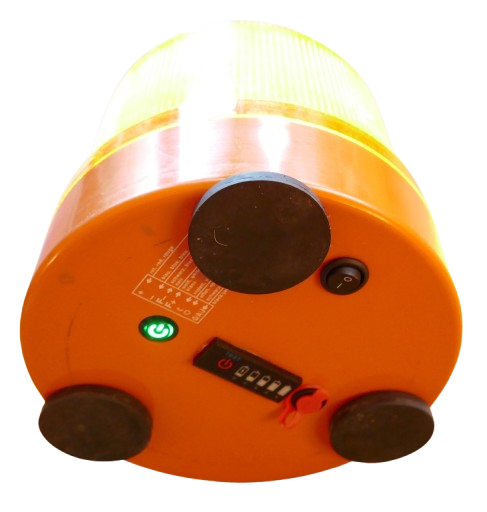

# MH-CD42 Emergency Light

> Using MG-CD42 to Create a Fully Portable Emergency Light

In this project, I am adding a custom powerbank to a **Haensch Comet 12-24V Emergency Light**, maing it conveniently usable without any cables for 3-5 hours of operation.

The truly interesting part about this project is its creative use of affordable and readily available breakout boards:

* [MH-CD42](https://done.land/components/power/powersupplies/battery/chargers/charge-discharge/ip5306/mh-cd42/) is used as a charger and discharger for a 1S LiIon cell
* **LX-LISC** is used as a super-small and super-efficient boost converter that boosts the 5V to 12V at 12W (without even getting hot).     

  LX-LISC is actually just another battery charger, designed to charge 3S battery packs, but it also works as boost converter for 12V loads.

In this project you learn how to build your own custom powerbank that can drive 12V devices up to around 12-15W.

## Overview

Typically, professional emergency lights are powered by car electric. That's simple and robust for fixed installations, yet portable emergency lights have to use a coiled wire that can get into the way.

### The Issue
Using emergency lights in a removable way (i.e. concealed law enforcement, volunteer emergency services, car breakdown, etc.) adds annoying cabling. If you want to use the light outside a car, additional 12V power supplies are required.

> [!TIP] 
> For a long time, my solution for away-from-car usage was a strong USB powerbank and a USB trigger board. That worked very well but involved a lot of gear.

### The Plan
There is considerable unused space inside **Heansch Comet** emergency lights, and I always have older 18650 LiIon battery cells around that aren't first grade anymore but still useful.

By adding a LiIon battery pack to the lamp, it works independent of external power and requires no more cables.

## The Design

Here is the design I came up with:

* **Battery Pack:**   
  4x 18650 LiIon battery cells, connected **in parallel**. This creates a battery pack with 3.7V nominal and roughly 10.000mAh (33Wh) - enough to operate the light for around 4 hours.
* **Charger/Discharger:**
  [MH-CD42](https://done.land/components/power/powersupplies/battery/chargers/charge-discharge/ip5306/mh-cd42/) takes a 1S LiIon battery and produces 2.4A output at 5V (12W). It can also charge the battery at a maximum rate of 2.1A which is perfect for the size of battery pack (0.25C).
* **Boost Converter:**     
  Instead of a traditional bulky boost converter I opted for an affordable modern *IP2326* power management chip that is readily available on boards such as **LX LISC**. While this IC was designed as a 2/3S charger, it can also be used as a simple boost converter and yields impressive 1.5-2A (15W input) at around 12V.

### Reasoning

* *Why not 3S or 4S battery pack?*     
  A 4S battery pack would natively produce the required 12V. Since Haensch Comet LED emergency lights accept 12-24V input, the light could have been directly driven off such a battery despite its varying output voltage (12.0-16.8V). 

  However, charger boards for 4S batteries are much harder to get than simple 1S chargers. Also, I was looking for a use case for an *IP5306*-driven charger/discharger, and this chip comes with additional useful features such as support for a neat push button that can control the load.

* *Why not a classic boost converter?*     
  There are tons of affordable boost converter breakout boards available, and I own plenty of them. However, my experiences with these are dissapointing. Either they are very large and bulky (and would never fit into the lamp housing), or they do not come close to the output power that is required.

  Worse yet, classic boost converters are fairly inefficient. That's generally not good for a battery-operated device, and it is particularly problematic because of the massive heat that is generated.

  That's why I was pleasantly surprised to see that 3S charger boards with modern power management ICs work phantastically as a boost converter. They seem to work highly efficient and can yield 10-15W output without getting hot at all.

* *Why not using a modern boost converter?*   
  I looked into *TPS61088* which is a highly efficient boost converter that yields up to 12V/3A. While this IC supports input voltages from as low as 2.7V, it was not able to provide the required power at 12V from LiIon voltage. That's expected because the higher the voltage difference between input and output, the higher are the currents at input. 

  It is actually an ideal design to first use the MH-CD42 to produce strong and stable 5V, then take this voltage into a second boost converter. I could have switched out the *LX LISC* 3S charger with a TPS61088 (which works well with 5V input instead of 3.7V directly from a battery), but when I realized all this, I already dedicated myself to LX LISC.

## Preparation

### LX LISC
Make sure you order the LX LISC **3S** version. If you got the **2S** version, remove the marked SMD resistor, and close the solder bridge:

### Haensch Comet

Disassemble the emergency light:

1. Remove the screw from the transparent cap, then screw it off by turning it about 10 degrees.     
  
    

2. Remove the three screws that hold the light dome. Remove it, and make sure you are not pulling out the rubber seal. Now you see the inside of the housing.

    

3. Make yourself familiar with the available space. Keep in mind that the power electronics below the light dome is extensive and reaches inside the housing. Your head space is limited in certain areas.

    

4. Use a drill, and add the required holes for your connectors. 

    

5. I used a rocker switch, a push button, a USB-C connector, and a hole to mount a LiIon 1S charge meter:

    * Push button: connects to MH-CD42 `K` pin. Short press turns light on. Two short presses turns it off.
    * USB-C: connects to the MH-CD42 USB-C input for charging the battery
    * LiIon charge meter: simple off-the-shelf on-demand tester that shows the state of charge on button press
    * Rocker switch: turns the light *physically* off. I learned the hard way that MH-CD42 outputs 5V *always* when connected to a USB-C power supply, regardless of push button state. Since I don't want to keep the light on during charging, the rocker switch can be turned off for charging. 

    **Note:** the rocker switch was added later so it is missing on some of the images.

    
    

    

### USB Extension Cable

To conveniently charge the emergency light externally, I put together a USB-C extension cable that connects to a water-proof female USB-C connector externally, and a male USB-C connector internally.

The water-proof USB-C connector (4 wires) was soldered to a **male** USB-C connector. I connected **V**, **D+**, **D-**, and **G**. 

**Note:** With **two**-wire connectors, you can no longer charge via modern USB PD (power delivery) chargers since these require the two additional data lines.

In the end, the cable can be conveniently mounted in the housing. The added **male** USB-C connector fits through the mounting hole and later plugs into the MH-CD42 charger input:

Verify your soldering job with one of the affordable generic USB wire testers before you mount the cable.

## Wiring

### MH-CD42 (on the right):

* Battery wires to the 1S battery pack with 4x 18650 in parallel
* 5V output to the 5V input of the LX LISC
* USB-C for external charging (using USB-C extension cable)

### LX-LISC (on the top):

* 5V input power from HO-CD42
* 12V output to the Haensch Comet power input (typically use the cable and connector that is supplied with the lamp and fits the light dome PCB). 

  Add the rocker switch to the positive cable so you can manually control the lamp during charging.
* USB-C not used
On the bottom of the lamp, I added the water-proof USB-C charging port.

## Battery Pack
I used unprotected 4x 18650 LiIon cells with a total capacity of 10.000mAh, and no distinct BMS.

Here is my reasoning:

* Batteries must sustain high currents. Li**Po** batteries (at least the affordable ones) are for **low currents only**. Li**Ion** batteries (like readily available 18650) are much better-suited for high currents (also, I had plenty of used 18650 laying around).
* The unused space in the lamp housing provides enough room to arrange four batteries with ease.
* A capacity of 10.000mAh provides enough energy to run the lamp for many hours, so it is practically useful.
* Since the batteries are non-servicable (not to be replaced by a user), neither a polarity protection nor a separate BMS was required. The MH-CD42 already comes with all the vital protections (short-circuit, over-current, over-charge, over-discharge) and cuts off power when the battery voltage drops below 3.0V.

I used nickel strips and spot welding to connect the four batteries, added the breakout boards, and secured it with Kapton tape. 

The setup is helt by a 3D printed enclosure that is screwed to the lamp housing.

### Add Connectors
If you use nickel strips like I did, make sure you add a few short ones so you can easily solder additional wires to the battery:

* MH-CD42 battery pins
* 1S LiIon Charge Tester (optional)

### Designing Battery Pack (Shape) 

Make up your mind how you want to shape your battery pack before you start. There is plenty of space in the lamp housing, but also space restrictions. Be certain that your battery pack actually fits into the lamp housing **when the light dome is put back on**. 

I initially did not take into account the extensive power electronics on the bottom side of the light dome that sticks deep into the housing in certain locations, so I had to redesign the shape of my battery pack. That was painful, so use scotch tape first to tape the batteries into the desired arrangement, then test your battery pack by putting back the light dome.

It is crucial that no part of the power electronics touches (or pierces) the batteries since these parts may get hot and need ventilation distance.

## Assembly

Connect the wires:

* add the LiIon 1S charging state board to the battery (optional).
* add the MH-CD42 5V output to the push button LED (if it has one).
* add the light dome connector that was soldered to the LX LISC to the light dome.

Then secure the light dome, add the cap, and you are done.

> [!IMPORTANT:]
> When you connect the light dome **before** you connect the battery to MH-CD42, then - due to the high load - MH-CD42 will immediately turn on the light (automatic load detection). In this case double-short-press the push button to turn off the lamp.    

## Using the Lamp
Using the lamp is a joy:

* **Turn on:**    
  A simple short push on the push button turns the light on. There is a 3s delay induced by how the LX LINC works (it first tests for a USB PD source).
* **Turn off:**    
  Double short-press to turn the lamp off. MH-CD42 goes into standby mode with quiescent current consumption in the uA.
* **Charging:**    
  Connect any USB charger via USB-C. Thanks to the 4-wire extension cable, both simple and USB PD chargers are supported. MH-CD42 will detect weak chargers and reduce charging rate. After I ran the lamp for about half an hour, I recharged the batteries. They initially charged at around 2A. When charging was completed, the total refilled charge was around 1.600mAh (6.4Wh) which aligns with expectations:

  

During charging, MH-CD42 always opens the 5V output, so during charging the lamp is always on - unless you installed the rocker switch and can turn it off (for charging only).

That's actually a useful feature since it enables you to run the light off an external USB power supply for as long as you want, independently of the battery: when MH-CD42 is supplied with USB-C power, it does not draw energy from the battery. It just charges it until it is full, and continues to use the external power supply to run the load.

> Tags: Haensch, Comet, Emergency Light, LX LISC, 3S Charger, MH-CD42, IP5306, USB-C Extension

