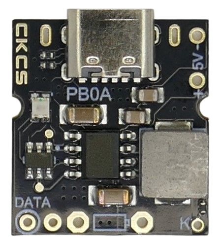
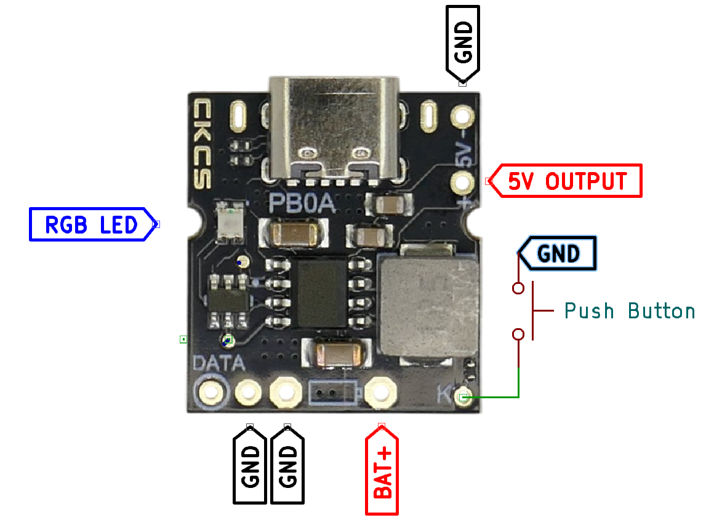
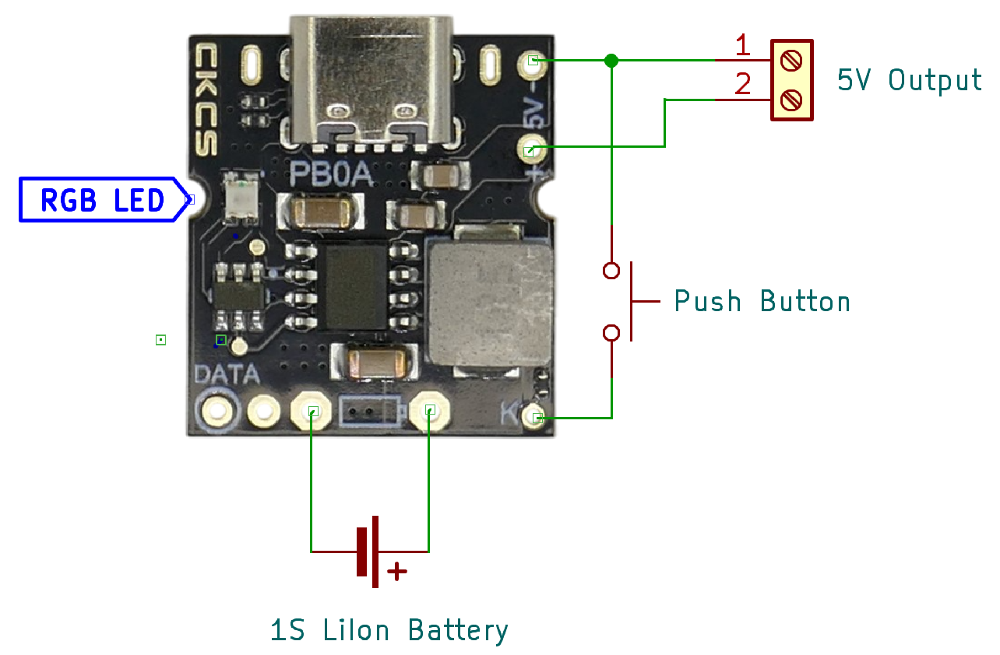
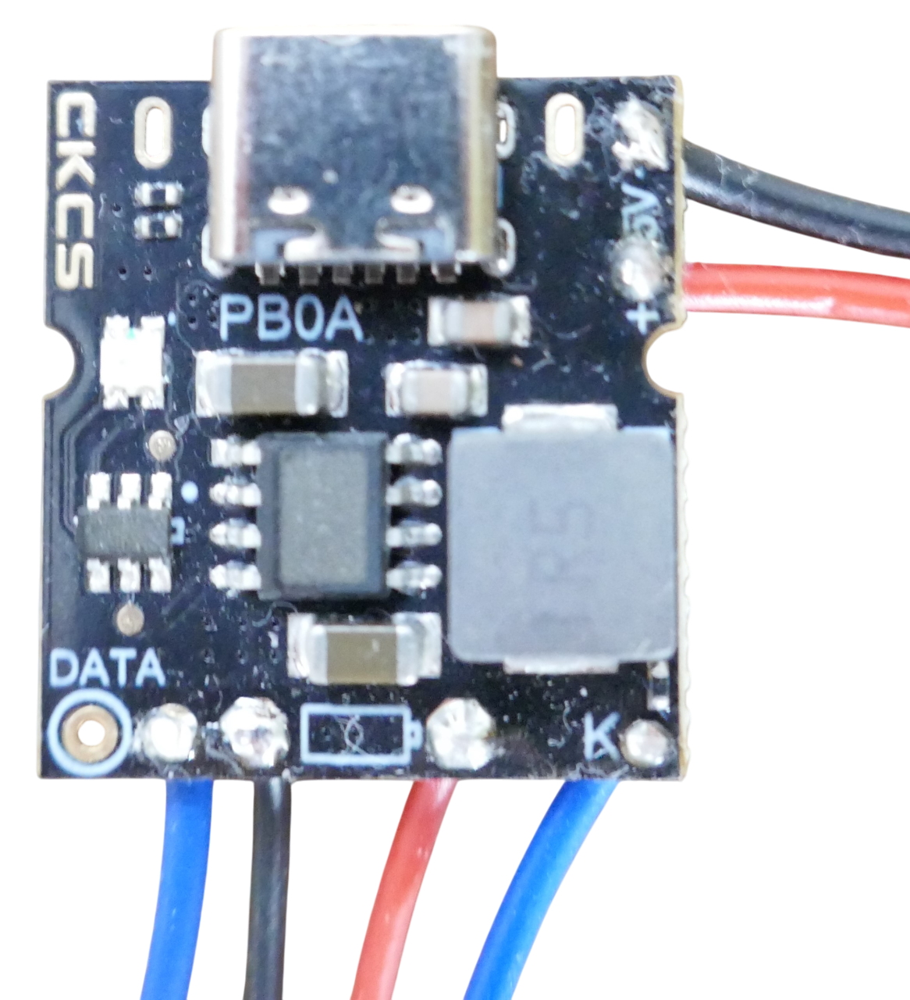
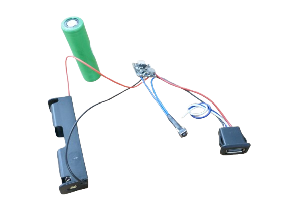
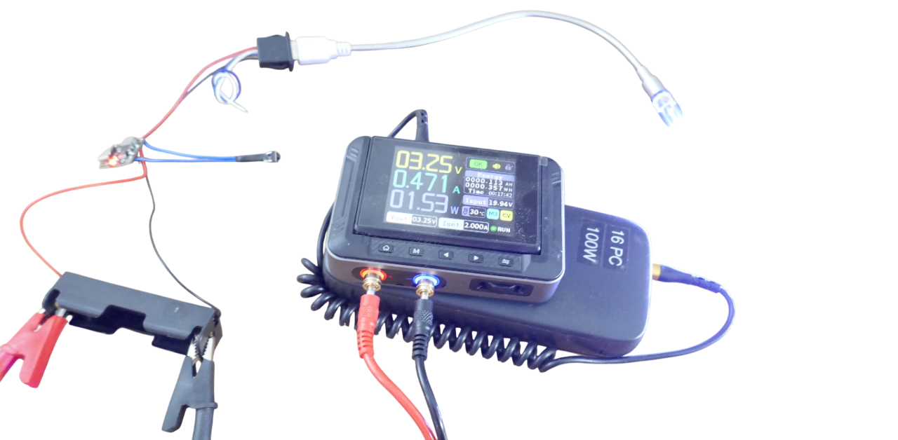

# PB0A Default Operation

> How To Use PB0A 1S LiIon Charger/Discharger Without Touching Its I2C Interface

The **PB0A** module can be used *as-is*, without requiring access to its built-in *I2C* interface. This article explains **PB0A**'s basic operation, wiring, and default behavior.

If you wish to *change* any of its *default* settings, you can later add a *microcontroller* and use the *I2C* interface.

> [!TIP]
> Before proceeding, read the article about the [IP5306](https://done.land/components/power/powersupplies/battery/chargers/charge-discharge/ip5306/) chip used in **PB0A**, and the [**PB0A** overview article](https://done.land/components/power/powersupplies/battery/chargers/charge-discharge/ip5306/pb0a/).

## Overview

By default—without adjustments via the *I2C* interface—**PB0A** operates as follows:

| Feature        | Description |
|----------------|-------------|
| Battery        | Connects to a single *LiIon* cell (*1S*) via two through-hole pins marked with a `battery symbol`. The pin next to the small "pin" in this symbol (adjacent to pin `K`) is `BAT+`; the other (adjacent to `DATA` and unmarked) is `BAT-`. |
| Charger Input  | The built-in *USB-C* connector serves as an *external power source* to *charge* the battery. This connector is **uni-directional** and only for charging. Charging occurs at a maximum of **2.1A**. |
| Power Output   | Pins `5V-` and `5V+` provide stabilized output power at **5V** and a maximum of **2.4A** (12W). - When charging, this output is powered by the charger. - When not charging, the output is powered by the battery and the internal boost controller. |
| Push Button    | A push button can be installed at `K` and `5V-`. When present, a single press turns the power output on manually, and a double short press turns it off manually. |
| Auto-Power     | By default, power output is enabled *automatically* when a load is connected, and disabled *automatically* once the load drops **<50mA** for a period of **>32s**; thus, a push button (manual operation) is not required. |
| RGB LED        | A single *RGB LED* indicates the current operational status. |

## Wiring

Typical basic wiring:

Here is the actual wiring on the board:

### Sample Setup

Note that **PB0A** uses the built-in *USB-C* connector **for charging only**. Power output is available at pins `5V+` and `5V-` only. 

Either directly connect a device, or connect a power output connector such as *USB-A*.

Here is a sample setup using a simple *18650* rechargeable LiIon battery holder:

When you now insert the battery into the battery holder, and connect a 5V device to your power connector (i.e. *USB-A*), it is powered from the battery until the battery voltage drops below *3.25V*.

During this phase, the on-board RGB LED pulsates. The color indicates the remaining power, transitioning from green to red.

> [!NOTE]
> You may have to push the push button once to turn on the power output.

To charge the battery, connect a USB power source to the built-in *USB-C* connector. 

#### Diagnostic Test Run
For a diagnostic test run, make sure no charger is connected to *USB-C*, and no battery is connected. 

Instead, connect a lab bench power supply to `GND` and `BAT+`. This enables you to simulate varying battery voltages and test how **PB0A* (and its built-in RGB LED) behave.

> [!IMPORTANT]
> Make sure you connect the lab bench power supply in correct polarity, and set it to a voltage in the LiIon battery range of **4.2-3.0V**. This is very important: a lab bench power supply can easily exceed the maximum allowable input voltage (**4.4V**) and potentially destroy the board. Also make sure your lab bench power supply isn't limiting current too much.

| Finding | Remark |
| --- | --- |
 RGB LED | 4.2-3.8V: pulsating green 3.7-3.5V: pulsating orange 3.4-3.2V: pulsating red |
| Discharge Protection | Power turns off at **<3.25V** |

> Tags: Charger, Li-Ion, LiIon, Li-Po, LiPo, IP5306, PB0A, Powerbank, USB-C, Power Supply, Boost Converter

[Visit Page on Website](https://done.land/components/power/powersupplies/battery/chargers/charge-discharge/ip5306/pb0a/defaultoperation?757111071612250154) - created 2025-07-11 - last edited 2025-07-12
