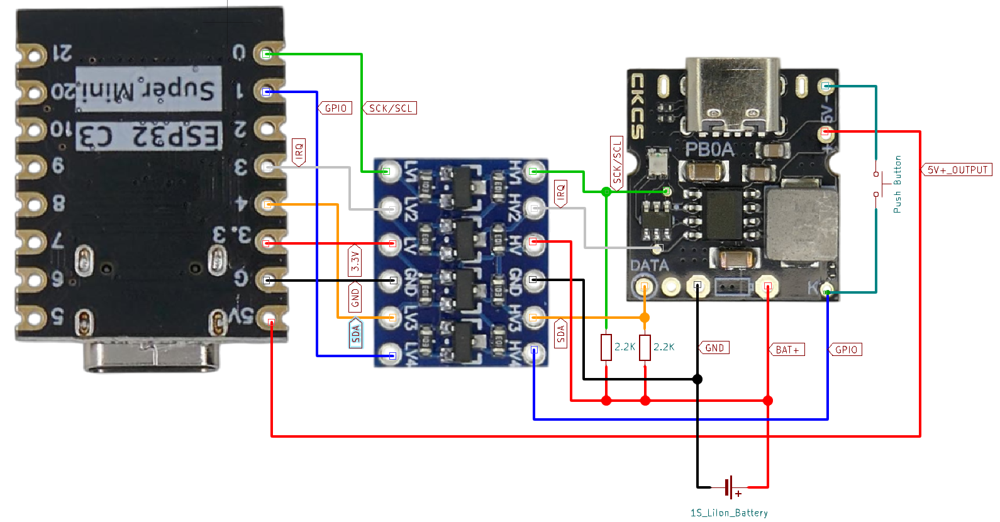

# PB0A I2C Production Setup

> Accessing PB0A I2C Interface In Power-Management Applications

**PB0A** provides great opportunities to control and fine-tune the power management functions via a microcontroller and its *I2C* interface. 

For this to be successful, a few caveats need to be addressed. The [**PB0A** basic *I2C* functionality](https://done.land/components/power/powersupplies/battery/chargers/charge-discharge/ip5306/pb0a/i2ctestsetup/) was addressed earlier in a test setup and isn't repeated here. Please [review](https://done.land/components/power/powersupplies/battery/chargers/charge-discharge/ip5306/pb0a/i2ctestsetup/) the introduction when needed.

In this article, **PB0A** production use is discussed.

## Overview
For production use, there are two challenges:

* **Microcontroller Required:**    
  Since *IP5306* has no built-in memory, it cannot store adjusted settings, nor can you "pre-program" the chip to your needs. Instead, your project **must** contain a microcontroller: each time *IP5306* enables its power output, the microcontroller needs to re-configure the chip via *I2C*.
* **TTL Logic Levels:**
  Your microcontroller and the *IP5306* chip used by **PB0A** must use the same voltages for logic levels in order to successufully communicate via *I2C*. Since the *IP5306* is powered by the *LiIon battery* (voltage range: *2.8-4.2V*), your microcontroller cannot directly interface with *IP5306*. Instead, a [level shifter](https://done.land/components/signalprocessing/levelshifter/) must be used. If you use a *3.3V* microcontroller, then it needs to be a *special* level shifter that accepts *higher* **as well as** *lower* voltages on the `HV` side since *3.3V* are somewhere in the middle of the range of the battery voltage. If you use a *5V* microcontroller, any [I2C compatible level shifter](https://done.land/components/signalprocessing/levelshifter/#ic) will do.

## Circuit Design Considerations

In this example, the microcontoller will be an affordable and small [ESP32-C3 SuperMini](https://done.land/components/microcontroller/families/esp/esp32/developmentboards/esp32-c3/c3supermini/).

### Level Shifter
Since *IP5306* communicates via *I2C* at *400kHz* ("fast" I2C), a sufficiently fast [I2C compatible level shifter](https://done.land/components/signalprocessing/levelshifter/#ic) is required.

#### Special Challenge: 3.3V Microcontroller
Since *ESP32-C3 SuperMini* is a *3.3V* microcontroller, the *voltage crossing* challenge applies: on the *high voltage* side of the level shifter, the battery voltage can be anywhere in a range of *2.8-4.2V*. On the *low voltage* side is the *3.3V* microcontroller supply. So when the battery is in its last 25% of capacity, its voltage will be **lower** than the microcontroller voltage.

This is a serious problem for most level shifters, especially when chip-based: they require `LV`<=`HV`. So when the voltage on the `HV` side (battery) drops below the voltage on the `LV` side (microcontroller), they no longer work correctly.

* A simple workaround is the use of MOSFET-based level shifters such as [BSS138-based level shifters](https://done.land/components/signalprocessing/levelshifter/bss138/). Even though such level shifters have the same `LV`<=`HV` requirement, due to the *body diode* inside the MOSFET, they typically keep working even when `LV`>`HV`.

  > Using any normal level shifter - including MOSFET types - with `LV`>`HV` is unsupported and not guaranteed to work. It *typically* works, and this is good enough for hobbyist projects. For more reliable operation, use [galvanically isolated level shifters](https://done.land/components/signalprocessing/levelshifter/#specialized-level-shifter-ics), i.e. based on *ISO1540/ISO1640*
* Or eliminate the *voltage crossing* challenge altogether by making sure the microcontroller voltage is **strictly below or above** battery voltage at all times, i.e. by using *1.6V* or *5V* microcontrollers instead of *3.3V*.    

### Powering the Microcontroller

The microcontroller needs to re-configure **PB0A** whenever it enables its power output. The simplest way to achieve this is to power the microcontroller via its `5V` pin directly off the **PB0A** power output. 

This way, whenever the power output is enabled, the microcontroller starts, and whenever the power output is disabled, the microcontroller is turned off.

This has a number of advantages:

* The microcontroller runs only when needed and does not consume power when **PB0A** is in standby. 
* If you use the microcontroller just for **PB0A** configuration, you can send it to deep sleep once the configuration is done. 
* If you use **PB0A** to provide portable power to your microcontroller project, the microcontroller can run as long as needed. The microcontroller can even turn off the **PB0A** power supply via *I2C*, which effectively is an elegant way of powering down your portable device.

## Schematics

Here is the parts list:

* **Microcontroller:**  [ESP32-C3 SuperMini](https://done.land/components/microcontroller/families/esp/esp32/developmentboards/esp32-c3/c3supermini/)   
* **I2C-Enabled IP1506 Power Management IC**    [PB0A](https://done.land/components/power/powersupplies/battery/chargers/charge-discharge/ip5306/pb0a/)     
* **MOSFET-based Level Shifter:**  [BSS138-based Module](https://done.land/components/signalprocessing/levelshifter/bss138/)
* **Pushbutton:**  *any*
* **1S LiIon Battery:**  *any*

### Wiring
The required connections can be seen here:

### Level Shifter
Note that the level shifter "translates" **four** lines. 

Strictly speaking, only the two *I2C* lines are required, but since the level shifter has four channels, two additional lines are translated for added opportunities:

* **I2C:** the original *I2C* lines **SDA** and **SCK/SCL**
* **IRQ:** the interrupt line that signals the state of **PB0A** (*optional*, not required)
* **GPIO:** the **PB0A* built-in GPIO on pin `K`. This way, the microcontroller can simulate push button presses, i.e. to turn off the power supply (*optional*, can also be achieved via *I2C*)

> Tags: IP5306, PB0A, I2C, Level Shifter, Voltage Crossing, BSS138

[Visit Page on Website](https://done.land/components/power/powersupplies/battery/chargers/charge-discharge/ip5306/pb0a/i2cproductionsetup?029566071424251232) - created 2025-07-23 - last edited 2025-07-23
