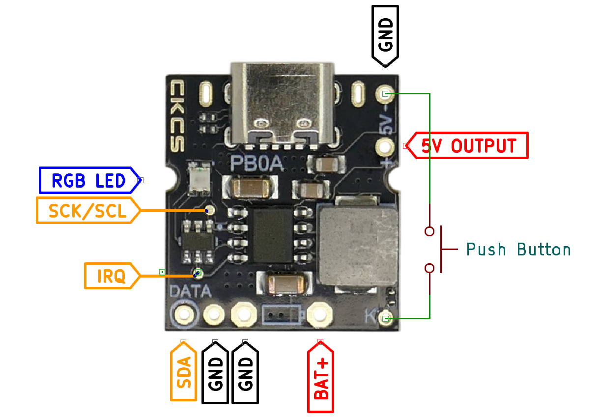
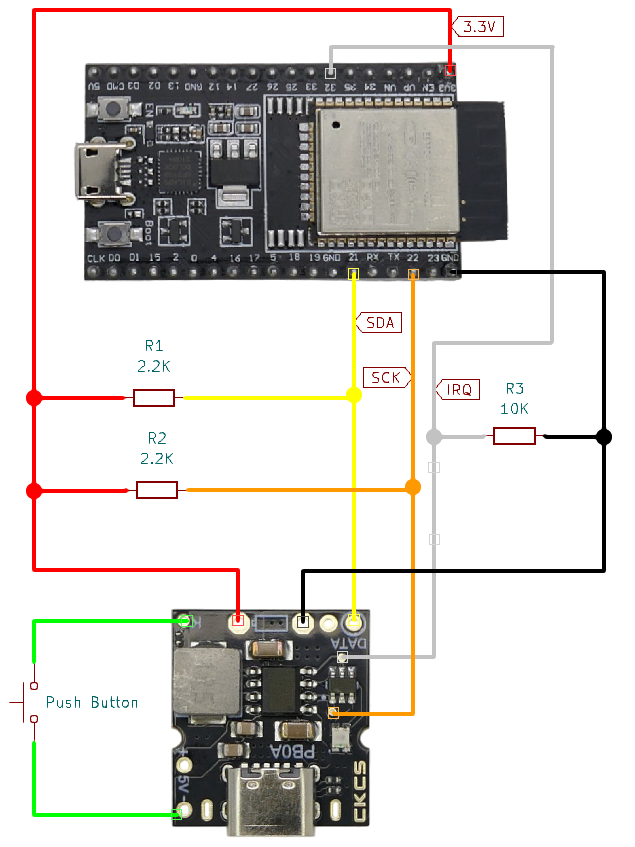

# PB0A I2C Test Setup

> Accessing PB0A I2C Interface For Testing

To test-drive the *I2C* interface on the **PB0A** board, you just need a microcontroller, and a few wires and resistors.


## Overview
For communication, both **PB0A** and the microcontroller must either run from the same power source, or use a special level shifter.

Since **PB0A** is powered from the battery input (range *3.0-4.2V*), normally it is not possible to run your microcontroller from this same voltage source. Most microcontrollers are not compatible with this voltage range and would be damaged.

Before we look at the requirements for a suitable level shifter that would allow your microcontroller to be run from a different voltage source, there *is one simple way* for a microcontroller to communicate with the **PB0A**:

Just power **PB0A** from the `3.3V` pin of your microcontroller, simulating a battery at this level.

### Ensuring Compatible Battery Voltage 
Simply connect `3.3V` of your microcontroller to `BAT+` on **PB0A**, and connect `GND` of both devices.

> [!IMPORTANT]
> This is a test setup simply to test-drive and experiment with the *I2C* interface. Obviously, the `3.3V` output of your microcontroller is not strong enough to drive external loads. So make sure there are no external loads connected to your **PB0A**'s `5V+` and `5V-` while powering it from your microcontroller pin.


### I2C Interface Pins

Here is how **PB0A** exposes its *I2C* interface:





| Pin | Pin on PCB | Description |
| --- | --- | --- |
| SDA | `DATA` | I2C data line |
| SCL/SCK | unmarked surface pad | I2C clock |
| VDD | `BAT+` | I2C is using battery voltage level |
| GND | `GND` | I2C and external microcontroller must share `GND` |
| IRQ | unmarked surface pad | `high` when *IP5306* power output is active |

## Wiring

Three resistors are required:

* **Pull-Up:**     
  Both `SDA` and `SCL` must be **pulled up** by a **strong** external pull-up resistor (*2.2KOhm* or lower). It is not sufficient to use internal pull-up resistors of your microcontroller.
* **Pull-Down:**     
  *IRQ* must be **pulled down** by a typical *10KOhm* resistor if you need the IRQ line. This line is `VDD` when the **PB0A** power output is active, else `low`.     
    
    Since it is not a compliant *digital* signal, make sure you connect this to an **analog input** GPIO. This pin will be at *battery voltage* when the power output is active. Either use *attenuation settings* (with *ESP32*, see code below), or use a voltage divider if your GPIO cannot handle up to *4.2V* input (battery voltage).



You must connect a push button between pins `K` and `5V-`/`GND` so you can enable the power output. This is necessary to activate the *I2C* interface which is only active when the power output is active, and the onboard LED is **on**.


## Source Code

In my test setup I used a [ESP32S DevKit V4](https://done.land/components/microcontroller/families/esp/esp32/developmentboards/esp32s/esp32devkitcv4/) with this platform.ini:

````
[env:esp32dev]
  platform = espressif32
  board = esp32doit-devkit-v1
  framework = arduino
  board_upload.flash_size = 4MB
  monitor_speed = 115200
  upload_speed = 921600
  build_flags =
     #-DBOARD_HAS_PSRAM
     # -mfix-esp32-psram-cache-issue
     -DARDUINO_ESP32_DEV
````

Any microcontroller will do. If you decide to use a different one,  adjust GPIO numbers in wiring and source code as appropriate.

### Main Program
The main program uses the *wire* library to establish the *I2C* communication:

````c++
#include <Arduino.h>
#include <Wire.h>
#include <ip5306.h>

#define IRQ1 32          // ANALOG-IN (!) GPIO for IRQ

int I2Caddress = 0x75;   // IP5306 I2C address 

void setup()
{
  // IRQ pin *should* be digital but in reality, its digital
  // voltage levels for "high" and "low" differ from the levels
  // expected by microcontroller. Therefore read this as
  // analog value with maximum voltage range:
  analogSetAttenuation(ADC_11db);
  pinMode(IRQ1, ANALOG); 

  Wire.begin();
  Serial.begin(115200);
  delay(2000);
  
  Serial.println("\nMake sure you use the correct I2C pins for your board:");
  Serial.printf("SDA: %d\n", SDA);
  Serial.printf("SCL: %d\n", SCL);
  Serial.println("======================================");
}

void loop()
{
  // check whether the power output is active
  // this should be the case since in typical setups,
  // the microcontroller is driven by this power output.
  //
  // in test scenarios where ip5306 is powered by the 3.3V
  // pin from the microcontroller, this check may be important
  //
  // first read the raw analog value:
  int rawAnalogIrq = analogRead(IRQ1);
  // next, do a manual comparison to see whether it
  // shows battery VDD:
  bool powerOutputActive = rawAnalogIrq > 4000;

  // flag for successful I2C connection:
  bool i2c_ready = false;

  // if the power output is active, then I2C should be available.
  // perform a check:
  if (powerOutputActive) {
    Wire.beginTransmission(I2Caddress);
    byte error = Wire.endTransmission();
    i2c_ready = (error == 0);
  }

  // if I2C is responding, query some ip5306 settings:
  if (i2c_ready) {
      Serial.print("raw IRQ analog: ");
      Serial.println(rawAnalogIrq);
      bool lpt = IP5306_GetLongPressTime();
      Serial.print("Long Press Time: ");
      Serial.println(lpt);
      bool pws = IP5306_GetPowerSource();
      Serial.print("Power Source: ");
      Serial.println(pws);
      bool lld = IP5306_GetOutputLoad();
      Serial.print("Light Load: ");
      Serial.println(lld);
      int llst = IP5306_GetOutputLoad();
      Serial.print("Light Load shutdown time: ");
      Serial.println(llst);
      int vin = IP5306_GetVinCurrent();
      Serial.print("Vin Current: ");
      Serial.println(vin);
    }  else  {
      // if I2C is not responding, emit a message:
      Serial.print("--not responding: IRQ=");
      Serial.print(powerOutputActive);
      Serial.print(", rawIRQ=");
      Serial.print(rawAnalogIrq);
      Serial.print(", I2C ready=");
      Serial.print(i2c_ready);
      Serial.println("--");
    }
    
    delay(500);           // wait 0.5 seconds for next scan
}
````

It uses a special *IP5306* library to handle the specific *I2C registers* and interpret the meaning of register bits.

### IP5306 Library

Either use one of the many available *IP5306* libraries, or add the library to your project yourself:

1. In *platform.io*, in your project, create a new folder named `IP5306` in the existing subfolder `lib`.
2. In the folder `IP5306`, create two files: `ip5306.h` and `ip5306.cpp`.

#### Source code for `ip5306.h`
Here is the source code for `ip5306.h`:

````c++
/*
  IP5306.h - Library for IP5306_I2C Power controller.
  Created by Sebastian Haap, December 3, 2019.
  Based on https://gist.github.com/me-no-dev/7702f08dd578de5efa47caf322250b57
*/

#ifndef IP5306_h
#define IP5306_h

#include "Wire.h"

#define IP5306_REG_SYS_0    0x00
#define IP5306_REG_SYS_1    0x01
#define IP5306_REG_SYS_2    0x02
#define IP5306_REG_CHG_0    0x20
#define IP5306_REG_CHG_1    0x21
#define IP5306_REG_CHG_2    0x22
#define IP5306_REG_CHG_3    0x23
#define IP5306_REG_CHG_4    0x24
#define IP5306_REG_READ_0   0x70
#define IP5306_REG_READ_1   0x71
#define IP5306_REG_READ_2   0x72
#define IP5306_REG_READ_3   0x77
#define IP5306_REG_READ_4   0x78

#define IP5306_GetKeyOffEnabled()               ip5306_get_bits(IP5306_REG_SYS_0, 0, 1)
#define IP5306_SetKeyOffEnabled(v)              ip5306_set_bits(IP5306_REG_SYS_0, 0, 1, v)
//0:dis,*1:en

#define IP5306_GetBoostOutputEnabled()          ip5306_get_bits(IP5306_REG_SYS_0, 1, 1)
#define IP5306_SetBoostOutputEnabled(v)         ip5306_set_bits(IP5306_REG_SYS_0, 1, 1, v)
//*0:dis,1:en

#define IP5306_GetPowerOnLoadEnabled()          ip5306_get_bits(IP5306_REG_SYS_0, 2, 1)
#define IP5306_SetPowerOnLoadEnabled(v)         ip5306_set_bits(IP5306_REG_SYS_0, 2, 1, v)
//0:dis,*1:en

#define IP5306_GetChargerEnabled()              ip5306_get_bits(IP5306_REG_SYS_0, 4, 1)
#define IP5306_SetChargerEnabled(v)             ip5306_set_bits(IP5306_REG_SYS_0, 4, 1, v)
//0:dis,*1:en

#define IP5306_GetBoostEnabled()                ip5306_get_bits(IP5306_REG_SYS_0, 5, 1)
#define IP5306_SetBoostEnabled(v)               ip5306_set_bits(IP5306_REG_SYS_0, 5, 1, v)
//0:dis,*1:en

#define IP5306_GetLowBatShutdownEnable()        ip5306_get_bits(IP5306_REG_SYS_1, 0, 1)
#define IP5306_SetLowBatShutdownEnable(v)       ip5306_set_bits(IP5306_REG_SYS_1, 0, 1, v)
//0:dis,*1:en

#define IP5306_GetBoostAfterVin()               ip5306_get_bits(IP5306_REG_SYS_1, 2, 1)
#define IP5306_SetBoostAfterVin(v)              ip5306_set_bits(IP5306_REG_SYS_1, 2, 1, v)
//0:Closed, *1:Open

#define IP5306_GetShortPressBoostSwitchEnable() ip5306_get_bits(IP5306_REG_SYS_1, 5, 1)
#define IP5306_SetShortPressBoostSwitchEnable(v) ip5306_set_bits(IP5306_REG_SYS_1, 5, 1, v)
//*0:disabled, 1:enabled

#define IP5306_GetFlashlightClicks()            ip5306_get_bits(IP5306_REG_SYS_1, 6, 1)
#define IP5306_SetFlashlightClicks(v)           ip5306_set_bits(IP5306_REG_SYS_1, 6, 1, v)
//*0:short press twice, 1:long press

#define IP5306_GetBoostOffClicks()              ip5306_get_bits(IP5306_REG_SYS_1, 7, 1)
#define IP5306_SetBoostOffClicks(v)             ip5306_set_bits(IP5306_REG_SYS_1, 7, 1, v)
//*0:long press, 1:short press twice

#define IP5306_GetLightLoadShutdownTime()       ip5306_get_bits(IP5306_REG_SYS_2, 2, 2)
#define IP5306_SetLightLoadShutdownTime(v)      ip5306_set_bits(IP5306_REG_SYS_2, 2, 2, v)
//0:8s, *1:32s, 2:16s, 3:64s

#define IP5306_GetLongPressTime()               ip5306_get_bits(IP5306_REG_SYS_2, 4, 1)
#define IP5306_SetLongPressTime(v)              ip5306_set_bits(IP5306_REG_SYS_2, 4, 1, v)
//*0:2s, 1:3s

#define IP5306_GetChargingFullStopVoltage()     ip5306_get_bits(IP5306_REG_CHG_0, 0, 2)
#define IP5306_SetChargingFullStopVoltage(v)    ip5306_set_bits(IP5306_REG_CHG_0, 0, 2, v)
//0:4.14V, *1:4.17V, 2:4.185V, 3:4.2V (values are for charge cutoff voltage 4.2V, 0 or 1 is recommended)

#define IP5306_GetChargeUnderVoltageLoop()      ip5306_get_bits(IP5306_REG_CHG_1, 2, 3)   
//Automatically adjust the charging current when the voltage of VOUT is greater than the set value
#define IP5306_SetChargeUnderVoltageLoop(v)     ip5306_set_bits(IP5306_REG_CHG_1, 2, 3, v)//Vout=4.45V + (v * 0.05V) (default 4.55V) 
// //When charging at the maximum current, the charge is less than the set value. Slowly reducing the charging current to maintain this voltage

#define IP5306_GetEndChargeCurrentDetection()   ip5306_get_bits(IP5306_REG_CHG_1, 6, 2)
#define IP5306_SetEndChargeCurrentDetection(v)  ip5306_set_bits(IP5306_REG_CHG_1, 6, 2, v)
//0:200mA, 1:400mA, *2:500mA, 3:600mA

#define IP5306_GetVoltagePressure()             ip5306_get_bits(IP5306_REG_CHG_2, 0, 2)
#define IP5306_SetVoltagePressure(v)            ip5306_set_bits(IP5306_REG_CHG_2, 0, 2, v)
//0:none, 1:14mV, *2:28mV, 3:42mV (28mV recommended for 4.2V)

#define IP5306_GetChargeCutoffVoltage()         ip5306_get_bits(IP5306_REG_CHG_2, 2, 2)
#define IP5306_SetChargeCutoffVoltage(v)        ip5306_set_bits(IP5306_REG_CHG_2, 2, 2, v)
//*0:4.2V, 1:4.3V, 2:4.35V, 3:4.4V

#define IP5306_GetChargeCCLoop()                ip5306_get_bits(IP5306_REG_CHG_3, 5, 1)
#define IP5306_SetChargeCCLoop(v)               ip5306_set_bits(IP5306_REG_CHG_3, 5, 1, v)
//0:BAT, *1:VIN

#define IP5306_GetVinCurrent()                  ip5306_get_bits(IP5306_REG_CHG_4, 0, 5)
#define IP5306_SetVinCurrent(v)                 ip5306_set_bits(IP5306_REG_CHG_4, 0, 5, v)
// Charging current: I=0.05 + 00.1 + 10.2 + 20.4 + 30.8 + 4*1.6A

#define IP5306_GetShortPressDetected()          ip5306_get_bits(IP5306_REG_READ_3, 0, 1)
#define IP5306_ClearShortPressDetected()        ip5306_set_bits(IP5306_REG_READ_3, 0, 1, 1)

#define IP5306_GetLongPressDetected()           ip5306_get_bits(IP5306_REG_READ_3, 1, 1)
#define IP5306_ClearLongPressDetected()         ip5306_set_bits(IP5306_REG_READ_3, 1, 1, 1)

#define IP5306_GetDoubleClickDetected()         ip5306_get_bits(IP5306_REG_READ_3, 2, 1)
#define IP5306_ClearDoubleClickDetected()       ip5306_set_bits(IP5306_REG_READ_3, 2, 1, 1)

#define IP5306_GetPowerSource()                 ip5306_get_bits(IP5306_REG_READ_0, 3, 1)
//0:BAT, 1:VIN
#define IP5306_GetBatteryFull()                 ip5306_get_bits(IP5306_REG_READ_1, 3, 1)
//0:CHG/DIS, 1:FULL
#define IP5306_GetLevelLeds()                ((~ip5306_get_bits(IP5306_REG_READ_4, 4, 4)) & 0x0F)
//LED[0-4] State (inverted)
#define IP5306_GetOutputLoad()                  ip5306_get_bits(IP5306_REG_READ_2, 2, 1)
//0:heavy, 1:light

#define IP5306_LEDS2PCT(byte)  \
  ((byte & 0x01 ? 25 : 0) + \
  (byte & 0x02 ? 25 : 0) + \
  (byte & 0x04 ? 25 : 0) + \
  (byte & 0x08 ? 25 : 0))

int ip5306_get_reg(uint8_t reg);
int ip5306_set_reg(uint8_t reg, uint8_t value);
uint8_t ip5306_get_bits(uint8_t reg, uint8_t index, uint8_t bits);
void ip5306_set_bits(uint8_t reg, uint8_t index, uint8_t bits, uint8_t value);


#endif
````


#### Source Code for `ip5306.cpp`

And here is the source code for `ip5306.cpp`:

````c++
/*
  IP5306.cpp - Library for IP5306_I2C Power controller.
  Created by Sebastian Haap, December 3, 2019.
  Based on https://gist.github.com/me-no-dev/7702f08dd578de5efa47caf322250b57
*/

#include "Wire.h"
#include "ip5306.h"

int ip5306_get_reg(uint8_t reg){
    Wire.beginTransmission(0x75);
    Wire.write(reg);
    if(Wire.endTransmission(false) == 0 && Wire.requestFrom(0x75, 1)){
        return Wire.read();
    }
    return -1;
}

int ip5306_set_reg(uint8_t reg, uint8_t value){
    Wire.beginTransmission(0x75);
    Wire.write(reg);
    Wire.write(value);
    if(Wire.endTransmission(true) == 0){
        return 0;
    }
    return -1;
}

uint8_t ip5306_get_bits(uint8_t reg, uint8_t index, uint8_t bits){
    int value = ip5306_get_reg(reg);
    if(value < 0){
        //Serial.printf("ip5306_get_bits fail: 0x%02x\n", reg);
        return 0;
    }
    return (value >> index) & ((1 << bits)-1);
}

void ip5306_set_bits(uint8_t reg, uint8_t index, uint8_t bits, uint8_t value){
    uint8_t mask = (1 << bits) - 1;
    int v = ip5306_get_reg(reg);
    if(v < 0){
        //Serial.printf("ip5306_get_reg fail: 0x%02x\n", reg);
        return;
    }
    v &= ~(mask << index);
    v |= ((value & mask) << index);
    if(ip5306_set_reg(reg, v)){
        //Serial.printf("ip5306_set_bits fail: 0x%02x\n", reg);
    }
}
````

## Running the Code
Once you uploaded the source code to your microcontroller, and then did the wiring, once the microcontroller is powered on (i.e. powered by its USB connector), **PB0A** also receives power.

Make sure you run your microcontroller with an attached terminal window set to *115.200* baud since all information is returned to the terminal. For example, in *platform.io*, choose *Upload and Monitor*, or *Monitor*.

In order for *I2C* to work in this test scenario, you need to *enable power output* by pressing the push button once for a short period of time. The onboard LED should start pulsating, and now you can connect to *I2C*.


### I2C Issues - and Workarounds

On the board, you see two ICs. The larger one is the IP5306. The smaller one seems to be an RGB controller that manages the on-board WS2812 RGB LED. This second controller is **also** using the I2C interface - and may interfere.

In many tests with different microcontrollers and configurations, it turned out that some microcontroller boards manage to use I2C with the RGB controller in place, whereas other microcontrollers require you to remove the RGB controller.

In my own tests, a classic ESP32 DevKit V2 board was able to use I2C with the unaltered board, whereas a ESP32-C3 SuperMini struggled. 

If you experience difficulties talking to I2C, you may want to remove the RGB controller chip. Once removed, I2C works reliably with any microcontroller.


### Performing Test Run
Once you add power to your microcontroller, it also powers the **PB0A** module through its `3.3V` pin.

You now need to press the push button once **in a timely manner** - do not wait for too long after providing power to your setup. Else, *IP5306* assumes there is no microcontroller and no need for *I2C*, and **disables the interface**.

Pressing the push button lets **PB0A** wake up from standby: the built-in RGB LED starts to pulsate, and the pin `IRQ` is set to battery voltage.

This is the signal for the firmware to start and initiate *I2C* communication, and when successful, it dumps a few *IP5306* settings to the terminal window:

````
raw IRQ analog: 4095
Long Press Time: 0
Power Source: 0
Light Load: 1
Light Load shutdown time: 1
Vin Current: 22
raw IRQ analog: 4095
Long Press Time: 0
Power Source: 0
Light Load: 1
Light Load shutdown time: 1
Vin Current: 22
(...)
````

### Solving I2C Connection Issues
If no *I2C* connection can be established, status messages are emitted:

````
--not responding: IRQ=0, rawIRQ=2794, I2C ready=0--
--not responding: IRQ=0, rawIRQ=2789, I2C ready=0--
--not responding: IRQ=0, rawIRQ=2790, I2C ready=0--
(...)
````

* **Power Output Not Active:**    
  If `rawIRQ` is below *4000*, then **PB01** power output is not active: make sure you pressed the push button, and the built-in RGB LED is pulsating.
* **I2C Disabled:**     
  If `IRQ=1` but `I2C ready=0`, then the *I2C interface* is not functional. Typically this is because you waited to long from initial powering on to establishing the first *I2C* communication. Remove power from **PB0A**, then power it on again, and try once more.     

    Keep in mind:     
    * once you established *I2C* connection **once**, *IP5306* knows that you are using *I2C* and will accept connections in the future (until you completely remove power from **PB0A** in which case it resets to default behavior again).
    * if you **change** settings via *I2C*, these changes will stay in effect until you *disable power output*. Custom settings must be set **each time the power output is activated**.
* **Other Reasons:**      
  A breadboard design can have many other points of potential failures, due to the relatively high speed of the *I2C* interface which operates at *400kHz*:     
    * **Cable length:** long *I2C* cables may introduce noice and capacitance. Try and reduce cable lenghts.
    * **Connectors:** when using a breadboard, make sure all DuPont plugs are securely plugged. If in doubt, replace pluggable DuPont wires with soldered connections.


### Next Steps
Once *I2C* communication works, you should take a closer look at the `ip5306` library and its methods. You'll quickly realize which information now can be read and set by your microcontroller.

> [!IMPORTANT]
> Keep in mind that *IP5306*/**PB0A** has no internal memory, and you cannot permanently change the settings. Whenever the **PB0A** enables its power output, the microcontroller must (re)configure **PB0A** via *I2C*.

Once you have familiarized yourself with how *IP5306 I2C* works, the next step is running the microcontroller from the designated **PB0A** power output (instead powering **PB0A** from the microcontroller). This requires a specialized *level shifter* and is discussed separately.


> Tags: IP5306, PB0A, I2C

[Visit Page on Website](https://done.land/components/power/powersupplies/battery/chargers/charge-discharge/ip5306/pb0a/i2ctestsetup?128966071813251842) - created 2025-07-12 - last edited 2026-02-14
