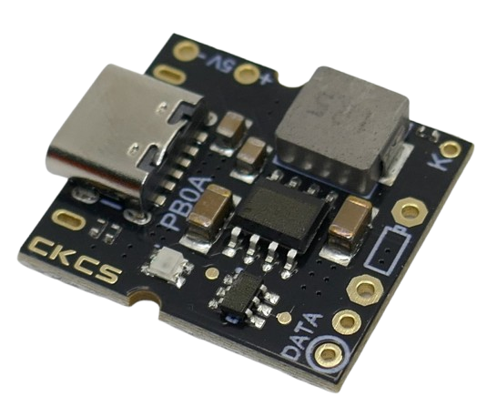
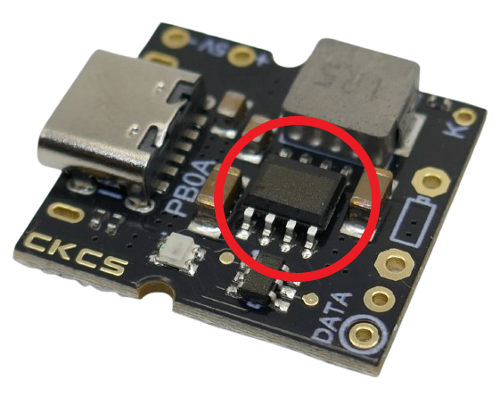
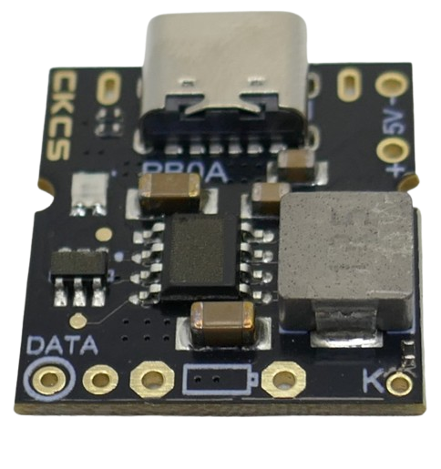
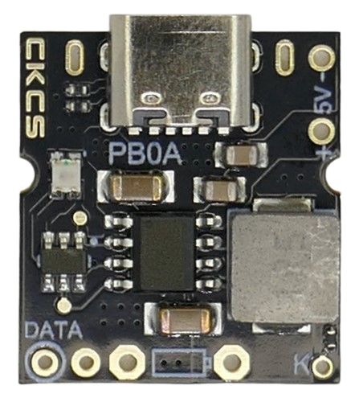
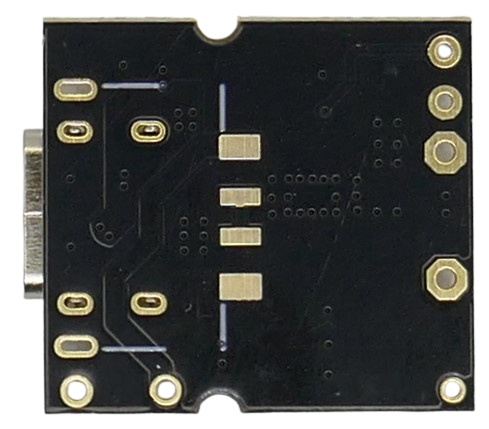
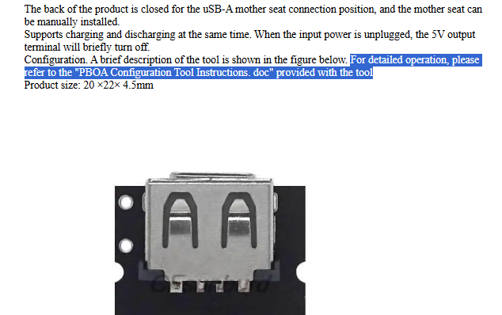
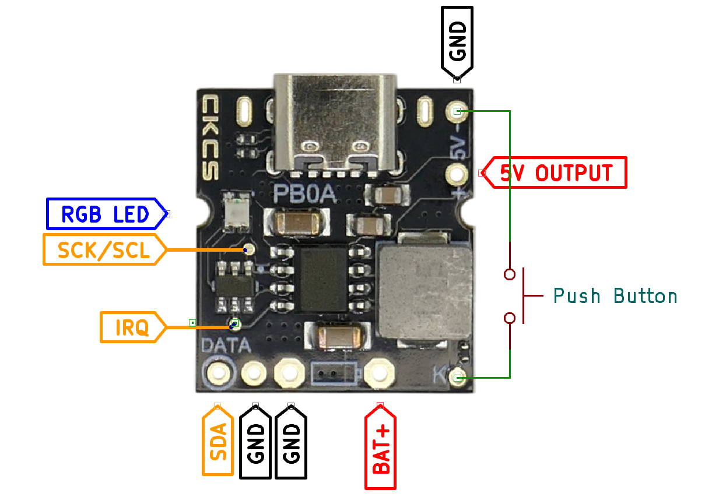

# CKCS PB0A

> I2C-Enabled Programmable 1S LiIon Charger and Discharger

The *PB0A* module is one of the most affordable **programmable** charger/dischargers for single-cell (1S) LiIon batteries. It supports *I2C*.

The module features a `DATA` through-hole pin and a separate solder pad on the front side, both providing access to its internal *I2C* programming interface.

## Overview

The *PB0A* breakout board is a sophisticated version of the basic [X-150](https://done.land/components/power/powersupplies/battery/chargers/charge-discharge/ip5306/x-150/). Both boards are based on the power management chip [IP5306](https://done.land/components/power/powersupplies/battery/chargers/charge-discharge/ip5306/), which comes in two different versions:

- **No I2C (non-programmable):**    
Basic versions (like the chip used on [X-150](https://done.land/components/power/powersupplies/battery/chargers/charge-discharge/ip5306/x-150/)) are **pre-programmed** and have no built-in *I2C* interface.
- **I2C (programmable):**    
*PB0A* (discussed here) uses a more advanced version of [IP5306](https://done.land/components/power/powersupplies/battery/chargers/charge-discharge/ip5306/) that includes an [I2C Interface](https://done.land/components/power/powersupplies/battery/chargers/charge-discharge/ip5306/#i2c-configuration).

| Feature | [X-150](https://done.land/components/power/powersupplies/battery/chargers/charge-discharge/ip5306/x-150/) | **PB0A** |
| --- | --- | --- |
| I2C Interface | ❌ | ✔️ |
| LEDs | 4 (monochrome) | 1 (RGB) |
| Charging Current | 2.4A | 2.4A (default), 0.05-3.2A (configurable) |
| Auto-Shutoff | *<50mA* for *>32s* | *<50mA* for *>32s* (default) 8s/16s/32s/no Auto-Shutoff (configurable) |

> [!IMPORTANT]
> You may want to familiarize yourself with [this comprehensive IP5306 guide](https://done.land/components/power/powersupplies/battery/chargers/charge-discharge/ip5306/) before reading on. The article you are currently reading focuses exclusively on the specific details and nuances of the PB0A breakout board.

### Why Use I2C?

If you are satisfied with the default specs of the [IP5306](https://done.land/components/power/powersupplies/battery/chargers/charge-discharge/ip5306/) or your project does not use a microcontroller, simpler breakout boards like [X-150](https://done.land/components/power/powersupplies/battery/chargers/charge-discharge/ip5306/x-150/) or [MH-CD42](https://done.land/components/power/powersupplies/battery/chargers/charge-discharge/ip5306/mh-cd42/) are easier to use and slightly cheaper. In fact, the **PB0A** behaves **exactly like those** by default.

However, when working with [IP5306](https://done.land/components/power/powersupplies/battery/chargers/charge-discharge/ip5306/)-based charger/dischargers, you may encounter some common issues:

- **Too much charging current:**  
By default, the [IP5306](https://done.land/components/power/powersupplies/battery/chargers/charge-discharge/ip5306/) delivers a maximum charging current of **2.4A**. For small batteries, especially affordable *LiPo* pouches with capacities of *400-3000mAh*, this current is **too high** and may damage the battery or create a fire hazard. The typical safe charging current for these batteries is **0.3C** (*100-900mA*).
- **Auto-Shutdown:**  
[IP5306](https://done.land/components/power/powersupplies/battery/chargers/charge-discharge/ip5306/) was designed for power banks and, by default, shuts down when output current drops below *50mA* for more than *32s*. For low-power projects or microcontrollers that occasionally enter *deep sleep*, this can cause unexpected power cuts.

With a **programmable [IP5306](https://done.land/components/power/powersupplies/battery/chargers/charge-discharge/ip5306/#i2c-configuration)**, you can *re-configure* the chip to:

- Raise or lower the maximum charging current
- Enable or disable the automatic shutdown feature

To do this, you need a microcontroller that can communicate with the *I2C* interface.

## Caveats

Before working with *PB0A* and its *I2C* interface, consider the following:

### Unmarked Chips

Many **PB0A** breakout boards use unmarked chips. It is not always clear whether these are original [IP5306](https://done.land/components/power/powersupplies/battery/chargers/charge-discharge/ip5306/) chips or clones, and whether they truly have an enabled *I2C* interface.

All boards acquired from various sources on *AliExpress* worked flawlessly.

### Confusing Labels

The battery output pins are marked with a battery symbol and lack distinct `BAT+` and `BAT-` labels. The small "pin" on the battery symbol marks the positive (`BAT+`) pin.

Make sure you connect the battery correctly. There is no *reverse polarity protection*, and connecting the battery in reverse will destroy the board.

Several additional pins and solder pads are unmarked, and one pin is labeled `DATA` (which really is the `SDA` pin for the *I2C* interface). The unmarked solder pads provide access to the remaining *I2C* pins (see [below](#missing-i2c-documentation) for clear pin labels).

### I2C vs Default Configuration

Some sellers claim the **PB0A** board delivers **3.2A** charging current (compared to **2.4A** for "normal" boards). This is only partly true: while the board **can** deliver up to **3.2A**, in its default configuration it is **identical** to [X-150](https://done.land/components/power/powersupplies/battery/chargers/charge-discharge/ip5306/x-150/) and [MH-CD42](https://done.land/components/power/powersupplies/battery/chargers/charge-discharge/ip5306/mh-cd42/):

- **Charging:** *2.4A* max.
- **Discharging:** *10W* (max *2.1A* at *5V*)

To unlock special **PB0A** features (like adjustable charging currents), you must use the *I2C* interface, and you need to do this *every time the board powers up* (it has no memory for persistent configuration).

Key conclusions:

- If your project does **not** use a microcontroller, choose the more affordable [X-150](https://done.land/components/power/powersupplies/battery/chargers/charge-discharge/ip5306/x-150/) or [MH-CD42](https://done.land/components/power/powersupplies/battery/chargers/charge-discharge/ip5306/mh-cd42/). Without *I2C* configuration, they behave **exactly** like the **PB0A**.
- If your project **does** use a microcontroller with *I2C*, **PB0A** is an **excellent choice** for portable power solutions. You can precisely adjust the charging current and avoid unwanted power cuts during microcontroller *deep sleep*.

## Understanding Power Output Paths

All [IP5306](https://done.land/components/power/powersupplies/battery/chargers/charge-discharge/ip5306/)-based boards, including **PB0A**, use **different connectors** for input and output. The *USB-C* connector is **only for charging** and does not supply power. It does not work bi-directional.

**PB0A** supplies *5V* at *10W*/*2.1A* output via its `5V+` and `5V-` solder pads and (optionally) the *USB-A* connector (solder pads on the module's backside).

### Power While Charging

This module can supply *5V* power to an external device while running from a *single cell LiIon battery*, even during charging via the *USB-C* connector.

However, unplugging the charging cable may cause a brief power interruption that can reboot microcontrollers (unless large-enough capacitors are used to bridge the gap). The reason:

- **Battery Operation:**  
Uses its boost converter to raise battery voltage to *5V*.
- **Charging:**  
Disables the boost converter and supplies *5V USB-C input* to both the charger and the external device.

When charging stops (USB-C unplugged), the module must re-enable its boost converter, causing a brief power gap.

This power path can draw up to **5A** during charging:

- **Charging:**  
  Up to *3.2A at 4.2V* (14W) to charge the battery
- **Device:**  
  Up to *2.1A at 5V* (10.5W) to the output
- **Total:**  
  Combined output power is *25W*.  
  The *USB-C power supply* must deliver up to *25W*/*5A* at *5V* for maximum performance.

### Push Button

An optional push button can be connected to the `K` and `GND` solder pads with a *10kΩ* resistor in series. The button is used to manually power an external device *on* or *off*.

Default behavior:

- **Short press (>30ms but <2s):** Turns on indicator LEDs and enables power output.
- **Double short press:** Turns off indicator LEDs and disables power output.

Button behavior can be adjusted via *I2C* (e.g., customizing which presses control on/off functions).

## Charging Mode

The built-in charger activates automatically when a power supply is connected to the *USB-C* port, charging the battery at up to *2.4A* (default) or *0.05-3.2A* (when configured via *I2C*).

## Supplying Power

The module provides *5V output* **on demand**, similar to a power bank:

- **Auto Power On:**  
When a load is connected to the *USB-A* connector (may not be soldered; see solder pads on the backside) or the `5V+`/`5V-` pins, the module enables its boost converter and supplies up to *10W* at *5V*.
- **Auto Power Off:**  
If the load draws less than *50mA* for *32s*, the module cuts power, disables the boost converter, and enters standby.

### Disabling Auto Power Off

The power supply behavior can be reconfigured via *I2C*. For microcontroller projects that are always connected, manual power control is often preferable:

- **Manual Power On and Off:**  
The **Auto Power On When Load Connected** feature can be disabled via *I2C* (Register `0x00`, set bit `2` to `0`). Power must then be enabled manually using a push button on pin `K`.  
  The module will no longer cut power automatically, even if current drops below *50mA*.  
  To power off, double-press the push button on `K`.

- **Continuous Operation for Microcontrollers:**  
  1. **Default:** Board powers on automatically when a load is detected (e.g., microcontroller connected).
  2. **Disable Auto Power On:** The microcontroller can disable "Auto Power On When Load Connected" via *I2C*, ensuring the power supply remains active even at low current draw.  
    Now, the microcontroller can safely enter *deep sleep* without losing power.
  3. **Permanent Off:** To turn off battery power, the microcontroller can re-enable "Auto Power On When Load Connected" via *I2C* and enter *deep sleep*. The board will detect *<50mA* current and turn off battery power until manually reactivated by the push button.

## Missing I2C Documentation

If you are curious to start using *I2C* to customize your **PB0A** now, there is one hurdle to take: lack of documentation.

Although sellers often mention a mysterious **PB0A Configuration Tool Instructions.doc** document, such a tool or document does **not** exist.

Fortunately, you don't need this. Here are the facts:

- **No Configuration Tool:**  
There is *no* specific "configuration tool" because it would not make sense anyway: [IP5306](https://done.land/components/power/powersupplies/battery/chargers/charge-discharge/ip5306/#i2c-configuration) *has no built-in memory* and **cannot be permanently re-programmed** by any external tool.  
  Instead, it must be configured at each power-on by a microcontroller that is part of your project.
- **Standard I2C Interface:**  
The board exposes a standard *I2C* interface on pins `DATA` (`SDA`) and `SCL` (via an unmarked solder pad). The I2C device address is `0x75`.

  Whenever [IP5306](https://done.land/components/power/powersupplies/battery/chargers/charge-discharge/ip5306/) starts supplying power, it also powers on your microcontroller. Your firmware should send the required configuration data via *I2C* each time the microcontroller is powered on.

- **Level Shifter Required:**  
*I2C* logic levels are tied to the *IP5306* internal voltages, which vary with battery charge (*2.8-4.2V*). For *I2C* to work, your microcontroller must be powered by the battery (**not** the *5V* output), or you must use a *level shifter*.

  Powering the microcontroller directly from the battery is usually infeasible, as most MCUs are incompatible with *2.8-4.2V*. Voltage regulators are also unsuitable, as they alter logic levels.

  Use a level shifter that supports independent voltages on both sides, since the battery voltage can be lower **or** higher than the MCU voltage. Most chip-based level shifters (like *TXS0108*) are unsuitable. Use one with discrete MOSFETs (like the *BSS138*).

  For testing only, you can power both the *PB0A* board and your microcontroller from a lab bench power supply set to *3.3V*, using `BAT+` and `GND` to simulate a suitable battery voltage.

- **Strong Pull-Ups Required:**  
  Both `SDA` and `SCK`/`SCL` must be pulled up to `VDD` (`BAT+`) with *2.2K* resistors. Due to the relatively high *400kHz I2C* speed and design, strong pull-ups are required. *10K* and higher resistors may not work.

> Tags: Charger, Li-Ion, LiIon, Li-Po, LiPo, Boost Converter, 2A, 3.2A, USB, 1S, X-150, IP5306, I2C, CKCS, PB0A Configuration Tool Instructions.doc, TXS0108, BSS138, Level Shifter, SCL, SDA, USB-C, USB-A, Push Button, Deep Sleep

[Visit Page on Website](https://done.land/components/power/powersupplies/battery/chargers/charge-discharge/ip5306/pb0a?992043071607250919) - created 2025-07-06 - last edited 2025-07-06
