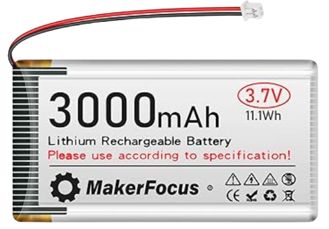
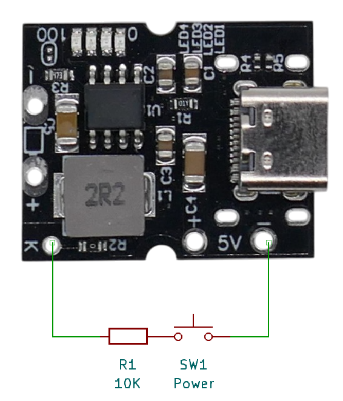
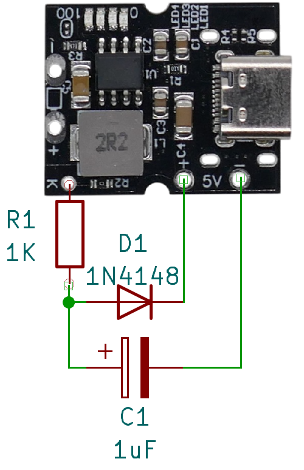

# IP5306 Power Management IC

> 2.4A 1S Li-Ion Charger Plus 5V 2A Boost Converter In One SoC Solution That Drives Many DIY Boards

The [IP5306](materials/ip5306_datasheet.pdf) is a fully integrated *power bank* system-on-chip with a *2.4A* charger and a *2A* discharger. This chip—or one of its many Chinese clones, like the [FM5324GA](materials/fm5324ga_datasheet_en.pdf)—is commonly used in modern DIY modules.

For highly integrated chips like this one, it is essential to understand their concepts and functionality before use. Some of its features - like its optional *torch mode* -  may not be immediately apparent and could lead to unintended risks. 

## Overview
The *IP5306* is found on affordable breakout boards like the [X-150](https://done.land/components/power/powersupplies/battery/chargers/charge-discharge/ip5306/x-150/) and the *MH-CD42*.

Modules utilizing this chip are highly compact (typically *15-20x25mm*) yet surprisingly powerful. With a single *Li-Ion* cell, they can deliver up to *2A* at *5V*. 

This compactness is made possible by a clever architecture that uses a single inductor for both charging and discharging operations.

How simultaneous charge and discharge really work
 

### Power Paths
This chip can **either** use its integrated boost converter to increase the battery voltage to *5V* at a maximum of *2A* output (*10W total*), **or** it can step down an external *5V* input to a charging voltage suitable for *Li-Ion* or *Li-Po* batteries. However, the chip can only perform *one* of these conversions at a time.

Despite this limitation, the chip supports simultaneous discharging and charging. This means you can operate a connected device both while the chip is charging and when the device is powered by the battery alone.

Understanding the involved switching between different power paths is critical.

### Battery Operation
When the chip operates solely on battery power, its boost converter supplies *5V* at a maximum of *2A* to the output, providing up to *10W* of power. The battery must be capable of supplying a peak current of *3.5A* to support this load. Be aware that smaller batteries or low-cost, low-current *Li-Po* batteries may not be sufficient to meet this demand.

### Charging
When an external *5V* power supply is connected, the chip dynamically switches internal power paths:
- The input voltage is stepped down to a suitable charging voltage for the battery, with a maximum charging current of *2.4A*.
- The internal boost converter is deactivated.
- The power output is now directly supplied by the *5V* input. 

This allows the device to continue operating while the battery is being charged. However, during this mode:
- If the connected device draws the full *10W* output **while** the battery is simultaneously charged at the maximum rate, the total power demand can reach *21W* when accounting for conversion inefficiencies.
- The external *5V* power supply must provide at least *4.2A* to handle this combined maximum load.
- If no device is connected to the output during charging, a standard *5V 2A* power supply is sufficient for charging the battery alone.

### Temporary Power Cut
When an external power supply is connected or disconnected, the chip actively switches power paths. During this transition, there may be a **brief power interruption** at the output. This can cause connected devices, such as microcontrollers, to reboot. To prevent this, you can add an appropriately sized capacitor to the output line, which will smooth out any voltage dips during these transitions.

### Use Cases
This chip is ideal for adding battery power to external *5V* devices such as microcontrollers, [WS2812](https://done.land/components/light/led/programmable/ws2812/) LED strips, DIY flashlights, and more. It is also suitable for building simple power banks.

#### Permanently Connected Devices
This chip is especially suited for adding battery support to *5V* devices:

- a *push button* can be used to control power to the connected device, so it can be turned on and off as needed.
- Only the device connected to the *power output* can draw energy from the battery.
- The *power input* is exclusively reserved for charging the battery and does not allow external devices to deplete the battery. 

#### Power Bank
When designing a power bank, the goal is to provide power on demand to various USB devices. To achieve this, you can add one or more USB connectors (of your chosen type) to the chip's power output.

Key considerations for power bank design with this chip:
- The chip provides a fixed *5V* output voltage only. This limitation is a direct consequence of the chip targeting *1S batteries* (single-cell configurations). 
- Boosting the voltage beyond *5V* would require higher battery currents, larger physical components (e.g., coils), and lead to inefficiencies. 

As a result:
- This chip does not support *quick charge protocols*, which rely on multiple output voltages such as *9/12/15/20V*. 
- Devices connected to the power bank will charge at standard speeds, limited to a fixed *5V* output at a maximum current of *2A* (10W).

In a nutshell, this chip is excellent for building *physically very small* power banks.

### No Temperature Sensor
The *IP5306* features several built-in protection mechanisms, including *over-temperature protection*, but there is no support for external temperature sensors.

External temperature sensors can detect catastrophic battery failures during charging. 

Such sensors, though, are more commonly integrated into power management chips designed for higher-capacity battery systems, where the risk of thermal issues is higher due to larger energy storage and discharge rates.

## Battery Requirements
The *IP5306* supports *1S* battery configurations (*Li-Ion* and *Li-Po*). You can use a single cell or connect multiple cells in *parallel* to increase capacity while maintaining the required *1S* voltage.

### Battery Voltage
This chip is designed for *Li-Ion* and *Li-Po* batteries with a maximum voltage of *4.2V*. It also includes optional support for *high-voltage* cells with a maximum voltage of *4.35V*. However, *LiFePO₄* batteries are **incompatible**, and using them can be hazardous.

> [!TIP]
> Some users have reported that the *4.35V* setting is ineffective, with the maximum charging voltage remaining at *4.2V*. Batteries must explicitly support *4.35V* to utilize this setting. Many standard *Li-Ion* batteries with built-in BMS will cut off power above *4.2V*. Additionally, their internal resistance increases sharply beyond this voltage, causing the charging current to taper naturally. To use the *4.35V* setting, ensure your batteries are specifically designed for *4.35V* operation.

### Selecting Appropriate Battery Capacity
Given the high performance of the *IP5306*, selecting a suitable battery is critical. Batteries that are too small can lead to overcharging and/or over-discharging, increasing the risk of fire hazards. 

Generally, you will need a battery with a minimum capacity of around *3,500mAh*.

#### Key Considerations:
- **High Charging Current:**  
  The charging current is fixed at *2.4A*. At a *1C* charge rate, the battery must have a capacity of at least *2,400mAh* to safely handle this current. 

- **High Power Output:**  
  The chip can supply up to *10W* to its power output. When the battery voltage drops to *3V* near depletion, a *10W* output at *90% conversion efficiency* requires approximately *3.5A*. At a *1C* discharge rate, the battery must have a capacity of at least *3,500mAh*. 

- **Minimum Capacity:**    
  Due to the fixed charging current, at *1C* charge rate, your battery **must have** a capacity of **at least** *2.400mAh*. Assuming a *1C* discharge rate as well, at this capacity the battery could deliver a maximum output current of *2.4A*. When the battery is close to depletion at *3V*, this allows for a maximum of *6.5W* power output (*1.3A* at *5V* output).
- **Recommended Minimum Capacity:**    
  To take advantage of the maximum *2A* output (10W) that this chip supports, your battery capacity must be at least *3.500mAh* at an assumed *1C* discharge rate.

> [!TIP]
> If the chip stops charging after only a few minutes and reports the battery as fully charged when it is not, this might indicate that the battery is too small for the *2.4A* charging current. Overcharging a small battery can cause its voltage to temporarily rise too quickly, triggering the chip's early cut-off protection.

Risk: Low-Performance Batteries
 
Low-performance *Li-Ion*/*Li-Po* batteries, such as the one shown below, can be a perfect and affordable choice for projects requiring only small currents.  

However, it is **essential** to understand their **limitations** before using them with *high performance* chips like the *IP5306*.

In the calculations discussed earlier, a default *1C* charge and discharge rate was assumed. This means the current can reach the same value as the battery's total capacity. For example, with a *3000mAh* battery like the one depicted, a *1C* rate would allow for a charge or discharge current of *3A*.  

However, low-performance batteries often fall short of the *1C* standard. For the battery shown:  
- **Maximum charge current:** **0.2C** (*600mA*)  
- **Maximum discharge current:** **0.5C** (*1,500mA*)  

If this battery were connected to the *IP5306*, the chip's fixed charging current of *2,400mA* would exceed the battery's maximum safe charge current by four times, potentially damaging the battery and creating safety hazards.

## Charging
Charging and discharging are separate features, and you can use the *IP5306* for charging only, possibly as a replacement for a simple *TP4056*, simply to achieve higher charging currents.

| Item                         | Description                    |
|------------------------------|--------------------------------|
| Input Voltage                | *5-5.5V*                      |
| Charging Current             | *2.4A*                        |
| Charge Switching Freq.       | *750kHz*                      |
| Charging Cut-Off Voltage     | *4.2V* or *4.35V* (configurable)   |
| Charging Efficiency          | *91%*                         |
| Short Circuit Protection     | Yes                           |
| Low Voltage Recovery         | Yes                           |
| Battery Reverse Polarity Prot.| No                           |
| Charging While Discharging   | Yes                           |

> [!IMPORTANT]
> The chip lacks *battery reverse polarity protection*. Use an *ideal diode* or other suitable protection if reverse polarity is a risk, i.e. because you are using battery holders where a user could be intreagued to insert a battery in wrong position.

### Initiating Charging
Charging starts automatically when a power supply is connected, and the battery voltage is *>2.8V* and *<4.2V*. The external power supply must provide *5V* at *2A* minimum.

During charging, the indicator LED show charging progress in *25%* increments, and one LED is blinking at *1Hz*.

Charging phases:
1. **Deep Discharge Recovery:** If battery voltage is below *2.8V*, the chip supplies *180mA* until safe voltage levels are reached.
2. **Constant Current:** For voltage between *2.8V* and the cut-off, the chip charges at *2.4A*.
3. **Constant Voltage:** Once the battery reaches *4.2V*, current tapers off until it falls below *100mA* or 24 hours elapse.

Once charging has completed, all four indicator LEDs light solidly.

A new charging cycle is initiated automatically once the battery voltage drops below *4.1V*.

> [!NOTE]
> When a battery has accidentally been *deeply discharged* (i.e. by keeping it in storage for too long so that normal self-discharge could cause a voltage drop below *2.8V*), it can no longer absorb the normal amount of energy. Charging such a battery with a normal charge current would convert the excess energy into heat and might cause a fire or explosion. The *recovery charge mode* is taking this into account. Whether or not it will be successful in recovering such a battery is not certain. However, if the battery isn't fully charged after a maximum of 24 hours, the charging cycle is aborted.

## Supplying Power

The chip includes a robust and efficient boost converter capable of supplying *5V* at up to *2A*. It is equipped with *over-current* and *short circuit* protection mechanisms.

| Item                  | Description                    |
|-----------------------|--------------------------------|
| Output Voltage        | *5-5.15V* (USB-A, 5V pads)    |
| Output Voltage Ripple | *50mV*                        |
| Output Current        | max. *2.1A*                   |
| Indicator LED Current | *4mA* each                    |
| Off Current           | *<50µA*                       |
| Standby Current       | *<100µA*                      |
| Load Removal Detection| *<45mA* for *32s*             |
| Boost Switching Freq. | *500kHz*                      |
| Boost Efficiency      | *92.5%*                       |
| Short Circuit Prot.   | Yes                           |
| Other Protections     | Over-Current, Over-Voltage    |

When a load is connected to the power output, the boost converter activates and begins supplying power. When the load is removed (or the load drops below *45mA* for more than *32s*), the boost converter automatically shuts down to conserve battery power.

While power is being supplied, four LEDs indicate the battery's *state of charge* in *25%* increments. Each LED is supplied with *4mA*.

When the battery's *state of charge* drops below *3%*, one LED will blink at *2Hz* to alert the user. If the battery voltage falls further, below *2.8-2.9V*, the *over-discharge* protection feature turns off the power output to prevent damage to the battery.

| LED | *On* at battery voltage *(V)* |
| --- | --- |
| 1 | *>3.36* |
| 2 | *>3.57* |
| 3 | *>3.65* |
| 4 | *>3.91* |

### Automatic Load Detection
The *automatic load detection* feature is essential for preserving battery life. 

Operating the boost converter requires approximately *100µA*. If the boost converter remained active continuously—even without an active load—it could deplete the battery unnecessarily.

To address this, both the boost converter and the indicator LEDs are activated only when required. In inactive states, the chip minimizes power consumption, reducing quiescent current to *30-50µA*. 

Two operational modes manage this behavior:

| Mode | Boost Converter | Indicator LED | Power Supply | Quiescent Power |
| --- | --- | --- | --- | --- |
| **Standby Mode** | on | on | available | 100µA |
| **Off Mode** | off | off | not available | 30-50µA |

The chip automatically transitions between these modes:

* **Load Detection:** The chip continuously monitors the power output. When it detects a load, it activates *Standby Mode* to supply power to the connected device.
* **Load Removal Detection:** If the load drops below *45mA* for a continuous period of at least *32 seconds*, the chip shuts off the boost converter and switches to *Off Mode*.

> [!TIP]
> A user once reported that the chip worked properly but stopped after exactly 33 seconds. This behavior was due to the *automatic load removal detection*. The user's load was too small to sustain *Standby Mode*. To prevent this, you can increase the load above *45mA* (e.g., by adding a small LED or resistor). Alternatively, you can enable the power output manually using the push button connector in regular intervals to reset the load removal timer (see below).

### Automatic Power-off

The chip automatically cuts off power in the following scenarios (**when operating on battery power**):

* **Low Load:** If the load drops below *45mA* for at least *32 seconds*, the chip assumes the load is disconnected and turns off the boost converter.
* **High Load:** If the load exceeds *4A*, the chip performs an emergency shutdown within *200µs* to prevent damage.
* **Battery Empty:** If the battery voltage falls below *2.8-2.9V*, the chip disables the boost converter to protect the battery from *over-discharge*.
* **Manual:** Using a push button signal (see below), the chip turns off the boost converter, even with the load still connected. This is useful for turning off permanently connected devices.

While charging, the output **is always active**.

## Push Button Support
An optional push button can be connected to the *K* and *GND* solder pads on most boards. While not mandatory, it allows manual control over power output and can access a special "torch mode".

**Always use a resistor** in series with the push button to limit potential current flow:  

- In some chip configurations, an optional *flashlight function* may be present. In this setup, an LED is connected in parallel with the push button. Pressing the button in such configurations effectively short-circuits the LED, which can result in high currents. These currents may damage the button, the LED, or the board itself.  

- To prevent such issues, use a resistor with a value of *2kΩ* or *10kΩ* in series with the button. Some chips can *actively differentiate* between these two resistor values. Depending on the resistance used, the chip may either *activate* or *deactivate* the flashlight function.

> [!NOTE]
> A user reported that pressing the push button produced a cloud of smoke. It turned out this user had taken *two breakout boards* and connected both push button wires to *one push button* to control both boards at the same time. While this is perfectly ok to do, the user did not add *10kΩ* resistors. So when the push button was pressed, a temporary *short circuit* occured in *both boards*, resulting in high currents flowing across the push button. Since DIY push buttons typically are for logic levels only, they can easily burn up when exposed to such high currents. You now know that with this board, it is crucial to limit current flow with at least a *2kΩ* resistor.

### Types of Button Presses
All chip variants distinguish three fundamental key press patterns:

* **Short press:** *>30ms but <=2s*
* **2x Short press**
* **Long press:** *>2s*

### Manually Control Output Power
A *short press* (*>30ms* impulse) enables power output in all chip variants. Use a short press to turn on a device, or to reset the *load removal detection timer* before it can kick in on light loads *<45mA*.

> [!TIP]
> With low loads (*<50mA*), your logic could send an impulse (*<30ms <2s*, simulated short press) in *<30s* intervals to prevent unintentional power off.

Manually *turning off* the boost converter varies between chip variants. With the original *IP5306*, this requires a *long press*, whereas clones like the *FM5324GA* may require two short presses instead.

> [!NOTE]
> Button presses only control the internal boost converter. The power output remains *always active* when the chip is connected to an external power supply (i.e., during charging).

### Torch Mode
A less commonly noticed feature of this chip is its ability to support an external *flashlight LED*. When present, the LED is connected *in parallel* with the push button.

This *torch mode* is the reason why the push button must always be used with a *2kΩ* or *10kΩ* resistor in series. Without this resistor, activating the *torch mode*—either intentionally or accidentally—can result in large currents, as pressing the push button would effectively short-circuit the flashlight LED.

On certain chip models, the *torch mode* may either be permanently disabled or configurable by using a *2kΩ* resistor instead of a *10kΩ* in series with the push button.

| Variant | Short Press | 2x Short Press | Long Press | Remark |
| --- | --- | --- | --- | --- |
| 1 | turns on power output and indicator LEDs | toggles flashlight | turns off power | *IP5306* |
| 2 | turns on power output and indicator LEDs | turns off power output | toggles flashlight | *FM5324GA*: use *10kΩ* in series with push button |
| 3 | turns on power output and indicator LEDs | turns off power output | no function | *FM5324GA*: use *2kΩ* in series with push button |

> [!NOTE]  
> Keep in mind that chips are often manufactured to meet specific customer requirements. If your chip has a different marking, it may function similarly to the *IP5306* but exhibit slight variations, such as different push button actions or modified indicator LED behavior.  

## Issues

Here are the top issues with this chip and the boards that are using it:

* **User Errors:** 
  * **Battery:** when you add a battery that is too small and cannot handle the high charge and discharge currents, charging the battery may not work, and there is a fire hazard.
  * **Push Button:** when you add a push button and omit a *10kΩ* series resistor, when you press the button, high currents can flow and damage the button.

* **Design Issues:**
  * **Load Removal Discovery:** with small loads *<50mA*, the unit cuts power after *32s*. This is by design. To work around this, you can have your microcontroller ground the push button key (via a *10kΩ* resistor, or you might ruin your microcontroller) in intervals of *<30s*. This resets the load removal discovery timer. Make sure you ground the pin for at least *50ms* in order to be considered a *short press*. Alternatively, you can keep the pin permanently to *ground* as described below.
  * **Various Chip Variants:** the fact that boards are produced with a variety of generic and cloned chips instead of the original *IP5306* can cause issues due to slight variations in behavior. 
  * **Wake-Up Issues:** there are reports with boards using the *FM5324GA*, that after prolonged operation for *24-48hrs*, the board may not automatically wake up from standby anymore when a new load is connected.     
  
     The reason is not yet clear. A remidy is to manually *short press* the push button or cause a reset of power paths by supplying a charging power. You might be able to work around this by keeping the chip active all the time (preventing *Off* mode) at the expense of a slightly higher quiescent power consumption via the following circuit (which may also help with continuously operating low loads *<50mA*):

### Keeping Power Output Active
One of the top design issues is the *load removal detection* that kicks in once the load drops below *<50mA* for more than *32s*.

Whether you want to work around this *load removal detection*, or whether you want to generally prevent the board from entering *Off* mode, i.e. to work around wake-up problems, here are two suggestions you may want to try (at own risk) to keep the power output active:

* **MH-CD42** breakout board:

          

* **X-150** breakout board:

    

By keeping the boards' boost converter active all the time, this will increase quiescent current consumption by approximately *50uA*.     

> [!IMPORTANT]    
> As always on this site, use all information including suggested circuitry entirely at your own risk.    

## Materials

[IP5306 Power Management SoC Datasheet](materials/ip5306_datasheet.pdf)     
[FM5324GA Power Management SoC (Chinese Clone) Datasheet](materials/fm5324ga_datasheet_en.pdf) *(translated)*       
[FM5324GA Power Management SoC (Chinese Clone) Datasheet](materials/fm5324ga_datasheet.pdf) *(Chinese original)*  

> Tags: Charger, Li-Ion, Li-Po, Boost Converter, 2A, USB, 1S, IP5306, FM5324GA, Torch Mode, Push Button

[Visit Page on Website](https://done.land/components/power/powersupplies/battery/chargers/charge-discharge/ip5306?313487011513254524) - created 2025-01-12 - last edited 2025-01-15
