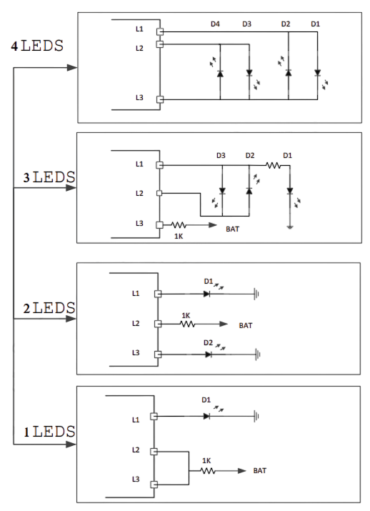

# IP5306 Power Management IC

> Charger/Discharger for Single Lithium Batteries (Some Versions Programmable)

The [IP5306](materials/ip5306_datasheet.pdf) is a fully integrated *power bank* system-on-chip (SOC) with a charger and a *2A* discharger that works with single *LiIon* cells:

* **Charger**     
  uses a *buck* converter at *750kHz* switching frequency, and charges with a maximum current of **2.1A**. Can be adjusted to *0.05-3.2A* using *I2C* (when the *IP5306* version supports *I2C*, see below for details).
* **Discharge:**     
  uses a *boost* converter at *500kHz* switching frequency and a *5V* output at a maximum current of *2.4A* (12W)

This chip—or one of its many Chinese clones, like the [FM5324GA](materials/fm5324ga_datasheet_en.pdf)—is commonly used in modern DIY modules.

## Overview
The *IP5306* is found on affordable breakout boards like the [X-150](https://done.land/components/power/powersupplies/battery/chargers/charge-discharge/ip5306/x-150/) and the [MH-CD42](https://done.land/components/power/powersupplies/battery/chargers/charge-discharge/ip5306/mh-cd42/). 

These modules use *IP5306*-variants that are non-programmable, so you are limited to the chip defaults which are tailored to powerbank use-cases, not so much to power microcontroller projects:

* **High Charging Current:** uses a maximum current of *2.1A* (which may be too much for small *LiIon/LiPo* batteries).
* **Low Current Cut-Off:** turn automatically off when the load current drops below *50mA* for more than *32s* (which can cause problems, i.e. with microcontroller projects that use deep sleep)

### I2C to the rescue
There are more sophisticated versions of *IP5306* that include a [I2C](https://done.land/fundamentals/interface/i2c/) interface. This interface allows microcontrollers to communicate with the chip, and change its settings.

The [PB01](https://done.land/components/power/powersupplies/battery/chargers/charge-discharge/ip5306/pb0a/) is an example of a very affordable breakout board (below €1.00) that comes with the I2C-enabled IP5306 and exposes the *I2C* pins.

Adjusting the IP5306 configuration provides immense flexibility:

* **Adjust Charge:**    
The maximum charging current can be adjusted in a wide range of *0.05-3.2A*, i.e. you can lower it to match the requirements of small *LiPo* batteries you may be using.
* **Continuous Power:**   
You can tell the chip to keep its 5V output open continuously and not turn off after a while when the load drops below *50mA*. This way, microcontrollers continue to receive power even when they switch to power-saving deep sleep modes.

There are many more things [I2C can read or change](https://done.land/components/power/powersupplies/battery/chargers/charge-discharge/ip5306/#i2c-configuration), i.e. fine-tune discharge protection or battery specifics, determine whether the battery is fully charged, and even manually controlling the charger. 

> [!NOTE]
> One thing the *IP5306* isn't able to do though is provide energy statistics such as actual battery voltage, or measuring currents.

### Power While Charging

Devices can be powered continuously even during charging, with a small power gap occuring when charging ends and the internal boost converter is re-enabled, and an optional push button can be used to *manually* turn power on and off.

How simultaneous charge and discharge works
 

This chip **either** use its integrated boost converter to increase the battery voltage to *5V* at a maximum of *2.4A* output (*12W total*), **or** it can step down an external *5V* input to a charging voltage suitable for *Li-Ion* or *Li-Po* batteries. However, the chip can only perform *one* of these conversions at a time because it only has one external coil that is used *either* for *boost* **or** for *buck* operations.

Despite this limitation, the chip supports simultaneous discharging and charging. This means you can operate a connected device both while the chip is charging and when the device is powered by the battery alone.

Understanding the involved switching between different power paths is critical.

### On Battery
Boost converter supplies *5V* at *2.4A* max (12W). The battery must be capable of supplying a peak current of *4A* to support this load. Be aware that smaller batteries or low-cost, low-current *Li-Po* batteries may not be sufficient to meet this demand.

### When Charging
Input voltage powers **both** the charger (at a maximum current of *2.1A* at up to *4.2V*) **and** the load (at a maximum of *12W*).

The total power demand can reach *22W* when accounting for conversion inefficiencies. The external *5V* power supply must provide *4.2A* to handle a combined maximum load. With charging only, a standard *5V 2A* power supply is sufficient.

### Temporary Power Cut
When an external power supply is connected or disconnected, the chip actively switches power paths. During this transition, there may be a **brief power interruption** at the output. This can cause connected devices, such as microcontrollers, to reboot. To prevent this, you can add an appropriately sized capacitor to the output line, which will smooth out any voltage dips during these transitions.

## Practical Use Cases
*IP5306* was originally designed for power banks. You can use IP5306 either to build your own powerbank, or something related:

* Charger
* Battery Tester
* "integrated" powerbank    
  (aka powering your project from a built-in  LiIon/LiPo battery)

The most exciting use case probably is providing power to portable projects: by adding a IP5306, you can convert it into a rechargeable battery-driven solution - whether it is a microcontroller project, LED strips, DIY flashlights, etc.

### Sample Projects for Inspiration

Here are a few example implementations that are all using a IP5306:

* [Simple Powerbank](https://www.pcbway.com/project/shareproject/Power_Bank_Project_Using_IP5306_IC_413161da.html)    
* [LiPo Charger](https://oshwlab.com/wagiminator/y-ip5306-lipo-charger-booster)    
* [18650 LiIon Charger](https://www.pcbway.com/project/shareproject/Based_on_IP5306_3_7V_boost_5V_charging.html)    
* [ESP32-controlled power bank](https://docs.m5stack.com/en/core/basic)  

### Using Basic IP5306

The basic *IP5306* (without *I2C* interface) that is found on [X-150](https://done.land/components/power/powersupplies/battery/chargers/charge-discharge/ip5306/x-150/) and [MH-CD42](https://done.land/components/power/powersupplies/battery/chargers/charge-discharge/ip5306/mh-cd42/) breakout boards is perfect **if**...

* ...your project is **power-hungry** and **won't drop below *50mA***   
* ...you use a *LiIon* or a **large LiPo** battery that can sustain up to **2.1A charging rate** (i.e. *18650 LiIon*).

Here is why:

* By default, IP5306 turns off power automatically once current drops below *50mA* for more than 32 seconds.
* *LiIon* battery cells (like *18650*) typically support **1-3C** and can typically sustain the *2.1A* default charging rate. However typical *LiPo pouch cells* have a nominal charging rate of just **0.3C**: a *1000mAh* LiPo cell needs a charging rate of just *350mA*, not *2.1A* (which can overcharge, heat up, and lead to fire hazards).

### Using I2C-Enabled IP5306
The *I2C*-enabled IP5306 requires a microcontroller, so this version is suitable only when your project uses a microcontroller. I2C then lets you fine-tune IP5306 which is especially useful if...

* ...power consumption may drop below *50mA*, i.e. when your microcontroller enters deep sleep states
* ...you are using a *LiPo* battery that requires reduced charging rates

#### Example Implementation
To get a first inspiration how microcontrollers can interface with IP5306, you may want to explore a commercial [programmable power bank](https://docs.m5stack.com/en/core/basic) that uses an [ESP32](https://done.land/components/microcontroller/families/esp/esp32/developmentboards/esp32s/) microcontroller and IP5306:

* **I2C Programming:**  [C++ code](https://github.com/m5stack/M5Stack/blob/master/src/utility/Power.cpp) illustrating how the power bank's *ESP32* microcontroller communicates with the *IP5306* registers via *I2C*.
* **Schematics:** [Circuitry](https://community.m5stack.com/assets/uploads/files/1515402963959-97994060-2969-49dc-ad9c-7b3887d95a17-image.png) showing the wiring and implementation, including the use of *BSS138* MOSFETs used as a level shifter to translate between the battery voltage and the *3.3V* used by the *ESP32* microcontroller.

#### Next Steps
Get yourself an I2C-enabled IP5306 or purchase a breakout board that uses one (like the [PB0A](https://done.land/components/power/powersupplies/battery/chargers/charge-discharge/ip5306/pb0a/)). Next, you can start building your own sophisticated  microcontroller-operated power bank, charger, battery tester, or related. 

Just keep in mind the inherent IP5306 limitations: 

* uses 1S LiIon battery
* outputs 5V, no fancy USB PD standards
* input and output connectors are separate

## BMS and Protection

The *IP5306* has the most important security features built in:

### Output protection

* **Over-Current detection:**    
  Output voltage **<4.4V** for over *30ms*
* **Short-Circuit Protection:**   
  Output current **>4A** for over *200us*

### Battery protection

* **Over-Discharge:**     
  turns off battery when voltage **<3.25V** (may vary with internal configuration)
* **Over-Charge:**   
  Charge termination at *4.2V*, safety timer cuts off at **<24h**
* **Under-Voltage:**    
  Trickle charge (*100mA*) when battery voltage *<2.9V*
* **Over-Voltage:**    
  Turns off charging when battery voltage **>4.2V**
* **Over-Current:**    
  Limits charging to **2.1A** max., and limits further if charger voltage drops too much
* **Auto-Recharge:**     
  Starts when battery voltage *<4.1V*

### General protection

* Thermal shutdown (at *125C*)

### Missing Protections
For a safe and robust power bank, *IP5306* lacks these two protections:

* **Temperature Sensor:**   
  No support for external temperature sensors. External temperature sensors typically detect catastrophic battery failures during charging.   
* **Revers Battery Polarity:**     
  Connecting the battery in reverse polarity destroys the chip. Since rechargeable batteries are typically not serviceable in portable devices and powerbanks, such a protection is normally not needed (with proper assembly). 
  
To cover this:

* Use an affordable [Dallas](https://done.land/components/data/sensor/temperature/dallas/) temperature sensor (or similar). They can be connected directly to your microcontroller, and in case of excessive temperatures, your microcontroller can disable the charger via *I2C*.
* Add an *ideal diode* if you do not hard-wire the battery (in which case there would be the risk of users not replacing the battery in correct polarity).

## Operational Modes

*IP5306* can be in four different operational modes:

| Mode | When Active | LED(s) | 5V Output | I2C Active | Can Charge  | Description |
| --- | --- | --- | --- | --- | --- | --- |
| 0 | remove power source | ❌ | ❌ | ❌ | ❌ | Chip is off, resets to default configuration |
| 1 | add power source | ❌ | ❌ | ❌ | ✅| All configuration changes made by *I2C* are lost. |
| 2 | short-press button, or connect load | ✅ | ✅ | ✅ | ✅| Disconnecting the load for >32s or double-pressing the push button switches to mode 1 |
| 3 | setting bit `1` of I2C register `00` | ❌ | ✅ | ❌ | ✅| *IP5306* stays active and keeps all settings, power output is permanently on |

Mode 3 is available only in *I2C*-enabled versions of *IP5306*.

## Charging
Charging is a separate feature and can be utilized independently from other features if you wish.

You could, for instance, use the *IP5306* solely for charging *LiIon/LiPo* cells, possibly as a replacement for a simple *TP4056* if you want higher charging rates:

| Item                         | Description                    |
|------------------------------|--------------------------------|
| Input Voltage                | *5-5.5V*                      |
| Charging Current             | *2.1A*                        |
| Charge Switching Freq.       | *750kHz*                      |
| Charging Cut-Off Voltage     | *4.2V* or *4.35V* (configurable)   |
| Charging Efficiency          | *91%*                         |
| Short Circuit Protection     | Yes                           |
| Low Voltage Recovery         | Yes                           |
| Battery Reverse Polarity Prot.| No                           |
| Charging While Discharging   | Yes                           |

> [!IMPORTANT]
> If you are using the *IP5306* as a simple charger, the lacking *battery reverse polarity protection* becomes an issue. Either make sure the battery connectors or bays are fool-proof, or add an *ideal diode* to the battery wiring.

### Initiating Charging
Charging starts automatically when a power supply is connected, and the battery voltage is *>2.8V* and *<4.2V*. The external power supply must provide *5V* at *2A* minimum.

During charging, the indicator LED show charging progress in *25%* increments, and one LED is blinking at *1Hz*.

Charging phases:
1. **Deep Discharge Recovery:** If battery voltage is below *2.8V*, the chip supplies *180mA* until safe voltage levels are reached.
2. **Constant Current:** For voltage between *2.8V* and the cut-off, the chip charges at *2.4A*.
3. **Constant Voltage:** Once the battery reaches *4.2V*, current tapers off until it falls below *100mA* or 24 hours elapse.

Once charging has completed, all four indicator LEDs light solidly.

> [!NOTE]
> I2C-enabled breakout boards, like the [PB01](https://done.land/components/power/powersupplies/battery/chargers/charge-discharge/ip5306/pb0a/), use the status LED connectors as *I2C* interface. These boards use additional helper ICs to drive a WS2812 RGB LED which typically pulsates in changing color, indicating the charging state.

A new charging cycle is initiated automatically once the battery voltage drops below *4.1V*.

### "Dead" Batteries
When a battery has accidentally been *deeply discharged* (i.e. by keeping it in storage for too long so that normal self-discharge could cause a voltage drop below *2.8V*), it can no longer absorb the normal amount of energy. 

That's why many chargers refuse to charge such batteries at all. Charging such a battery with normal charging rates would convert the excess energy into heat and can subsequently easily cause a fire or explosion. 

*IP5306* can deal with over-discharged batteries. When the battery voltage is too low for normal charging, its *recovery charge mode* reduces the charging rate and charges in intervals. 

This is not guaranteed to work of course, it is just a best effort. If the battery was damaged beyond recovery, *IP5306* aborts the *recovery charge mode* after 24 hours.

## Supplying Power

*IP5306* has a robust and efficient boost converter. It boosts the battery voltage to *5V* at up to *2A*. The boost converter is equipped with *over-current* and *short circuit* protection.

| Item                  | Description                    |
|-----------------------|--------------------------------|
| Output Voltage        | *5-5.15V* (USB-A, 5V pads)    |
| Output Voltage Ripple | *50mV*                        |
| Output Current        | max. *2.4A*                   |
| Indicator LED Current | *4mA* each                    |
| Off Current           | *<50µA*                       |
| Standby Current       | *<100µA*                      |
| Load Removal Detection| *<45mA* for *32s*             |
| Boost Switching Freq. | *500kHz*                      |
| Boost Efficiency      | *92.5%*                       |
| Short Circuit Prot.   | Yes                           |
| Other Protections     | Over-Current, Over-Voltage    |

### Automatic Load Detection
When a load is connected to the power output, the boost converter activates and begins supplying power. This requires the load to consume significant currents. Light loads may require to *manually* turn on the power output by pressing a push button (connected to pins `K` and `GND` on most breakout boards). This behavior is inline with typical powerbanks.

When the load is removed (or the load drops below *45mA* for more than *32s*), the boost converter automatically shuts down to conserve battery power.

> [!NOTE]
> The *I2C*-enabled versions of *IP5306* can adjust all this. Specifically, *IP5306* can be switched to an *always-on* mode that works also with light loads (*I2C* register `00`, bit `1` set to `1`). When *always-on* is enabled, the on-board LED still turns off after the designated time (*32s* by default, can be shortened via *I2C* to *8s*), but the *5V* output remains active, and the *IP5306* preserves all other changes that have been made via *I2C*.

While power is being supplied, four LEDs indicate the battery's *state of charge* in *25%* increments. Each LED is supplied with *4mA*. *I2

When the battery's *state of charge* drops below *3%*, one LED will blink at *2Hz* to alert the user. If the battery voltage falls further, below *2.8-2.9V*, the *over-discharge* protection feature turns off the power output to prevent damage to the battery.

| LED | *On* at battery voltage *(V)* |
| --- | --- |
| 1 | *>3.36* |
| 2 | *>3.57* |
| 3 | *>3.65* |
| 4 | *>3.91* |

> [!IMPORTANT]
> *I2C*-enabled breakout boards often use a single pulsating WS2812-RGB LED.

### Power Consumption

Operating the boost converter requires approximately *100µA*. 

To save even more energy, the chip can minimize power consumption to just *30-50µA* when disabling the power output (quiescent current).

That's why by default, *IP5306* has an active *low load detection*: once the load drops below 50mA for more than 32 seconds, the chip switches off the boost converter and cuts power output.

Like mentioned before, if this power-savings feature causes problems because your load requires low current (i.e. deep sleep), you have two options:
* **Manual:**    
  pull pin `K` low every 30 seconds, either by external discrete logic, or by waking up your MCU every 30 seconds.
* **Reconfigure:**   
  if you use an *I2C*-enabled *IP5306*, set bit `1` of register `00` to keep the boost converter turned on all the time. Be aware that the power LED(s) on the board will turn off, yet the power output stays enabled.

Two operational modes manage this behavior:

| Mode | Boost Converter | Indicator LED | Power Supply | Quiescent Power |
| --- | --- | --- | --- | --- |
| **Standby Mode** | on | on | available | 100µA |
| **Off Mode** | off | off | not available | 30-50µA |

The chip automatically transitions between these modes:

* **Load Detection:** The chip continuously monitors the power output. When it detects a load, it activates *Standby Mode* to supply power to the connected device.
* **Load Removal Detection:** If the load drops below *45mA* for a continuous period of at least *32 seconds*, the chip shuts off the boost converter and switches to *Off Mode*.

### Automatic Power-off

The chip automatically cuts off power in the following scenarios (**when operating on battery power**):

* **Low Load:** If the load drops below *45mA* for at least *32 seconds*, the chip assumes the load is disconnected and turns off the boost converter.
* **High Load:** If the load exceeds *4A*, the chip performs an emergency shutdown within *200µs* to prevent damage.
* **Battery Empty:** If the battery voltage falls below *2.8-2.9V*, the chip disables the boost converter to protect the battery from *over-discharge*.
* **Manual:** Using a push button signal (see below), the chip turns off the boost converter, even with the load still connected. This is useful for turning off permanently connected devices.

While charging, the output **is always active**.

## Push Button Support
An optional push button can be connected to the *K* and *GND* solder pads on most boards. While not mandatory, it allows manual control over power output and can access a special "torch mode".

**Always use a resistor** in series with the push button to limit potential current flow:  

- In some chip configurations, an optional *flashlight function* may be present. In this setup, an LED is connected in parallel with the push button. Pressing the button in such configurations effectively short-circuits the LED, which can result in high currents. These currents may damage the button, the LED, or the board itself.  

- To prevent such issues, use a resistor with a value of *2kΩ* or *10kΩ* in series with the button. Some chips can *actively differentiate* between these two resistor values. Depending on the resistance used, the chip may either *activate* or *deactivate* the flashlight function.

> [!NOTE]
> A user reported that pressing the push button produced a cloud of smoke. It turned out this user had taken *two breakout boards* and connected both push button wires to *one push button* to control both boards at the same time. While this is perfectly ok to do, the user did not add *10kΩ* resistors. So when the push button was pressed, a temporary *short circuit* occured in *both boards*, resulting in high currents flowing across the push button. Since DIY push buttons typically are for logic levels only, they can easily burn up when exposed to such high currents. You now know that with this board, it is crucial to limit current flow with at least a *2kΩ* resistor.

### Types of Button Presses
All chip variants distinguish three fundamental key press patterns:

* **Short press:** *>30ms but <=2s*
* **2x Short press**
* **Long press:** *>2s*

### Manually Controlling Power Output
This can be done by grounding pin `K`:

* **Turn On:**     
  *Short press* (*30ms-2000ms*).    
    * resets the *light load detection timer*    
    by issuing impulses every 30 seconds, you can manually keep the power output active.
* **Turn Off:**     
  * genuine IP5306: **long** press (*>2000ms*)    
  * Clones: **two** short presses

This controls the boost converter only. 

When *IP5306* is connected to a charger, the power output is **always active** because during charging, the power output is supplied by the charger, not the boost converter.

### Torch Mode
A less commonly noticed feature of this chip is its ability to support an external *flashlight LED*. When present, the LED is connected *in parallel* with the push button.

This *torch mode* is the reason why the push button must always be used with a *2kΩ* or *10kΩ* resistor in series. Without this resistor, activating the *torch mode*—either intentionally or accidentally—can result in large currents, as pressing the push button would effectively short-circuit the flashlight LED.

On certain chip models, the *torch mode* may either be permanently disabled or configurable by using a *2kΩ* resistor instead of a *10kΩ* in series with the push button.

| Variant | Short Press | 2x Short Press | Long Press | Remark |
| --- | --- | --- | --- | --- |
| 1 | turns on power output and indicator LEDs | toggles flashlight | turns off power | *IP5306* |
| 2 | turns on power output and indicator LEDs | turns off power output | toggles flashlight | *FM5324GA*: use *10kΩ* in series with push button |
| 3 | turns on power output and indicator LEDs | turns off power output | no function | *FM5324GA*: use *2kΩ* in series with push button |

> [!NOTE]  
> Keep in mind that chips are often manufactured to meet specific customer requirements. If your chip has a different marking, it may function similarly to the *IP5306* but exhibit slight variations, such as different push button actions or modified indicator LED behavior.  

## Issues

Here are the top issues with this chip and the boards that are using it:

* **User Errors:** 
  * **Battery:** when you add a battery that is too small and cannot handle the high charge and discharge currents, charging the battery may not work, and there is a fire hazard.
  * **Push Button:** when you add a push button and omit a *10kΩ* series resistor, when you press the button, high currents can flow and damage the button.

* **Design Issues:**
  * **Load Removal Discovery:** with small loads *<50mA*, the unit cuts power after *32s*. This is by design. To work around this, you can have your microcontroller ground the push button key (via a *10kΩ* resistor, or you might ruin your microcontroller) in intervals of *<30s*. This resets the load removal discovery timer. Make sure you ground the pin for at least *50ms* in order to be considered a *short press*. Alternatively, you can keep the pin permanently to *ground* as described below.
  * **Various Chip Variants:** the fact that boards are produced with a variety of generic and cloned chips instead of the original *IP5306* can cause issues due to slight variations in behavior. 
  * **Wake-Up Issues:** there are reports with boards using the *FM5324GA*, that after prolonged operation for *24-48hrs*, the board may not automatically wake up from standby anymore when a new load is connected.     
  
     The reason is not yet clear. A remidy is to manually *short press* the push button or cause a reset of power paths by supplying a charging power. You might be able to work around this by keeping the chip active all the time (preventing *Off* mode) at the expense of a slightly higher quiescent power consumption via the following circuit (which may also help with continuously operating low loads *<50mA*):

## Implementation Details

IP5306 is a highly compact IC with just 8 pins. External components are minimal. 

### Inductor for Switching

Both boost and buck converter share the same external inductor which should be *1uH*. The inductor needs to be rated for at least *4.5A*.

A push button can be connected to `K`/`KEY` and `GND`. It should be protected by a *10K* resistor because when "torch mode" is active, `K`/`KEY` can supply considerable current.

### Status LEDs
In basic (non-I2C) variants of IP5306, pins `L1`, `L2`, and `L3` connect to the status LED:

Optionally, less than 4 LEDs can be connected:

### I2C Interface

For I2C-enabled variants of IP5306, pins `L1`, `L2`, and `L3` host the I2C interface:

IP5306 is running on battery voltage, so a level shifter mechanism is required to translate the voltages and logic levels to the levels required by the external microcontroller.

`IRQ` indicates whether IP5306 is active. This does not necessarily mean that the I2C interface is active. If I2C does not respond, you may have to send a short impulse to `K`/`KEY` (*30ms-2000ms*).

## Examples

* [Using IP5306 Breakout Board with default settings (no I2C)](https://done.land/components/power/powersupplies/battery/chargers/charge-discharge/ip5306/pb0a/defaultoperation/)     
* [Testing IP5306 I2C Communication](https://done.land/components/power/powersupplies/battery/chargers/charge-discharge/ip5306/pb0a/i2ctestsetup/)   
* [Using ESP32 + IP5306 with I2C](https://done.land/components/power/powersupplies/battery/chargers/charge-discharge/ip5306/pb0a/i2cproductionsetup/)    

## Materials

[IP5306 Datasheet](materials/ip5306_datasheet.pdf)        
[IP5306 I2C Register Map](materials/ip5306_i2c_registers.pdf)   
[FM5324GA (IP5306 Clone) Translated English](materials/fm5324ga_datasheet_en.pdf) *(translated)*          
[FM5324GA (IP5306 Clone) Chinese Original](materials/fm5324ga_datasheet.pdf) *(Chinese original)*         
[ESP32-controlled Powerbank Schematics](https://done.land/assets/img/m5stack_basic_ip5306_interface.png) (image)    

> Tags: Charger, Li-Ion, Li-Po, Boost Converter, 2A, USB, 1S, IP5306, FM5324GA, Torch Mode, Push Button

[Visit Page on Website](https://done.land/components/power/powersupplies/battery/chargers/charge-discharge/ip5306?313487011513254524) - created 2025-01-12 - last edited 2025-08-10
