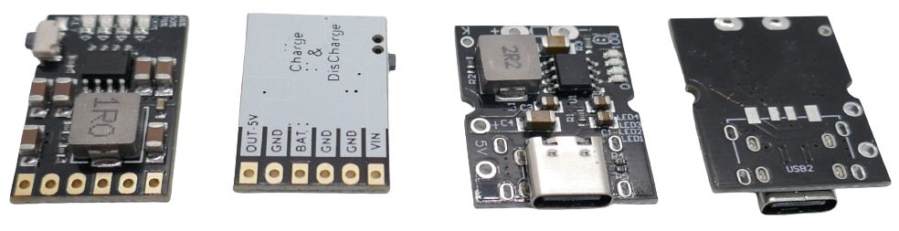
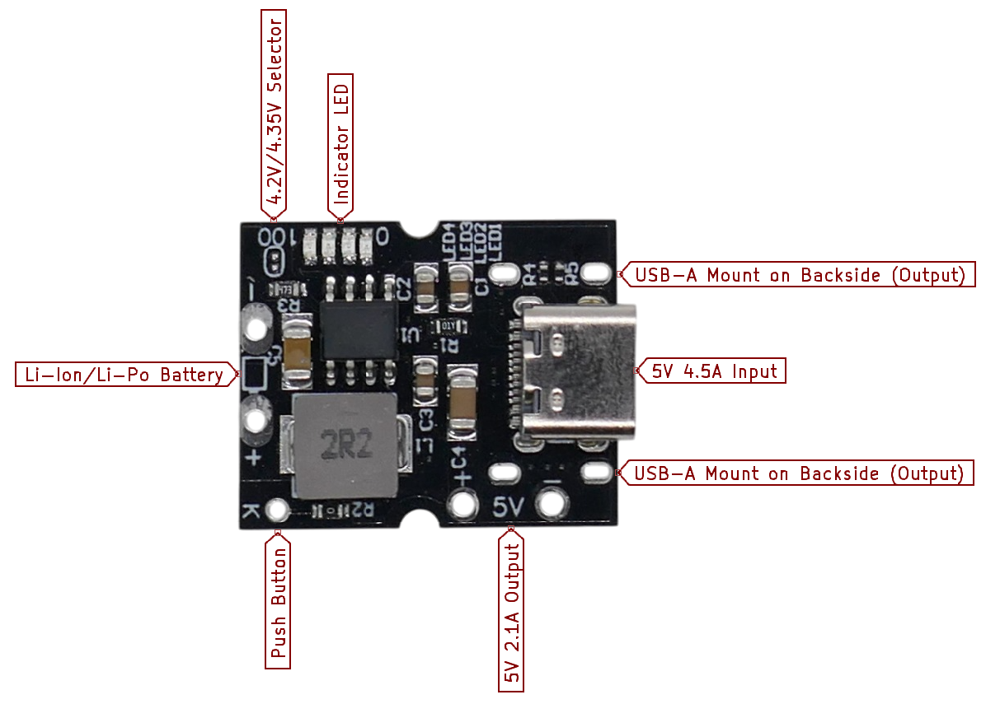
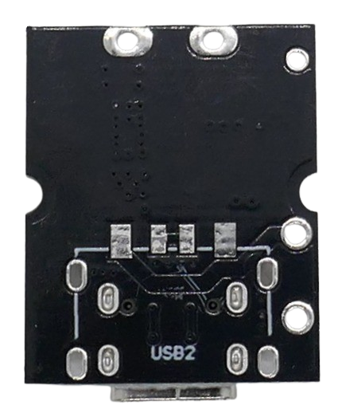
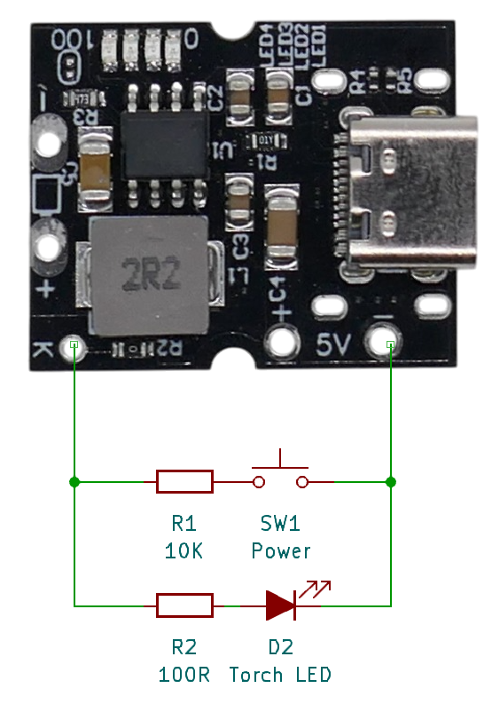
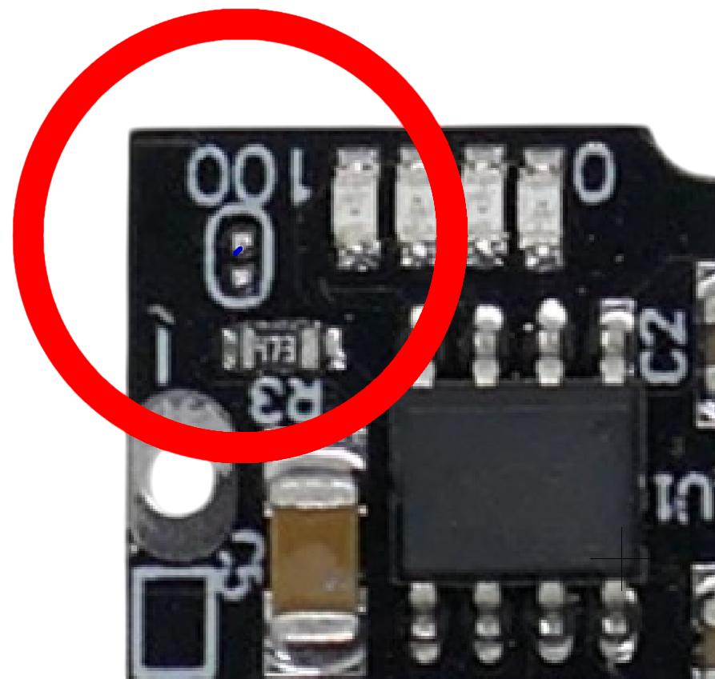
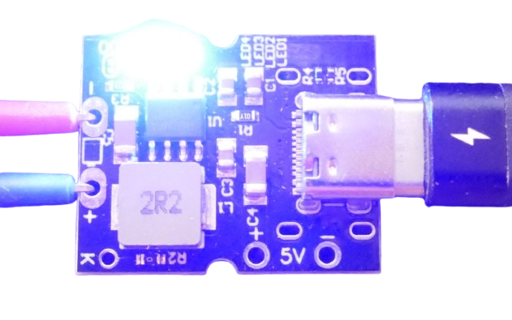

# X-150

> Robust and Powerful 2A 5V Power Supply Powered by a Single Li-Ion Cell

The *X-150* is a compact module designed for use with a single (1S) Li-Ion or Li-Po cell, or multiple cells connected in parallel.

At its core, the module uses the [IP5306](https://done.land/components/power/powersupplies/battery/chargers/charge-discharge/ip5306/) power management chip, a robust solution for efficient power regulation both for charging and for discharging.

Numerous breakout boards from various vendors exist that are all built around this chip (or its Chinese clones, such as the *FM5324GA*). These boards share many similarities, as the IP5306 largely defines their behavior.

**That's why it is essential** that you consult [this comprehensive guide](https://done.land/components/power/powersupplies/battery/chargers/charge-discharge/ip5306/) on the IP5306 first before you move on to *this* article which focuses exclusively on the ***specific** details and nuances* of the *X-150* breakout board. 

## Overview

This *20x25mm* module integrates all necessary components for building power banks, portable chargers, or adding battery support to USB/5V devices.

### Separate Input and Output Connectors

Because of the *IP5306* specific power path management, the module uses *separate* USB connectors for input (charging) and output (power supply):

- **USB-C Input:** Pre-soldered *USB-C* connector exclusively for **input**. It cannot supply power to USB devices.
- **USB-A Output:** Optional *USB-A* connector for **output**, supplying power to USB devices. Alternatively, dedicated *5V solder pads* allow permanent connections to a development board, LED strip, or additional USB connectors in various formats.

#### Output Connector
On the backside of the board, a *USB-A* connector can be mounted if you want to supply power to USB devices. Often, such a connector is included with the board: 

If you want to use this module to permanently power *one specific* device, i.e. a microcontroller development board, you do not need the bulky USB-A connector. Instead, use two solder pads marked *5V* on the front side that supply *5V 2.1A*.

#### Understanding Power Output Paths
This module can *either* charge the battery *or* supply power. It cannot do both at the same time. Regardless, you can draw power *while* charging. How does that work?

The chip's power path management uses the battery and boost converter to provide battery power when no external power is connected (no charging).

Once you connect a USB-C power supply, the boost converter is turned off, and charging begins. The power output will still *continue to deliver power*, however now this power is taken from the *USB-C power supply*.

This has a number of consequences you should know and consider:

* **High Input Power Requirements:** the chip charges the battery with up to *2.4A* (10.5W) while simultaneously providing up to *5V 2.1A* (10.5W) to the power output. During charging, *both* is powered by the *USB-C* input. The combined output power is *21W*. Your *USB-C power supply* must be capable of delivering up to *22W*/*4.5A* at *5V*.
* **Short Interruption:** the chip needs to switch power paths once a *USB-C power source* is added or removed. Plugging in or unplugging the *USB-C* cable may therefore cause a brief power interruption, potentially rebooting connected microcontroller boards. Adding a sufficiently large capacitor to the power input can mitigate this issue.

### Push Button

An optional push button can be connected to the *K* and *GND* solder pads with a *10kΩ* resistor in series. 

The button allows manual control of the power supply:

- **Short press (>30ms but <2s):** Turns on indicator LEDs and enables power output.
- **Double short press:** Turns off indicator LEDs and disables power output.

### Torch LED 

A *torch LED* can be connected in parallel to the push button using a *100Ω* series resistor. The push button can then turn the LED on and off with a double short press. The torch LED is designed to draw approximately *25mA*.

> [!TIP]
> When the push button is using a *2KΩ* series resistor instead of a *10KΩ* series resistor, the torch feature is disabled, and a *long press* is without function.    

## Charging Mode

The charger activates automatically when a power supply is connected to the *USB-C* port, charging the battery at up to *2.4A*. It requires a *5V 2A* input. For detailed charging specifications, refer to the [*IP5306* documentation](https://done.land/components/power/powersupplies/battery/chargers/charge-discharge/ip5306/).

By default, the charging cut-off voltage is set to *4.2V*, which is suitable for most *Li-Ion* and *Li-Po* batteries. Near the *100%* mark on the built-in indicator LEDs, there are two tiny solder pads. Bridging these pads raises the cut-off voltage to *4.35V*.

> [!IMPORTANT]
> Change the solder bridge only when all power sources (including the battery) are disconnected. Using *4.35V* requires a battery that *supports this voltage*. Standard batteries will cap at *4.2V* and can be damaged by higher voltages.

## Supplying Power

The module provides *5V* at up to *2A* via the *USB-A connector* or *5V solder pads*. Advanced quick-charge protocols are not supported.

Four blue SMD LEDs display charging status and battery *state of charge* in 25% increments. When the battery's *state of charge* drops below *3%*, one LED starts to blink. If the battery voltage drops below *2.8-2.9V*, the *over-discharge protection* cuts off power.

If the load is very light (*<45mA*) for more than *32s*, the *automatic load removal detection* will cut off power.

> [!NOTE]
> During charging, the load is powered directly from the input supply, not the battery. This behavior only applies to battery operation. While charging, the load remains powered regardless of the battery status.

### Manual Mode

Manual mode allows direct control of the (battery-powered) output via the optional push button:

- **Short press:** Manually enters *Standby* mode and turns power output *on*.
- **Double short press:** Exits *Standby* mode and stops power output.

When the module is charging, the buttons have no effect, and the load remains powered.

> Tags: Charger, Li-Ion, LiIon, Li-Po, LiPo, Boost Converter, 2A, USB, 1S, X-150, IP5306, FM5324GA

[Visit Page on Website](https://done.land/components/power/chargers/charge-discharge/ip5306/x-150?160929011912250937) - created 2025-01-11 - last edited 2025-01-15
