# LIFC2-N Emergency Light 

> Using LIFC2-N 4S Charger to Create a Fully Portable Emergency Light

In this project, I am repurposing a used **Haensch Comet LED Emergency Light**, turning it into a truly portable emergency light powered by an internal rechargeable battery.

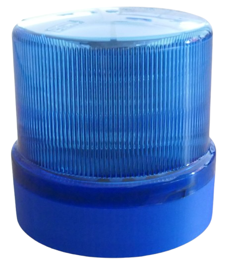

> [!IMPORTANT]
> Building your own lithium battery packs and power banks requires experience and knowledge and can be dangerous due to the high energy density and currents in lithium batteries. If you do not appropriately insulate wires, make connection errors, or use inappropriate boards, polarity, or other parts, there is a substantial fire risk, you can harm yourself and others, and cause great property damage. Whenever you work with lithium batteries, make sure you take off any rings or other metal parts that may accidentally short-circuit.

## Overview
In a previous project, I already [created a portable emergency light](https://done.land/components/power/powersupplies/battery/chargers/charge-discharge/ip5306/mh-cd42/portableemergencylight/) powered by a single (1S) LiIon battery using the [1S charger/discharger MH-CD42](https://done.land/components/power/powersupplies/battery/chargers/charge-discharge/ip5306/mh-cd42/). 

Recently, I aquired yet another **Haensch Comet LED Emergency Light** which was used on an Ambulance before. While it was operational, the housing had been painted in white and was pretty worn down.

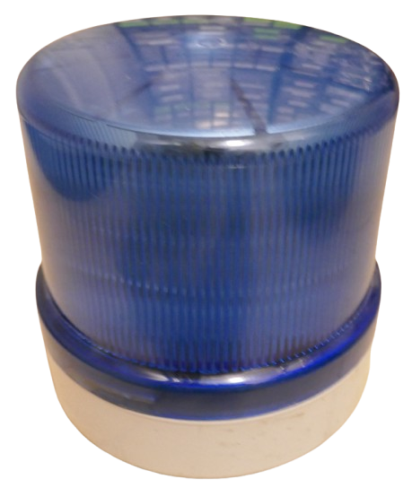

So I decided to rehaul the light, this time not just adding an internal battery but also 3D-printing its body to replace the ugly original body, and also add holes and compartments for switches and batteries.

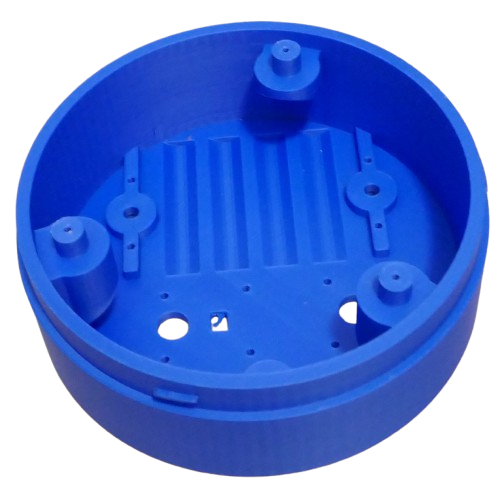

I designed the body in Fusion360 so that the original light dome would snap into place just with the original body.

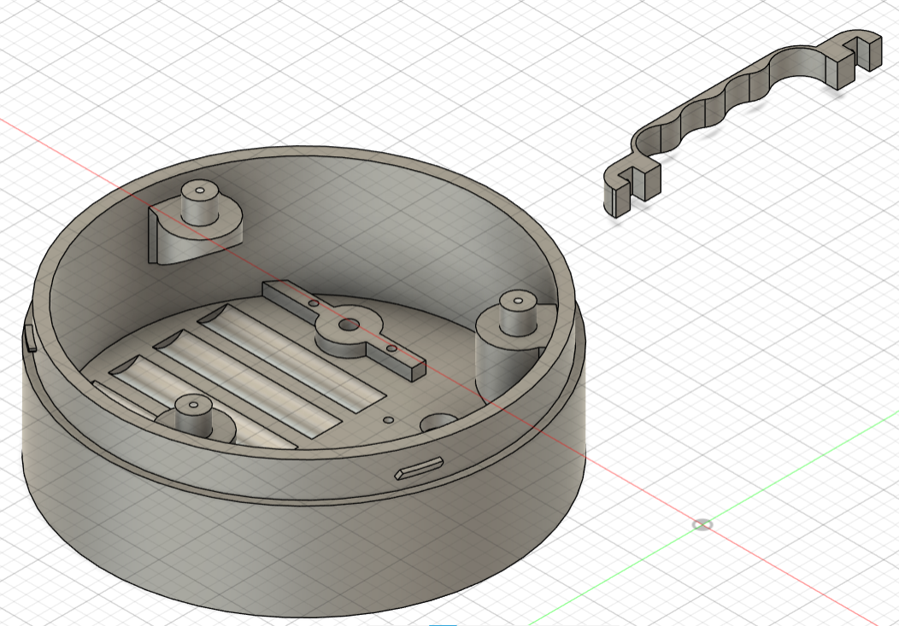

Here are the print files:

[STL file for body](materials/haensch_comet_body.stl)    
[STL file for battery constraints](materials/battery_constraint.stl)    

### Designing the Internal Battery
The emergency light requires **12-24V** at around **15W**. Running it off a **1S** LiIon battery required boosting the 3.7V battery voltage up quite a bit - [this did work surprisingly well](https://done.land/components/power/powersupplies/battery/chargers/charge-discharge/ip5306/mh-cd42/portableemergencylight/) by using a cheap [LX-LISC 3S charger module](https://done.land/components/power/powersupplies/battery/chargers/charge/powermanagementics/ip2326/) in a "creative" design in my [previous project](https://done.land/components/power/powersupplies/battery/chargers/charge-discharge/ip5306/mh-cd42/portableemergencylight/).

This time, however, I wanted to run the emergency light directly off a **4S LiIon** pack built from old *18650* cells (12-16.8V depending on state-of-charge) to increase efficiency and decrease part counts and complexity.    

> [!NOTE]
> The emergency light input voltage covers the entire voltage range a 4S LiIon battery pack can deliver, so no dedicated **discharger module** was required to output a particular voltage. If you want to adapt the concept to other devices that require a specific voltage, add a **discharger board** or **DC-DC converter** to output a regulated fixed voltage of your choice.    

### Parts Needed

* **Battery Pack:**     
  LiIon battery cells in the desired configuration. I am using 4 used *18650* LiIon cells in series (**4S**).     

  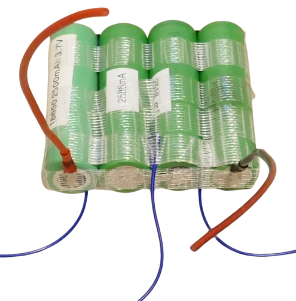
   
* **Charger:**     
  In order to conveniently charge the battery pack from a standard USB power supply, a suitable charger board is needed that matches your battery configuration. I am using a [LIFC2-N](https://done.land/components/power/powersupplies/battery/chargers/charge/buck-boost/lifc2-n/) configured for **4S**.     

  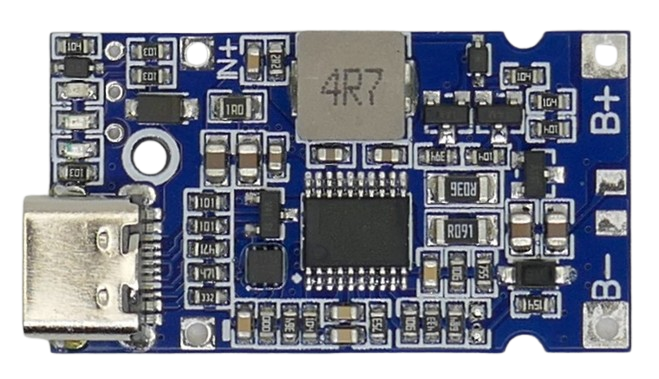
  
* **BMS:**      
  In order to protect the battery pack from short circuit and especially from over-discharge, a BMS is required. I am using a simple unbalanced [4S BMS board](https://done.land/components/power/powersupplies/battery/bms/4s/8a/#8a).   

  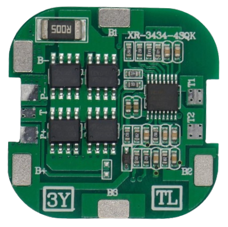

### Caveats

I [successfully used a simple **1S** battery](https://done.land/components/power/powersupplies/battery/chargers/charge-discharge/ip5306/mh-cd42/portableemergencylight/) before to power a 12V device. Switching to a multi-string battery pack (**4S** in this project) has distinct advantages but also a number of challenges:

| Item | 1S | Multi-String |
| --- | --- |--- |
| USB Charger | +++ *(readily available, cheap)* | - *(the more strings the less choice, higher cost)* |
| Balancer | +++ *(not needed)* | -- *(strongly recommended)* |
| BMS | +++ *(often built into charger)* | -- *(needs to be added)*
| Currents | --- *(very high)* | +++ *(low)* |

#### 1S Is Simpler
From a complexity point of view, **1S** battery packs are much simpler and more affordable as there are [plenty of cheap **1S** USB charger/dischager boards](https://done.land/components/power/powersupplies/battery/chargers/charge-discharge/ip5306/) available that already include BMS protection. As always with **1S** battery packs, battery cell balancing is not needed.

This is very different with multi-string battery packs as they require separate BMS and balancer circuits, and while there are all-in-one charger/discharger boards, these are expensive.

#### Multi-S Is More Efficient

So why using a Multi-String battery pack at all? Because a battery pack works most efficiently when its voltage is close to the voltage that your load requires.

In this particular project, the emergency lamp requires around **15W** at **12V** (around **1.25A**). If powered by a **1S** battery pack, this would create battery currents of up to 15V/3.0V=**5A**. Such currents require much thicker cables, produce significant voltage drops, and boosting the battery voltage up to 12V at 15W isn't trivial, and even in the best case causes losses of around 10%.

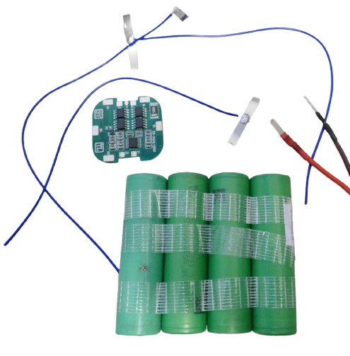

So this is the reason why it may be worthwhile to invest more into a multi-string battery pack and its ecosystem: running the emergency light directly off the battery (through a simple BMS to protect it from over-discharge) delivers 100% efficiency at almost no heat and losses.

## Building the Battery Pack

I used nickel strips and a simple spot welder to connect the four 18650 battery cells. Make sure you solder wires to the strips before you spot-weld them to the battery cells. 

> [!NOTE]
> It is **crucial** that all four cells are of the same type, capacity, and **state-of-charge**.  Always make sure all four cells are **fully charged** when assembling your pack. Keep in mind: your battery pack will be as good (or bad) as the **worst single cell** you are using.

Here are the schematics:

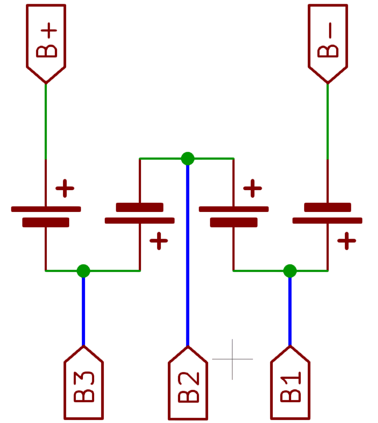

Note how all four battery cells are connected **in series**, and how there are separate helper wires marked **B1** through **B3** that allow the BMS to monitor each cell voltage separately.

### Adding BMS

Next, add a 4S BMS to the battery pack by connecting the five wires to the matching solder pads on the BMS.

I used a [very simple 4S BMS](https://done.land/components/power/powersupplies/battery/bms/4s/8a/) simply to protect the battery from    

* over-discharge (which could destroy its cells), and from     
* short-circuit (which could cause a fire).

> [!IMPORTANT]
> You may want to invest a little more and use a 4S BMS with integrated balancing, ensuring that all four cells are always at a matching voltage.     

### Adding Charger

In order for you to charge your battery pack from a simple USB power supply, add a **4S Charger Board**. I used a [4S LIFC2-N board](https://done.land/components/power/powersupplies/battery/chargers/charge/buck-boost/lifc2-n/):

Connect the charger output (**B+** and **B-** solder pads) to the **BMS power input** (**P+** and **P-** on the BMS board).

### Testing

Once you assembled your battery pack with BMS, you can now test it:

* **Charging:**      
  When plugging in a USB power source into your charger board, your battery pack should be charged, and the green LED on the charger board should turn on.    
* **Discharging:**     
  Since there is no **discharge** board used in this project that would stabilize the output voltage, you have access only to the **raw battery voltage**, either at solder pads **B+** and **B-** on the **charger board**, or at solder pads **P+** and **P-** on the **BMS board**.

> [!IMPORTANT]
> **Do not** connect loads directly to your battery pack or the **B+** and **B-** solder pads on the BMS. Always make sure your load only connects **through the BMS** to the battery. Else, you won't be protected from short circuit and over-discharge.     

### Caveats

Most BMS need to be "initialized" before you can actually power a load. This is done by plugging in a charger and charging them, however short.

The same is true if your BMS should ever trigger one of its protections. If, for example, you left your load powered on until your battery pack was depleted and the over-discharge threshold voltage was reached, the BMS will cut off the load, and you need to connect a charger in order to re-enable the BMS.

## Adding Bells and Whistles

In my project, I added a few accessoires to the bottom of the emergency light:

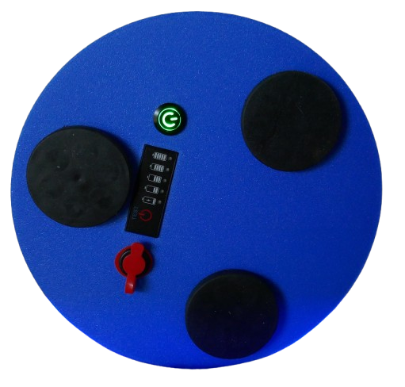

* **Magnets:**      
  **M6** screw holes can be used to attach magnets.    
* **SOC Meter:**    
  Simple and very affordable **4S battery charge meters** can be added to always check the battery state of charge.    
* **Illuminated Push Button:**    
  I used a water-proof *16mm* illuminated push button to conveniently turn the lamp on and off. Either use a latched button, or use a [bistable switch module](https://done.land/components/signalprocessing/switch/bistableswitch/).   
* **USB-C Charging Port:**    
  I used a water-proof USB-C female connector that internally connects to the [LIFC2-N charger board](https://done.land/components/power/powersupplies/battery/chargers/charge/buck-boost/lifc2-n/) so I can conveniently charge the battery via USB power supply from the outside.

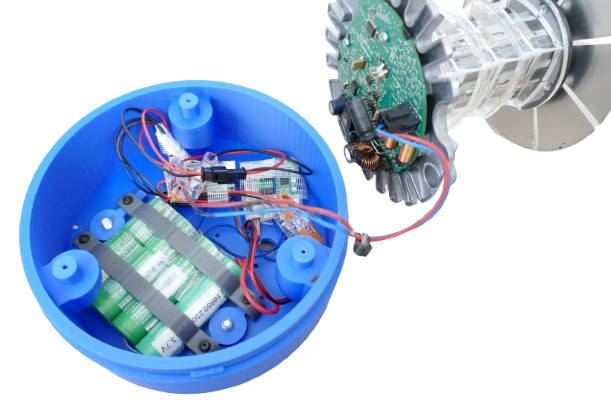

### USB Extension Cord

The most crucial accessoire probably is the external USB-C port: in order to charge your battery, you would either have to place the [LIFC2-N charger board](https://done.land/components/power/powersupplies/battery/chargers/charge/buck-boost/lifc2-n/) in such a way that its USB-C connector became accessible from the outside, or you would need some sort of extension cable.

An extension cable is the most flexible solution:

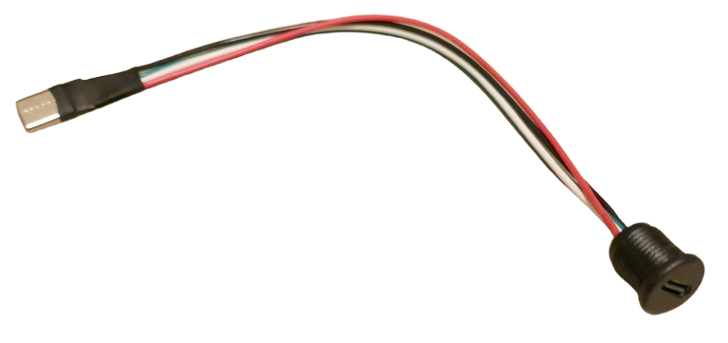

All you need are:

* **USB-C male connector:**    
  Plugs into the charger board.    
* **USB-C female connector:**    
  Is screwed into the lamp housing.

Both are available on AliExpress and elsewhere for just a few cents.

### Quick Charge Support
The [LIFC2-N charger board](https://done.land/components/power/powersupplies/battery/chargers/charge/buck-boost/lifc2-n/) has a built-in USB trigger that can request up to 20V from a suitable USB power supply for efficient quick charge.

The number of wires you use in your USB extension cord directly determines the quick charge modes supported:

| Wire Configuration | Wires | Supported Voltages | 4S LIFC2-N Voltage |
| --- | --- | --- | --- |
| `V+`/`G`  | 2 | 5V | 5V |
| `V+`/`G`  `D+`/`D-` | 4 | 5V, 9V, or 12V | 12V |
| `V+`/`G` `D+`/`D-`  `CC1`/`CC2` | 6 | 5V, 9V, 12V, 15V, or 20V | 20V |

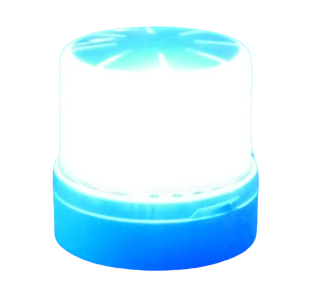

> Tags: Haensch, Hänsch, Comet, Emergency Light, 4S Charger, Battery Pack, LIFC2-N, USB-C Extension

[Visit Page on Website](https://done.land/components/power/powersupplies/battery/chargers/charge/buck-boost/lifc2-n/portableemergencylight?842979101627255512) - created 2025-10-26 - last edited 2025-10-26
