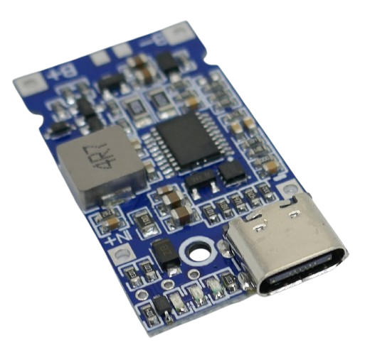
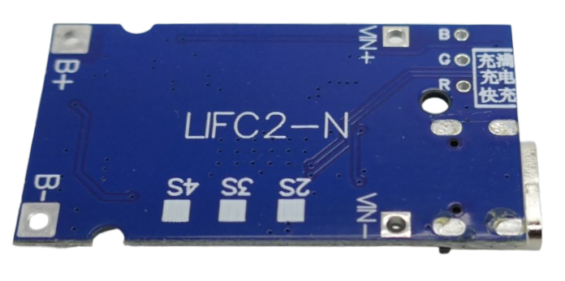
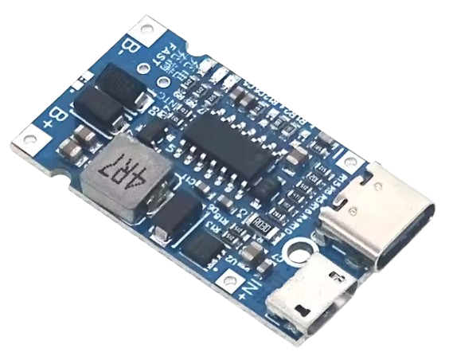
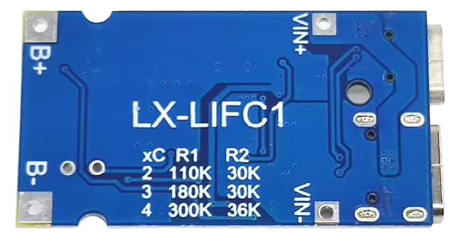
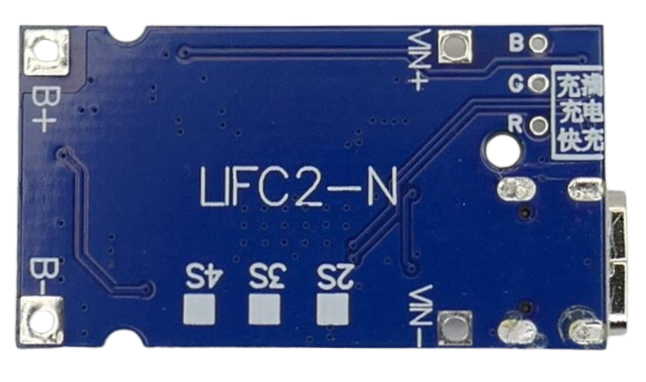
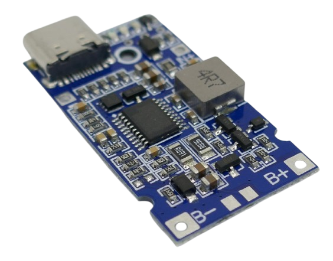
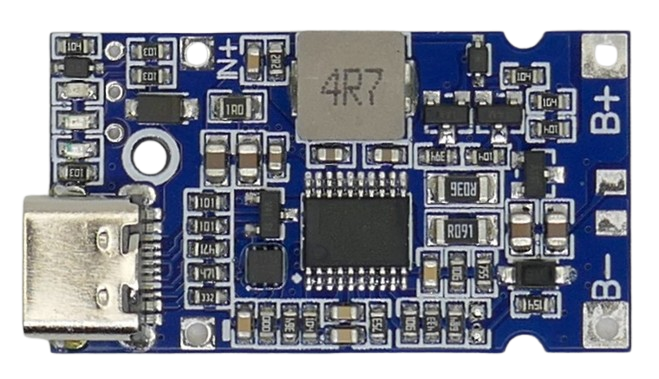

# LIFC2-N 2-4S 18W LiIon/LiPo Charger 

> 2-4S LiIon/LiPo Buck-Boost Charger With USB-C Input

This small breakout board is a highly flexible charger for 2-4S LiIon battery packs.

It can be powered via USB-C port or via a fixed input voltage in the range of 5-20V. The board supports USB-PD, and when you power it via its USB-C input, it automatically negotiates the most efficient input voltage (12V, 15V).

> [!NOTE]
> Boards come preconfigured for **2S**, **3S**, or **4S** **LiIon** battery packs. Make sure you order the version you need. It is not possible to re-configure the board later.

## Overview

This board uses an unknown (and undocumented) power management chip. Considering its price (around €2.00) and its specs, it is an excellent value.

> [!NOTE]
> This is a **charger only**: the USB-C port is unidirectional and can be used for charging only. This board is **not a discharger**. If you want to built a power bank and supply USB power from your battery pack, look at [charger-discharger boards](https://done.land/components/power/powersupplies/battery/chargers/charge-discharge/).

| Item | Description |
| --- | --- |
| Voltage Input | 5-20V, USB PD |
| Battery Chemistry | *LiIon* or *LiPo* *(LiFePo4 not supported)* |
| String Count | 2S, 3S, **or** 4S *(preconfigured, not adjustable)* |
| LEDs | 3 LEDs (red, green, and blue) *charging*, *quick charge*, and *fully charged* |
| Protections | Over-Temperature, Short-Circuit *(separate BMS required)* |

### LX-LIFC1 Predecessor
This board is the successor to the **LX-LIFC1** charger board:

Here are the most important differences:

| Feature | LIFC1 | LIFC2 |
| --- | --- | --- |
| Input Voltage | 4.5-15V USB trigger: 9V, 12V | 4.5-20V USB trigger: 12V, 15V |
| USB Connector | USB-C and Micro-USB | USB-C |
| Power | 18W | 18W |
| Preconfigured | **LiFePo4** 2-4S | **LiIon/LiPo** 2-4S |
| Configurable | yes, via `R1` and `R2` | no |

The most notable differences are the target battery chemistries:

* **LIFC1** targets *LiFePo4* chemistries with lower charging voltages. Its USB trigger supports 9V and 12V.
* **LIFC2** targets *LiIon/LiPo* chemistries. Since charging voltages are higher compared to *LiFePo4*, its USB trigger voltages were raised to *12V* and *15V*.

Another overlooked difference is that the older *LIFC1* could be re-configured using two clearly marked resistors `R1` and `R2`. This way, you could change its configuration from *LiFePo4* to *LiIon*, and you could also change the string count as needed.

Manual re-configuration is no longer possible with *LIFC2*. Even though sellers still mention two configuration resistors `R1` and `R2`, such resistors no longer exist. Apparently, sellers simply carried over out-dated information that was applicable to the predecessor *LIFC1*:

* On the *LIFC1* board, configuration information is printed on the backside, and the resistors are clearly marked on the board:

  

* On *LIFC2*, such information is missing, and neither resistors nor the power management chip carry any markings whatsoever.

  

You can therefore use *LIFC2* boards only in their pre-configured **2S**, **3S**, **-or- 4S** setup, and only for **LiIon/LiPo** cells.

> [!NOTE]
> *LIFC2* is an awesome board that works very well and is more affordable than *LIFC1*. While you may not be able to reconfigure it, or use it for *LiFePo4*, most users wouldn't want to fiddle with tiny resistors anyway. Just make sure you order the board in the configuration you need, and you are all set.

### Heat Generation

LIFC2 is a very efficient *synchronous* converter board that can reach 96% efficiency. Excess heat generation is low under these circumstances.

This charger *can* get quite hot (>70C) if you force it to boost a large voltage gap. So if you i.e. supply just 5V via a basic USB power supply, and charge a 4S battery pack, then make sure to add additional heat sinks.

The best way to keep the module temperature low is to use a modern USB PD power supply in which case the charger negotiates a higher voltage and can work efficiently.

## Connections
Connect the battery to `B+` and `B-`. Make sure you are using a separate BMS board with balancing capabilities.

Input power can either be supplied via USB-C, or via the dedicated `VIN+` and `VIN-` pads (5-15V).

### Additional Solder Pads
On the back side, `B`, `G`, and `R`can be used to connect external LEDs.

On the front side, located between `B+` and `B-`, additional unmarked solder pads can be used to add a thermistor.

Connecting a temperature probe is not enough, though. Using a temperature sensor requires changing the NTC voltage divider resistor on the board (unfortunately no documentation exists).

## Indicator LEDs

The board comes with three LEDs in different colors:

| LED | Description |
| --- | --- |
| green | **on:** quick charge/no battery connected **4Hz flash:** battery short circuit |
| red | **on:** charging |
| blue | **blinking:** negotiating fast charge **on:** fully charged |

The LEDs are labeled on the PCB backside (however in Chinese):

On the backside of the board, three through-hole solder pads labeled `R`, `G`, and `B` exist that can be used to connect external LEDs (remove the onboard LEDs).

## Battery Chemistry and Strings

This breakout board is sold preconfigured for **LiIon/LiPo** chemistry and **2S**, **3S**, or **4S** configuration. 

According to many sellers, the power management chip is capable of supporting any battery cut-off voltage in the range of 3.6-21.0V using two resistors (`R1` and `R2`), using this formula:

V*cutoff* = 1.8V * (1 + (`R1`/`R2`))

If this was true, this would open up this board to *LiIon*, *LiPo*, *LiFePo4* in configurations ranging from *1S* to *5S* - a truly universal charger. Apparently, though, this is too good to be true.

On *LIFC2* (unlike its predecessor *LIFC1*), there are no PCB markings for `R1` and `R2`, and when comparing boards pre-configured for different string counts, all resistors seem to use the same values. 

Possibly, *LIFC2* uses different power management chip versions with **internal feedback resistors**. There is also no documentation for the power management chip, and its markings are scraped off, so it is hard to tell.

If anyone out there is able to figure out the traces and identify `R1` and `R2` on this board, and **if** the published formula is indeed applicable to the power management chip used on *this* board, then these would be the resistor values:

| Charging Cut-Off Voltage (V) | Chemistry     | Strings | R1 (top) | R2 (bot) | R2'        |
| --- | --- | --- | --- | --- | --- |
| 3.60 | LiFePO4     | 1S | 100K    | 100K    | -          |
| 3.65 | LiFePO4     | 1S | 25K     | 30K     | 180K (trim)|
| 3.70 | LiFePO4     | 1S | 56K     | 59K     | -          |
| 4.10 | LiIon/LiPo  | 1S | 39K     | 7.50K   | -          |
| 4.20 | LiIon/LiPo  | 1S | 27K     | 20.0K   | -          |
| 4.35 | LiIon HV    | 1S | 100K    | 80.6K   | -          |
| 7.30 | LiFePO4     | 2S | 100K    | 32.7K   | -          |
| 7.40 | LiFePO4     | 2S | 56K     | 18.0K   | -          |
| 8.40 | LiIon/LiPo  | 2S | 51K     | 13.7K   | -          |
| 10.95| LiFePO4     | 3S | 100K    | 19.6K   | -          |
| 11.10| LiFePO4     | 3S | 62K     | 12.0K   | -          |
| 12.60| LiIon/LiPo  | 3S | 160K    | 26.7K   | -          |
| 14.60| LiFePO4     | 4S | 180K    | 25.5K   | -          |
| 14.80| LiFePO4     | 4S | 180K    | 26.0K   | -          |
| 16.80| LiIon/LiPo  | 4S | 140K    | 16.9K   | -          |
| 18.25| LiFePO4     | 5S | 220K    | 24.0K   | -          |
| 21.00| LiIon/LiPo  | 5S | 160K    | 15.0K   | -          |

Until there is more information, the only safe way to use this board is to order a preconfigured version from a seller and use it for this scenario only.

All board versions I tested worked flawlessly for the string count that they were made for, and they all cut charging power at exactly *18W* maximum (short of *1A* for a *4S* configuration).

> Tags: LIFC2-N, LIFC1, LX-LIFC1, 2S, 3S, 4S, LiIon, Charger, USB PD

[Visit Page on Website](https://done.land/components/power/powersupplies/battery/chargers/charge/buck-boost/lifc2-n?204605101913255914) - created 2025-10-12 - last edited 2025-10-13
