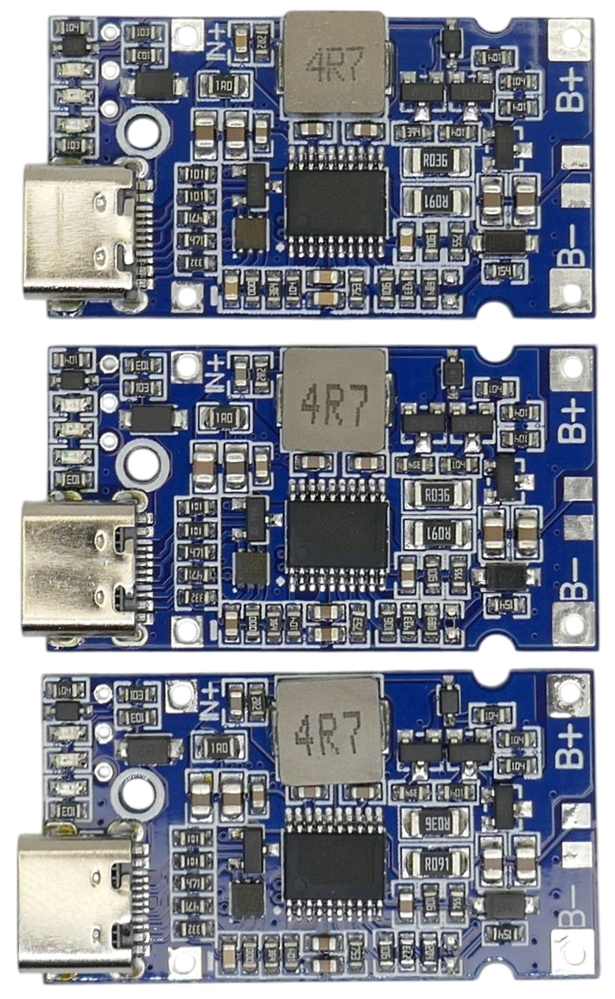

# LIFC2-N 2-4S 18W LiIon/LiPo Charger 

> 2-4S LiIon/LiPo Buck-Boost Charger With USB-C Input

This small breakout board is a highly flexible charger for 2-4S LiIon battery packs.

It can be powered via USB-C port or via a fixed input voltage in the range of 5-20V. The board supports USB-PD, and when you power it via its USB-C input, it automatically negotiates the most efficient input voltage: 

* With capable USB power supplies, the module requests 20V.    
* When using USB-A cables, it requests 12V.     
* With non-USB PD power supplies, it uses 5V input.    

> [!NOTE]
> Boards come preconfigured for **2S**, **3S**, or **4S** **LiIon** battery packs. Make sure you order the version you need. It is **not possible to re-configure the board** later for a different string count.

> [!IMPORTANT]
> While the predecessor **LIFC1** board targeted *LiFePo4* cells, the **LIFC2** targets *LiIon/LiPo* and cannot be used for *LiFePo4*.

## Overview

This board uses an unknown (and undocumented) power management chip. Considering its price (around €2.00) and its specs, it is an excellent value.

> [!NOTE]
> This is a **charger only**: the USB-C port is unidirectional and can be used for charging only. This board is **not a discharger**. If you want to built a power bank and supply USB power from your battery pack, look at [charger-discharger boards](https://done.land/components/power/powersupplies/battery/chargers/charge-discharge/).

| Item | Description |
| --- | --- |
| Voltage Input | 5-20V, built-in USB PD Trigger up to 20V |
| Battery Chemistry | *LiIon* or *LiPo* *(LiFePo4 not supported)* |
| String Count | 2S, 3S, **or** 4S *(preconfigured, not adjustable)* |
| LEDs | 3 LEDs (red, green, and blue) *charging*, *quick charge*, and *fully charged* |
| Protections | Over-Temperature, Short-Circuit *(separate BMS required)* |

### LX-LIFC1 Predecessor
This board is the successor to the **LX-LIFC1** charger board:

Here are the most important differences:

| Feature | LIFC1 | LIFC2 |
| --- | --- | --- |
| Input Voltage | 4.5-15V USB trigger: 9V, 12V | 4.5-20V USB trigger: up to 20V |
| USB Connector | USB-C and Micro-USB | USB-C |
| Power | 18W | 18W |
| Preconfigured | **LiFePo4** 2-4S | **LiIon/LiPo** 2-4S |
| Configurable | yes, via `R1` and `R2` | no |

The most notable differences are the target battery chemistries:

* **LIFC1** targets *LiFePo4* chemistries with lower charging voltages. Its USB trigger supports 9V and 12V.
* **LIFC2** targets *LiIon/LiPo* chemistries. Since charging voltages are higher compared to *LiFePo4*, its USB trigger voltages were raised to up to *20V*.

## Reconfiguration Misconceptions
The older *LIFC1* could be re-configured using two clearly marked resistors `R1` and `R2`. This way, you could change its target cell chemistry from *LiFePo4* to *LiIon*, and you could also change the string count as needed.

With **LIFC2**, manual **re-configuration is no longer possible** despite some sellers claiming so.

### Confusion Among Sellers
The original manufacturer has stopped producing *LIFC1*. It is (currently) no longer available on the Chinese market.

This apparently let many sellers to believe that *LIFC2* was some sort of successor to *LIFC1* and a direct replacement - **which it clearly is not**: *LIFC1* targets *LiFePo4* whereas *LIFC2* targets *LiIon/LiPo*, and it would be catastrophic if you replaced a *LIFC1* with a *LIFC2* and tried to charge a *LiFePo4* battery with it.

There are almost no sellers anymore who sell *LIFC1*, and those who still advertise it, silently ship *LIFC2* instead. 

### Chip Determines String Count
Here is a direct comparison of 4S, 3S, and 2S versions of LIFC2 (from top to down):

As you can see, even on close inspection **there are no differences in passive components**. All three boards use the same resistors and capacitor values. 

So with LIFC2, there are clearly no "resistors `R1` and `R2`" anymore that could be adjusted. Instead, the boards use **different chip versions**. This makes production easier but eliminates the option to manually re-configure the board.

### No Longer Applicable
Many sellers still use the "reconfiguration information" involving `R1` and `R2` that was applicable to *LIFC1* but no longer applies to *LIFC2*.      

On the older *LIFC1* board, these resistors were clearly marked on the board and documented on the backside:

  

*LIFC2* uses a blank backside and no marked resistors because here, the chip version internally determines the string count and battery chemistry.

  

You can therefore use *LIFC2* boards only in their pre-configured **2S**, **3S**, **-or- 4S** setup, and only for **LiIon/LiPo** cells.

> [!NOTE]
> *LIFC2* is an awesome board that works very well and is more affordable than *LIFC1*. While you may not be able to reconfigure it, or use it for *LiFePo4*, most users wouldn't want to fiddle with tiny resistors anyway. Just make sure you order the board in the configuration you need, and you are all set.

All board versions I tested worked flawlessly for the string count that they were made for, and they all cut charging power at exactly *18W* maximum (short of *1A* for a *4S* configuration).

### Heat Generation

LIFC2 is a very efficient *synchronous* converter board that can reach 96% efficiency. Excess heat generation is low under these circumstances.

This charger still *can* get quite hot (>70C) **if you force it to boost a large voltage gap**. So if you i.e. supply just 5V via a basic USB power supply, and charge a 4S battery pack, then this is much less efficient than supplying USB PD 20V. Make sure to add additional heat sinks.

The best way to keep the module temperature low is to use a modern USB PD power supply in which case the charger negotiates a higher voltage and can work with the best possible efficiency.

## Connections
Connect the battery to `B+` and `B-`. Make sure you are using a separate BMS board with balancing capabilities.

Input power can either be supplied via USB-C, or via the dedicated `VIN+` and `VIN-` pads (5-20V).

### Additional Solder Pads
On the back side, `B`, `G`, and `R`can be used to connect external LEDs.

On the front side, located between `B+` and `B-`, additional unmarked solder pads can be used to add a thermistor.

Connecting a temperature probe is not enough, though. Using a temperature sensor requires changing the NTC voltage divider resistor on the board (unfortunately no documentation exists).

## Indicator LEDs

The board comes with three LEDs in different colors:

| LED | Description |
| --- | --- |
| green | **on:** quick charge/no battery connected **4Hz flash:** battery short circuit |
| red | **on:** charging |
| blue | **blinking:** negotiating fast charge **on:** fully charged |

The LEDs are labeled on the PCB backside (however in Chinese):

On the backside of the board, three through-hole solder pads labeled `R`, `G`, and `B` exist that can be used to connect external LEDs (remove the onboard LEDs).

## Battery Chemistry and Strings

This breakout board is sold preconfigured for **LiIon/LiPo** chemistry and **2S**, **3S**, or **4S** configuration. 

According to many sellers, the power management chip is capable of supporting any battery cut-off voltage in the range of 3.6-21.0V using two resistors (`R1` and `R2`), using this formula:

V*cutoff* = 1.8V * (1 + (`R1`/`R2`))

This is not true anymore for *LIFC2* and false information. The board cannot be re-configured because the unmarked power management chip on the board now handles all the resistor networks that determine string count and chemistry.

> Tags: LIFC2-N, LIFC1, LX-LIFC1, 2S, 3S, 4S, LiIon, Charger, USB PD

[Visit Page on Website](https://done.land/components/power/powersupplies/battery/chargers/charge/buck-boost/lifc2-n?204605101913255914) - created 2025-10-12 - last edited 2025-10-28
